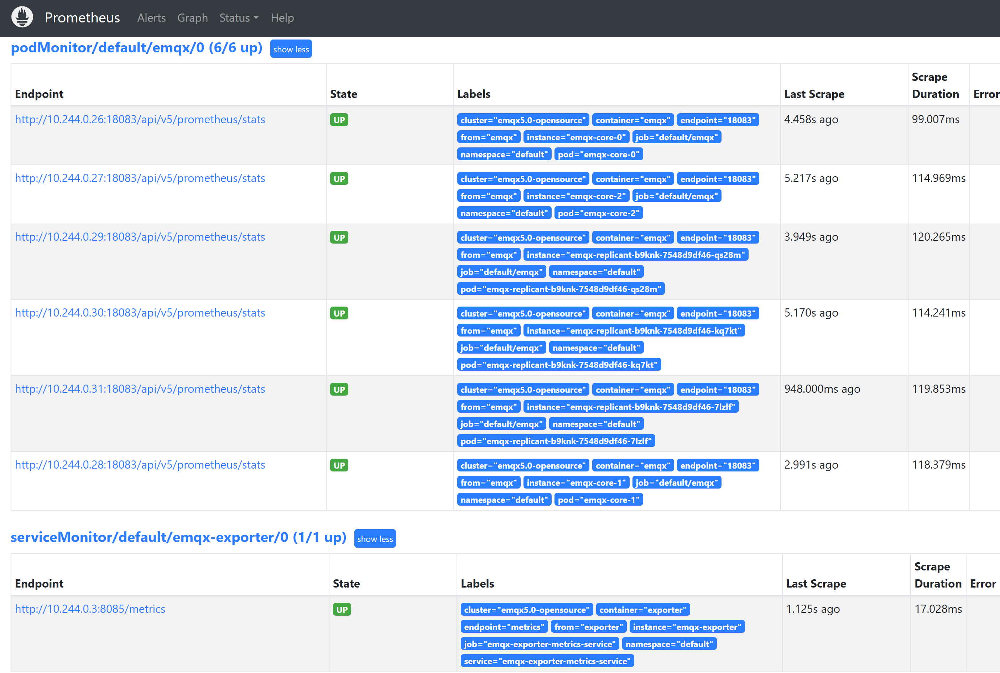

# 使用 Prometheus+Grafana 监控 EMQX 集群

## 任务目标
部署 [EMQX Exporter](https://github.com/emqx/emqx-exporter) 并通过 Prometheus 和 Grafana 监控 EMQX 集群。

## 部署 Prometheus 和 Grafana

Prometheus 部署文档可以参考：[Prometheus](https://github.com/prometheus-operator/prometheus-operator)
Grafana 部署文档可以参考：[Grafana](https://grafana.com/docs/grafana/latest/setup-grafana/installation/kubernetes/)

## 部署 EMQX 集群

下面是 EMQX Custom Resource 的相关配置，你可以根据希望部署的 EMQX 的版本来选择对应的 APIVersion，具体的兼容性关系，请参考[EMQX Operator 兼容性](../operator.md):

:::: tabs type:card
::: tab v2beta1

EMQX 支持通过 http 接口对外暴露指标，集群下所有统计指标数据可以参考文档：[集成 Prometheus](../../../../observability/prometheus.md)

```yaml
apiVersion: apps.emqx.io/v2beta1
kind: EMQX
metadata:
  name: emqx
spec:
  image: emqx/emqx-enterprise:@EE_VERSION@
  coreTemplate:
    spec:
      ports:
        # prometheus monitor requires the pod must name the target port
        - name: dashboard
          containerPort: 18083
  replicantTemplate:
    spec:
      ports:
        - name: dashboard
          containerPort: 18083
```

将上述内容保存为：`emqx.yaml`，并执行如下命令部署 EMQX 集群：

```bash
$ kubectl apply -f emqx.yaml

emqx.apps.emqx.io/emqx created
```

检查 EMQX 集群状态，请确保 `STATUS` 为 `Running`，这可能需要一些时间等待 EMQX 集群准备就绪。

  ```bash
  $ kubectl get emqx emqx
  NAME   IMAGE                              STATUS    AGE
  emqx   emqx/emqx-enterprise:@EE_VERSION@  Running   10m
  ```

## 创建 API Secret
emqx-exporter 和 Prometheus 通过访问 EMQX dashboard API 拉取监控指标，因此需要提前登录 dashboard 创建 [API 密钥](../../../../dashboard/system.md#api-%E5%AF%86%E9%92%A5)。

## 部署 [EMQX Exporter](https://github.com/emqx/emqx-exporter)

The `emqx-exporter` is designed to expose partial metrics that are not included in the EMQX Prometheus API.

```yaml
apiVersion: v1
kind: Service
metadata:
  labels:
    app: emqx-exporter
  name: emqx-exporter-service
spec:
  ports:
    - name: metrics
      port: 8085
      targetPort: metrics
  selector:
    app: emqx-exporter
---
apiVersion: apps/v1
kind: Deployment
metadata:
  name: emqx-exporter
  labels:
    app: emqx-exporter
spec:
  selector:
    matchLabels:
      app: emqx-exporter
  replicas: 1
  template:
    metadata:
      labels:
        app: emqx-exporter
    spec:
      securityContext:
        runAsUser: 1000
      containers:
        - name: exporter
          image: emqx-exporter:latest
          imagePullPolicy: IfNotPresent
          args:
            # "emqx-dashboard-service-name" is the service name that creating by operator for exposing 18083 port
            - --emqx.nodes=${emqx-dashboard-service-name}:18083
            - --emqx.auth-username=${paste_your_new_api_key_here}
            - --emqx.auth-password=${paste_your_new_secret_here}
          securityContext:
            allowPrivilegeEscalation: false
            runAsNonRoot: true
          ports:
            - containerPort: 8085
              name: metrics
              protocol: TCP
          resources:
            limits:
              cpu: 100m
              memory: 100Mi
            requests:
              cpu: 100m
              memory: 20Mi
```

> 参数"--emqx.nodes" 为暴露18083端口的 service name。不同的 EMQX 版本的 service name 不一样，可以通过命令 `kubectl get svc` 查看。

将上述内容保存为`emqx-exporter.yaml`，同时使用你新创建的 API 密钥（EMQX 4.4 则为用户名密码）替换其中的`--emqx.auth-username`以及`--emqx.auth-password`，并执行如下命令：

```bash
kubectl apply -f emqx-exporter.yaml
```

检查 emqx-exporter 状态，请确保 `STATUS` 为 `Running`。

```bash
$ kubectl get po -l="app=emqx-exporter"

NAME      STATUS   AGE
emqx-exporter-856564c95-j4q5v   Running  8m33s
```

## 配置 Prometheus Monitor
Prometheus-operator 使用 [PodMonitor](https://github.com/prometheus-operator/prometheus-operator/blob/main/Documentation/design.md#podmonitor) 和 [ServiceMonitor](https://github.com/prometheus-operator/prometheus-operator/blob/main/Documentation/design.md#servicemonitor) CRD 定义如何动态的监视一组 pod 或者 service。

```yaml
apiVersion: monitoring.coreos.com/v1
kind: PodMonitor
metadata:
  name: emqx
  labels:
    app.kubernetes.io/name: emqx
spec:
  podMetricsEndpoints:
  - interval: 5s
    path: /api/v5/prometheus/stats
    # the name of emqx dashboard containerPort
    port: dashboard
    relabelings:
      - action: replace
        # user-defined cluster name, requires unique
        replacement: emqx5
        targetLabel: cluster
      - action: replace
        # fix value, don't modify
        replacement: emqx
        targetLabel: from
      - action: replace
        # fix value, don't modify
        sourceLabels: ['pod']
        targetLabel: "instance"
  selector:
    matchLabels:
      # the label in emqx pod
      apps.emqx.io/instance: emqx
      apps.emqx.io/managed-by: emqx-operator
  namespaceSelector:
    matchNames:
     # modify the namespace if your EMQX cluster deployed in other namespace
      #- default
---
apiVersion: monitoring.coreos.com/v1
kind: ServiceMonitor
metadata:
  name: emqx-exporter
  labels:
    app: emqx-exporter
spec:
  selector:
    matchLabels:
      # the label in emqx exporter svc
      app: emqx-exporter
  endpoints:
  - port: metrics
    interval: 5s
    path: /metrics
    relabelings:
      - action: replace
        # user-defined cluster name, requires unique
        replacement: emqx5
        targetLabel: cluster
      - action: replace
        # fix value, don't modify
        replacement: exporter
        targetLabel: from
      - action: replace
        # fix value, don't modify
        sourceLabels: ['pod']
        regex: '(.*)-.*-.*'
        replacement: $1
        targetLabel: "instance"
      - action: labeldrop
        # fix value, don't modify
        regex: 'pod'
  namespaceSelector:
    matchNames:
      # modify the namespace if your exporter deployed in other namespace
      #- default
```

<p> `path` 表示指标采集接口路径，在 EMQX 5 里面路径为：`/api/v5/prometheus/stats`。`selector.matchLabels` 表示匹配 Pod 的 label。</p>
<p> 每个集群的 Monitor 配置中都需要为当前集群打上特定的标签，其中`targetLabel`为`cluster`的值表示当前集群的名字，需确保每个集群的名字唯一。</p>

将上述内容保存为`monitor.yaml`，并执行如下命令：

```bash
kubectl apply -f monitor.yaml
```

## 访问 Prometheus 查看 EMQX 集群的指标

打开 Prometheus 的界面，切换到 Graph 页面，输入 emqx 显示如下图所示：


切换到 **Status** → **Targets** 页面，显示如下图，可以看到集群中所有被监控的 EMQX Pod 信息：



## 导入 Grafana 模板
导入所有 dashboard [模板](https://github.com/emqx/emqx-exporter/tree/main/grafana-dashboard/template)。

集群的整体监控状态位于 **EMQX** 看板中。


