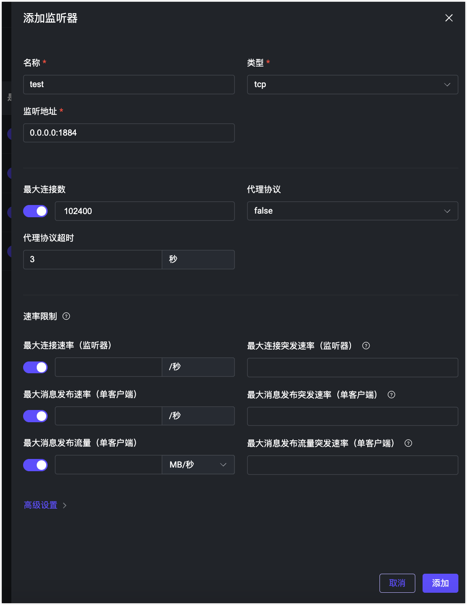
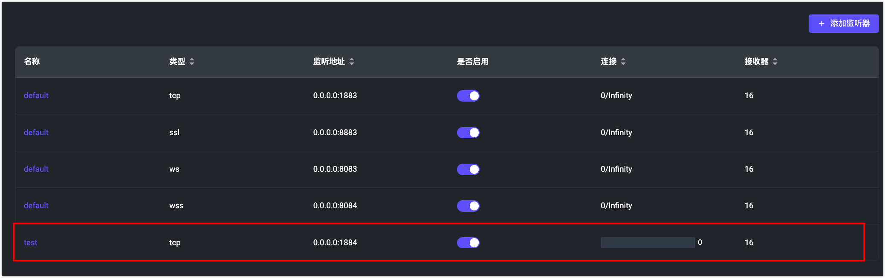

# 通过 LoadBalancer 访问 EMQX 集群

## 目标

通过 LoadBalancer 类型的 Service 访问 EMQX 集群。

## 配置 EMQX 集群

EMQX CRD `apps.emqx.io/v2beta1` 支持：
* 通过 `.spec.dashboardServiceTemplate` 配置 EMQX Dashboard Service。
* 通过 `.spec.listenersServiceTemplate` 配置 EMQX 集群监听器 Service。

有关更多详细信息，请参阅[相应文档](../reference/v2beta1-reference.md#emqxspec)。

1. 将以下内容保存为 YAML 文件，并使用 `kubectl apply` 部署。

   ```yaml
   apiVersion: apps.emqx.io/v2
   kind: EMQX
   metadata:
     name: emqx
   spec:
     image: emqx/emqx:@EE_VERSION@
     config:
       data: |
         license {
           key = "..."
         }
     listenersServiceTemplate:
       spec:
         type: LoadBalancer
     dashboardServiceTemplate:
       spec:
         type: LoadBalancer
   ```

   ::: tip

   默认情况下，EMQX 在端口 1883 上启动 MQTT TCP 监听器 `tcp-default`，在端口 18083 上启动 Dashboard HTTP 监听器。

   用户可以通过 `.spec.config.data` 配置新的或现有的监听器，或通过 EMQX Dashboard 管理它们。

   EMQX Operator 会自动在 Service 资源中反映默认监听器信息。当用户配置的 Service 与 EMQX 配置的监听器发生冲突时（名称或端口字段重复），EMQX Operator 会优先使用用户配置。

   :::

2. 等待 EMQX 集群就绪。使用 `kubectl get` 检查 EMQX 集群的状态，并确保 `STATUS` 为 `Ready`。这可能需要一些时间。

   ```bash
   $ kubectl get emqx emqx
   NAME   STATUS   AGE
   emqx   Ready    10m
   ```

## 通过 EMQX Dashboard 添加新监听器

1. 添加新监听器。

   - 打开 EMQX Dashboard 并导航到 **管理**  -> **监听器**。

   - 点击**添加监听器**按钮添加一个名称为 `test`、端口为 `1884` 的监听器，如下图所示：

     

   - 点击**添加**按钮创建监听器，如下图所示：

     

     从图中可以看出，新监听器已创建。

2. 检查新监听器是否反映在 Service 中。

   ```bash
     kubectl get svc
   
     NAME             TYPE       CLUSTER-IP       EXTERNAL-IP   PORT(S)                                         AGE
     emqx-dashboard   NodePort   10.105.110.235   <none>        18083:32012/TCP                                 13m
     emqx-listeners   NodePort   10.106.1.58      <none>        1883:32010/TCP,1884:30763/TCP                   12m
   ```

   从输出结果可以看到，新添加的端口 1884 上的监听器已反映在 `emqx-listeners` Service 资源中。

## 使用 MQTTX 连接到新监听器

1. 获取 EMQX 监听器服务的外部 IP。

   ```bash
   external_ip=$(kubectl get svc emqx-listeners -o json | jq -r '.status.loadBalancer.ingress[0].ip')
   ```

2. 使用 MQTTX CLI 连接到新监听器。

   ```bash
     $ mqttx conn -h ${external_ip} -p 1884
   
     [4/17/2023] [5:17:31 PM] › … Connecting...
     [4/17/2023] [5:17:31 PM] › ✔ Connected
   ```
