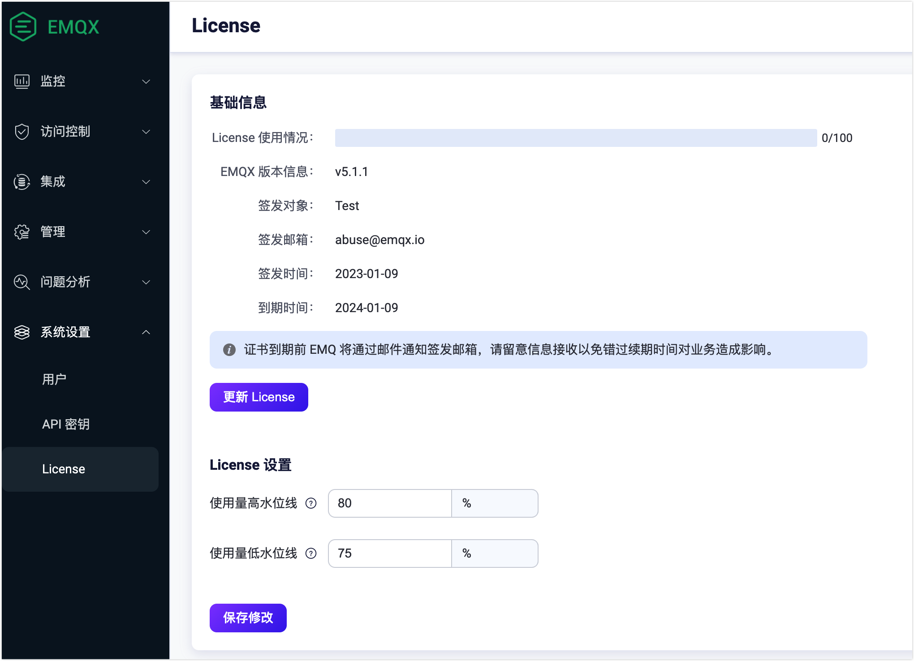

# EMQX 企业版 License

EMQX 企业版是 EMQX 的商业版本，使用时需要提供许可凭证 (License)。本页将指导您申请或购买 License 并导入到 EMQX 中。

EMQX 企业版随安装包内置了一个试用 License，该 License 最大支持 100 个客户端并发连接。

## 获取 License

如果您要直接购买 License，请联系您之前的 EMQ 销售代表，或点击[此处](https://www.emqx.com/zh/contact?product=emqx&channel=apply-Licenses)通过官网提交您的联系方式，稍后会有销售人员联系您。

如果您想在购买前试用 EMQX 企业版，您可以在[此处](https://www.emqx.com/zh/apply-licenses/emqx)自助申请试用 License：

- License 有效期为 15 天；
- License 支持的并发连接为 10000 线；
- License 将会实时发送至您的邮箱。

更多连接以及试用时长的 License 可以向销售人员申请。

:::tip
EMQX 企业版 5.0 采用与之前版本不同格式的 License，申请时请注意区分版本。对于旧版本想升级 5.0 版本的企业客户，请联系您的销售代表。
:::

## 更新和设置 License 

您可以通过 Dashboard 或配置文件更新 License 并且设置 License 连接配额使用水位线。

### Dashboard 

1. 打开 EMQX Dasboard，从左侧导航目录点击**系统设置 **-> **License**, 在 **License** 页面的**基础信息**区域，您可以看到 EMQX 当前 License 的基础信息，包括 License 连接配额使用情况、EMQX 版本信息和 License 签发信息等。

2. 点击**更新 License** 按钮，在弹出框中粘贴您的 License Key，点击提交即可。提交完成后页面数据将刷新，请确认新的 License 文件是否生效。

3. 在 **License 设置**区域，您可以配置 License 连接配额使用的水位限制。
   - **使用量高水位线**：指定超过该百分比值将触发 License 连接配额使用告警的限制。
   - **使用低水位线**：指定低于该百分比值将取消 License 连接配额使用告警的限制。

4. 点击**保存修改**保存您的设置。

   

### 配置文件

您可以通过配置文件设置 License，设置完成后请在 [EMQX 命令行](../admin/cli.md) 中执行 `emqx ctl license reload` 重新加载 License：

```bash
license {
    ## License Key
    key = "MjIwMTExCjAKMTAKRXZhbHVhdGlvbgpjb250YWN0QGVtcXguaW8KZGVmYXVsdAoyMDIzMDEwOQoxODI1CjEwMAo=.MEUCIG62t8W15g05f1cKx3tA3YgJoR0dmyHOPCdbUxBGxgKKAiEAhHKh8dUwhU+OxNEaOn8mgRDtiT3R8RZooqy6dEsOmDI="
    ## Low watermark limit below which license connection quota usage alarms are deactivated
    connection_low_watermark = "75%"

    ## High watermark limit above which license connection quota usage alarms are activated
    connection_high_watermark = "80%"
}
```

加载完成后执行 `emqx ctl license info` 命令查看 License 是否符合您的预期。

<!-- 您也可以通过环境变量 `EMQX_LICENSE__KEY` 变量名设置您的 License。TODO 确认是否可以 reload -->