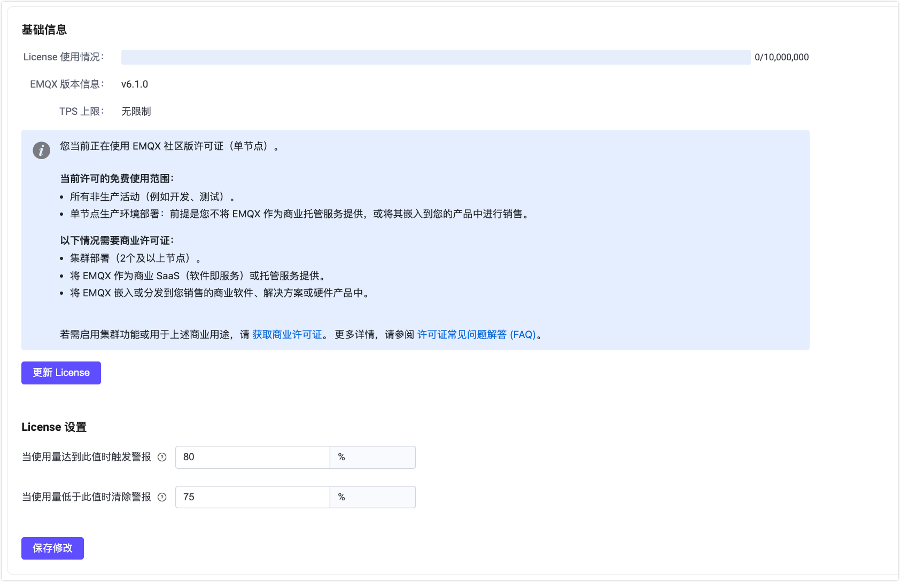

# EMQX 企业版 License

从 EMQX 5.9 开始，EMQX 采用了商业源代码许可证（BSL）1.1，这是一种源代码可用的许可证，允许开放开发，同时保护 EMQX 的商业使用。

::: tip

关于 License 变更的详细信息，请参阅 [EMQX Licensing FAQ](https://www.emqx.com/zh/content/license-faq)。

:::

作为安装包的一部分，EMQX 企业版已包含一个单节点社区版 License，具有有限的商业使用权限。但是，如果您要将 EMQX 企业版用于全面的商业用途和集群部署，您必须获得商业 License。

本页将指导您如何购买商业 License 并导入到 EMQX 中。

## 获取 License

如果您要直接购买一个有效的商业 License 密钥，请联系您之前的 EMQ 销售代表，或点击[此处](https://www.emqx.com/zh/contact?product=emqx&channel=apply-Licenses)通过官网提交您的联系方式，我们的销售代表将尽快与您联系。

如果您想在购买前试用 EMQX 企业版，您可以在[此处](https://www.emqx.com/zh/apply-licenses/emqx)自助申请试用 License，License 文件将会立即发送至您的邮箱：

- License 有效期为 15 天；
- License 支持的并发会话数为 10,000。

::: tip 注意

在试用期间，所有 EMQX 企业版功能均可使用。然而，试用期结束后，集群功能将会被禁用。您需要购买商业 License 才能继续使用集群功能。

试用 License 下的 EMQX 企业版不允许用于生产环境。

:::

更多连接以及试用时长的 License 可以向销售人员申请。

## 更新和设置 License 

您可以通过 Dashboard、命令行或配置文件更新 License 并且设置 License 连接配额使用水位线。

### Dashboard 

1. 打开 EMQX Dashboard，从左侧导航目录点击**系统设置**-> **License**, 在 **License** 页面的**基础信息**区域，您可以看到 EMQX 当前 License 的基础信息，包括 License 连接配额使用情况、EMQX 版本信息和 License 签发信息等。

2. 点击**更新 License** 按钮，在弹出框中粘贴您的 License Key，点击提交即可。提交完成后页面数据将刷新，请确认新的 License 文件是否生效。

3. 在 **License 设置**区域，您可以配置 License 会话配额使用量的水位限制。 有关会话配额限制的详细说明，请参见[会话数限制](#会话数限制)。
   - **使用量高水位线**：指定超过该百分比值将触发 License 会话配额使用告警的限制。
   - **使用低水位线**：指定低于该百分比值将取消 License 会话配额使用告警的限制。

4. 点击**保存修改**保存您的设置。

   

#### 恢复社区版 License

EMQX Dashboard 允许用户将系统恢复为默认的单节点社区版 License。您可以在 **License** 页面上点击**移除 License** 按钮，在弹出的对话框中进行二次确认以移除当前的 License。

::: tip 提示

集群模式下无法移除 License。如果您正在使用集群部署，需要先解散集群。

:::

恢复为默认的社区版 License 后：

- 当前的 License 将被清除，并替换为默认的社区版 License。
- 当前已连接的客户端不会受到影响。

::: tip 提示

社区版 License 不支持完整的商业用途，仅适用于单节点部署。移除 License 将会禁用集群部署。

:::

### 命令行

您还可以使用以下命令来更新您的 EMQX 企业版 License：

```bash
./bin/emqx ctl 

    license info             # 显示 license 信息 
    license update <License> # 更新 license，<License> 为 license 字符串
    license update default   # 恢复为默认社区版 License
```

### 配置文件

您可以通过配置文件设置 License，设置完成后请在 [EMQX 命令行](../admin/cli.md)中执行 `emqx ctl license reload` 重新加载 License：

```bash
license {
    ## License Key
    key = "MjIwMTExCjAKMTAKRXZhbHVhdGlvbgpjb250YWN0QGVtcXguaW8KZGVmYXVsdAoyMDIzMDEwOQoxODI1CjEwMAo=.MEUCIG62t8W15g05f1cKx3tA3YgJoR0dmyHOPCdbUxBGxgKKAiEAhHKh8dUwhU+OxNEaOn8mgRDtiT3R8RZooqy6dEsOmDI="
    ## Low watermark limit below which license connection quota usage alarms are deactivated
    connection_low_watermark = "75%"

    ## High watermark limit above which license connection quota usage alarms are activated
    connection_high_watermark = "80%"
}
```

加载完成后执行 `emqx ctl license info` 命令查看 License 是否符合您的预期。

<!-- 您也可以通过环境变量 `EMQX_LICENSE__KEY` 变量名设置您的 License。TODO 确认是否可以 reload -->

## License 限制

EMQX Enterprise 的 License 可能包含使用限制，用于在生产环境中确保遵守授权条款。常见的 License 限制包括：

- 会话数限制
- 每秒消息处理数（TPS）限制（自 EMQX 6.0 起引入）

### 会话数限制

会话数限制定义了当前 License 下，EMQX Enterprise 支持的最大 MQTT 客户端并发连接数（会话数）。

- 当达到限制时，新的连接请求将被拒绝。
- 超出 License 配额的连接尝试将收到 CONNACK 返回码 `151 (0x97)`，表示 “配额超限”。
- 当会话配额使用量超过配置的高水位阈值时，系统将触发告警。
- 当使用量降至低水位阈值以下时，告警将自动解除。

你可以通过 EMQX Dashboard 或配置文件配置会话数使用的告警水位阈值。

### 会话峰值水位线历史

EMQX Enterprise 会自动记录集群每日的会话数峰值，并保留最长 24 个月的历史数据。该数据存储在一个经过复制并具备完整性保护的内部表中，可在节点重启或集群拓扑变更后持久保留，为计费结算提供可审计的数据依据。

#### 命令行

使用 `emqx ctl license history` 命令查询历史记录：

```bash
# 按月查询（默认）
emqx ctl license history

# 按日查询，最近 7 天
emqx ctl license history 7 --period daily

# JSON 格式输出
emqx ctl license history --json
```

完整命令参考请参见 [license history](../admin/cli.md#license-history)。

#### REST API

```bash
GET /api/v5/license/session_hwm_history
```

**查询参数**

| 参数 | 类型 | 默认值 | 说明 |
| ---- | ---- | ------ | ---- |
| `period` | `daily` \| `monthly` | `daily` | 聚合粒度。`daily` 按自然日返回记录；`monthly` 将每日峰值聚合为月度最大值。 |
| `limit` | 整数 | `30` | 最大返回条数，仅对 `daily` 有效；`monthly` 模式下忽略此参数，返回 24 个月保留窗口内的所有可用月份数据。 |

**响应示例**

以下示例显式指定按月聚合的请求：

```bash
GET /api/v5/license/session_hwm_history?period=monthly
```

```json
{
  "period": "monthly",
  "count": 2,
  "data": [
    { "period": "2026-04", "high_watermark": 25000, "observed_at": "2026-04-18T13:53:05.000Z" },
    { "period": "2026-03", "high_watermark": 23500, "observed_at": "2026-03-31T22:10:42.000Z" }
  ]
}
```

每条记录包含以下字段：
- `period`：自然日（`YYYY-MM-DD`）或月份（`YYYY-MM`），取决于请求的聚合粒度
- `high_watermark`：该时间段内观测到的会话数峰值
- `observed_at`：峰值发生时的 RFC 3339 格式时间戳

#### 时区配置

自然日的划分边界由配置项 `license.high_watermark_timezone` 决定。默认值为 `"system"`，即跟随节点所在主机的本地时区。您可以设置显式的 UTC 偏移量（如 `"+08:00"`），以确保跨地域节点的日期边界保持一致。详情请参见 [License 配置](../configuration/license.md)。

### TPS 限制

从 EMQX 6.0 起，License 中还可以包含每秒消息处理数（TPS）限制。该限制适用于整个集群中处理的 MQTT 消息总量，包括入站和出站消息。

- 当 TPS 使用量超过 License 限制时，EMQX 会触发告警。
- 告警将记录观察到的 TPS 峰值，但不会限制消息流量。
- 告警在以下情况下才会被解除：
  - 应用了包含更高 TPS 限制的新 License，或
  - 手动在 EMQX Dashboard 或 CLI 中解除。

TPS 限制旨在用于可观测性和合规性监控，而非强制执行。

::: tip 提示

TPS 限制由 License 定义，用户无法自行配置或调整。如需提高限制，请申请包含更高 TPS 值的新 License。

:::
