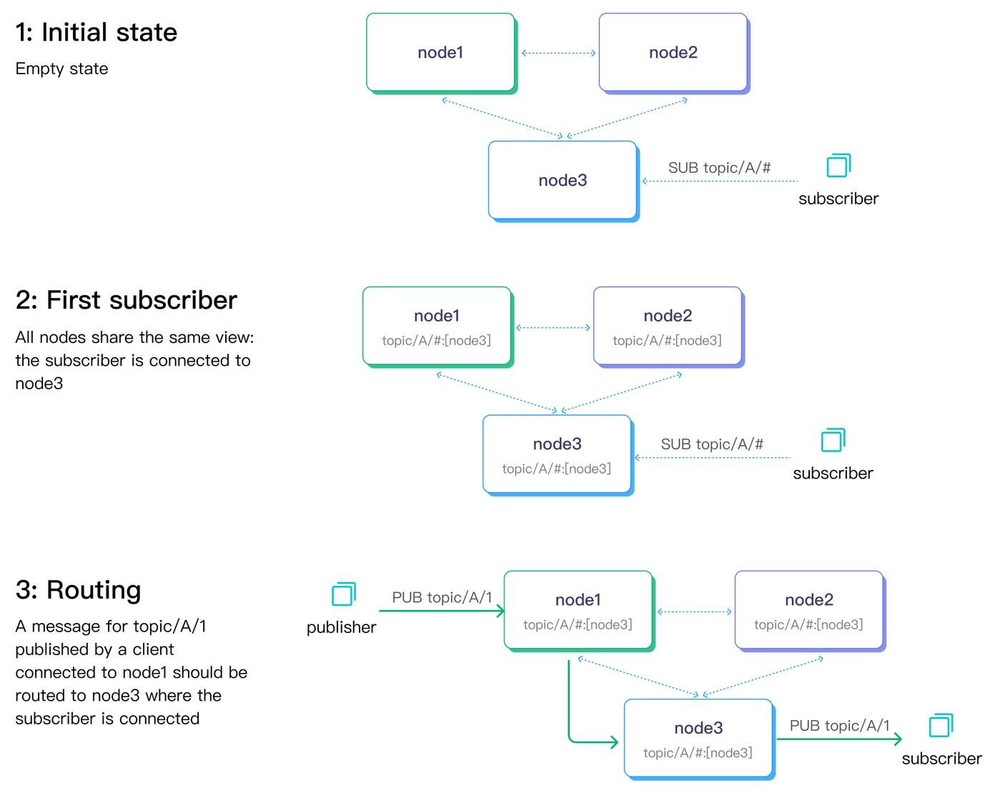
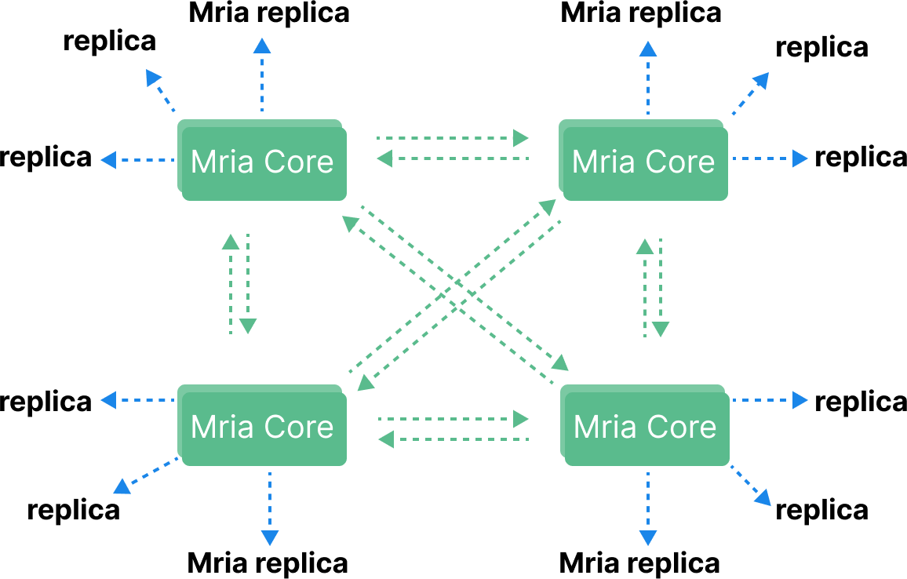

# EMQX Clustering

MQTT is a stateful protocol, which means the broker needs to maintain state information about each MQTT session including subscribed messages and unfinished message transmissions.
One of the biggest challenges of MQTT broker clustering is ensuring that the clustered nodes are able to synchronize and replicate such states efficiently and reliably.

EMQX is a highly scalable and fault-tolerant MQTT broker that can be distributed and run in a cluster mode with multiple nodes.
In this chapter, we will discuss the reasons why we need the cluster MQTT brokers and how it is done EMQX which enables millions of unique wildcard subscribers in one single cluster.

For instructions to create and run a EMQX version 5 cluster, you can find more inforamtion here: [EMQX Cluster](../deploy/cluster/introduction).

Clustering EMQX can help improve the scalability, availability, reliability and management of IoT messaging systems, which is why clustering is recommended for larger or mission-critical applications.

## Key Aspects of Clustering

When designing a cluster, there are several key aspects that need to be considered. Often these are the most important factors that determine the success of the cluster. In this section, we will discuss the key aspects of clustering in more detail.

* **Centralized Management**: The cluster should be able to be managed centrally, as all nodes in the cluster can be monitored and controlled from a single management console.

* **Data Consistency**: The cluster ensures that all nodes in the cluster have a consistent view of the r. This is achieved by replicating data across all nodes in the cluster.

* **Easy To Scale**: To reduce the complexity of the cluster management, it should not be a complex task to add more nodes to the cluster. The cluster should be able to automatically detect the new nodes and add them to the cluster.

* **Cluster Rebalance**: With minimal operational overhead, the cluster should be able to reflect on detect unblanced load of each node and reassign the workloads to the nodes with the least load. This ensures that the cluster can continue to function even if one or more nodes fail.

* **Large Cluster Size**: To meet the increasing demands of the system, the cluster can be expanded by adding more nodes to the cluster. This allows the cluster to scale horizontally to meet the increasing demands of the system.

* **Automatic Failover**: If a node fails, the cluster will automatically detect the failure and reassign the workloads to the remaining nodes. This ensures that the cluster can continue to function even if one or more nodes fail.

* **Network Partition Tolerance**: The cluster should be able to tolerate network partitions, as the cluster can continue to function even if one or more nodes fail.

In the following sections, we will discuss the key aspects of clustering in more detail.

## Centralized Management

EMQX can be managed centrally, as all nodes in the cluster can be monitored and controlled from a single management console. This makes it easy to manage a large number of devices and messages. The console is accessible via a web browser and provides a user-friendly interface for managing the cluster. Any `core` type node can serve as the management HTTP API endpoint (we will discuss the different node types in the next section).

The online configuration management feature allows you to make configuration changes to all nodes the cluster without having to restart the nodes. This is especially useful when you need to make changes to the cluster configuration, such as adding or removing nodes.

## Data Consistency

The most important distributed data structure in a MQTT broker cluster is the routing table, which is used to store the routing information of all topics. The routing table is used to determine which nodes should receive a message published to a particular topic. In this section, we will discuss how EMQX ensures that the routing table is consistent across all nodes in the cluster.

EQMX cluster makes use of full ACID (Atomicity, Consistency, Isolation, Durability) transactions to ensure that the routing table is consistent across all the `core` nodes in the cluster. and employs asynchronous replication from the `core` nodes to the `replica` nodes to ensure that the routing table is eventually consistent across all nodes in the cluster.

Let's dive into the details of how EMQX data consistency is achieved.

### Data Replication Channels

* In a EMQX cluster, there are two data replication channels.

  Metadata replication. Such as routing information which (wildcard) topics are being subscribed by which nodes.

* Message delivery. Such as when forwarding messages from one node to another.

Below diagram illustrates the two data replication channels with a pub-sub flow.



The dashed lines connecting the nodes indicate metadata replications, while the solid arrow lines represent the message delivery channel.

### How EMQX Nodes Communicate

EMQX utilizes Erlang/OTP's built-in database, Mnesia, to store MQTT session states. To facilitate database and message replication, the Erlang distribution protocol a custom distribution protocol are utilized for inter-broker remote procedure calls.

The database replication channel is powered by the "Erlang distribution" protocol, enabling each node to function as both a client and server. The default listening port number for this protocol is 4370.

In contrast, the message delivery channel employs a connection pool and each node is configured to listen on port number 5370 by default (5369 when running in a Docker container). This approach differs from the Erlang distribution protocol, which utilizes a single connection.

### Routing Table Replication

A Mnesia cluster is designed using a full mesh topology where each node in the cluster connects to every other node and continuously checks their liveliness.


However, the full mesh topology imposes a practical limit on the cluster size.
For EMQX versions prior to 5, it is recommended to keep the cluster size under 5 nodes.
Beyond this, vertical scaling, which involves using more powerful machines, is a preferable option to maintain the cluster's performance and stability.

In our benchmark environment, we managed to reach [ten million concurrent connections with EMQX Enterprise 4.3](https://www.emqx.com/en/resources/emqx-v-4-3-0-ten-million-connections-performance-test-report).

While our customers are not required to report their production deployment details, based on the information shared with us, the largest known in-production cluster consists of 7 nodes.

One of the major challenges of managing a large Mnesia cluster is the risk of a split-brain situation, which can occur when a network partition isolates nodes into multiple subclusters, with each subcluster believing it is the only active cluster. This risk is especially pronounced in large clusters, where the N^2 complexity of networking overheads can cause nodes to become less responsive under high load. In addition, head-of-line blocking in the Erlang distribution channel can delay the sending of heartbeat messages, further increasing the risk of a split-brain situation.

In version 5, we have greatly improved the cluster scalability by introducing [Mria](https://github.com/emqx/mria) (an enhanced version of Mnesia with async transaction log replication). Mria uses a new network topology which consists two type of node roles: `core` and `replicant` (sometimes referred to as `replica` for short).



In a EMQX Enterprise version 5 cluster, the `core` nodes still form the same full-mesh network as in older versions. The `replicant` nodes, however, only connects to one or more core nodes, but not to each other.

### Core and Replicant Nodes

The behavior of Core nodes is the same as that of Mnesia nodes in 4.x: Core nodes form a cluster in a fully connected manner, and each node can initiate transactions, hold locks, and so on. Therefore, EMQX 5.0 still requires Core nodes to be as reliable as possible in deployment.

Replicant nodes are no longer directly involved in the processing of transactions. But they connect to Core nodes and passively replicate data updates from Core nodes. Replicant nodes are not allowed to perform any write operations. Instead, it is handed over to the Core node for execution. In addition, because Replicants will replicate data from Core nodes, they have a complete local copy of data to achieve the highest efficiency of read operations, which helps to reduce the latency of EMQX routing.

Since Replicant nodes do not participate in write operations, the latency of write operations will not be affected when more Replicant nodes join the cluster. This allows creating larger EMQX clusters.

For performance reasons, the replication of irrelevant data can be divided into independent data streams, that is, multiple related data tables can be assigned to the same RLOG Shard (replicated log shard), and transactions are sequentially replicated from Core nodes to the Replicant node. But different RLOG Shards are asynchronous.

## Easy to Scale

EMQX is designed to be easy to scale horizontally.
You can choose to add/delete nodes to/from the cluster at any time from the CLI, API or even the dashboard.

For example, to add a new node to the cluster it can be as simple as exeucting a command like this:

```bash
$ emqx ctl cluster join emqx@node1.my.net
```

Where `emqx@node1.my.net` is one of the nodes in the cluster.

Or you can, from the dashboard, click a button to invite a new node to join the cluster.

With the help of the rich management interfaces, you can easiy script the cluster management make it part of your DevOps pipeline.

In EMQX version 5, the `replica` nodes are designed to be stateless, so they can be placed in an autoscaling group for better DevOps practices.

## Cluster Rebalance

When a node newly joins the cluster, it will start off with an empty state. With a good load balancer, the newly connected clients maybe have a better chance to connect to the new node. But the existing clients will still be connected to the old nodes.

If the clients reconnect in a relatively short period of time, the cluster can reach balance quickly. But if the clients are not reconnecting, the cluster may remain unbalanced for a long time.

In order to address this issue, EMQX Enterprise (since version 4.4) introduced a new feature called "Cluster Rebalance". This feature allows the cluster to automatically rebalance the load by migrating the sessions from the overloaded nodes to the underloaded nodes.

An extreme version of "rebalance" is "evacuation", in which all the sessions are migrated off the given node. This is useful when you want to remove a node from the cluster.

## Cluster Size

At the scale of millions of concurrent connections, you have no choice but to scale horizontally, because there is simply no single machine that can handle that many connections.

In EMQX version 5, the `core`-`replica` clustering architecture allows us to scale the cluster to a much larger size.

In our benchmark, we tested 50 million publishers plus 50 million wildcard subscribers in a 23 nodes cluster. You can read our [blog post](https://www.emqx.com/en/blog/reaching-100m-mqtt-connections-with-emqx-5-0) to find more details.

Why wildcards? Because wildcards subscriptions are the gold standard when benchmarking MQTT broker cluster scalability. It challenges the underlying data structures and algorithms to the limit.

## Automatic Failover

In MQTT protocol specification, there is no concept of session affinity. This means that a client can connect to any node in the cluster and still be able to receive messages published to the topics it has subscribed to.
There is also not any service discovery mechanism in MQTT, so the client needs to know the address of the cluster nodes.
This often requires the client to be configured with a list of all the nodes in the cluster or even better a load balancer that can route the client to the right node.

EMQX is designed to work with a load balancer in front of the cluster. With a health check endpoint, the load balancer can detect the health of the nodes in the cluster and route the client to the right node.

Using Erlang's node monitoring mechanism, EMQX nodes monitor each other's health status and will automatically remove unhealthy nodes from the cluster.

## Network Partition Tolerance

When a network partition occurs, the cluster may split into multiple isolated subclusters, each believing it is the only active cluster. This is known as the "split-brain" problem.
A production cluster should be able to recover from a network partition automatically.

EMQX's 'autoheal' feature can automatically heal the cluster after a network partition.
When the feature is enabled, after network partition has occurred and then recovered, the nodes in the cluster will follow the steps below to heal the cluster.

1. Node reports the partitions to a leader node which has the longest uptime.
1. Leader node create a global netsplit view and choose one node in the majority as coordinator.
1. Leader node requests the coordinator to command the minority side to reboot.
1. requests all the nodes in the minority side.

## Summary

In this article, we have introduced the new clustering architecture in EMQX version 5. We have also discussed the key aspects of a production-ready MQTT broker cluster, including scalability, automatic failover, network partition tolerance, and so on. and how EMQX can help you achieve these goals.
