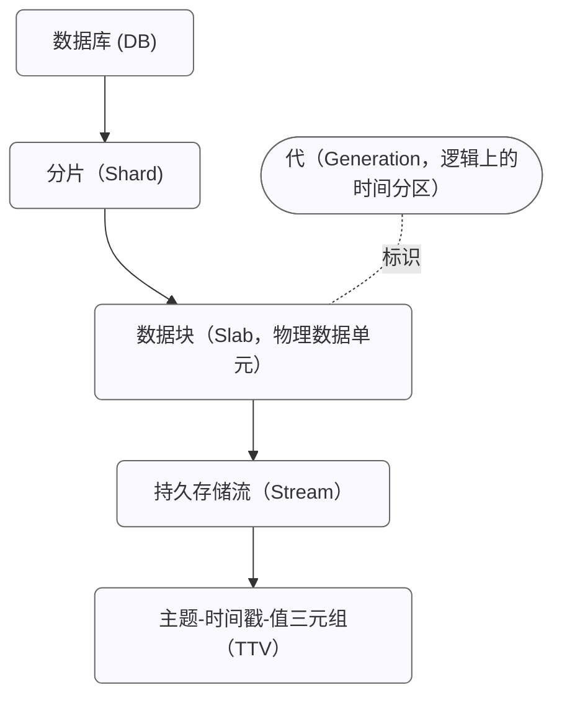

# 持久存储设计

EMQX 6.0 引入了优化的持久存储（Optimized Durable Storage，简称 DS），这是一款专门为确保 MQTT 消息投递的高可靠性和持久性而设计的数据库抽象层。DS 结合了流式服务（如 Kafka）和键值存储（Key-Value Store）的优势，为 MQTT 数据的存储、重放和管理提供了稳健且高度优化的基础。

## 架构：后端与存储层次结构

持久存储的实现与底层数据库系统解耦，通过后端机制支持将数据存储在不同类型的数据库管理系统中。

### 内嵌后端

EMQX 提供了两个不依赖外部服务的内嵌后端：

- **`builtin_local`**：使用 RocksDB 作为存储引擎，适用于单节点部署。
- **`builtin_raft`**：在 `builtin_local` 的基础上扩展，支持集群模式与跨站点数据复制。

### 数据存储层次结构

赋予 EMQX 内置持久化能力的数据库存储引擎采用分层结构组织数据。下图展示了持久存储数据库在 EMQX 集群中的分布方式：

在内部，DS 将数据组织为一个多层次但对应用透明的结构，以实现**水平扩展**与**时间分区管理**，确保在分布式环境中的高效数据存取与可维护性。

完整的层次结构如下所示：

#### 数据库（Database, DB）

数据的顶层逻辑容器。每个数据库都是独立的，可根据需要创建、管理或删除，并负责自身的分片、数据块和持久存储流。
 例如：

- **会话数据库（Sessions DB）**：存储持久会话状态。
- **消息数据库（Messages DB）**：存储对应的 MQTT 消息数据。

单个 EMQX 集群可以同时托管多个 DS 数据库。

#### 分片（Shard）

数据库的**水平分区**。来自不同 MQTT 客户端的数据会被分配到不同的分片中，从而实现并行处理与高可用性。

每个 EMQX 节点可以托管一个或多个分片，分片的总数量由 EMQX 首次启动时的 [`n_shards`](../durability/managing-replication.md#number-of-shards) 配置参数决定。

分片同时也是复制的基本单位。根据 `durable_storage.messages.replication_factor` 的配置，每个分片会在多个节点之间复制，确保所有副本都持有一致的消息集合，从而实现冗余备份和容错能力。

#### 代（Generation）

代是数据库基于时间的逻辑分区。在不同时间段写入的数据会被归入不同的代中。新消息始终写入当前代，而旧代会变为不可变且只读。EMQX 定期创建新代，主要用于以下目的：

1. **向后兼容与数据迁移：** 新数据会写入新的代，并可能使用改进后的编码格式；而旧代保持不可变且只读。
2. **基于时间的数据保留：** 由于每一代对应一个特定的时间范围，可以通过直接删除完整的旧代来高效清理过期数据。

虽然在概念上与数据块（Slab）相关，但代并不是物理存储单元。代充当时间边界，用于组织每个分片内的 Slab。

代内部的结构和存储方式可能会因配置的存储布局而有所不同。目前，DS 支持一种主要面向高吞吐通配符订阅与单主题订阅的布局。未来版本将引入适用于不同工作负载的更多布局。新代使用的布局通过 `durable_storage.messages.layout` 参数配置，每种布局引擎都定义了自己的配置选项。

#### 数据块（Slab）

由**分片 ID** 与**代 ID** 共同标识的物理数据单元。每个 Slab 是一个持久化的数据容器，包含一个或多个持久存储流（Stream）。Slab 中的所有数据共享相同的编码格式，无需额外存储元数据；同时，Slab 内的数据写入具备原子性与一致性保证。

示例：`shard 2, gen 3` 表示“分片 2、第 3 代”的一个独立数据块，用于承载该分片在该代中的一个或多个流及其数据。

#### 流（Stream）

持久存储流是每个 Slab 内用于批处理和序列化的逻辑单位。流将具有相似主题结构的 **Topic–Timestamp–Value（TTV）** 三元组进行分组，使数据能够以时间顺序、确定性的方式成批读取。单个流可以包含来自多个主题的消息，不同的存储布局可能会采用不同策略将主题映射到流中。

在持久存储中，流也是订阅与迭代的基本单位，使系统能够高效处理通配符主题过滤，并实现有序数据的可重复读取。[持久会话](../durability/durability_introduction.md#durable-sessions)会以批处理方式从流中读取消息，批大小可通过 `durable_sessions.batch_size` 配置参数进行控制。

#### 主题–时间戳–值（Topic–Timestamp–Value, TTV）

最小的数据存储单元，代表一条 MQTT 消息。每个 TTV 包含以下字段：

- **主题**：遵循 MQTT 协议语义。
- **时间戳**：记录写入时间或逻辑顺序键。
- **值**：任意二进制数据块。

## 写入路径

向 DS 写入数据可采用两种模式：仅追加模式（Append-Only Mode）或 ACID 事务（ACID Transactions）。

### 仅追加模式

该模式仅支持数据追加写入，具有极低的开销，适用于高吞吐量场景。

### ACID 事务

事务机制基于**乐观并发控制（Optimistic Concurrency Control, OCC）**。假设客户端通常操作的是互不冲突的数据子集；若发生冲突，只有一个事务能成功提交，其他事务会被中止并重试。

**事务流程：**

1. **初始化：** 客户端进程（Tx）请求 Leader 节点创建一个事务上下文（包含 Leader 的任期号和最近一次提交的序列号）。
2. **操作阶段：** 持久存储事务以一个 Erlang 函数的形式表示。客户端可以在此函数内部执行读取操作（会将访问的主题及时间范围信息添加到事务上下文中），并安排写入或删除操作。客户端还可以设置提交前置条件（例如检查特定 TTV 是否存在或不存在）。读取操作会立即执行，而安排的写入/删除操作只有在事务成功提交并完成复制后才会真正生效。
3. **提交与验证：** 客户端将操作列表发送至 Leader。
   - Leader 根据最新数据快照检查前提条件。
   - 验证读取内容是否与最近写入发生冲突。
4. **“烹制（准备）”与日志记录：** 如果验证通过，Leader 对事务进行“烹制”（即准备阶段）：
   - 为每个待写入的 TTV 分配所属的流（如有需要会创建新的流）。
   - 生成一组可确定性地应用到所有副本上的低层存储变更操作列表。
5. **提交：** 经过“烹制”的事务批次被写入 Raft 日志（`builtin_raft`）或 RocksDB 的预写日志（Write-Ahead Log, WAL）。
6. **结果：** 成功完成后，客户端进程收到提交通知。若检测到冲突，则事务会被中止并重新尝试。

**写入刷新控制（Write Flush Control）：**

缓冲区中事务写入 Raft 日志的频率由以下参数控制：

- `flush_interval`：事务在缓冲区中可保留的最大时间。
- `max_items`：缓冲区中允许的最大待提交事务数。
- `idle_flush_interval`：当缓冲区在一定时间内无新数据写入时，允许提前触发刷新。

以下流程描述了 `builtin_raft` 后端中事务的完整生命周期：

## 读取路径

从 DS 读取数据主要围绕流（Streams）进行。

1. **获取流列表：**

   当需要访问某个 MQTT 主题的数据时，读取端首先通过 `get_streams` API 获取与该主题关联的流列表。这种间接层允许 DS 将结构相似的主题归组，减少元数据体积。随后，读取端为每个流创建一个**迭代器（Iterator）**并指定起始时间。迭代器是一个轻量级数据结构，用于跟踪流中的读取位置。

2. **读取数据：**

   使用 `next` API 可读取下一段数据块，并返回更新后的迭代器，指向下一个读取位置。

### 使用通配符主题过滤器读取数据

为支持高效的通配符主题订阅，DS 使用学习型主题结构算法（Learned Topic Structure, LTS）将结构相似的 TTV 分配到同一流中。该算法自动将主题拆分为**静态部分**和**可变部分**。

- **示例：**

  若客户端发布的主题为 `metrics/<hostname>/cpu/socket/1/core/16`，当积累足够数据后，LTS 算法可推导出静态主题模式：
   `metrics/+/cpu/socket/+/core/+`，
   其中 `<hostname>`、`socket` 和 `core` 为可变部分。

- **优势：**

  这样便可高效地执行查询：`metrics/my_host/cpu/#` 或 `metrics/+/cpu/socket/1/core/+`。

## 实时订阅（Real-Time Subscriptions）

除了按需读取外，客户端还可以通过订阅机制实时获取 DS 数据。基于迭代器的 `subscribe` API 允许 DS 主动推送数据给订阅者，而无需客户端轮询。

DS 维护两个订阅者池：

- **追赶型订阅者（Catch-up Subscribers）：** 读取历史数据，当到达最新位置后自动转为实时订阅。
- **实时订阅者（Real-Time Subscribers）：** 基于事件触发，仅在 DS 有新数据写入时激活。

这两个池均按流与主题对订阅者进行分组，从而在多订阅场景中复用底层资源。这种方式能有效节省磁盘 I/O（IOPS）和跨节点网络带宽。

在集群中，系统会将消息批次、订阅 ID 列表和稀疏分发矩阵发送到远程节点，再由这些节点将消息分发给本地客户端。

## 更多信息

持久存储是 EMQX 多项高可靠性与消息持久化特性的核心数据基础组件，为上层功能提供统一的存储、重放与一致性保障。包括：

- **[MQTT 会话持久化](../durability/durability_introduction.md)**：基于 DS 的会话状态与消息持久化机制。
- **[消息队列](../message-queue/message-queue-concept.md)**：内置的 MQTT 消息队列功能，提供消息顺序投递、消费进度管理以及跨 EMQX 集群的高可用性。
- **[消息流](../message-stream/message-stream-concept.md)**：基于 DS 的持久化消息流与重放机制，支持按主题过滤器持续存储 MQTT 消息，并通过时间戳订阅实现历史消息回放。
- **[共享订阅](../messaging/mqtt-shared-subscription.md)**：一种负载均衡的订阅机制，将消息在同一订阅组内的多个订阅者之间进行分发。