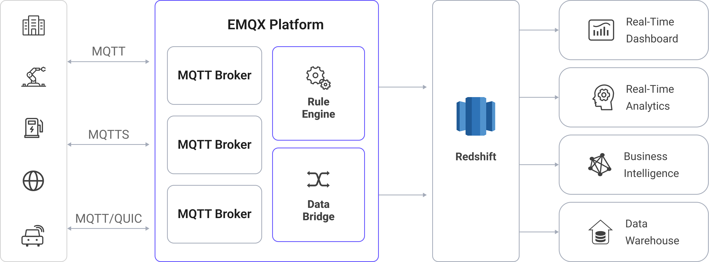

# 将 MQTT 数据写入到 Redshift

[Amazon Redshift](https://aws.amazon.com/cn/redshift/) 是一款全托管的、可扩展至 PB 级的数据仓库服务，专为高性能分析而设计。它基于 PostgreSQL 构建，并针对联机分析处理（OLAP）进行了优化，使您能够以极高的速度运行复杂查询并执行大规模数据分析。EMQX 可以直接与 Amazon Redshift 集成，实现物联网设备 MQTT 遥测数据的近实时采集与存储。

本页面将全面介绍 EMQX 与 Redshift 的数据集成，并提供创建和验证数据集成的实用操作指南。

## 工作原理

EMQX 中的 Redshift 数据集成是一项开箱即用的功能，可以将基于 MQTT 的物联网数据流直接写入 Amazon Redshift 的分布式、兼容 PostgreSQL 的数据仓库。借助 EMQX 内置的[规则引擎](./rules.md)，您无需编写复杂的自定义代码，就能将 IoT 数据流式导入 Redshift 进行大规模分析处理。

下图展示了 EMQX 与 Redshift 数据集成的典型架构：



将 MQTT 数据写入 Redshift 的流程如下：

1. **物联网设备连接到 EMQX**：设备通过 MQTT 协议成功连接后，会触发上线事件。事件中包含设备 ID、源 IP 地址及其他属性信息。
2. **消息发布与接收**：设备将遥测数据和状态数据发布到特定主题。EMQX 接收到这些消息后，会在规则引擎中启动匹配流程。
3. **规则引擎处理消息**：EMQX 的规则引擎根据主题或消息内容，将事件与消息匹配到预定义规则。处理过程可包括数据转换（如将 JSON 转换为 SQL 可用格式）、过滤以及在入库前进行上下文信息补充。
4. **写入 Redshift**：匹配成功的规则会触发基于 SQL 的数据写入操作。通过 SQL 模板，EMQX 将处理后的数据字段映射到 Redshift 的表和列中。为实现高吞吐写入，数据管道可利用 Amazon S3 的 COPY 命令或 Redshift Streaming Ingestion 将数据高效加载到列式存储中。Redshift 的查询优化器和大规模并行处理（MPP）执行引擎确保数据可以立即用于分析查询。

事件与消息数据写入 Redshift 后，您可以：

- 将 Redshift 与 Amazon QuickSight、Grafana 或 Tableau 等工具连接，构建仪表盘以跟踪 IoT 指标与趋势；
- 将 Redshift 数据与 AWS 的分析与 AI/ML 服务（如 Amazon SageMaker）集成，实现异常检测与设备行为预测；
- 利用 Redshift 的并行查询执行能力，在海量 IoT 数据集上运行聚合、关联和时序分析，同时支持历史数据与准实时数据洞察。

## 特性与优势

与 Redshift 的数据集成可以为您的业务带来以下特性与优势：

- **灵活的事件处理**：借助 EMQX 规则引擎，Redshift 可以低延迟地存储和处理设备生命周期事件（连接、断开、状态变化）。结合 Redshift 的 MPP（大规模并行处理）查询引擎，事件数据能够被快速聚合和分析，用于检测故障、异常或长期使用趋势。
- **消息转换**：通过 EMQX 规则，消息在写入 Redshift 之前可以进行广泛的处理和转换，使存储的数据从一开始就具备分析就绪性。这种预处理能够降低查询复杂性，并优化下游使用效率。
- **基于 SQL 模板的灵活数据操作**：通过 EMQX 的 SQL 模板映射，可以将结构化的 IoT 数据插入到 Redshift 的表和列中。Redshift 支持兼容 PostgreSQL 的 SQL、支持 SUPER 等半结构化数据类型（如 JSON），并提供高级索引以优化查询性能。借助列式存储、数据压缩和区域映射（Zone Maps），查询能够加速执行，显著减少大数据集的扫描时间。
- **业务流程集成**：Redshift 可与 AWS 生态系统无缝集成，使您能够将 IoT 数据连接至 BI 工具（如 Amazon QuickSight）、分析服务（如 AWS Glue 和 AWS Data Pipeline），或 AI/ML 服务（如 Amazon SageMaker）。
- **高级地理空间能力**：Redshift 通过 GEOMETRY 和 GEOGRAPHY 类型支持地理空间数据类型和函数，从而实现地理围栏、基于位置的分析和路径优化。结合 EMQX 的实时数据接入，您可以实现资产追踪、车队监控，或在近实时场景下触发基于位置的事件。
- **内置指标与监控**：EMQX 为每个 Redshift Sink 提供运行时指标，而 Redshift 可与 Amazon CloudWatch 集成，对集群性能、查询执行指标和存储使用情况进行监控，实现端到端的可观测性。

## 准备工作

本节介绍在创建 Redshift 数据集成之前需要完成的准备工作，包括如何创建 Redshift 集群，以及创建数据库和数据表。

### 前置准备

- 了解 EMQX 数据集成[规则](./rules.md)
- 了解[数据集成](./data-bridges.md)

### 在 Amazon Redshift 中创建数据库和数据表

在 EMQX 中设置 Redshift 连接器之前，需确保您的 Amazon Redshift 集群（或 Serverless 工作组）已经运行，并准备好用于存储 IoT 数据的模式（schema）。

1. 部署 Redshift 集群或工作组。请参考 [Amazon Redshift 集群创建指南](https://docs.aws.amazon.com/zh_cn/redshift/latest/mgmt/create-cluster.html)启动您的环境。

2. 配置数据库用户信息。在创建初始集群时，需要为主用户（通常为 `adminuser`）指定管理员凭证。您也可以选择使用 Redshift SQL 创建一个专用的 EMQX 数据库用户。该用户必须具备以下权限：

   - 连接数据库
   - 创建数据表
   - 读写 EMQX 数据表

   例如：

   ```
   CREATE USER emqx_user PASSWORD 'YourStrongPassword1';
   ```

   详细步骤请参见 [Redshift 入门指南](https://docs.aws.amazon.com/redshift/latest/gsg/t_adding_redshift_user_cmd.html)和[用户管理文档](https://docs.aws.amazon.com/redshift/latest/dg/r_Users.html)。

   请妥善保存用户名（`emqx_user`）和密码，后续在 EMQX 中配置 Redshift 连接器时需要使用。

3. 使用任意兼容 PostgreSQL 的客户端（如 `psql`、SQL Workbench/J 或 DBeaver）[连接到 Redshift 端点](https://docs.aws.amazon.com/redshift/latest/mgmt/cluster-syntax.html)。连接时需要提供主机名、端口、现有数据库名称（例如默认的 `dev`）、用户名和密码。

4. 连接成功后，创建目标数据库 `emqx_data`，作为 EMQX 写入 IoT 数据的目标数据库：

   ```
   CREATE DATABASE emqx_data;
   ```

5. 连接到 `emqx_data` 数据库，并创建两个数据表用于存储 MQTT 消息和客户端事件数据。

   - 使用以下 SQL 语句创建 `t_mqtt_msg` 表，用于存储客户端 ID、主题、载荷以及消息到达时间等信息：

     ```sql
     CREATE TABLE t_mqtt_msg (
       id BIGINT GENERATED BY DEFAULT AS IDENTITY PRIMARY KEY,
       msgid   VARCHAR(64),
       sender  VARCHAR(64),
       topic   VARCHAR(255),
       qos     INTEGER,
       retain  INTEGER,
       -- 如果 payload 是 JSON，建议使用 SUPER；否则使用较大的 VARCHAR
       payload SUPER,
       arrived TIMESTAMPTZ
     );
     ```

   - 使用以下 SQL 语句创建 `emqx_client_events` 表，用于存储客户端上下线事件及其时间戳：

     ```sql
     CREATE TABLE emqx_client_events (
       id BIGINT GENERATED BY DEFAULT AS IDENTITY PRIMARY KEY,
       clientid   VARCHAR(255),
       event      VARCHAR(255),
       created_at TIMESTAMPTZ DEFAULT CURRENT_TIMESTAMP
     );
     ```

## 创建 Redshift 连接器

在添加 Redshift Sink 之前，需要先在 EMQX 中创建 Redshift 连接器。连接器定义了 EMQX 如何连接到 Amazon Redshift 集群或 Serverless 工作组。

1. 在 EMQX Dashboard 中，进入**集成** -> **连接器**页面。

2. 点击页面右上角的**创建**。

3. 在**创建连接器**页面中，选择  **Redshift**，点击**下一步**。

4. 输入连接器名称：必须以字母或数字开头，可以包含字母、数字、连字符（-）或下划线（_），例如：`my_redshift`。

5. 输入连接信息：

   - **服务器地址**：Redshift 端点的主机名（例如：`redshift-cluster-1.abc123xyz.us-east-1.redshift.amazonaws.com`）。您可以在 AWS Redshift 控制台的**集群**或**工作组**页面中找到。
   - **数据库名字**：EMQX 将写入数据的 Redshift 目标数据库名称。本示例为 `emqx_data`。
   - **用户名**：具有插入数据所需权限的数据库用户，本示例中为 `emqx_user`。
   - **密码**：`emqx_user` 对应的密码。
   - **启用 TLS**：如需建立加密连接，请开启此选项（推荐用于所有云服务连接）。更多信息请参见[启用 TLS 访问外部资源](../../guides/network/overview.md#启用-tls-加密访问外部资源)。
   
6. **高级设置**（可选）：可配置连接池大小、空闲超时、请求超时等其他连接属性。

7. 点击**测试连接**，验证 EMQX 是否能够使用所提供的配置成功连接到 Redshift 集群。

8. 点击**创建**保存连接器。

9. 创建完成后，可以选择：

   - 点击**返回连接器列表**查看所有连接器，或
   - 点击**创建规则**立即创建使用该连接器将数据转发到 Redshift 的规则。

   详细示例请参见：

   - [创建 Redshift 消息存储规则](#创建-redshift-消息存储规则)
   - [创建 Redshift 事件记录规则](#创建-redshift-事件记录规则)

## 创建 Redshift 消息存储规则

本节演示如何在 Dashboard 中创建一条规则，用于处理来自源 MQTT 主题 `t/#` 的消息，并通过配置的 Sink 将处理后的数据保存到 Redshift 表 `t_mqtt_msg` 中。

1. 在 Dashboard 中，进入**集成** -> **规则**页面。

2. 点击页面右上角的**创建**。

3. 在 SQL 编辑器中输入规则 ID `my_rule` 和规则 SQL。此处选择将主题为 `t/#` 的 MQTT 消息存储到 Redshift，请确保规则 SQL（`SELECT` 部分）中选择的字段包含 SQL 模板中使用的所有变量。示例 SQL 如下：

   ```sql
   SELECT
    *
   FROM
    "t/#"
   ```

   ::: tip

   如果是初学者，可以点击 **SQL 示例**和**启用调试**来学习和测试 SQL 规则。

   :::

4. 点击 **+ 添加动作**按钮，定义规则触发时要执行的动作。通过该动作，EMQX 会将规则处理后的数据发送到 Redshift。

5. 从**动作类型**下拉列表中选择 Redshift，保持动作下拉框为默认的`创建动作`选项，或者从列表中选择一个之前已创建的 Redshift 动作。本示例将新建一个 Sink 并将其添加到规则中。

6. 在表单中输入 Sink 的名称与描述。

7. 在**连接器**下拉框中选择刚刚创建的 `my_redshift`  连接器。您也可以点击下拉框旁的按钮新建连接器。连接器配置方法参见[创建 Redshift 连接器](#创建-redshift-连接器)。

8. 配置 SQL 模板，使用如下 SQL 完成数据插入。

   注意，这是一个[预处理 SQL](./data-bridges.md#sql-预处理)，字段不应当包含引号，SQL 末尾不要带分号 `;`。

   ```sql
   INSERT INTO t_mqtt_msg (
       msgid,
       topic,
       qos,
       payload,
       arrived
   )
   VALUES (
       ${id},
       ${topic},
       ${qos},
       ${payload},
       timestamp 'epoch' + (${timestamp} :: bigint / 1000) * interval '1 second'
   )
   ```

9. **备选动作（可选）**：如果您希望在消息投递失败时提升系统的可靠性，可以为 Sink 配置一个或多个备选动作。当 Sink 无法成功处理消息时，这些备选动作将被触发。更多信息请参见：[备选动作](./data-bridges.md#备选动作)。

10. **高级配置（可选）**：根据情况配置同步/异步模式，队列与批量等参数。详细内容请参考 [Sink 的特性](./data-bridges.md#sink-的特性)中的配置参数章节。

11. 在点击**创建**之前，可以先点击**测试连接**以验证 Sink 是否可以连接到 Redshift。

12. 点击**创建**完成 Sink 配置。此时会在**动作输出**中新增一个 Sink。

13. 在**创建规则**页面中检查配置信息后，点击**保存**生成规则。

现在您已成功创建了规则，可以点击**集成** -> **规则**页面看到新建的规则，同时在**动作 (Sink)**  标签页看到新建的 Redshift Sink。

您也可以点击**集成** -> **Flow 设计器**查看拓扑，直观地看到主题 `t/#` 下的消息在经过规则 `my_rule` 解析后被写入到 Redshift 中。

## 创建 Redshift 事件记录规则

本节展示如何创建用于记录客户端上/下线状态的规则，并通过配置的 Sink 将事件记录数据写入到 Redshift 的数据表 `emqx_client_events` 中。

注意：除 SQL 模板与规则外，其他操作步骤与[创建 Redshift 消息存储规则](#创建-redshift-消息存储规则)章节完全相同。

SQL 模板如下，请注意字段不应当包含引号，SQL 末尾不要带分号 `;`:

```sql
INSERT INTO emqx_client_events(clientid, event, created_at) VALUES (
  ${clientid},
  ${event},
  TO_TIMESTAMP((${timestamp} :: bigint)/1000)
)
```

规则 SQL 如下：

```sql
SELECT
  *
FROM
  "$events/client_connected", "$events/client_disconnected"
```

## 测试规则

使用 MQTTX 向 `t/1` 主题发布消息，此操作同时会触发上下线事件：

```bash
mqttx pub -i emqx_c -t t/1 -m '{ "msg": "hello Redshift" }'
```

分别查看两个 Sink 的运行统计，消息存储 Sink 应显示 1 条新接收的消息和 1 条新写入的消息。事件记录 Sink 应显示 2 条新事件记录。

查看数据是否已经写入表中，`t_mqtt_msg` 表：

```bash
emqx_data=# select * from t_mqtt_msg;
 id |              msgid               | sender | topic | qos | retain |            payload
        |       arrived
----+----------------------------------+--------+-------+-----+--------+-------------------------------+---------------------
  1 | 0005F298A0F0AEE2F443000012DC0002 | emqx_c | t/1   |   0 |        | { "msg": "hello Redshift" } | 2023-01-19 07:10:32
(1 row)
```

`emqx_client_events` 表：

```bash
emqx_data=# select * from emqx_client_events;
 id | clientid |        event        |     created_at
----+----------+---------------------+---------------------
  3 | emqx_c   | client.connected    | 2023-01-19 07:10:32
  4 | emqx_c   | client.disconnected | 2023-01-19 07:10:32
(2 rows)
```

