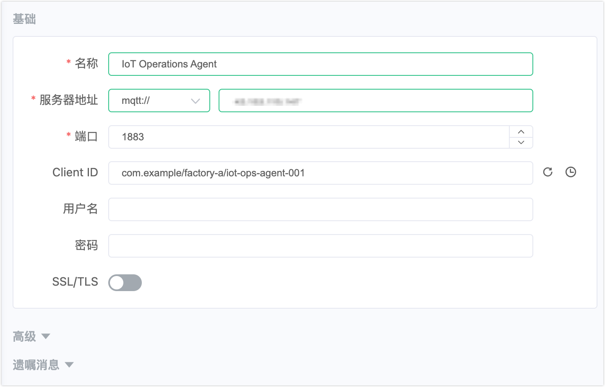
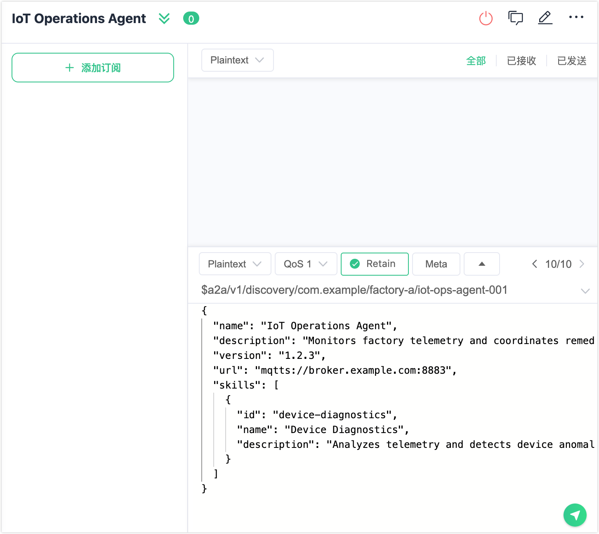
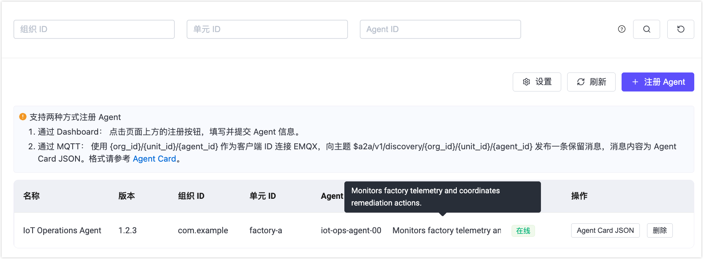

# 管理 Agent

本文介绍如何启用 A2A Registry，以及如何通过 Dashboard、CLI 或 MQTT 注册、查看和删除 Agent。

## 前提条件

- EMQX 6.2.0 及以上版本。
- 具有 Dashboard 或 EMQX 节点的管理员访问权限。

## 启用 A2A Registry

A2A Registry 默认为禁用状态，请在注册 Agent 之前先将其启用。

### 通过 Dashboard

1. 在左侧导航栏中点击 **A2A 注册**。
2. 点击**设置**。
3. 将**启用 A2A Registry** 开关打开。
4. **验证 Schema** 默认已启用。启用后，EMQX 将在注册时对 Agent Card 载荷进行 A2A Schema 校验，不合规的 Card 将被拒绝。仅在需要接受不符合 Schema 的 Card 时才建议关闭此选项。
5. 点击**保存更改**。

### 通过配置文件

在 `emqx.conf` 中添加以下配置：

```hocon
a2a_registry {
  enable = true
  validate_schema = true
}
```

完整配置参数说明：

| 参数 | 类型 | 默认值 | 说明 |
|---|---|---|---|
| `enable` | Boolean | `false` | 启用 A2A Registry。 |
| `validate_schema` | Boolean | `true` | 在注册时对 Agent Card 载荷进行 A2A Schema 校验，不合规的 Card 将被拒绝。 |
| `max_card_size` | Integer | `65536` | Agent Card 载荷的最大字节数。 |
| `registration_rate_limit` | Integer | `10` | 每个 Agent 每分钟允许的最大注册更新次数。 |
| `require_security_metadata` | Boolean | `false` | 启用后，要求 Agent Card 在安全元数据扩展中包含 `jwksUri`。 |
| `trusted_jkus` | Array | `[]` | 若非空，Agent Card 中的 `jwksUri` 必须匹配列表中的某个前缀。空列表表示关闭 JKU 校验（宽松模式）。 |
| `verify_jku_tls` | Boolean | `true` | 在获取 JWKS 端点时校验 TLS 证书。 |

## 注册 Agent

Agent 通过将 Agent Card 发布至 A2A Registry 完成注册，注册后即可被其他 Agent 发现。支持通过 Dashboard、MQTT 或 CLI 三种方式注册 Agent。

### 通过 Dashboard

1. 点击 **A2A 注册** -> **+ 注册 Agent**。
2. 填写身份字段：

   - **组织 ID**：Agent 所属的组织或信任域，例如 `com.example`。建议使用反向域名格式以确保全局唯一性。
   - **单元 ID**：组织内的子部门，例如业务单元或部署环境，如 `factory-a`。
   - **Agent ID**：该 Agent 在所属组织和部门内的唯一标识符，例如 `iot-ops-agent-001`。

   三个字段的值只能包含字母、数字、连字符、下划线或英文句点（`^[A-Za-z0-9._-]+$`），不能包含 `/`、`+`、`#` 或空白字符。三者共同构成 Agent 的完整地址：`{org_id}/{unit_id}/{agent_id}`。

3. 在编辑器中粘贴 Agent Card JSON。点击**帮助**按钮可查看必填字段说明及模板。
4. 点击**注册 Agent**。

### 通过 MQTTX

Agent 通过向发现主题发布带保留标志的消息完成注册。注册要求如下：

- MQTT 协议版本：5。
- Client ID 设置为 `{org_id}/{unit_id}/{agent_id}`。
- 启用保留标志，QoS 为 1。
- 载荷为 Agent Card JSON，至少包含 `name`、`description`、`version`、`url` 和 `skills` 字段。

**使用 [MQTTX Desktop](https://mqttx.app/zh/downloads)：**

1. 打开 MQTTX，点击**新建连接**。

2. 填写连接信息：
   - **名称**：连接名称，例如 `IoT Operations Agent`。
   - **服务器地址**：EMQX Broker 地址。
   - **端口**：`1883`（或实际使用的端口）。
   - **Client ID**：设置为 `com.example/factory-a/iot-ops-agent-001`。
   - **MQTT 版本**：`5.0`。

   

3. 点击**连接**。

4. 在底部消息编辑区填写：
   - **Topic**：`$a2a/v1/discovery/com.example/factory-a/iot-ops-agent-001`
   - **QoS**：`1`
   - **Retain**：启用
   - **Payload**：Agent Card JSON（见下方示例）。

5. 点击发送按钮。

```json
{
  "name": "IoT Operations Agent",
  "description": "Monitors factory telemetry and coordinates remediation actions.",
  "version": "1.2.3",
  "url": "mqtts://broker.example.com:8883",
  "skills": [
    {
      "id": "device-diagnostics",
      "name": "Device Diagnostics",
      "description": "Analyzes telemetry and detects device anomalies."
    }
  ]
}
```



**使用 [MQTTX CLI](https://mqttx.app/zh/cli)：**

```bash
mqttx pub \
  -h localhost -p 1883 \
  -V 5 \
  -i "com.example/factory-a/iot-ops-agent-001" \
  -t '$a2a/v1/discovery/com.example/factory-a/iot-ops-agent-001' \
  -m '{"name":"IoT Operations Agent","description":"Monitors factory telemetry and coordinates remediation actions.","version":"1.2.3","url":"mqtts://broker.example.com:8883","skills":[{"id":"device-diagnostics","name":"Device Diagnostics","description":"Analyzes telemetry and detects device anomalies."}]}' \
  -q 1 -r
```

若已启用**验证 Schema**，EMQX 会在收录前对载荷进行校验。不合规的 Card 将以 PUBACK 原因码的形式被拒绝。

### 通过 CLI

```bash
emqx ctl a2a-registry register <agent-card.json 路径>
```

JSON 文件须同时包含 Agent Card 字段和路由所需的身份字段：

```json
{
  "org_id": "com.example",
  "unit_id": "factory-a",
  "agent_id": "iot-ops-agent-001",
  "name": "IoT Operations Agent",
  "description": "Monitors factory telemetry and coordinates remediation actions.",
  "version": "1.2.3",
  "url": "mqtts://broker.example.com:8883",
  "skills": [
    {
      "id": "device-diagnostics",
      "name": "Device Diagnostics",
      "description": "Analyzes telemetry and detects device anomalies."
    }
  ]
}
```

## 查看已注册的 Agent

可通过 Dashboard 浏览和查看已注册的 Agent，也可使用 CLI 进行查询。

### 通过 Dashboard

**A2A 注册**页面列出所有已注册的 Agent，包含以下列：**名称**、**版本**、**组织 ID**、**单元 ID**、**Agent ID**、**描述**和**状态**。每行提供两个操作按钮：**Agent Card JSON** 和**删除**。

使用页面顶部的**组织 ID**、**单元 ID** 和 **Agent ID** 筛选字段缩小列表范围。

点击任意行的 **Agent Card JSON** 按钮，可查看完整的 Agent Card 原始 JSON 及复制按钮。



### 通过 CLI

```bash
# 列出所有 Agent
emqx ctl a2a-registry list

# 按组织和状态筛选
emqx ctl a2a-registry list --org com.example --status online

# 查看指定 Agent 的完整 Card
emqx ctl a2a-registry get com.example factory-a iot-ops-agent-001

# 查看 Registry 统计信息
emqx ctl a2a-registry stats
```

## 删除 Agent

删除 Agent 会将其从 A2A Registry 中注销并清除其保留的 Agent Card，使其不再可被发现。

### 通过 Dashboard

在 Agent 列表中点击目标 Agent 的**删除**按钮。在确认对话框中输入完整的 `{org_id}/{unit_id}/{agent_id}` 后确认删除。

### 通过 MQTT

向 Agent 的发现主题发布一条空的保留消息，即可清除保留 Card 并将 Agent 从 Registry 中移除。

**使用 MQTTX Desktop：**

1. 使用 Agent 的 Client ID（`com.example/factory-a/iot-ops-agent-001`）连接至 EMQX。
2. 将主题设置为 `$a2a/v1/discovery/com.example/factory-a/iot-ops-agent-001`，QoS 为 `1`，启用 Retain，载荷留空。
3. 点击发送按钮。

**使用 MQTTX CLI：**

```bash
mqttx pub \
  -h localhost -p 1883 \
  -V 5 \
  -i "com.example/factory-a/iot-ops-agent-001" \
  -t '$a2a/v1/discovery/com.example/factory-a/iot-ops-agent-001' \
  -m '' \
  -q 1 -r
```

### 通过 CLI

```bash
emqx ctl a2a-registry delete com.example factory-a iot-ops-agent-001
```

## 通过 MQTT 发现 Agent

客户端 Agent 通过订阅带通配符的发现主题来查找可用 Agent。由于 Agent Card 为保留消息，订阅后将立即收到。

**使用 MQTTX Desktop：**

1. 连接至 EMQX Broker。
2. 点击 **+ 添加订阅**，输入带通配符的主题，例如 `$a2a/v1/discovery/com.example/+/+` 以发现某组织下的所有 Agent。
3. 点击**确认**。保留的 Agent Card 将立即出现在消息面板中。

**使用 MQTTX CLI：**

```bash
# 某组织下的所有 Agent
mqttx sub -h localhost -p 1883 -V 5 -t '$a2a/v1/discovery/com.example/+/+' -v

# 某部门下的所有 Agent
mqttx sub -h localhost -p 1883 -V 5 -t '$a2a/v1/discovery/com.example/factory-a/+' -v

# 指定 Agent
mqttx sub -h localhost -p 1883 -V 5 -t '$a2a/v1/discovery/com.example/factory-a/iot-ops-agent-001' -v
```

`-v` 参数会在每条收到的载荷前打印主题名称。

每条收到的消息均以 Agent Card JSON 作为载荷。EMQX 会附加以下 MQTT v5 用户属性以表示在线状态：

| 用户属性 | 值 | 含义 |
|---|---|---|
| `a2a-status` | `online` | Agent 当前处于连接状态。 |
| `a2a-status` | `offline` | Agent 已断开连接。 |
| `a2a-status-source` | `broker` | 状态由 EMQX 根据连接情况设置。 |
| `a2a-status-source` | `agent` | 状态由 Agent 主动发布（例如正常下线）。 |
| `a2a-status-source` | `lwt` | 状态反映通过遗嘱消息（LWT）检测到的异常断开。 |
