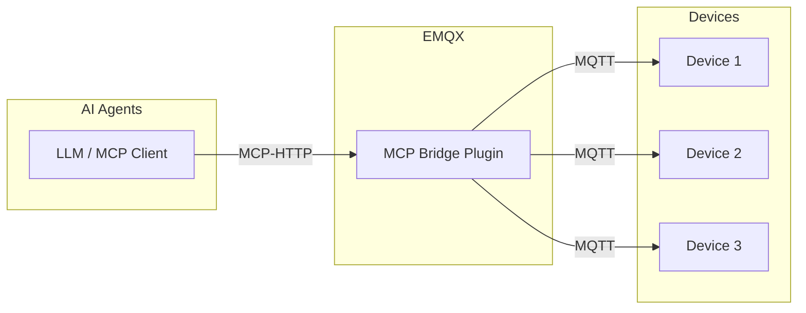
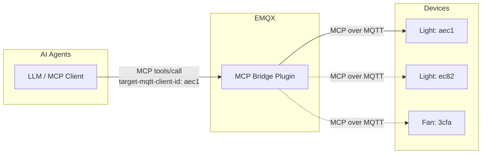
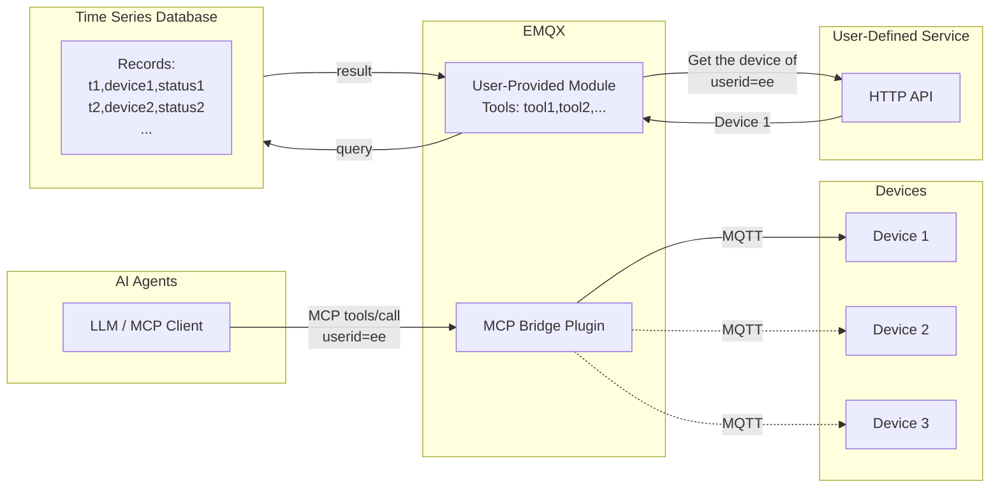

# MCP 桥接插件

[EMQX MCP 桥接插件](https://github.com/emqx/emqx_mcp_bridge) 是一个用于将 EMQX 与 MCP（Model Context Protocol）设备进行集成的插件。通过该插件，用户可以使用支持 MCP 的大模型或者 AI 智能体来访问和控制物联网设备。

## MCP 桥接插件是如何工作的

MCP 桥接插件安装并运行在 EMQX 内部，启动后它将会暴露一个 HTTP 端点，将 Streamable HTTP 或者 SSE 协议的 MCP 连接转换为 MQTT 协议。

物联网设备通过 MQTT 协议连接到 EMQX 服务器，而支持 MCP 的大模型或者 AI 智能体则连接到 MCP 桥接插件的 HTTP 端点。

### 使用 MCP over MQTT 协议访问设备

设备端可以选择使用 MCP over MQTT 协议，作为 MCP Server 直接暴露自己的工具和能力，插件将会将这些设备注册上来的工具按工具类型 (MCP over MQTT 协议里的 Server Name 概念在 MCP 插件中将会被映射为工具类型) 分类汇总，生成统一的工具列表供 MCP Client 使用。就是说，同类型的多个设备向 EMQX 注册的工具，会被桥接插件聚合为单个逻辑工具供模型调用。

这种方式适合一个客户端访问单个或几个设备的场景，例如智能家居、工业控制、语音玩具等。这种场景下，用户通常只需要访问自己名下的设备，不需要批量访问大量设备。

由于多个同类型的设备的工具会被聚合为单个逻辑工具，因此 MCP 桥接会在工具的定义中注入一个 `target-mqtt-client-id` 的必选参数。AI 智能体在调用工具时，需要根据业务逻辑确定需要访问的设备 ID，填入该参数，从而将 MCP 请求路由到具体的设备上。

### 使用标准 MQTT 协议访问设备

设备端也可以不使用 MCP over MQTT 协议，而是使用标准的 MQTT 协议连接到 EMQX。这种情况下，用户可以通过在 MCP 桥接中编码实现 MCP 工具，从而间接访问这些普通 MQTT 设备。

这种方式适合需要更加灵活地访问设备的场景，例如智慧城市、车联网、工业物联网等。在 MCP 桥接插件中，可以编码实现任意的业务逻辑，比如访问用户自定义的外部服务或接口，或者访问外部数据库获取设备上报的数据等等。

关于如何实现 MCP 工具的编码示例，请参考[创建自定义 MCP 工具](https://github.com/emqx/emqx_mcp_bridge?tab=readme-ov-file#create-custom-mcp-tools)。

