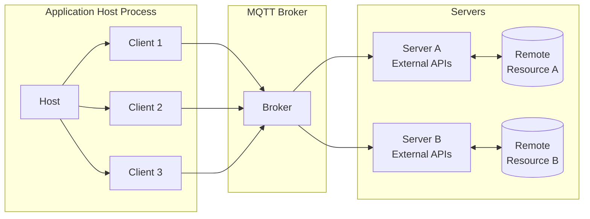
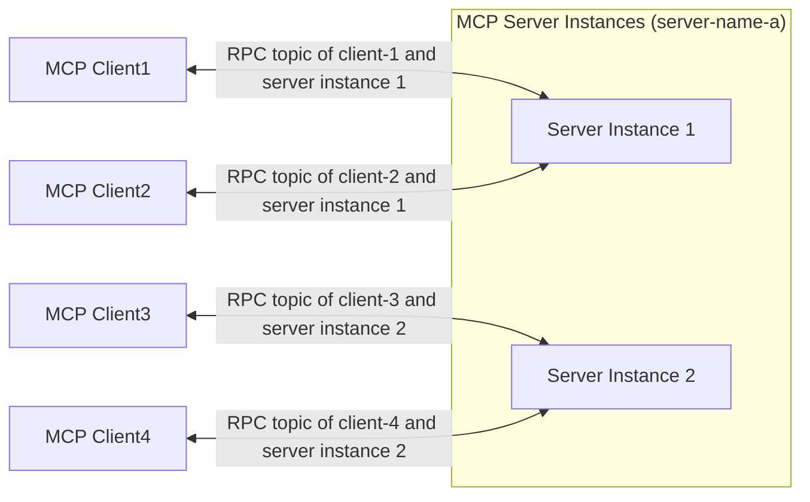

# MCP over MQTT 架构

MCP over MQTT 在整体设计上继承了标准 MCP 架构的核心概念（Host、Client、Server），并通过引入中心化的 MQTT Broker 作为传输层，实现消息的路由、服务注册与发现、认证与授权。这种架构不仅保持了 MCP 原有的上下文交互模式，还利用 MQTT 的轻量化与广泛适用性，为物联网与边缘计算场景中的多对多通信、负载均衡与可扩展性提供了基础。

## 核心组件与通信方式

在 MCP over MQTT 架构中，引入了中心化的 MQTT Broker 作为消息路由器，其余组件（Host、Client、Server）保持与标准 MCP 架构一致。

### Host、Client 与 Server

Host、Client 和 Server 组件保持不变（详见[核心组件](https://modelcontextprotocol.io/docs/learn/architecture#concepts-of-mcp)）：

- Host 进程作为客户端的容器和协调者。
- 每个 Client 由 Host 创建，并维护与 Server 的独立连接。
- Server 提供专用的上下文和能力。

最大的区别是，Client 和 Server 现在通过 MQTT Broker 进行通信，而不是直接相互通信。另外，由于 MQTT Broker 的引入，Client 和 Server 变为多对多的关系，而不是一对一。

### MQTT Broker 的角色

MQTT Broker 作为中心化的消息路由器：
- 转发 Client 与 Server 之间的消息。
- 支持服务发现和服务注册（通过保留消息）。
- 对 Client 和 Server 进行认证和授权。

## 服务端扩展与负载均衡

为实现 MCP 服务端负载均衡与可扩展性，MCP Server 可以启动多个实例（进程），每个实例使用唯一的 `server-id` 作为 MQTT Client ID 建立独立的 MQTT 连接。所有 MCP Server 实例共享同一个 `server-name`。

**客户端交互流程**：

1. Client 订阅服务发现主题，获取目标 `server-name` 下的所有可用 `server-id`。
2. Client 根据自定义策略（如随机、轮询）选择一个 Server 实例，并向其发起 `initialize` 请求。
3. 初始化完成后，Client 与选定的 Server 实例在专属 RPC 主题上进行通信。

这使我们能够实现 MCP 服务端的高可用性和可扩展性：

- 扩容时，已有的 MCP 客户端会继续连接到旧的服务端实例，而新的 MCP 客户端则有机会向新的服务端实例发起初始化请求。

- 缩容时，MCP 客户端可以重新向 MCP 服务端发起初始化请求，从而连接到其他服务端实例。