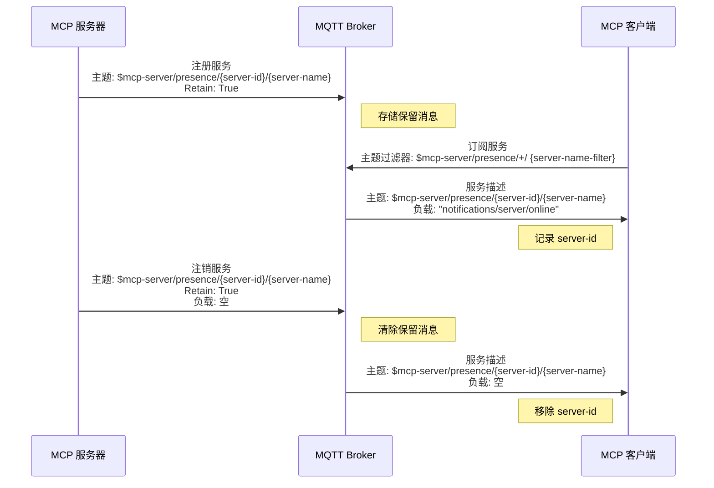
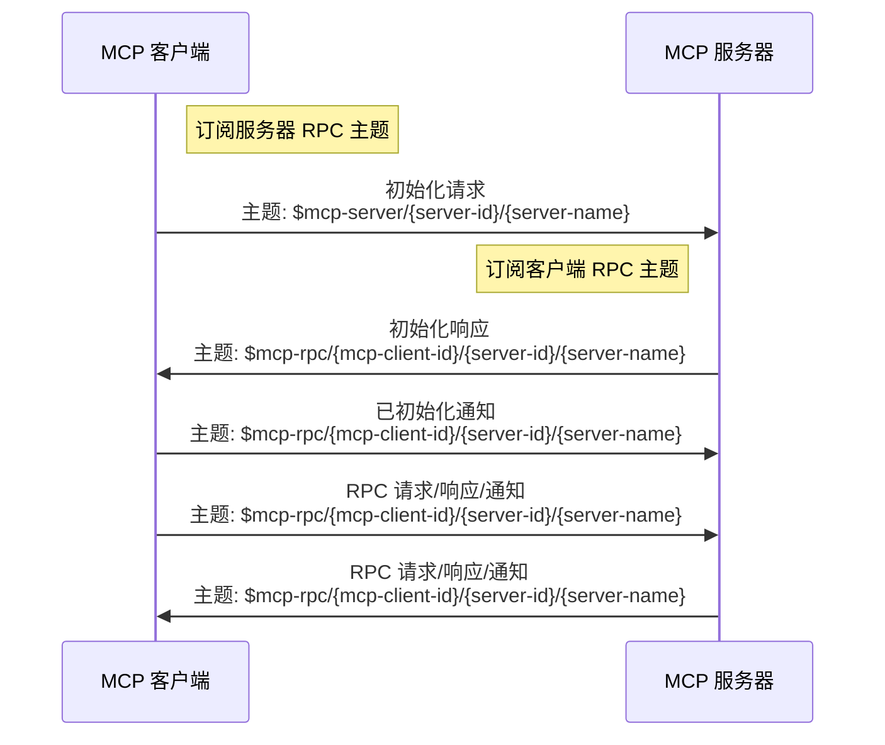
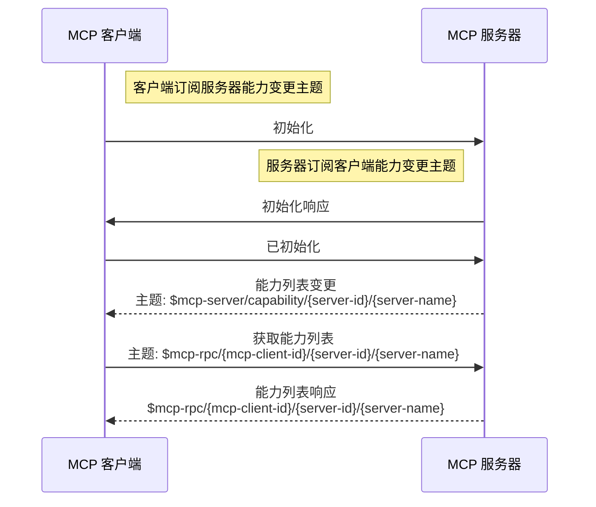
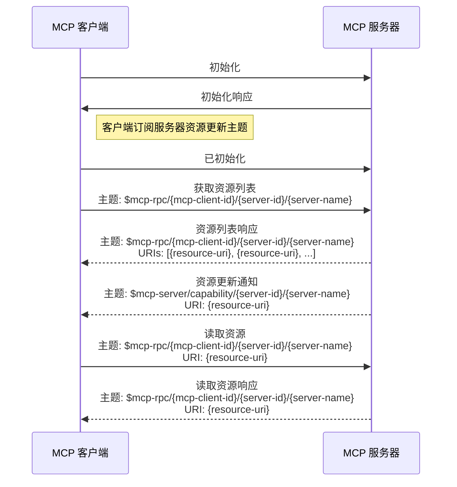

# 协议规范

本文档定义了 MCP 协议在 MQTT 传输层下的特殊要求，包括 MQTT 主题、客户端 ID 格式等，并描述了 MQTT 传输层的生命周期，包括服务发现、初始化、能力列表变更、资源更新和关闭流程。

请结合 [MCP 规范](https://modelcontextprotocol.io/specification/2025-06-18)一起阅读。

## 术语

- **server-name**：MCP 服务器的标识符，将包含在 MQTT 消息主题中。

    多个使用相同 `server-name` 的连接视为同一个 MCP 服务器的多个实例，提供完全相同的服务。MCP 客户端发送初始化消息时，应根据客户端侧策略选择其中一个。

    不同 `server-name` 的 MCP 服务器可能提供类似功能，此时客户端可根据权限、LLM 推荐或用户选择，决定初始化连接的服务器。

    连接 MQTT Broker 后，Broker 可通过 MQTT CONNECT 消息中的 `MCP-SERVER-NAME` 用户属性建议 MCP 服务器使用的 `server-name`。如有建议，MCP 服务器**必须**采用该名称；否则应根据自身功能使用默认名称。

    `server-name` 必须采用以 `/` 分隔的层级主题风格，便于客户端通过 MQTT 通配符订阅特定类型的 MCP 服务器，例如：`server-type/sub-type/name`。

    `server-name` 不应包含 `+` 和 `#` 字符，且应在所有 MCP 服务器中唯一。

- **server-name-filter**：用于匹配 `server-name` 的 MQTT 主题过滤器，可包含 `/`、`+`、`#`。详见 **server-name** 说明。

    连接 MQTT Broker 后，Broker 可通过 MQTT CONNACK 消息中的 `MCP-SERVER-NAME-FILTERS` 用户属性建议 MCP 客户端使用的过滤器。该属性值为字符串数组，每个字符串为 MQTT 主题过滤器。若无建议，客户端应根据自身功能使用默认过滤器。

- **server-id**：MCP 服务器实例的 MQTT Client ID，除 `/`、`+`、`#` 外任意字符串。必须全局唯一，并包含在主题中。

- **mcp-client-id**：客户端的 MQTT Client ID，除 `/`、`+`、`#` 外任意字符串。必须全局唯一，并包含在主题中。每次初始化请求需使用不同的 client-id。

## 消息主题

MCP 通过 MQTT 主题传递消息，协议包含如下主题：

| 主题名称                       | 主题格式                                                          | 说明                                                                        |
|-------------------------------|-------------------------------------------------------------------|-----------------------------------------------------------------------------|
| 服务器控制主题                 | `$mcp-server/{server-id}/{server-name}`                           | 初始化及其他控制消息。                                                      |
| 服务器能力变更主题             | `$mcp-server/capability/{server-id}/{server-name}`                | 能力列表变更或资源更新通知。                                                |
| 服务器在线状态主题             | `$mcp-server/presence/{server-id}/{server-name}`                  | 服务器在线/离线状态消息。                                                   |
| 客户端在线状态主题             | `$mcp-client/presence/{mcp-client-id}`                            | 客户端在线/离线状态消息。                                                   |
| 客户端能力变更主题             | `$mcp-client/capability/{mcp-client-id}`                          | 客户端能力列表变更通知。                                                    |
| RPC 主题                      | `$mcp-rpc/{mcp-client-id}/{server-id}/{server-name}`              | RPC 请求/响应及通知消息。                                                   |

## MQTT 协议版本

MCP 服务器和客户端**必须**使用 MQTT 5.0 协议。

## 用户属性

CONNECT 消息**必须**设置如下用户属性：
- `MCP-COMPONENT-TYPE`：`mcp-client` 或 `mcp-server`
- `MCP-META`：包含 MCP 组件元数据的 JSON 对象，如版本、实现信息、位置等。Broker 可据此建议 server-name 或 server-name-filter。

CONNACK 消息（Broker 发送）**可选**用户属性：
- `MCP-SERVER-NAME`：Broker 建议的 MCP 服务器名称，仅服务器连接时存在。
- `MCP-RBAC`：JSON 数组，包含服务器名称及对应角色名，客户端可据此判断权限。每个元素为包含 `server_name` 和 `role_name` 的对象，仅客户端连接时存在。
- `MCP-SERVER-NAME-FILTERS`：Broker 建议的服务器名称过滤器，字符串数组，每个为 MQTT 主题过滤器，仅客户端连接时存在。

PUBLISH 消息**必须**设置如下用户属性：
- `MCP-COMPONENT-TYPE`：`mcp-client` 或 `mcp-server`
- `MCP-MQTT-CLIENT-ID`：发送方的 MQTT Client ID

## 会话过期时间

会话过期时间**必须**设为 0，客户端断开时会话立即清理。

## MQTT Client ID

### MCP 服务器

MCP 服务器的 Client ID（`server-id`）为除 `/`、`+`、`#` 外的任意字符串。

### MCP 客户端

MCP 客户端的 Client ID（`mcp-client-id`）为除 `/`、`+`、`#` 外的任意字符串，每次初始化请求需使用不同的 client-id。

## MQTT 主题与过滤器

### MCP 服务器订阅

| 主题过滤器                                         | 说明                                                                 |
|----------------------------------------------------|----------------------------------------------------------------------|
| `$mcp-server/{server-id}/{server-name}`            | 服务器控制主题，接收控制消息。                                        |
| `$mcp-client/capability/{mcp-client-id}`           | 客户端能力变更主题，接收客户端能力列表变更通知。                      |
| `$mcp-client/presence/{mcp-client-id}`             | 客户端在线状态主题，接收客户端断开通知。                              |
| `$mcp-rpc/{mcp-client-id}/{server-id}/{server-name}`| RPC 主题，接收来自客户端的 RPC 请求、响应和通知。                     |

::: tip 注意

服务器订阅 RPC 主题时**必须**设置 **No Local** 选项，避免收到自身消息。
:::

### MCP 服务器发布

| 主题名称                                             | 消息内容                                        |
| ---------------------------------------------------- | ----------------------------------------------- |
| `$mcp-server/capability/{server-id}/{server-name}`   | 能力列表变更或资源更新通知。                    |
| `$mcp-server/presence/{server-id}/{server-name}`     | 服务器在线状态消息，详见[服务发现](#服务发现)。 |
| `$mcp-rpc/{mcp-client-id}/{server-id}/{server-name}` | RPC 请求、响应和通知。                          |

::: tip 注意
- 服务器发布在线状态消息时，**必须**将 `$mcp-server/presence/{server-id}/{server-name}` 的 RETAIN 标志设为 True。
- 连接 MQTT Broker 时，服务器**必须**将 `$mcp-server/presence/{server-id}/{server-name}` 设为遗嘱主题，负载为空，用于异常断开时清除保留消息。
:::

### MCP 客户端订阅

| 主题过滤器                                         | 说明                                                                 |
|----------------------------------------------------|----------------------------------------------------------------------|
| `$mcp-server/capability/{server-id}/{server-name-filter}`| 能力变更主题，接收服务器能力列表变更或资源更新通知。                  |
| `$mcp-server/presence/+/{server-name-filter}`      | 服务器在线状态主题，接收服务器在线状态消息。                          |
| `$mcp-rpc/{mcp-client-id}/{server-id}/{server-name-filter}`| RPC 主题，接收服务器发送的 RPC 请求、响应和通知。                      |

::: info 注意

客户端订阅 RPC 主题时**必须**设置 **No Local** 选项，避免收到自身消息。
:::

### MCP 客户端发布

| 主题名称                                   | 消息内容                                             |
|--------------------------------------------|------------------------------------------------------|
| `$mcp-server/{server-id}/{server-name}`    | 发送控制消息，如初始化请求。                         |
| `$mcp-client/capability/{mcp-client-id}`   | 发送客户端能力列表变更通知。                         |
| `$mcp-client/presence/{mcp-client-id}`     | 发送客户端断开通知。                                 |
| `$mcp-rpc/{mcp-client-id}/{server-id}/{server-name}`| 向指定服务器发送 RPC 请求/响应。                     |

::: tip 注意

连接 MQTT Broker 时，客户端**必须**将 `$mcp-client/presence/{mcp-client-id}` 设为遗嘱主题，负载为 "disconnected" 通知，用于异常断开时通知服务器。
:::

## 服务发现

### 服务注册

MCP 服务器启动后，向 MQTT Broker 注册服务。服务发现与注册主题为：`$mcp-server/presence/{server-id}/{server-name}`。

服务器**必须**在启动时向服务在线状态主题发布 "server/online" 通知，并设置 RETAIN 标志为 True。

"server/online" 通知**应**只包含简要信息，避免消息过大。客户端可在初始化后请求详细信息。

- MCP 服务器功能简述，便于客户端选择初始化对象。
- 元数据，如角色与权限，帮助客户端理解访问控制策略。`rbac` 字段可包含角色列表，每个角色含名称、描述、允许的方法、工具和资源，Broker 可据此实现基于角色的访问控制（RBAC）。

```json
{
    "jsonrpc": "2.0",
    "method": "notifications/server/online",
    "params": {
        "server_name": "example/server",
        "description": "简要描述 MCP 服务器功能，便于客户端按需选择。若提供工具，仅说明工具类型，不含参数，减少消息体积。",
        "meta": {
            "rbac": {
                "roles": [
                    {
                        "name": "admin",
                        "description": "管理员角色，拥有全部权限",
                        "allowed_methods": [
                            "notifications/initialized",
                            "ping", "tools/list", "tools/call", "resources/list", "resources/read",
                            "resources/subscribe", "resources/unsubscribe"
                        ],
                        "allowed_tools": "all",
                        "allowed_resources": "all"
                    },
                    {
                        "name": "user",
                        "description": "普通用户角色，权限有限",
                        "allowed_methods": [
                            "notifications/initialized",
                            "ping", "tools/list", "tools/call", "resources/list", "resources/read"
                        ],
                        "allowed_tools": [
                            "get_vehicle_status", "get_vehicle_location"
                        ],
                        "allowed_resources": [
                            "file:///vehicle/telemetry.data"
                        ]
                    }
                ]
            }
        }
    }
}
```

详细信息如工具参数，**应**由客户端按需通过 `**/list` 请求获取。

客户端可随时订阅 `$mcp-server/presence/+/{server-name-filter}`，其中 `{server-name-filter}` 为服务器名称过滤器。

例如，若服务器名称为 `{server-type}/{sub-type}/{name}`，客户端仅有权限访问 `{server-type}/{sub-type}` 类型服务器，则可订阅 `$mcp-server/presence/+/{server-type}/{sub-type}/#`，一次性获取所有 `{sub-type}` 类型服务器的在线状态。

虽然客户端可订阅 `$mcp-server/presence/+/#` 获取所有类型服务器，但管理员可通过 MQTT Broker 的 ACL 限制其只能在如 `$mcp-rpc/{mcp-client-id}/{server-id}/{server-type}/{sub-type}/#` 等主题收发消息。因此，过宽的订阅无实际意义。合理设计 `{server-name-filter}` 可减少无关信息干扰。

### 服务注销

连接 MQTT Broker 时，服务器**必须**将 `$mcp-server/presence/{server-id}/{server-name}` 设为遗嘱主题，负载为空，用于异常断开时清除注册信息。

主动断开前，服务器**必须**向 `$mcp-server/presence/{server-id}/{server-name}` 发送空消息，清除注册信息。

在 `$mcp-server/presence/{server-id}/{server-name}` 主题上：

- 客户端收到 `server/online` 通知时，应记录 `{server-id}` 为该 `{server-name}` 的一个实例。
- 客户端收到空消息时，应清除缓存的 `{server-id}`。只要有任一实例在线，客户端应认为 MCP 服务器在线。

服务注册与注销消息流程如下：



## 初始化

本节仅描述 MQTT 传输相关的初始化流程，详细内容见[生命周期](https://modelcontextprotocol.io/specification/2025-06-18/basic/lifecycle)。

初始化阶段**必须**是客户端与服务器的首次交互。

客户端**必须**在发送初始化请求前，订阅 RPC 主题（`$mcp-rpc/{mcp-client-id}/{server-id}/{server-name}`），并设置 **No Local** 选项。

服务器**必须**在响应初始化前，订阅 RPC 主题（`$mcp-rpc/{mcp-client-id}/{server-id}/{server-name}`），并设置 **No Local** 选项。



客户端**必须**通过 `$mcp-server/{server-id}/{server-name}` 主题发送 `initialize` 请求，内容包括：

- 支持的协议版本
- 客户端能力
- 客户端实现信息

```json
{
    "jsonrpc": "2.0",
    "id": 1,
    "method": "initialize",
    "params": {
        "protocolVersion": "2024-11-05",
        "capabilities": {
            "roots": {
                "listChanged": true
            },
            "sampling": {}
        },
        "clientInfo": {
            "name": "ExampleClient",
            "version": "1.0.0"
        }
    }
}
```

服务器**必须**通过 `$mcp-rpc/{mcp-client-id}/{server-id}/{server-name}` 主题响应自身能力及信息：

```json
{
    "jsonrpc": "2.0",
    "id": 1,
    "result": {
        "protocolVersion": "2024-11-05",
        "capabilities": {
            "logging": {},
            "prompts": {
                "listChanged": true
            },
            "resources": {
                "subscribe": true,
                "listChanged": true
            },
            "tools": {
                "listChanged": true
            }
        },
        "serverInfo": {
            "name": "ExampleServer",
            "version": "1.0.0"
        }
    }
}
```

初始化成功后，客户端**必须**通过 `$mcp-rpc/{mcp-client-id}/{server-id}/{server-name}` 发送已初始化通知：

```json
{
    "jsonrpc": "2.0",
    "method": "notifications/initialized"
}
```

## 能力列表变更

客户端在发送初始化请求前，**必须**订阅服务器能力列表变更主题：`$mcp-server/capability/{server-id}/{server-name-filter}`。

服务器在响应初始化请求前，**必须**订阅客户端能力列表变更主题：`$mcp-client/capability/{mcp-client-id}`。

后续能力列表更新时：

- 服务器向 `$mcp-server/capability/{server-id}/{server-name}` 发送通知
- 客户端向 `$mcp-client/capability/{mcp-client-id}` 发送通知

能力列表变更通知负载依赖具体能力，如工具变更为 "notifications/tools/list_changed"。收到通知后，需通过 RPC 获取最新能力列表，详见相关能力文档。



## 资源更新

MCP 协议允许客户端订阅特定资源的变更。

若服务器支持资源订阅能力，客户端可在发送已初始化通知前订阅资源变更主题。

客户端订阅资源变更主题为：`$mcp-server/capability/{server-id}/{server-name}`。

资源变更时，服务器**应**向 `$mcp-server/capability/{server-id}/{server-name}` 发送通知。



## 关闭流程

### 服务器断开

服务器**必须**连接时设置遗嘱消息，通知客户端异常断开，遗嘱主题为 `$mcp-server/presence/{server-id}/{server-name}`，负载为空。

主动断开前，服务器**必须**向该主题发送空消息。

服务器如需与客户端“去初始化”但保持与 Broker 的连接，**必须**向 RPC 主题 `$mcp-rpc/{mcp-client-id}/{server-id}/{server-name}` 发送 "disconnected" 通知，并取消订阅如下主题：
- `$mcp-client/capability/{mcp-client-id}`
- `$mcp-client/presence/{mcp-client-id}`
- `$mcp-rpc/{mcp-client-id}/{server-id}/{server-name}`

"disconnected" 通知格式：

```json
{
    "jsonrpc": "2.0",
    "method": "notifications/disconnected"
}
```

客户端收到服务器在线状态主题的空消息或 RPC 主题的 "disconnected" 通知时，**必须**视服务器为离线，清除缓存的 `{server-id}`，并取消订阅如下主题：
- `$mcp-server/capability/{server-id}/{server-name-filter}`
- `$mcp-rpc/{mcp-client-id}/{server-id}/{server-name-filter}`

### 客户端断开

服务器**必须**在响应初始化前订阅客户端在线状态主题（`$mcp-client/presence/{mcp-client-id}`）。

客户端**必须**连接时设置遗嘱消息，通知服务器异常断开，遗嘱主题为 `$mcp-client/presence/{mcp-client-id}`，负载为 "disconnected" 通知。

主动断开前，客户端**必须**向该主题发送 "disconnected" 通知。

客户端如需与服务器“去初始化”但保持与 Broker 的连接，**必须**向 RPC 主题 `$mcp-rpc/{mcp-client-id}/{server-id}/{server-name}` 发送 "disconnected" 通知，并取消订阅如下主题：
- `$mcp-server/capability/{server-id}/{server-name-filter}`
- `$mcp-rpc/{mcp-client-id}/{server-id}/{server-name-filter}`

服务器收到 "disconnected" 通知后，**必须**取消订阅如下主题：
- `$mcp-client/capability/{mcp-client-id}`
- `$mcp-client/presence/{mcp-client-id}`
- `$mcp-rpc/{mcp-client-id}/{server-id}/{server-name}`

"disconnected" 通知格式：

```json
{
    "jsonrpc": "2.0",
    "method": "notifications/disconnected"
}
```

## 健康检查

客户端或服务器**可**随时发送 `ping` 请求检查对方健康状态。

- 客户端若未在合理时间收到服务器 `ping` 响应，**必须**向 `$mcp-client/presence/{mcp-client-id}` 发送 "disconnected" 通知并断开自身连接。
- 服务器若未及时收到客户端 `ping` 响应，**必须**向客户端发送其他 RPC 请求。

详见 [Ping](https://modelcontextprotocol.io/specification/2025-06-18/basic/utilities/ping)。

## 超时设置

所有 RPC 请求均通过 MQTT 异步发送，需考虑超时。不同请求超时时间可配置，推荐默认值如下：

- "initialize"：30 秒
- "ping"：10 秒
- "roots/list"：30 秒
- "resources/list"：30 秒
- "tools/list"：30 秒
- "prompts/list"：30 秒
- "prompts/get"：30 秒
- "sampling/createMessage"：60 秒
- "resources/read"：30 秒
- "resources/templates/list"：30 秒
- "resources/subscribe"：30 秒
- "tools/call"：60 秒
- "completion/complete"：60 秒
- "logging/setLevel"：30 秒

<!-- {< callout type="info" >}
进度请求以通知形式发送，无需响应，无需超时。
{< /callout >} -->

## 错误处理

实现应准备处理如下错误场景：

- 协议版本不匹配
- 必需能力协商失败
- 初始化请求超时
- 关闭超时

实现应为所有请求设置合理超时，防止连接挂起和资源耗尽。

初始化错误示例：

```json
{
    "jsonrpc": "2.0",
    "id": 1,
    "error": {
        "code": -32602,
        "message": "不支持的协议版本",
        "data": {
            "supported": ["2025-03-26"],
            "requested": "1.0.0"
        }
    }
}
```
