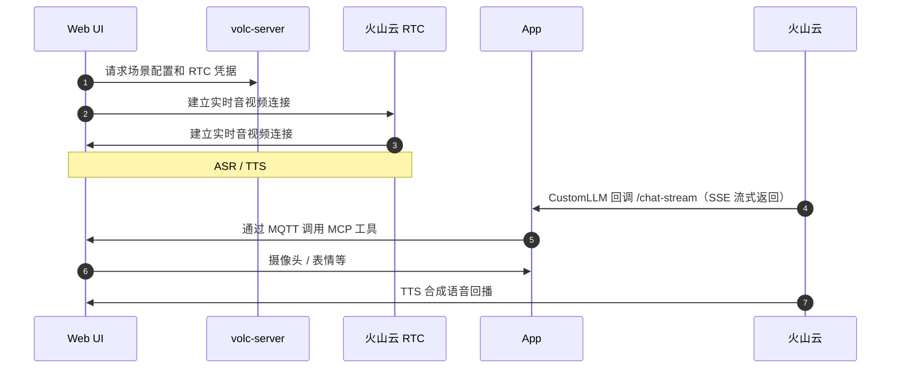

# 使用 EMQX + 火山引擎 RTC 构建实时语音智能体

该文档介绍如何使用 Docker Compose 部署 AI Agent 演示项目。项目通过浏览器中的智能玩偶模拟智能设备，演示如何使用[火山引擎 RTC](https://www.volcengine.com/product/veRTC/ConversationalAI) 实现低延迟语音交互，通过 MCP over MQTT 协议调用设备端能力（拍照、表情切换、音量调节等），并使用火山引擎 `CustomLLM` 模式对接自定义 AI Agent 服务实现多轮对话与工具调用，展示从语音对话到设备控制的完整流程。

观看[演示视频](https://www.bilibili.com/video/BV1P2WTzBEu4/)了解 Demo 完整效果。

## 架构概览

### 组件说明

系统由三个核心组件组成：

| 组件            | 角色                  | 端口 | 主要功能                                                   |
|-----------------|-----------------------|------|------------------------------------------------------------|
| **volc-server** | 火山引擎代理          | 3002 | 管理 RTC 房间/Token，配置 CustomLLM 地址供火山引擎回调 app |
| **web**         | MCP Server            | 8080 | 前端 UI，暴露硬件控制工具（摄像头/表情/音量）              |
| **app**         | MCP Client + AI Agent | 8081 | 提供 `/chat-stream` 端点，处理 LLM/VLM 推理和 MCP 工具调用 |

### 通信流程



**核心能力**：

- **MCP over MQTT 协议**：通过 EMQX Broker 实现跨网络工具调用，AI Agent 控制设备（摄像头、表情、音量）
- **多模态理解**：集成 VLM 视觉模型，支持"我手里拿的是什么"等场景
- **实时语音交互**：基于火山引擎 RTC + ASR/TTS，端到端低延迟语音识别与合成
- **并行处理架构**：工具调用与语音合成异步执行，用户体验流畅

## 前置准备

### 1. Docker 环境

Docker 24+（运行 `docker --version` 确认版本）。

### 2. MQTT Broker

本项目需要可访问的 EMQX Broker，供 Web 服务（MCP Server）和 app（MCP Client + AI Agent）容器连接。

**部署方式（二选一）**：

- **自建部署**：参考 [EMQX 安装文档](https://docs.emqx.com/zh/emqx/latest/deploy/install.html)
- **托管服务**：使用 [EMQX Cloud](https://docs.emqx.com/zh/cloud/latest/)

**配置示例**：

```bash
MQTT_BROKER_HOST=localhost        # EMQX Broker 地址
MQTT_BROKER_PORT=1883             # MQTT 端口
MQTT_USERNAME=your_username       # 用户名（如需认证）
MQTT_PASSWORD=your_password       # 密码（如需认证）
```

### 3. LLM API Key

项目通过火山引擎 CustomLLM 模式接入自定义 AI Agent，默认使用阿里云百炼 `qwen-flash` 模型。

#### 开通阿里云百炼

1. 访问 [阿里云百炼控制台](https://bailian.console.aliyun.com)
2. 如果顶部有开通提示，点击开通服务（开通免费，仅 API 调用超出免费额度时收费）
3. 如需实名认证，按提示完成

#### 创建 API Key

1. 进入 [API-KEY 管理](https://bailian.console.aliyun.com/#/api-key)
2. 在 **API-Key** 标签下，点击 **创建 API-KEY**
3. 选择账号和工作空间（通常为默认工作空间），填写描述并确认
4. 点击 API Key 旁的复制图标获取密钥
5. 将获取的 API Key 填入 `app/.env` 的 `DASHSCOPE_API_KEY`

#### 使用其他模型服务（可选）

如需使用其他 OpenAI 兼容的模型服务，修改 `app/.env` 中的配置：

```bash
LLM_API_BASE=https://your-model-service.com/v1  # 模型服务 Base URL
LLM_API_KEY=your_api_key                        # 模型服务 API Key
LLM_MODEL=your_model_name                       # 模型名称
```

**常用模型服务**：

- **OpenAI**：`https://api.openai.com/v1`
- **DeepSeek**：`https://api.deepseek.com/v1`
- **其他兼容服务**：参考各服务文档

不同 LLM 服务的延迟和成本差异较大，请根据需求选择。为获得最佳延迟，推荐使用默认的阿里云百炼 `qwen-flash`。

### 4. 火山引擎凭证

本项目需要多个火山引擎服务。请访问 [火山引擎控制台](https://console.volcengine.com/home) 注册并登录。

**需要开通的服务**：

1. **RTC 服务** - [开通教程](https://www.volcengine.com/docs/6348/69865)
   - 开通后获取 `VOLC_RTC_APP_ID` 和 `VOLC_RTC_APP_KEY`
   - 获取位置：[RTC 控制台](https://console.volcengine.com/rtc/aigc/listRTC)

2. **ASR/TTS 语音服务** - [豆包语音控制台](https://console.volcengine.com/speech/app)
   - 创建应用时选择：
     - **ASR**：流式语音识别
     - **TTS**：语音合成
   - 获取以下凭证：
     - `VOLC_ASR_APP_ID` - 语音识别应用 ID
     - `VOLC_TTS_APP_ID` - 语音合成应用 ID
     - `VOLC_TTS_APP_TOKEN` - TTS 应用 Token
     - `VOLC_TTS_RESOURCE_ID` - TTS 资源 ID（根据选择的音色）

3. **账号凭证** - [密钥管理](https://console.volcengine.com/iam/keymanage/)
   - `VOLC_ACCESS_KEY_ID` - Access Key ID
   - `VOLC_SECRET_KEY` - Secret Access Key

#### 权限配置

**必须完成**：在 RTC 控制台配置跨服务授权，否则智能体无法正常调用 ASR/TTS/LLM 服务。

**主账号调用**（推荐，配置简单）：

1. 使用主账号登录 [RTC 控制台](https://console.volcengine.com/rtc)
2. 进入 [跨服务授权](https://console.volcengine.com/rtc/aigc/iam)
3. 点击 **一键开通跨服务授权**，配置 `VoiceChatRoleForRTC` 角色
4. 使用主账号的 AK/SK 调用服务

**子账号调用**（可选，需额外配置）：

为子账号添加调用实时对话式 AI 接口的权限：

1. 使用主账号登录 [RTC 控制台](https://console.volcengine.com/rtc)
2. 进入 [跨服务授权](https://console.volcengine.com/rtc/aigc/iam)，点击 **为子账号添加权限**
3. 找到需要授权的子账号，点击添加权限

> 完整的 RTC 服务开通教程，参考：[实时对话式 AI 前提条件](https://www.volcengine.com/docs/6348/1315561)

#### LLM 配置

本项目使用 **CustomLLM 模式**，火山引擎回调 app 的自定义 AI Agent 服务获取 LLM 响应。

**核心配置**：

- `VOLC_LLM_URL` - 指向 app 服务的 `/chat-stream` 端点
  - 本地部署：`http://app:8081/chat-stream`（容器网络）
  - 生产部署：`https://your-domain.com/chat-stream`（必须公网可访问）
- `VOLC_LLM_API_KEY` - 自定义认证密钥，必须与 app 的 `CUSTOM_LLM_API_KEY` 一致（见下方"步骤 2：配置环境变量"）

**模型来源**（可选）：

- **火山方舟**：在 [方舟控制台](https://console.volcengine.com/ark/region:ark+cn-beijing/endpoint) 创建推理接入点或应用
- **扣子平台**：在 [扣子](https://www.coze.cn) 创建 Agent - [创建教程](https://www.coze.cn/open/docs/guides/quickstart)
- **第三方模型**：准备 OpenAI 兼容的服务 URL - [接入要求](https://www.volcengine.com/docs/6348/1399966)

> **说明**：本项目的 app 服务已实现 CustomLLM 协议。你只需配置上述"3. LLM API Key"中的 API Key（如 `DASHSCOPE_API_KEY`），无需额外部署模型服务。

#### 快速获取参数

**推荐方式**：使用火山引擎官方 Demo 快速验证配置

1. 访问 [实时对话式 AI Demo](https://console.volcengine.com/rtc/aigc/run)
2. 运行 Demo 后，点击右上角 **接入 API** 按钮
3. 复制参数配置代码，提取所需凭证

### 5. 网络要求

**端口开放**（默认配置，可在 Compose 文件中调整）：

- `8080` - Web UI
- `8081` - App 后端（SSE 端点）
- `3002` - volc-server 代理（火山引擎服务配置）

**可访问性要求**：

**重要**：要完整体验本项目的 MCP over MQTT 功能，app 服务的 `/chat-stream` 端点**必须部署到公网可访问的 HTTPS 环境**，供火山引擎服务回调。

- **生产部署**（推荐）：将 app 部署到公网 HTTPS 地址（如 `https://your-domain.com/chat-stream`），确保 SSE 响应以 `data: [DONE]` 正确结束
- **本地测试**：非公网环境只能通过 API 测试 LLM 推理和 MCP over MQTT 工具调用，无法完整体验火山引擎语音交互

## 快速教程：10 分钟语音交互 + 设备控制演示

完成所有前置准备后，按以下步骤快速搭建具有语音交互和设备控制（Web 模拟设备）的 AI Agent 演示。

### 步骤 1：获取代码

```bash
git clone -b volcengine/rtc https://github.com/emqx/mcp-ai-companion-demo.git
cd mcp-ai-companion-demo
```

### 步骤 2：配置环境变量

这是最关键的一步。我们需要将前置准备中获取的凭证正确填入三个服务的配置文件。请仔细阅读每个配置项的说明和来源。

#### 2.1 配置 app 服务（AI Agent 后端）

**创建配置文件**：

```bash
cp app/.env.example app/.env
```

**编辑 `app/.env`，填入以下配置**：

```bash
# ===== LLM 配置 =====
# 来源：前置准备"3. LLM API Key"
# 用途：供 AI Agent 调用大语言模型进行对话推理
DASHSCOPE_API_KEY=sk-xxxxxxxxxxxxx  # 替换为阿里云百炼 API Key

# 如使用其他模型服务，额外配置：
# LLM_API_BASE=https://api.openai.com/v1
# LLM_MODEL=gpt-4

# ===== CustomLLM 认证密钥 =====
# 来源：自行生成（建议使用强随机字符串）
# 用途：火山引擎通过此密钥验证回调请求合法性
# 要求：必须与 volc-server 的 VOLC_LLM_API_KEY 完全一致
CUSTOM_LLM_API_KEY=your-strong-random-secret-key-here

# 生成示例（在终端运行）：
# openssl rand -base64 32
# 或使用在线工具：https://www.random.org/strings/

# ===== MQTT Broker 配置 =====
# 来源：前置准备"2. MQTT Broker"
# 用途：连接 EMQX Broker 进行 MCP over MQTT 协议通信
MQTT_BROKER_HOST=localhost        # EMQX Broker 地址
MQTT_BROKER_PORT=1883             # MQTT 端口

# 如 EMQX 启用了认证，填入：
MQTT_USERNAME=your_mqtt_username  # EMQX 用户名（可选）
MQTT_PASSWORD=your_mqtt_password  # EMQX 密码（可选）

# ===== 可选配置 =====
MCP_TOOLS_WAIT_SECONDS=5          # 等待 MCP 工具注册的秒数
PHOTO_UPLOAD_DIR=uploads          # 照片上传目录
# APP_SSL_CERTFILE=/path/to/cert  # HTTPS 证书路径（生产环境）
# APP_SSL_KEYFILE=/path/to/key    # HTTPS 密钥路径（生产环境）
```

**说明**：

- **`DASHSCOPE_API_KEY` 和 `CUSTOM_LLM_API_KEY` 的区别**：
  - `DASHSCOPE_API_KEY`：用于 app 服务**主动调用**阿里云百炼（或其他 LLM 服务）获取 AI 响应
  - `CUSTOM_LLM_API_KEY`：用于 app 服务**被动接收**火山引擎回调请求时的身份验证（类似 API 网关访问令牌）

- **`CUSTOM_LLM_API_KEY` 生成方法**（任选）：

  ```bash
  # 方法 1：使用 openssl 生成（推荐）
  openssl rand -base64 32
  
  # 方法 2：使用 Python 生成
  python3 -c "import secrets; print(secrets.token_urlsafe(32))"
  
  # 方法 3：使用在线工具
  # https://www.random.org/strings/（长度 32，字符集 Alphanumeric）
  ```

#### 2.2 配置 volc-server 服务（火山引擎代理）

**创建配置文件**：

```bash
cp volc-server/.env.example volc-server/.env
```

**编辑 `volc-server/.env`，填入火山引擎凭证**：

```bash
# ===== 火山引擎账号凭证 =====
# 来源：前置准备"4. 火山引擎凭证 > 开通服务 > 账号凭证"
# 获取位置：https://console.volcengine.com/iam/keymanage/
VOLC_ACCESS_KEY_ID=AKLT*********************
VOLC_SECRET_KEY=************************************

# ===== RTC 服务凭证 =====
# 来源：前置准备"4. 火山引擎凭证 > 开通服务 > RTC 服务"
# 获取位置：https://console.volcengine.com/rtc/aigc/listRTC
VOLC_RTC_APP_ID=your_rtc_app_id
VOLC_RTC_APP_KEY=your_rtc_app_key

# ===== ASR/TTS 语音服务凭证 =====
# 来源：前置准备"4. 火山引擎凭证 > 开通服务 > ASR/TTS 语音服务"
# 获取位置：https://console.volcengine.com/speech/app
VOLC_ASR_APP_ID=your_asr_app_id
VOLC_TTS_APP_ID=your_tts_app_id
VOLC_TTS_APP_TOKEN=your_tts_app_token
VOLC_TTS_RESOURCE_ID=your_tts_resource_id

# ===== CustomLLM 配置 =====
# 用途：告诉火山引擎服务回调哪个地址获取 LLM 响应

# VOLC_LLM_URL - app 服务的 /chat-stream 端点地址
# 本地测试：使用 Docker 容器网络访问
# VOLC_LLM_URL=http://app:8081/chat-stream
# 生产环境：必须改为公网 HTTPS 地址（供火山引擎回调）
VOLC_LLM_URL=https://your-domain.com/chat-stream

# VOLC_LLM_API_KEY - CustomLLM 认证密钥
# 要求：必须与 app/.env 的 CUSTOM_LLM_API_KEY 完全一致
VOLC_LLM_API_KEY=your-strong-random-secret-key-here  # 与 app 保持一致
```

**配置检查清单**：

| 检查项 | 配置内容 | 获取来源 |
|--------|----------|----------|
| 火山引擎凭证 | `VOLC_ACCESS_KEY_ID`、`VOLC_SECRET_KEY` | 火山引擎控制台 |
| RTC 应用配置 | `VOLC_RTC_APP_ID`、`VOLC_RTC_APP_KEY` | RTC 控制台 |
| 语音服务配置 | `VOLC_ASR_APP_ID`、`VOLC_TTS_APP_ID`、`VOLC_TTS_APP_TOKEN`、`VOLC_TTS_RESOURCE_ID` | 豆包语音控制台 |
| LLM 密钥同步 | `VOLC_LLM_API_KEY` | 需与 `app/.env` 的 `CUSTOM_LLM_API_KEY` 完全一致 |
| 权限配置 | 跨服务授权 | 完成前置准备中的"权限配置" |

#### 2.3 配置 web 服务（前端 UI）

web 服务使用**构建时**环境变量，本地开发使用默认配置即可：

```bash
VITE_AIGC_PROXY_HOST=http://localhost:3002  # volc-server 代理地址
```

**仅在以下情况需要自定义**：

- volc-server 部署在远程服务器
- volc-server 使用非 3002 端口

**自定义方法**（启动前导出环境变量）：

```bash
export VITE_AIGC_PROXY_HOST=http://your-remote-host:3002
```

#### 配置关系汇总

```text
前置准备                          配置文件位置
├─ 3. LLM API Key           ──►  app/.env (DASHSCOPE_API_KEY)
├─ 4. 火山引擎凭证
│  ├─ 账号凭证              ──►  volc-server/.env (VOLC_ACCESS_KEY_ID/SECRET_KEY)
│  ├─ RTC 服务              ──►  volc-server/.env (VOLC_RTC_APP_ID/APP_KEY)
│  ├─ ASR/TTS 服务          ──►  volc-server/.env (VOLC_ASR_*/VOLC_TTS_*)
│  └─ LLM 配置              ──►  volc-server/.env (VOLC_LLM_URL/API_KEY)
└─ 2. MQTT Broker           ──►  app/.env (MQTT_BROKER_HOST/PORT/USERNAME/PASSWORD)

自行生成
└─ CUSTOM_LLM_API_KEY       ──►  app/.env + volc-server/.env（必须一致）
```

**要点**：

1. **`CUSTOM_LLM_API_KEY` 是唯一需要自己生成的密钥**，且必须在 `app/.env` 和 `volc-server/.env` 中完全一致
2. **`DASHSCOPE_API_KEY` 用于调用 LLM**，`CUSTOM_LLM_API_KEY` 用于验证火山引擎回调
3. **生产环境必须将 `VOLC_LLM_URL` 改为公网 HTTPS 地址**，否则火山引擎无法回调 app 服务

### 步骤 3：启动服务

使用 Docker Compose 启动所有服务：

```bash
docker compose -f docker/docker-compose.web-volc.yml up --build
```

**启动过程**：

1. 构建镜像：`mcp-app`、`mcp-volc-server`、`mcp-web`
2. 启动容器并监听端口：
   - `8080` - Web UI
   - `8081` - AI Agent 后端
   - `3002` - 火山引擎代理

**首次启动**可能需要几分钟下载依赖并构建镜像，请耐心等待。

**查看日志**（可选）：

```bash
# 实时查看所有服务日志
docker compose -f docker/docker-compose.web-volc.yml logs -f

# 仅查看特定服务
docker compose -f docker/docker-compose.web-volc.yml logs -f app
```

### 步骤 4：功能验证

#### 4.1 访问 Web UI

打开浏览器访问：[http://localhost:8080](http://localhost:8080)

你会看到一个虚拟设备界面，包含对话机器人头像、语音、摄像头按钮等元素。

#### 4.2 配置 MQTT 连接（首次使用）

1. 点击页面右上角的**设置**图标
2. 在设置面板中填入 EMQX Broker 配置：
   - **Broker**：`ws://localhost:8083/mqtt`（使用 WebSocket 端口 8083，不是 MQTT 端口 1883）
   - **用户名**：如 EMQX 启用了认证，填入用户名
   - **密码**：如 EMQX 启用了认证，填入密码
3. 点击**保存**按钮
4. 在弹出的确认对话框中点击**确认**，页面将自动刷新并应用新配置，MQTT 连接会自动建立

> **说明**：
>
> - 设备 ID 由系统自动生成（格式：`web-ui-hardware-controller/{randomID}`），无需手动配置
> - MQTT 连接成功后，MCP 工具会自动注册，可供 AI Agent 调用
> - 如连接失败，检查 EMQX Broker 的 WebSocket 监听器是否已启用（默认端口 8083）

#### 4.3 开始语音交互

点击页面底部的**麦克风按钮**，允许浏览器麦克风权限后，系统自动建立 RTC 连接。连接成功后麦克风按钮变为紫色，即可开始语音对话。

**测试建议**：

- 说"你好"或"给我讲个故事"测试基本对话
- 说"我手里拿的是什么"触发拍照和视觉识别
- 说"把音量调到 80%"或"换个开心的表情"测试设备控制

#### 4.4 成功验证指标

- **语音交互**：ASR 转写正确、LLM 流式响应、TTS 播放正常
- **MCP 工具调用**：拍照、表情切换、音量调整均生效
- **日志无报错**：app、volc-server、浏览器控制台均无错误

#### 4.5 部分功能测试

如果只想验证 UI 和火山引擎配置（不使用自定义 AI Agent）：

```bash
docker compose -f docker/docker-compose.web-volc.yml up --build volc-server web
```

**模式特点**：

- ✅ 可用：语音识别（ASR）、语音合成（TTS）、基础对话
- ❌ 不可用：MCP 工具调用（摄像头、表情、音量控制等）

**使用火山方舟平台 LLM 进行对话**：

1. 进入 [方舟控制台](https://console.volcengine.com/ark) 创建推理接入点或 Agent 应用
2. 获取 `EndpointId`（推理接入点）或 `BotId`（Agent 应用）
3. 在 `volc-server/src/config.ts` 中配置 LLM：

   ```typescript
   llm: {
     mode: 'ArkV3',                    // 使用方舟平台 LLM
     endpointId: 'ep-xxx',             // 方式 1：推理接入点 ID（二选一）
     // botId: 'bot-xxx',               // 方式 2：Agent 应用 ID（二选一）
     systemMessages: [
       { role: 'system', content: '你是一个友好的语音助手' }
     ],
     historyLength: 5,                 // 上下文历史轮数
   }
   ```

4. 重启 volc-server 服务即可使用火山方舟平台 LLM 进行对话

> **提示**：推荐使用非深度思考的大模型（如豆包-pro 系列），以保证对话流畅性。完整配置参数参考 [火山引擎文档](https://www.volcengine.com/docs/6348/1581714)。

### 步骤 5：停止服务

```bash
docker compose -f docker/docker-compose.web-volc.yml down
```

## 常见问题与排查

### 配置调整

#### 端口冲突

如端口被占用，修改 `docker/docker-compose.web-volc.yml` 中的端口映射：

```yaml
services:
  web:
    ports:
      - "8888:8080"  # 修改 Web UI 端口
  app:
    ports:
      - "8082:8081"  # 修改 app 端口
  volc-server:
    ports:
      - "3003:3002"  # 修改 volc-server 端口
```

**注意**：修改 volc-server 端口后，需相应更新 `VITE_AIGC_PROXY_HOST` 环境变量。

#### 启用 HTTPS（生产环境）

1. 准备证书文件（`fullchain.pem`、`privkey.pem`）

   > **重要**：必须使用 **fullchain**（完整证书链），而非单个证书文件。火山引擎回调需要验证完整证书链，否则 SSL 握手会失败。
   >
   > - Let's Encrypt：使用 `fullchain.pem`（包含证书 + 中间证书）
   > - 其他 CA：确保证书文件包含完整证书链（服务器证书 + 中间证书）

2. 将证书文件放在项目目录（如 `certs/` 文件夹）

3. 在 `app/.env` 中配置证书路径：

   ```bash
   APP_SSL_CERTFILE=./certs/fullchain.pem  # 必须是 fullchain
   APP_SSL_KEYFILE=./certs/privkey.pem
   ```

4. 修改 `volc-server/.env` 中的 `VOLC_LLM_URL` 为 HTTPS 地址（如 `https://your-domain.com:8081`）

#### 单独构建镜像

如需单独构建某个服务的镜像：

```bash
docker build -t mcp-web:local ./web
docker build -t mcp-app:local ./app
docker build -t volc-server:local ./volc-server
```

### 常见问题

#### 服务启动问题

| 问题 | 可能原因 | 解决方案 |
|------|----------|----------|
| 容器启动失败 | 端口被占用 | 1. 使用 `lsof -i :8080` 检查进程 2. 修改 compose 端口映射 3. 重新运行 `docker compose up --build` |
| 环境变量不生效 | .env 文件加载失败 | 1. 确认 `.env` 在正确目录 2. 检查文件权限 3. 重新构建镜像 |

#### 火山引擎服务问题

| 问题 | 可能原因 | 解决方案 |
|------|----------|----------|
| 一直停留在"AI 准备中" | 未配置跨服务授权 | 1. 检查"权限配置"是否完成 2. 确认服务已开通且余额充足 3. 验证参数大小写 |
| 401/403 错误 | AK/SK 或 Token 错误 | 1. 检查 `VOLC_ACCESS_KEY_ID`/`VOLC_SECRET_KEY` 2. 确认 Token 未过期 3. 验证跨服务授权 |
| 子账号配额限制 | 默认配额不足 | 前往 [配额中心](https://console.volcengine.com/quota/productList/ParameterList?ProviderCode=iam) 提升配额 |

#### LLM 请求问题

| 问题 | 可能原因 | 解决方案 |
|------|----------|----------|
| LLM 请求失败 | API Key 错误 | 1. 确认 `DASHSCOPE_API_KEY` 正确 2. 检查网络连接 3. 查看日志：`docker compose logs app` |
| CustomLLM 回调失败 | 认证密钥不匹配 | 1. 确认两个 `CUSTOM_LLM_API_KEY` 一致 2. 验证 `VOLC_LLM_URL` 地址 3. 检查 volc-server 能否访问 app |
| HTTPS 回调失败 | 证书链不完整 | **必须使用 fullchain 证书**：`APP_SSL_CERTFILE` 应指向 `fullchain.pem`（包含完整证书链），而非单个 `cert.pem`。火山引擎回调需要完整证书链验证，否则 SSL 握手失败 |

#### MCP 工具调用问题

| 问题 | 可能原因 | 解决方案 |
|------|----------|----------|
| 工具不可用 | MQTT 连接或 device_id 问题 | 1. 检查浏览器控制台的 MQTT 状态 2. 确认 Device ID 匹配 3. 增加 `MCP_TOOLS_WAIT_SECONDS=10` |
| 摄像头拍照失败 | 未授予权限 | 1. 检查浏览器摄像头权限 2. 点击允许访问 3. 刷新页面 |

#### MQTT 连接问题

| 问题 | 可能原因 | 解决方案 |
|------|----------|----------|
| MQTT 连接失败 | Broker 配置错误 | 1. 确认 EMQX Broker 正在运行 2. 检查 `MQTT_BROKER_HOST`/`PORT` 3. 验证认证信息 4. 测试网络连通性 |
| Web UI 无法连接 | WebSocket 端口未开放 | 1. 确认 WebSocket 端口已开放（默认 8083） 2. 使用 `ws://` 协议（如 `ws://localhost:8083/mqtt`） |

### 日志查看

```bash
# 查看所有服务日志
docker compose -f docker/docker-compose.web-volc.yml logs -f

# 查看特定服务
docker compose -f docker/docker-compose.web-volc.yml logs -f app

# 查看最近 100 行
docker compose -f docker/docker-compose.web-volc.yml logs --tail=100 app
```

### 性能优化

- **LLM 延迟**：使用低延迟模型（推荐阿里云百炼 `qwen-flash`）
- **语音质量**：在 `volc-server/src/config.ts` 中调整 ASR VAD 阈值和 TTS 音色
- **工具调用延迟**：确保 app 和 web 服务之间网络连接良好，减少 MQTT 通信延迟（推荐部署在同一内网或低延迟环境）

**本地开发（非 Docker）**：

web 使用 `pnpm dev`，app 使用 `uv run ...`，volc-server 使用 `bun run dev`
