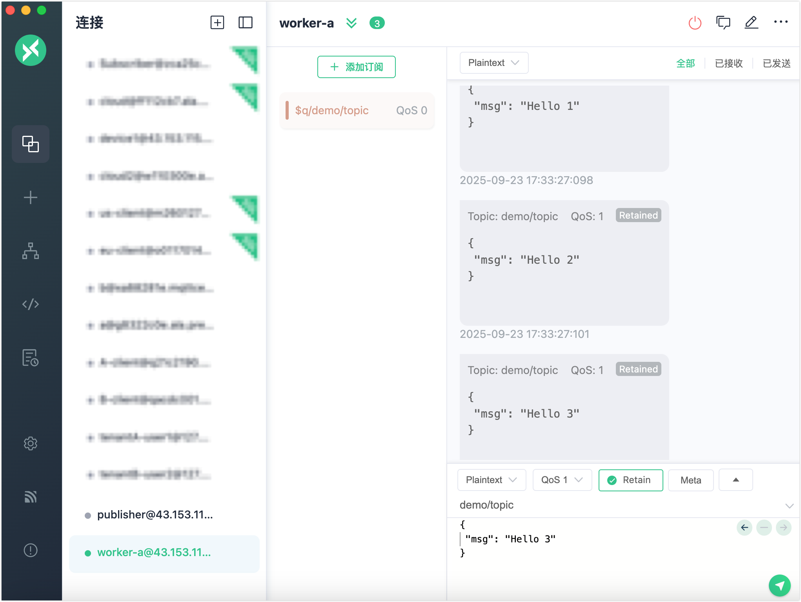

# 消息队列快速开始

本页面将引导您如何在 EMQX 6.0 中使用消息队列功能。您将使用 MQTTX 模拟客户端，借助 EMQX Dashboard 创建和管理消息队列，并观察消息如何被可靠地存储和投递。

## 目标

本快速开始将展示 EMQX 消息队列如何：

- 在订阅者离线时仍能持久化消息
- 支持可配置的消息派发策略
- 启用最后值语义以实现消息压缩

## 前置条件

开始之前，请确保您已具备以下条件：

- 已运行 EMQX 6.0+（已启用消息队列功能）
- [MQTTX](https://mqttx.app/zh)（或任意支持 MQTT 5.0 的客户端）
- 可访问 EMQX Dashboard（默认地址：`http://localhost:18083`）

## 测试消息队列核心功能

本节展示 EMQX 如何持久化和投递消息。您将使用 MQTTX 模拟 MQTT 客户端，并观察即使在订阅者离线时，消息也能被保留和投递。

### 步骤 1：创建一个消息队列

1. 在左侧菜单中进入**消息队列**。
2. 点击页面中的**创建**按钮。
3. 在**创建消息队列**弹窗中，配置以下内容：
   - **主题过滤器**：`demo/topic`
   - **派发策略**：`随机`
   - **数据保留周期**：`1` 天
   - **最后值语义**：`关闭`
4. 点击**创建**。

### 步骤 2：发布消息

使用 MQTTX 模拟一个客户端作为**发布者**：

1. 打开 MQTTX，创建一个客户端（例如命名为 `publisher`）。
2. 连接到 EMQX（地址：`mqtt://localhost:1883`）。
3. 向 `demo/topic` 主题发布 QoS 1 的消息：

示例：

```json
Topic: demo/topic
QoS: 1
Payload: {"msg": "Hello 1"}
```

继续发布更多消息，例如：`{"msg": "Hello 2"}`，等等。

此时尚无订阅者，消息将被 EMQX 缓存并持久化。

### 步骤 3：订阅并消费消息

使用 MQTTX 模拟一个客户端作为**订阅者**：

1. 打开另一个客户端（例如命名为 `worker-a`）。
2. 连接到 EMQX。
3. 订阅队列主题：

```json
Topic: $q/demo/topic
QoS: 1
```

您将立即接收到之前发布的所有队列消息。



## 模拟多订阅者与派发策略

本节中，您将模拟多个订阅者连接到同一个消息队列，并观察不同派发策略对消息派发行为的影响。

1. 在 `publisher` 客户端中，向原始主题（非 `$q/` 前缀）批量发布消息，例如：

   ```bash
   for i in {1..10}; do
     mqttx pub -t demo/topic -m "message-$i" -q 1
   done
   ```

2. 创建另一个 MQTTX 客户端（例如命名为 `worker-b`）。

3. 连接到 EMQX，并订阅相同的队列主题：

   ```json
   Topic: $q/demo/topic
   QoS: 1
   ```

   现在，`worker-a` 和 `worker-b` 都正在从同一个队列中消费消息。

4. 观察两个订阅者客户端中消息的接收情况。

### 派发策略对投递的影响

消息派发的行为取决于队列配置的**派发策略**：

| 派发策略               | 行为说明                                   | 使用场景               |
| ---------------------- | ------------------------------------------ | ---------------------- |
| `最少未确认消息订阅者` | 优先选择当前未确认消息数量较少的订阅者。   | 不均衡消费者的负载均衡 |
| `轮询`                 | 轮流将消息投递给每个订阅者，确保严格轮换。 | 无关速度的公平派发     |
| `随机`（默认）         | 随机选择一个订阅者进行消息投递。           | 不确定性或演示场景     |

您可以通过观察 `worker-a` 和 `worker-b` 的消息接收模式来验证这些行为。

### 修改派发策略

您可以动态修改派发策略：

1. 在 Dashboard 中进入**消息队列**页面。
2. 点击您要修改的队列旁的**编辑**。
3. 选择新的**派发策略**并保存。

请注意：在仍有订阅客户端在线的情况下，新的分发策略不会生效。您需要断开所有客户端连接，并重连。

修改后，再次执行消息发布操作，观察订阅者之间的派发模式变化。

## 测试最后值语义

本节将演示如何启用**最后值语义**，它确保只保留队列中的最新消息，适用于如设备配置等场景。

### 步骤 1：删除已有队列

1. 在 EMQX Dashboard 的**消息队列**页面中，找到主题过滤器为 `demo/topic` 的队列。
2. 点击**操作**栏中的**删除**。
3. 在弹出框中确认删除。

这将删除旧队列及其所有已存储消息。

### 步骤 2：创建带最后值语义的队列

1. 在**消息队列**页面点击**创建**。
2. 在弹窗中设置以下参数：
   - **主题过滤器**：`device/config`
   - **派发策略**：`随机`（或其他选择）
   - **数据保留周期**：`1` 天
   - **最后值语义**：开启开关
   - **队列键提取表达式**：`message.from`（或您将使用的字段名）
3. 点击**创建**。

“队列键表达式”用于定义 EMQX 如何从每条消息中提取一个键，以用于最后值队列中的去重。本示例中设置为 `message.from`， 表示 EMQX 会从消息发布者的客户端 ID 中提取队列键。该字段支持使用 [Variform 表达式](../../guides/configuration/configuration.md#variform-表达式)设置。

若需了解更高级的用法，包括自定义键和完整的消息结构示例，请参见[队列键表达式](./message-queue-task.md#队列键表达式)。

### 步骤 3：发布消息

1. 打开 MQTTX，选择或创建一个客户端（例如命名为 `publisher`）。

2. 连接至 EMQX（`mqtt://localhost:1883`）。

3. 向 `device/config` 发布消息：

   示例：

   | 字段        | 值                  |
   | ----------- | ------------------- |
   | **Topic**   | `device/config`     |
   | **QoS**     | 1                   |
   | **Payload** | `{"ssid": "wifi1"}` |

4. 使用相同的客户端（即相同的客户端 ID）发布一条更新内容的新消息：

   ```json
   Payload: {"ssid": "wifi2"}
   User Property: mq-key=wifi
   ```

   由于**队列键表达式**被设置为 `message.key`，EMQX 会自动从每条消息中提取客户端 ID 并将其作为队列键。来自同一客户端的新消息将覆盖队列中尚未被消费的旧消息。

### 步骤 4：订阅该队列

1. 创建第二个 MQTTX 客户端（例如命名为 `subscriber`）并连接至 EMQX。

2. 订阅队列主题：

   ```json
   Topic: $q/device/config
   QoS: 1
   ```

   **预期行为**：
   仅最近的一条消息将被投递。本例中，只有 `{"ssid": "wifi2"}` 会被接收。

