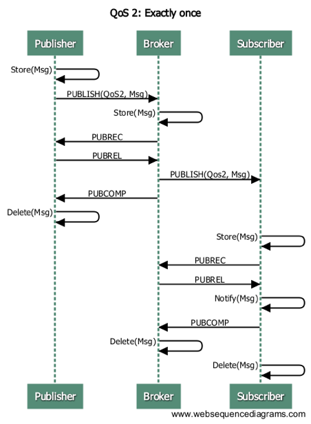

# 协议介绍

## MQTT协议

### 概览

MQTT是一个轻量的发布订阅模式消息传输协议，专门针对低带宽和不稳定网络环境的物联网应用设计。

MQTT官网: <http://mqtt.org>

MQTT V3.1.1协议规范:
<http://docs.oasis-open.org/mqtt/mqtt/v3.1.1/os/mqtt-v3.1.1-os.html>

### 特点

1.  开放消息协议，简单易实现
2.  发布订阅模式，一对多消息发布
3.  基于TCP/IP网络连接
4.  1字节固定报头，2字节心跳报文，报文结构紧凑
5.  消息QoS支持，可靠传输保证

### 应用

MQTT协议广泛应用于物联网、移动互联网、智能硬件、车联网、电力能源等领域。

1.  物联网M2M通信，物联网大数据采集
2.  Android消息推送，WEB消息推送
3.  移动即时消息，例如Facebook Messenger
4.  智能硬件、智能家具、智能电器
5.  车联网通信，电动车站桩采集
6.  智慧城市、远程医疗、远程教育
7.  电力、石油与能源等行业市场

### MQTT基于主题(Topic)消息路由

MQTT协议基于主题(Topic)进行消息路由，主题(Topic)类似URL路径，例如:

```bash
chat/room/1

sensor/10/temperature

sensor/+/temperature

$SYS/broker/metrics/packets/received

$SYS/broker/metrics/#
```

主题(Topic)通过'/'分割层级，支持'+', '\#'通配符:
```
'+': 表示通配一个层级，例如a/+，匹配a/x, a/y
    
'#': 表示通配多个层级，例如a/#，匹配a/x, a/b/c/d
```
订阅者与发布者之间通过主题路由消息进行通信，例如采用mosquitto命令行发布订阅消息:

```bash
mosquitto_sub -t a/b/+ -q 1

mosquitto_pub -t a/b/c -m hello -q 1
```


订阅者可以订阅含通配符主题，但发布者不允许向含通配符主题发布消息。


### MQTT V3.1.1协议报文

#### 报文结构

- 固定报头(Fixed header)
- 可变报头(Variable header)
- 报文有效载荷(Payload)

#### 固定报头

```
+----------+-----+-----+-----+-----+-----+-----+-----+-----+
| Bit      |  7  |  6  |  5  |  4  |  3  |  2  |  1  |  0  |
+----------+-----+-----+-----+-----+-----+-----+-----+-----+
| byte1    |   MQTT Packet type    |         Flags         |
+----------+-----------------------+-----------------------+
| byte2... |   Remaining Length                            |
+----------+-----------------------------------------------+
```

#### 报文类型

|             |     |          |
| ----------- | --- | -------- |
| 类型名称        | 类型值 | 报文说明     |
| CONNECT     | 1   | 发起连接     |
| CONNACK     | 2   | 连接回执     |
| PUBLISH     | 3   | 发布消息     |
| PUBACK      | 4   | 发布回执     |
| PUBREC      | 5   | QoS2消息回执 |
| PUBREL      | 6   | QoS2消息释放 |
| PUBCOMP     | 7   | QoS2消息完成 |
| SUBSCRIBE   | 8   | 订阅主题     |
| SUBACK      | 9   | 订阅回执     |
| UNSUBSCRIBE | 10  | 取消订阅     |
| UNSUBACK    | 11  | 取消订阅回执   |
| PINGREQ     | 12  | PING请求   |
| PINGRESP    | 13  | PING响应   |
| DISCONNECT  | 14  | 断开连接     |

#### PUBLISH发布消息

PUBLISH报文承载客户端与服务器间双向的发布消息。
PUBACK报文用于接收端确认QoS1报文，PUBREC/PUBREL/PUBCOMP报文用于QoS2消息流程。

#### PINGREQ/PINGRESP心跳

客户端在无报文发送时，按保活周期(KeepAlive)定时向服务端发送PINGREQ心跳报文，服务端响应PINGRESP报文。PINGREQ/PINGRESP报文均2个字节。

### MQTT消息QoS

MQTT发布消息QoS保证不是端到端的，是客户端与服务器之间的。订阅者收到MQTT消息的QoS级别，最终取决于发布消息的QoS和主题订阅的QoS。

| 发布消息的 QoS | 主题订阅的 QoS | 接收消息的 QoS |
| -------------- | -------------- | -------------- |
| 0              | 0              | 0              |
| 0              | 1              | 0              |
| 0              | 2              | 0              |
| 1              | 0              | 0              |
| 1              | 1              | 1              |
| 1              | 2              | 1              |
| 2              | 0              | 0              |
| 2              | 1              | 1              |
| 2              | 2              | 2              |


#### Qos0消息发布订阅


#### Qos1消息发布订阅


#### Qos2消息发布订阅



### MQTT会话(Clean Session)

MQTT客户端向服务器发起CONNECT请求时，可以通过'Clean Session'标志设置会话。

'Clean Session'设置为0，表示创建一个持久会话，在客户端断开连接时，会话仍然保持并保存离线消息，直到会话超时注销。

'Clean
Session'设置为1，表示创建一个新的临时会话，在客户端断开时，会话自动销毁。

### MQTT连接保活心跳

MQTT客户端向服务器发起CONNECT请求时，通过KeepAlive参数设置保活周期。

客户端在无报文发送时，按KeepAlive周期定时发送2字节的PINGREQ心跳报文，服务端收到PINGREQ报文后，回复2字节的PINGRESP报文。

服务端在1.5个心跳周期内，既没有收到客户端发布订阅报文，也没有收到PINGREQ心跳报文时，主动心跳超时断开客户端TCP连接。

emqx 消息服务器默认按最长 2.5 心跳周期超时设计。


### MQTT遗愿消息(Last Will)

MQTT客户端向服务器端CONNECT请求时，可以设置是否发送遗愿消息(Will
Message)标志，和遗愿消息主题(Topic)与内容(Payload)。

MQTT客户端异常下线时(客户端断开前未向服务器发送DISCONNECT消息)，MQTT消息服务器会发布遗愿消息。

### MQTT保留消息(Retained Message)

MQTT客户端向服务器发布(PUBLISH)消息时，可以设置保留消息(Retained Message)标志。保留消息(Retained
Message)会驻留在消息服务器，后来的订阅者订阅主题时仍可以接收该消息。

例如mosquitto命令行发布一条保留消息到主题'a/b/c':

```bash
mosquitto_pub -r -q 1 -t a/b/c -m 'hello'
```

之后连接上来的MQTT客户端订阅主题'a/b/c'时候，仍可收到该消息:

```bash
$ mosquitto_sub -t a/b/c -q 1
hello
```

保留消息(Retained
Message)有两种清除方式:

1.  客户端向有保留消息的主题发布一个空消息:

```bash
mosquitto_pub -r -q 1 -t a/b/c -m ''
```
2.  消息服务器设置保留消息的超期时间。

### MQTT WebSocket连接

MQTT协议除支持TCP传输层外，还支持WebSocket作为传输层。通过WebSocket浏览器可以直连MQTT消息服务器，发布订阅模式与其他MQTT客户端通信。

MQTT协议的WebSocket连接，必须采用binary模式，并携带子协议Header:
```
Sec-WebSocket-Protocol: mqttv3.1 或 mqttv3.1.1
```
### MQTT 与 XMPP 协议对比

MQTT协议设计简单轻量、路由灵活，将在移动互联网物联网消息领域，全面取代PC时代的XMPP协议:

1.  MQTT协议一个字节固定报头，两个字节心跳报文，报文体积小编解码容易。XMPP协议基于繁重的XML，报文体积大且交互繁琐。
2.  MQTT协议基于主题(Topic)发布订阅模式消息路由，相比XMPP基于JID的点对点消息路由更为灵活。
3.  MQTT协议未定义报文内容格式，可以承载JSON、二进制等不同类型报文。XMPP协议采用XML承载报文，二进制必须Base64编码等处理。
4.  MQTT协议支持消息收发确认和QoS保证，XMPP主协议并未定义类似机制。MQTT协议有更好的消息可靠性保证。

## MQTT-SN 协议

MQTT-SN 协议是 MQTT 的直系亲属，它使用 UDP 进行通信，标准的端口是1884。MQTT-SN
的主要目的是为了适应受限的设备和网络，比如一些传感器，只有很小的内存和
CPU，TCP 对于这些设备来说非常奢侈。还有一些网络，比如 ZIGBEE，报文的长度在300字节以下，无法承载太大的数据包。所以
MQTT-SN 的数据包更小巧。

MQTT-SN 的官方标准下载地址:
<http://mqtt.org/new/wp-content/uploads/2009/06/MQTT-SN_spec_v1.2.pdf>

### MQTT-SN 和 MQTT 的区别

MQTT-SN 的信令和 MQTT 大部分都相同，比如都有 Will, 都有 Connect/Subscribe/Publish 命令.

MQTT-SN 最大的不同是，Topic 使用 TopicId 来代替，而 TopicId 是一个16比特的数字。每一个数字对应一个
Topic, 设备和云端需要使用 REGISTER 命令映射 TopicId 和 Topic 的对应关系。

MQTT-SN 可以随时更改 Will 的内容, 甚至可以取消. 而 MQTT 只允许在 CONNECT 时设定 Will 的内容,
而且不允许更改.

MQTT-SN 的网络中有网关这种设备，它负责把 MQTT-SN 转换成 MQTT，和云端的 MQTT Broker 通信. MQTT-SN
的协议支持自动发现网关的功能。

MQTT-SN 还支持设备的睡眠功能，如果设备进入睡眠状态，无法接收 UDP 数据，网关将把下行的 PUBLISH
消息缓存起来，直到设备苏醒后再传送。

### EMQX-SN 网关插件

EMQX-SN 是 EMQX 的一个网关插件，实现了 MQTT-SN 的大部分功能，它相当于一个在云端的 MQTT-SN 网关，直接和 EMQ
X Broker 相连。

#### 配置参数

```bash
# File: etc/plugins/emqx_sn.conf:

mqtt.sn.port = 1884

mqtt.sn.advertise_duration = 900

mqtt.sn.gateway_id = 1

mqtt.sn.username = mqtt_sn_user

mqtt.sn.password = abc
```

| 配置项                      |       说明                           |
| --------------------------- | ---------------------------------- |
| mqtt.sn.port                | 指定 MQTT-SN 监听的端口号                  |
| mqtt.sn.advertise_duration | ADVERTISE 消息的发送间隔(秒)               |
| mqtt.sn.gateway_id         | 网关 ID                              |
| mqtt.sn.username            | 这是可选的参数，指定所有 MQTT-SN 连接的用户名，用于鉴权模块 |
| mqtt.sn.password            | 这也是可选的参数，和 username 一起使用           |

#### 启动 emqx-sn

```bash
./bin/emqx_ctl plugins load emqx_sn
```

### MQTT-SN 客户端库

1.  <https://github.com/eclipse/paho.mqtt-sn.embedded-c/>
2.  <https://github.com/ty4tw/MQTT-SN>
3.  <https://github.com/njh/mqtt-sn-tools>
4.  <https://github.com/arobenko/mqtt-sn>


## LWM2M 协议

LwM2M 全称是 Lightweight Machine-To-Machine，是由 Open Mobile Alliance(OMA)
定义的一套适用于物联网的轻量级协议，它提供了设备管理和通讯的功能，尤其适用于资源有限的终端设备。协议可以在
[这里](http://www.openmobilealliance.org/wp/) 下载。

LwM2M 基于 REST 架构，使用 CoAP 作为底层的传输协议，承载在 UDP 或者 SMS
上，因而报文结构简单小巧，并且在网络资源有限及无法确保设备始终在线的环境里同样适用。

<!--  -->

LwM2M 最主要的实体包括 LwM2M Server 和 LwM2M Client。

LwM2M Server 作为服务器，部署在 M2M 服务供应商处或网络服务供应商处。LwM2M 定义了两种服务器

  - 一种是 LwM2M BOOTSTRAP SERVER，emqx-lwm2m 插件并未实现该服务器的功能。
  - 一种是 LwM2M SERVER，emqx-lwm2m 实现该服务器在 UDP 上的功能，SMS 并没有实现。

LwM2M Client 作为客户端，部署在各个 LwM2M 设备上。

在 LwM2M Server 和 LwM2M Client 之间，LwM2M 协议定义了4个接口。

1.  引导接口 Bootstrap：向 LwM2M 客户端提供注册到 LwM2M
    服务器的必要信息，例如服务器访问信息、客户端支持的资源信息等。
2.  客户端注册接口 Client Registration：使 LwM2M 客户端与 LwM2M 服务器互联，将 LwM2M
    客户端的相关信息存储在 LwM2M 服务器上。只有完成注册后，LwM2M
    客户端与服务器端之间的通信与管理才成为可能。
3.  设备管理与服务实现接口 Device Management and Service Enablement：该接口的主控方为 LwM2M
    服务器，服务器向客户端发送指令，客户端对指令做出回应并将回应消息发送给服务器。
4.  信息上报接口 Information Reporting：允许 LwM2M
    服务器端向客户端订阅资源信息，客户端接收订阅后按照约定的模式向服务器端报告自己的资源变化情况。

<!--  -->

LwM2M 把设备上的服务抽象为 Object 和 Resource, 在 XML 文件中定义各种 Object 的属性和功能。可以在
[这里](http://www.openmobilealliance.org/wp/OMNA/LwM2M/LwM2MRegistry.html)
找到 XML 的各种定义。

LwM2M 协议预定义了8种 Object 来满足基本的需求，分别是：

  - Security 安全对象
  - Server 服务器对象
  - Access Control 访问控制对象
  - Device 设备对象
  - Connectivity Monitoring 连通性监控对象
  - Firmware 固件对象
  - Location 位置对象
  - Connectivity Statistics 连通性统计对象

### EMQX-LWM2M 插件

EMQX-LWM2M 是 EMQX 服务器的一个网关插件，实现了 LwM2M 的大部分功能。MQTT 客户端可以通过 EMQX-LWM2M
访问支持 LwM2M 的设备。设备也可以往 EMQX-LWM2M 上报 notification，为 EMQX后端的服务采集数据。

### MQTT 和 LwM2M的转换

从 MQTT 客户端可以发送 Command 给 LwM2M 设备。MQTT 到 LwM2M 的命令使用如下的 topic

```bash
"lwm2m/{?device_end_point_name}/command".
```

其中 MQTT Payload 是一个 json 格式的字符串，指定要发送的命令，更多的细节请参见 emqx-lwm2m 的文档。

LwM2M 设备的回复用如下 topic 传送

```bash
"lwm2m/{?device_end_point_name}/response".
```

MQTT Payload 也是一个 json 格式的字符串，更多的细节请参见 emqx-lwm2m 的文档。

#### 配置参数

```bash
## File: etc/emqx_lwm2m.conf:

lwm2m.port = 5683

lwm2m.certfile = etc/certs/cert.pem

lwm2m.keyfile = etc/certs/key.pem

lwm2m.xml_dir =  etc/lwm2m_xml
```

|   配置项        |         说明                                      |
| -------------- | ------------------------------------------------ |
| lwm2m.port     | 指定 LwM2M 监听的端口号，为了避免和 emqx-coap 冲突，使用了非标准的5783端口 |
| lwm2m.certfile | DTLS 使用的证书                                       |
| lwm2m.keyfile  | DTLS 使用的秘钥                                       |
| lwm2m.xml\_dir | 存放 XML 文件的目录，这些 XML 用来定义 LwM2M Object            |

#### 启动 emqx-lwm2m

```bash
./bin/emqx_ctl plugins load emqx_lwm2m
```

### LwM2M 的客户端库

  - <https://github.com/eclipse/wakaama>
  - <https://github.com/OpenMobileAlliance/OMA-LWM2M-DevKit>
  - <https://github.com/AVSystem/Anjay>
  - <http://www.eclipse.org/leshan/>

## 私有 TCP 协议

EMQX 提供 **emqx-tcp** 插件，插件作为一个靠近端侧的一个接入模块，按照其功能逻辑和整个系统的关系，将整个消息交换的过程可以分成三个部分：终端侧，平台侧和其它侧：

```bash
|<-- Terminal -->|<--------- Broker Side --------->|<---  Others  --->|
|<-    Sid e   ->|                                 |<--    Side    -->|

+---+                                                PUB  +-----------+
| D |  INCOMING  +----------+    PUB     +---------+   -->| subscriber|
| E |----------->|          |----------->|         |--/   +-----------+
| V |            | emqx-tcp |            |  EMQX  |
| I |<-----------|          |<-----------|         |<--   +-----------+
| C |  OUTGOING  +----------+    PUB     +---------+   \--| publisher |
| E |                                                PUB  +-----------+
+---+
```


1. 终端侧，通过本插件定义的 TCP 私有协议进行接入，然后实现数据的上报，或者接收下行的消息。
2. 平台侧，主体是 emqx-tcp 插件和  EMQX 系统。emqx-tcp 负责报文的编解码，代理订阅下行主题。实现将上行消息转为 EMQX 系统中的 MQTT 消息 PUBLISH 到整个系统中；将下行的 MQTT 消息转化为 TCP 私有协议的报文结构，下发到终端。
3. 其它侧，可以对 2 中出现的上行的 PUBLISH 消息的主题进行订阅，以接收上行消息。或对发布消息到具体的下行的主题，以发送数据到终端侧。


### 配置说明

#### 协议层

```bash
## 闲置时间。超过该时间未收到 CONNECT 帧, 将
## 直接关闭该 TCP 连接
tcp.proto.idle_timeout = 1s

## 上行主题。上行消息到 EMQ 系统中的消息主题
##
## 占位符：
#### - %c: 接入客户端的 ClientId
#### - %u: 接入客户端的 Username
tcp.proto.up_topic = tcp/%c/up

## 下行主题。客户端接入成功后, emqx-tcp 会订阅
## 该主题，以接收 EMQ 系统向该类型的客户端下
## 发的消息。
##
## 占位符：(同上)
tcp.proto.dn_topic = tcp/%c/dn

## 最大处理的单个 TCP 私有协议报文大小
tcp.proto.max_packet_size = 65535

## 开启状态统计。开启后，emqx-tcp 会定期更新
## 连接信息, 并检测连接的健康状态
tcp.proto.enable_stats = on

## 强制 GC, 当进程已处理 1000 消息或发送数据超过 1M
tcp.proto.force_gc_policy = 1000|1MB

## 强制关闭连接, 当进程堆积 8000 消息或堆栈内存超过 800M
tcp.proto.force_shutdown_policy = 8000|800MB
```

#### 监听器

监听器配置比较广泛，在此仅列举部分常用部分：

```bash

## 配置监听的端口
tcp.listener.external = 0.0.0.0:8090

## 配置监听池大小。影响 TCP 建链的并发速率。
tcp.listener.external.acceptors = 8

## 最大连接数
tcp.listener.external.max_connections = 1024000

## 每秒支持的最大并发连接数
tcp.listener.external.max_conn_rate = 1000
```
