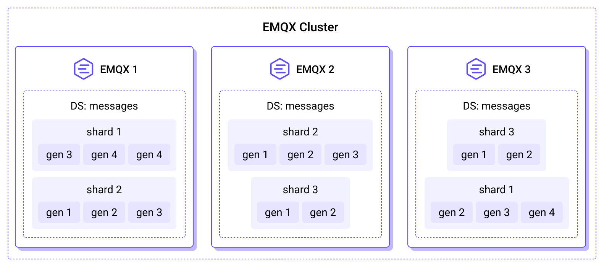
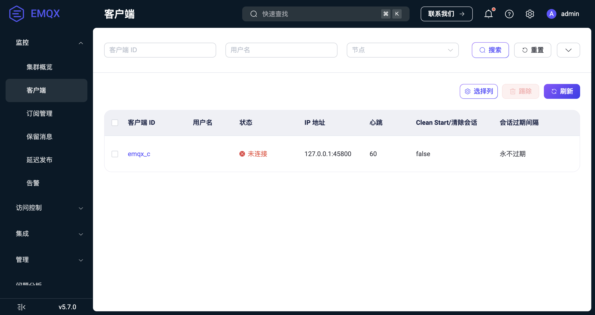

# MQTT 会话持久化

EMQX 内置了 MQTT 会话持久化（Durable Sessions）功能，可以将会话和消息持久化存储到磁盘，并提供高可用副本以保证数据的冗余和一致性。通过会话持久化功能，可以实现有效的故障转移和恢复机制，确保服务的连续性和可用性，从而提高系统的可靠性。

本页面介绍了 EMQX 中会话持久化的概念、原理和使用方法。

::: warning 重要提示
该功能自 EMQX v5.7.0 版本起可用。然而，尚不支持共享订阅会话的持久化，计划在后续版本中实现。
:::

## 基本概念

在了解 EMQX 中的会话持久化功能之前，您需要先了解关于 MQTT 会话的一些基本概念。

### 客户端会话类型

EMQX 的会话持久化功能只对持久会话生效，因此我们有必要先了解 MQTT 客户端会话的类型划分。

根据 MQTT 标准，客户端会话有助于在 MQTT 代理中管理客户端连接和状态。在 EMQX 中，客户端会话通常分为以下两个逻辑类别：

- **临时会话**: 临时会话仅在客户端连接到 EMQX 的持续时间内存在。当具有临时会话的客户端断开连接时，所有会话信息，包括订阅和未传递的消息，都将被丢弃。
- **持久会话**: 持久会话在客户端连接终止后由服务器保留，并且如果客户端在会话到期间隔内重新连接到服务器，则可以恢复该会话。在客户端离线时发送到主题的消息将被传递。

以下情况的客户端会话被视为持久会话：

- 对于使用 MQTT 5 协议的客户端，如果 `CONNECT` 或 `DISCONNECT` 数据包的 [Session Expiry Interval](https://docs.oasis-open.org/mqtt/mqtt/v5.0/os/mqtt-v5.0-os.html#_Toc3901048) 属性设置为大于零的值。
- 对于使用 MQTT 3.* 协议的客户端，如果 [Clean Session](http://docs.oasis-open.org/mqtt/mqtt/v3.1.1/os/mqtt-v3.1.1-os.html#_Toc398718030) 标志设置为 0，并且 `mqtt.session_expiry_interval` 配置参数设置为大于 0 的值。

了解更多关于 MQTT 持久会话的信息，参阅 [MQTT 持久会话与 Clean Session 详解](https://www.emqx.com/zh/blog/mqtt-session)。

### 概念区分

在 MQTT 的使用场景中，持久会话（Persistent Sessions）和会话持久化（Durable Sessions）这两个概念可能容易引起混淆，因此本节对这两个概念进行了区分。

- **持久会话 (Persistent Sessions)**：MQTT 协议中的一个特性，当客户端与服务器建立连接时可以设置是否保持当前会话，这样，即使客户端断开连接再重新连接，它之前订阅的主题关系、未发送完成的消息等状态都会被保留。简而言之，它是关于客户端连接状态和消息队列的持久性保持。

- **会话持久化 (Durable Sessions)**：与 MQTT 协议无关的特性，它是指是否将客户端会话保存到持久存储（磁盘）中，保证消息传递的可靠性。

## EMQX 中的会话存储方式

EMQX 提供了两种不同的客户端会话存储实现，每种都针对特定的使用场景进行了优化：

- **内存 (RAM) 存储**：使用节点所在服务器内存存储会话，会话是非持久的。
- **持久存储 (durable)**：增加了持久层，在目前的版本中基于本地的 RocksDB + 节点本地磁盘存储会话。

实现选择取决于会话类型（临时或持久）和 `durable_sessions.enable` 配置参数，该参数可以全局设置，也可以根据 [zone](../configuration/configuration.md#zone-override) 进行设置。可以根据以下标准选择实现：

| `durable_sessions.enable` | 临时会话 | 持久会话 |
| ------------------------- | -------- | -------- |
| `false`                   | RAM      | RAM      |
| `true`                    | RAM      | durable  |

EMQX 使用一种独特的方法来管理消息的持久性，允许 RAM 和持久化会话共存，同时最小化存储成本。

当持久化会话订阅一个主题过滤器时，EMQX 将匹配该过滤器的主题标记为“持久化”。这确保除了将这些主题的 MQTT PUBLISH 消息路由到 RAM 会话之外，代理还将这些消息保存到持久化存储中。

每个持久化的 MQTT 消息在每个副本上仅存储一次，不管订阅的持久化会话的数量或它们的连接状态如何。这种高效的分发方式最小化了磁盘写入。

### 内存存储与持久存储对比

客户端会话的管理策略是确保服务稳定可靠的重要因素之一。本节将对比分析 EMQX 中 MQTT 会话的内存存储与持久存储的特点，帮助开发者更好地理解各自的特性和适用场景，从而做出更加精准的部署决策。

#### 内存存储

RAM 客户端会话实现是默认的，并且在 EMQX 5.7 版本之前的所有版本中都已经使用过。顾名思义，RAM 会话的状态完全保存在易失性内存中。

RAM 会话的优点包括：

- 非常高的吞吐量和低延迟。
- 立即将消息分发给客户端。

然而，也存在一些缺点：

- 当承载会话的 EMQX 节点停止或重新启动时，会话数据会丢失，这是由于 RAM 的易失性导致的。
- 未传递的消息存储在内存队列中，有一个限制以防止内存耗尽。当达到此限制时，新消息将被丢弃，可能导致消息丢失。

#### 持久存储

会话持久化实现是在 EMQX 5.7 版本中引入的，它将会话状态和路由到持久化会话的消息存储在磁盘上。

持久化会话通过在 EMQX 集群中的多个节点之间持续复制会话元数据和 MQTT 消息，提供了强大的持久性和高可用性。可配置的[复制因子](./managing-replication.md#复制因子-replication-factor)决定了每条消息或会话的副本数量，使用户能够根据其特定要求自定义持久性和性能之间的平衡。

持久化客户端会话的优点包括：

- 在 EMQX 节点重新启动或停止后，会话可以恢复。
- MQTT 消息存储在共享的、复制的、持久的存储中，而不是存储在内存队列中，这降低了在线和离线会话的 RAM 使用量。

然而，也存在一些缺点：

- 将消息存储在磁盘上会导致系统总吞吐量降低。
- 与 RAM 会话相比，持久化会话具有更高的延迟，因为 MQTT 消息的写入和读取都是批量执行的。虽然批处理提高了吞吐量，但也增加了端到端延迟（客户端看到发布消息之前的延迟）。

## 会话持久化架构

EMQX 的会话持久化以一个分层结构来组织，包括存储 (Storage)、分片 (Shard)、代 (Generation) 和流 (Stream)。



### 存储 (Storage)

存储封装了某种类型的所有数据，例如 MQTT 消息或 MQTT 会话。

### 分片 (Shard)

消息根据客户端进行隔离，并根据发布者的客户端 ID 存储在分片中。分片数量在 EMQX 初始启动时由 [n_shards](./managing-replication.md#number-of-shards) 配置参数决定。分片也是复制的单位。每个分片会根据 `durable_storage.messages.replication_factor` 在不同节点间进行一致性复制，确保每个副本中的消息集是相同的。

### 代 (Generation)

分片中的消息根据特定时间段划分为代。新消息写入当前代，而以前的代是只读的。EMQX 通过完全删除旧的代来清理旧的 MQTT 消息。旧 MQTT 消息的保留期限由 `durable_sessions.message_retention_period` 参数确定。

代可以根据存储布局规范以不同方式组织数据。目前，仅支持一种布局，优化了通配符和单一主题订阅的高吞吐量。未来更新将引入针对不同工作负载优化的布局。

新代的存储布局通过 `durable_storage.messages.layout` 参数配置，每个布局引擎定义其自己的配置参数。

### 流 (Stream)

每个分片和代中的消息被划分为多个流。流作为 EMQX 中消息序列化的单位。流可以包含多个主题的消息。不同的存储布局可以采用不同的策略将主题映射到流中。

持久会话以批量方式从流中获取消息，批量大小可以通过 `durable_sessions.batch_size` 参数调整。

## 集群中的会话持久化

EMQX 集群中的每个节点都分配有唯一的 *站点 ID*，该 ID 作为稳定标识符，与 Erlang 节点名称 (`emqx@...`) 无关。站点 ID 是持久的，并且在节点第一次启动时随机生成。这种稳定性维护了数据的完整性，特别是在节点可能经历名称修改或重新配置的情况下。

管理员可以使用 `emqx_ctl ds info` CLI 命令查看不同站点的状态，以管理和监控集群中的持久会话。

## 会话持久化的硬件要求

当会话持久化启用时，EMQX 会将持久会话的元数据和发送到持久会话的 MQTT 消息保存到磁盘上。因此，EMQX 必须部署在具有足够大存储容量的服务器上。为了获得最佳吞吐量，建议使用固态硬盘（SSD）存储。

存储需求可以根据以下指南进行估算：

- **消息存储**：每个副本上存储消息所需的空间与传入消息的速率乘以 `durable_sessions.message_retention_period` 参数指定的持续时间成正比。此参数决定了消息的保留时间，从而影响所需的总存储量。
- **会话元数据存储**：会话元数据的存储量与会话数量乘以它们订阅的流数量成正比。
- **流计算**：流的数量与分片的数量成正比。它还（以非线性方式）取决于主题的数量。EMQX 会自动将结构相似的主题组合到同一个流中，确保流的数量不会随着主题数量的增加而过快增长，从而最小化每个会话存储的元数据量。

## 快速体验会话持久化

本章节将帮助您快速了解如何在 EMQX 与 MQTT 客户端上使用会话持久化功能，并介绍简单的会话持久化工作流程。

::: tip 注意

即使没有启用持久会话，通过步骤 2-4 的操作会话仍然会被保留、消息也将会保存在客户端队列中。不同之处在于会话是否持久存储，以及步骤 5 中会话是否能在节点重启后恢复。

:::

### 1. 在 EMQX 上启用会话持久化

默认情况下，EMQX 不启用会话持久化功能。您需要修改 `etc/emqx.conf` 文件并添加以下配置以启用该功能：

```bash
durable_sessions {
  enable = true
}
```

重启 EMQX 以应用配置。

### 2. 调整 MQTT 客户端连接参数以启用持久会话

以 [MQTTX CLI](https://mqttx.app/zh/cli) 为例，它默认使用了 MQTT 5.0 协议，添加 `--no-clean` 选项以设置 `Clean Start = false`，同时指定客户端 ID 为 `emqx_c`，连接到 EMQX 并订阅 `t/1` 主题：

```bash
mqttx sub -t t/1 -i emqx_c --no-clean
```

### 3. 断开客户端连接，会话将被保留

断开步骤 2 中的客户端连接。打开 EMQX Dashboard，在 **监控** -> **客户端** 页面中，您仍然可以看到客户端状态变为**未连接**，这表明会话已经保留。

<!-- 英文截图： -->



### 4. 向客户端发送消息，消息将被发送到客户端队列

仍以 MQTTX CLI 为例，使用 `bench` 命令，通过 1 个客户端重复向 `t/1` 主题发布消息：

```bash
mqttx bench pub -t t/1 -c 1
```

根据 MQTT 协议要求，即使 `emqx_c` 客户端不在线，它订阅的 `t/1` 主题消息也会被保存在客户端队列中，以便在重新连接后继续派发。

### 5. 重启 EMQX 节点，会话与消息将从持久存储中恢复

重启 EMQX 节点，在没有进行任何客户端连接操作的情况下，打开 EMQX Dashboard，在 **监控** -> **客户端** 页面中可以看到状态为**未连接**的客户端，这表明会话已恢复。

尝试使用相同的客户端 ID `emqx_c`，并使用 `--no-clean` 选项设置 `Clean Start = false`）连接到 EMQX：

```bash
mqttx sub -t t/1 -i emqx_c --no-clean
```

离线期间接收到的消息将在此时将派发到当前客户端：

```bash
...
[2024-5-22] [16:14:14] › …  Connecting...
[2024-5-22] [16:14:14] › ✔  Connected
[2024-5-22] [16:14:14] › …  Subscribing to t/1...
[2024-5-22] [16:14:14] › ✔  Subscribed to t/1
[2024-5-22] [16:14:14] › payload: Hello From MQTTX CLI
...
```

::: tip **注意**

- 必须使用相同的客户端 ID `emqx_c`，并指定 `--no-clean` 选项以将 `Clean Start` 设置为 `false`，确保满足这两项要求才能恢复持久的会话。
- 由于会话中已经保存了之前的订阅信息，即使重连时不重新订阅 `t/1` 主题，消息也会派发到客户端。

:::

## 下一步

想要了解如何对会话持久化功能进行配置和管理，以及如何对 EMQX 集群中的会话持久化进行初始设置和更改设置，请参阅以下页面：

- [管理副本](./managing-replication.md)
- [配置和管理会话持久化](./management.md)
