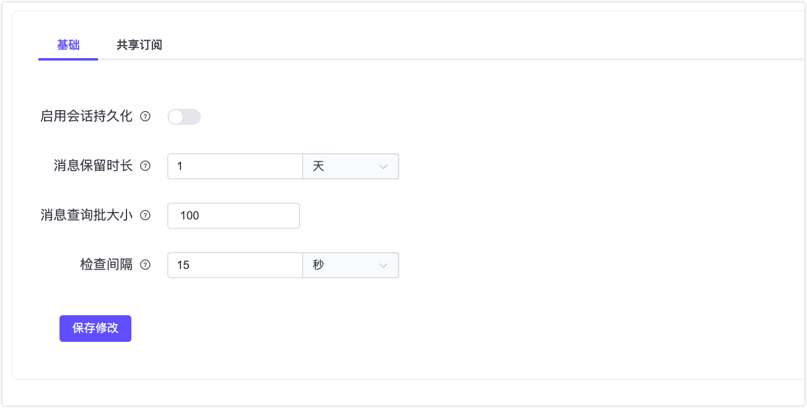

# 配置和管理会话持久化

本文档提供了有关在 EMQX 中配置、管理和优化 [MQTT 会话持久化](./durability_introduction.md)功能的参考和说明，包括会话和存储配置。

## 配置参数

会话持久化的配置分为两个主要类别：

- `durable_sessions`：包含与 MQTT 客户端会话相关的设置，包括它们如何从持久存储中消费数据以及数据保留参数。
- `durable_storage`：管理持久存储如何保存 MQTT 消息数据的设置。

### 持久会话配置

您可以在 Dashboard 中配置持久会话的相关参数。点击 Dashboard 左侧菜单中的**管理** -> **MQTT 配置**，选择**会话持久化**标签页进行参数配置。



| 参数                                        | Dashboard   配置项 | 描述                                                         |
| ------------------------------------------- | ------------------ | ------------------------------------------------------------ |
| `durable_sessions.enable`                   | 启用会话持久化     | 启用会话持久化。该配置项无法通过 Dashboard、REST API 或 CLI 修改，必须在配置文件中设置。注意：需要重新启动 EMQX 节点才能使更改生效。 |
| `durable_sessions.message_retention_period` | 消息保留时长       | 定义会话持久化中 MQTT 消息的保留期。注意：此参数是全局参数。 |
| `durable_sessions.batch_size`               | 消息查询批大小     | 控制持久会话从存储中消费消息时的最大批量大小。               |
| `durable_sessions.checkpoint_interval`      | 会话检查点间隔     | 指定保存会话元数据的时间间隔。                               |

以下参数可以在 [zone](../configuration/configuration.md#zone-override) 级别覆盖：

- `durable_sessions.enable`
- `durable_sessions.batch_size`
- `durable_sessions.checkpoint_interval`

### 持久存储配置

`<DS>` 占位符代表 "durable storage"。当前，`<DS>` 的可用参数为 `message`。

#### 持久存储关键参数

| 参数                                      | 描述                                                         |
| ----------------------------------------- | ------------------------------------------------------------ |
| `durable_storage.n_sites`                 | 设置[站点数量](./managing-replication.md#站点-site-数量)。   |
| `durable_storage.<DS>.data_dir`           | EMQX 存储数据的文件系统中的目录。                            |
| `durable_storage.<DS>.n_shards`           | 设置[分片数量](./managing-replication.md#分片-shard-数量)。  |
| `durable_storage.<DS>.replication_factor` | 设置[复制因子](./managing-replication.md#复制因子-replication-factor)以确定每个分片的副本数量。 |
| `durable_storage.<DS>.transaction`        | 包含与消息缓冲相关的参数。请参阅[缓冲机制](#缓冲机制)。      |
| `durable_storage.<DS>.layout`             | 包含控制 EMQX 如何在磁盘上布局数据的参数。请参阅[存储布局配置](#存储布局配置)。 |

#### 数据库组配置

自 EMQX 6.1 起，持久存储引入了[数据库组](../design/durable-storage.md/#持久存储数据库组)，用于支持节点级别的资源治理。

数据库组允许对多个持久存储数据库进行统一治理，并共享资源使用限制，而不会改变其逻辑数据模型。该特性主要面向运维人员和托管部署场景。

默认情况下，每个持久化存储数据库都属于一个以该数据库自身命名的数据库组，并且每个这样的数据库组只包含这一个数据库，从而保持与早期版本一致的行为。

数据库组通过 `durable_storage.db_groups` 命名空间进行配置。

| 参数                                                      | 说明                                               |
| --------------------------------------------------------- | -------------------------------------------------- |
| `durable_storage.db_groups.<group>.storage_quota`         | 该数据库组中所有 SST 文件磁盘使用量的软配额上限。  |
| `durable_storage.db_groups.<group>.write_buffer_size`     | 该数据库组中 RocksDB memtable 的最大合计内存大小。 |
| `durable_storage.db_groups.<group>.rocksdb_nthreads_high` | RocksDB 高优先级后台线程池的线程数量。             |
| `durable_storage.db_groups.<group>.rocksdb_nthreads_low`  | RocksDB 低优先级后台线程池的线程数量。             |

#### 缓冲机制

为了最大化吞吐量，EMQX 将来自客户端的 MQTT 消息批量写入持久存储。批量写入可使用 `durable_storage.<DS>.transaction` 配置子树下的以下参数进行配置：

| 参数                  | 描述                                                     |
| --------------------- | -------------------------------------------------------- |
| `max_pending`         | 当缓冲区累积到该指定数量的消息时触发刷新。               |
| `flush_interval`      | 如果缓冲区包含至少一条消息，则会按照该时间间隔进行刷新。 |
| `idle_flush_interval` | 如果在该时间间隔内没有新消息到达，缓冲区将被提前刷新。   |

#### 存储布局配置

存储布局决定了 EMQX 如何在磁盘上组织数据。设置 `durable_storage.<DS>.layout.type` 参数可以更改新一代中使用的布局。此更改不会影响现有的生成。每种布局类型的配置都不同，包含在 `durable_storage.<DS>.layout` 子树下。当前，可用的布局类型是 `wildcard_optimized`。

##### `wildcard_optimized` 布局类型的配置

`wildcard_optimized` 布局旨在优化广泛的主题通配符订阅。它通过随时间自动积累关于主题结构的知识来实现这一目标。利用轻量级机器学习算法，它预测客户端可能订阅的通配符主题过滤器。随后，它将这些主题组织成统一的流，从而在单个批次中实现高效消费。

| 参数                    | 描述                               |
| ----------------------- | ---------------------------------- |
| `bytes_per_topic_level` | 确定主题级别哈希的大小。           |
| `topic_index_bytes`     | 指定流标识符的大小，以字节为单位。 |

## CLI 命令

以下是用于管理持久存储的 CLI 命令：

### `emqx_ctl ds info`

显示持久存储状态的概述。

示例：
```bash
$ emqx_ctl ds info

THIS SITE:
D8894F95DC86DFDB

SITES:
.------------------.-------------------.----------.
: Site             : Node              : Status   :
:------------------:-------------------:----------:
: 5C6028D6CE9459C7 : 'emqx@n2.local'   : up       :
: D8894F95DC86DFDB : 'emqx@n1.local'   : up       :
: F4E92DEA197C8EBC : 'emqx@n3.local'   : (x) down :
`------------------`-------------------`----------`

SHARDS:
.-------------.------------------.-------------.
: DB/Shard    : Replicas         : Transitions :
:-------------:------------------:-------------:
:-messages/0--:------------------:-------------:
:             : 5C6028D6CE9459C7 :             :
:-messages/1--:------------------:-------------:
:             : 5C6028D6CE9459C7 :             :
:-messages/10-:------------------:-------------:
:             : 5C6028D6CE9459C7 :             :
:-messages/11-:------------------:-------------:
:             : 5C6028D6CE9459C7 :             :
:-messages/12-:------------------:-------------:
:             : 5C6028D6CE9459C7 :             :
:-messages/2--:------------------:-------------:
:             : 5C6028D6CE9459C7 :             :
:-messages/3--:------------------:-------------:
:             : 5C6028D6CE9459C7 :             :
:-messages/4--:------------------:-------------:
:             : 5C6028D6CE9459C7 :             :
:-messages/5--:------------------:-------------:
:             : 5C6028D6CE9459C7 :             :
:-messages/6--:------------------:-------------:
:             : 5C6028D6CE9459C7 :             :
:-messages/7--:------------------:-------------:
:             : 5C6028D6CE9459C7 :             :
:-messages/8--:------------------:-------------:
:             : 5C6028D6CE9459C7 :             :
:-messages/9--:------------------:-------------:
:             : 5C6028D6CE9459C7 :             :
`-------------`------------------`-------------`
```

此命令输出包括： 

- `THIS SITE`：本地 EMQX 节点声明的站点 ID。 
- `SITES`：所有已知站点的列表，包括 EMQX 节点名称及其状态。 
- `SHARDS`：会话持久化分片列表以及其副本所在的站点 ID。

### `emqx_ctl ds set_replicas all <site1> <site2> ...`

此命令允许设置包含集群中持久存储副本的站点列表。 一旦执行，它会创建一个操作计划，以在站点之间公平分配分片，并继续在后台执行。 

::: warning 重要提示

更新持久存储副本列表可能成本高昂，因为可能涉及在站点之间复制大量数据。 

::: 

示例：
```bash
$ emqx_ctl ds set_replicas all 5C6028D6CE9459C7 D8894F95DC86DFDB F4E92DEA197C8EBC
ok
```

执行此命令后，`ds info` 的输出类似如下所示：
```bash
$ emqx_ctl ds info

THIS SITE:
D8894F95DC86DFDB

SITES:
.------------------.-------------------.----------.
: Site             : Node              : Status   :
:------------------:-------------------:----------:
: 5C6028D6CE9459C7 : 'emqx@n2.local'   : up       :
: D8894F95DC86DFDB : 'emqx@n1.local'   : up       :
: F4E92DEA197C8EBC : 'emqx@n3.local'   : up       :
`------------------`-------------------`----------`

SHARDS:
.-------------.------------------.--------------------.
: DB/Shard    : Replicas         : Transitions        :
:-------------:------------------:--------------------:
:-messages/0--:------------------:--------------------:
:             : 5C6028D6CE9459C7 : + F4E92DEA197C8EBC :
:             : D8894F95DC86DFDB :                    :
:-messages/1--:------------------:--------------------:
:             : 5C6028D6CE9459C7 : + F4E92DEA197C8EBC :
:             : D8894F95DC86DFDB :                    :
:-messages/10-:------------------:--------------------:
:             : 5C6028D6CE9459C7 : + F4E92DEA197C8EBC :
:             :                  : + D8894F95DC86DFDB :
:-messages/11-:------------------:-------------------:
:             : 5C6028D6CE9459C7 : + F4E92DEA197C8EBC :
:             : D8894F95DC86DFDB :                    :
:-messages/2--:------------------:--------------------:
:             : 5C6028D6CE9459C7 : + F4E92DEA197C8EBC :
:             : D8894F95DC86DFDB :                    :
:-messages/3--:------------------:--------------------:
:             : 5C6028D6CE9459C7 : + F4E92DEA197C8EBC :
:             :                  : + D8894F95DC86DFDB :
:-messages/4--:------------------:-------------------:
:             : 5C6028D6CE9459C7 : + F4E92DEA197C8EBC :
:             : D8894F95DC86DFDB :                    :
:-messages/5--:------------------:--------------------:
:             : 5C6028D6CE9459C7 : + F4E92DEA197C8EBC :
:             : D8894F95DC86DFDB :                    :
:-messages/6--:------------------:--------------------:
:             : 5C6028D6CE9459C7 : + F4E92DEA197C8EBC :
:             :                  : + D8894F95DC86DFDB :
:-messages/7--:------------------:-------------------:
:             : 5C6028D6CE9459C7 : + F4E92DEA197C8EBC :
:             : D8894F95DC86DFDB :                    :
:-messages/8--:------------------:--------------------:
:             : 5C6028D6CE9459C7 : + F4E92DEA197C8EBC :
:             : D8894F95DC86DFDB :                    :
:-messages/9--:------------------:--------------------:
:             : 5C6028D6CE9459C7 : + F4E92DEA197C8EBC :
:             :                  : + D8894F95DC86DFDB :
`-------------`------------------`--------------------`
```

新的 `REPLICA TRANSITIONS` 部分列出了待处理的操作。一旦所有操作完成，此列表将为空。

### `emqx_ctl ds join all <site>` / `emqx_ctl ds leave all <site>`

这些命令将一个站点添加到持久存储副本列表中或从中移除。它们类似于 `set_replicas` 命令，但每次更新一个站点。 

示例：
```bash
$ bin/emqx_ctl ds join all B2A7DBB2413CD6EE
ok
```

更多详细内容，请见[添加站点](./managing-replication.md#添加站点)和[移除站点](./managing-replication.md#移除站点)。

## REST API

以下是用于管理和监控内置会话持久化的 REST API 端点：

- `/ds/sites`：列出已知站点。
- `/ds/sites/:site`：提供有关站点的信息（状态、管理站点的当前 EMQX 节点名称等）。
- `/ds/storages`：列出持久存储。
- `/ds/storages/:ds`：提供有关持久存储及其分片的信息。
- `/ds/storages/:ds/replicas`：列出或更新包含持久存储副本的站点。
- `/ds/storages/:ds/replicas/:site`：在站点上添加或删除持久存储的副本。

有关更多信息，请参阅 EMQX OpenAPI schema。

### 数据库组 API

除副本管理相关 API 之外，EMQX 6.1 还引入了数据库组相关的 API，用于支持运维人员和高级工具进行管理。

- `POST /ds/db_groups`：创建一个新的持久存储数据库组。
- `PUT /ds/db_groups/:group`：更新指定数据库组的配置（例如存储配额）。
- `GET /ds/db_groups`：列出所有数据库组。
- `GET /ds/db_groups/:group`：获取指定数据库组的详细信息及其当前资源使用情况。

这些 API 主要面向运维级管理场景，在部分部署环境中可能不会对外暴露。

## 指标

以下 Prometheus 指标与持久会话相关：

### `emqx_ds_egress_batches`

每次成功将一批消息写入会话持久化时递增。

### `emqx_ds_egress_messages`

计算成功写入会话持久化的消息数量。

### `emqx_ds_egress_bytes`

计算成功写入会话持久化的有效载荷数据总量。注意：此指标仅考虑消息有效载荷，因此实际写入的数据量可能更大。

### `emqx_ds_egress_batches_failed`

每次写入会话持久化失败时递增。

### `emqx_ds_egress_flush_time`

记录写入批次到会话持久化所花费时间（以微秒为单位）的滚动平均值。这是复制速度的关键指标。

### `emqx_ds_store_batch_time`

记录写入批次到本地 RocksDB 存储所花费时间（以微秒为单位）的滚动平均值。与 `emqx_ds_egress_flush_time` 不同，它不包括网络复制成本，因此是磁盘 I/O 效率的关键指标。

### `emqx_ds_builtin_next_time`

记录从会话持久化中消费一批消息所花费时间（以微秒为单位）的滚动平均值。

### `emqx_ds_storage_bitfield_lts_counter_seek` 和 `emqx_ds_storage_bitfield_lts_counter_next`

这些计数器特定于 "wildcard optimized" 存储布局。它们衡量从本地存储消费数据的效率。`seek` 操作通常较慢，因此理想情况下 `emqx_ds_storage_bitfield_lts_counter_next` 的增长速度应快于 `seek`。

增加 `durable_storage.messages.layout.epoch_bits` 参数可以帮助改善此比率。

### `emqx_ds_raft_db_shards_num`

持久存储数据库被划分的分片数量。

### `emqx_ds_raft_db_sites_num`

该指标跟踪某个持久存储数据库当前和已分配的副本节点（站点）数量。

大多数情况下，“当前节点数”应等于“已分配节点数”。如果两者长时间不一致，可能说明副本迁移存在异常。

### `emqx_ds_raft_shard_replication_factor`

跟踪持久存储数据库分片的副本集中的副本数量。

如果该数值低于配置的副本因子（replication factor），将存在数据持久性的风险。建议在更多节点间重新平衡副本。

### `emqx_ds_raft_db_shards_online_num`

跟踪当前节点上实际管理的持久存储数据库分片数量。

该数值应等于当前分配给该节点的分片数量。如不一致，可能会影响可用性，请检查日志获取详细信息。

### `emqx_ds_raft_shard_transition_queue_len`

跟踪 DS 数据库分片处于等待状态的副本集变更（如添加或删除副本）任务数量。

如果该值长时间不为 0，说明副本迁移可能存在问题。

### `emqx_ds_raft_shard_transitions`

统计某个分片副本集变更的开始 / 完成 / 跳过 / 失败的次数。

失败（crashed）的次数应始终为 0。如不为 0，建议检查日志以获取错误信息。

### `emqx_ds_raft_shard_transition_errors`

统计在编排分片副本集变更过程中发生的瞬时错误数量。

如果该计数持续增长，表示副本迁移出现问题。建议检查日志以查明原因。

### `emqx_ds_raft_snapshot_reads`

统计 DS 数据库分片作为快照源时，开始和完成快照读取的次数。

### `emqx_ds_raft_snapshot_read_errors`

统计 DS 数据库分片作为快照源时读取快照过程中发生的错误次数，这些错误会导致快照复制被中止。

快照读取应无错误，如有异常，请查看日志查找可能的原因。

### `emqx_ds_raft_snapshot_read_chunks`

统计 DS 数据库分片作为快照传输源时读取并传输的快照数据块（chunk）数量。

### `emqx_ds_raft_snapshot_read_chunk_bytes`

统计 DS 数据库分片作为快照源读取的数据块总字节数。

### `emqx_ds_raft_snapshot_writes`

统计 DS 数据库分片作为快照接收方时，开始和完成快照写入的次数。

### `emqx_ds_raft_snapshot_write_errors`

统计 DS 数据库分片作为快照接收方时写入快照过程中发生的错误次数，这些错误会导致快照复制中止。

该值通常不应增长，如有增长，请查看日志以获取详细信息。

### `emqx_ds_raft_snapshot_write_chunks`

统计 DS 数据库分片作为快照接收方时接收到并写入的数据块数量。

### `emqx_ds_raft_snapshot_write_chunk_bytes`

统计 DS 数据库分片作为快照接收方时写入的快照数据块总字节数。

### `emqx_ds_raft_current_timestamp_us`

跟踪分片服务器当前正在复制的最新操作时间戳（单位为微秒）。

正常情况下，每个副本的时间戳应一致。如果不一致，可能表示复制机制存在问题。

### `emqx_ds_raft_rasrv_state_changes`

统计 Raft 服务器角色切换（如变为 candidate、follower、leader）的次数。

频繁的状态变化可能是系统不稳定的信号。建议查看日志获取详细信息。

### 数据库组指标（EMQX 6.1+）

以下 Prometheus 指标用于在节点级别观测持久存储数据库组的资源使用情况：

#### `emqx_ds_disk_usage`

该数据库组中所有数据库所使用的 SST 文件的总磁盘大小。

#### `emqx_ds_write_buffer_memory_usage`

该数据库组中 RocksDB memtable 使用的内存总量。

#### `emqx_ds_total_trash_size`

等待删除的过期 SST 文件所占用的磁盘空间。

这些指标以节点和数据库组为维度进行上报。在集群部署中，运维人员可以通过外部监控系统对各节点的指标进行汇总，以评估集群整体的存储容量。
