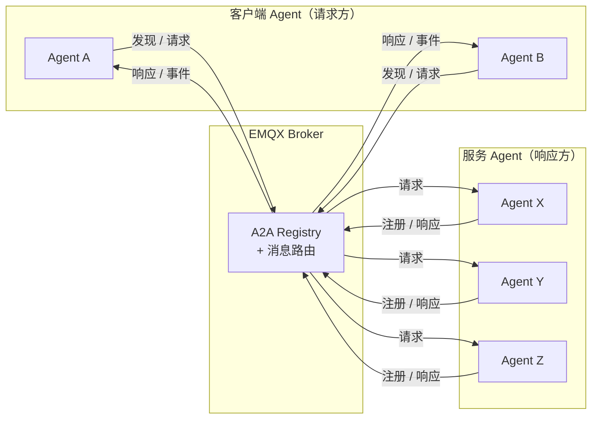
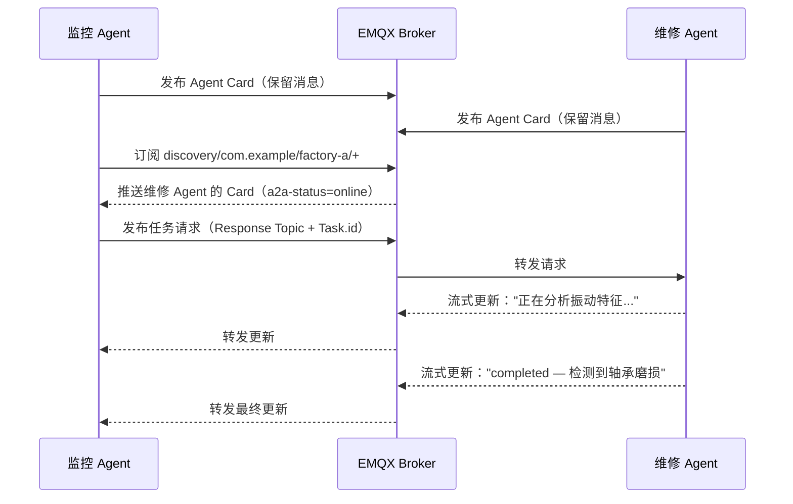

# A2A over MQTT 工作原理

本文介绍 A2A over MQTT 的核心概念：Agent、客户端与 Broker 的组织方式，Agent 如何标识自身并被发现，Agent Card 的内容，以及 Agent 之间通信所使用的交互模式。理解这些概念是在 EMQX 中使用 A2A Registry 的基础。

## 架构

A2A over MQTT 采用以 Broker 为中心的模型，包含三类参与者：

- **Agent（响应方）**：将 Agent Card 作为保留消息发布到发现主题，订阅自身的请求主题，并处理收到的任务请求。
- **客户端 Agent（请求方）**：订阅发现主题以查找可用 Agent，然后发送任务请求并接收响应。
- **MQTT Broker（EMQX）**：路由所有消息，将 Agent Card 收录至 A2A Registry，执行认证与授权，并在转发发现消息时附加在线状态元数据。



## Agent 标识

每个 Agent 通过三级层级结构进行标识：

```
{org_id} / {unit_id} / {agent_id}
```

- **org_id**：Agent 所属的组织（例如 `com.example`）。
- **unit_id**：组织内的子部门，例如团队或部署环境（例如 `factory-a`）。
- **agent_id**：Agent 在所属组织和部门内的唯一标识符（例如 `iot-ops-agent-001`）。

三个字段均须满足正则 `^[A-Za-z0-9_.-]+$`，不能包含 `/`、`+`、`#` 或空白字符。Agent 的 MQTT Client ID 必须使用组合格式：`{org_id}/{unit_id}/{agent_id}`。

## 主题模型

| 主题 | 用途 |
|---|---|
| `$a2a/v1/discovery/{org_id}/{unit_id}/{agent_id}` | Agent 注册与发现（保留消息） |
| `$a2a/v1/request/{org_id}/{unit_id}/{agent_id}` | 向指定 Agent 发送任务请求 |
| `$a2a/v1/reply/{org_id}/{unit_id}/{agent_id}/{suffix}` | 推荐的响应主题模式（见下方说明） |
| `$a2a/v1/event/{org_id}/{unit_id}/{agent_id}` | 主动推送的事件消息 |
| `$a2a/v1/request/{org_id}/{unit_id}/pool/{pool_id}` | 负载均衡调度的共享池主题 |

::: tip 说明
响应主题并非固定的协议主题。请求方可以使用任意主题作为响应主题，响应方通过每条请求消息中的 MQTT v5 `Response Topic` 属性获知回复地址。上表中的模式仅为推荐约定，有助于保持一致性并简化 ACL 配置。
:::

发现订阅通过通配符限定范围：

```
$a2a/v1/discovery/com.example/+/+     # 某组织下的所有 Agent
$a2a/v1/discovery/com.example/factory-a/+  # 某部门下的所有 Agent
```

## Agent Card

Agent Card 是 Agent 发布到其发现主题的 JSON 文档，描述 Agent 的身份、能力、端点地址及可选的安全元数据。EMQX 收到后将该 Card 收录至 A2A Registry。

最少必填字段：

| 字段 | 类型 | 说明 |
|---|---|---|
| `name` | String | 易于阅读的 Agent 名称。 |
| `description` | String | Agent 功能的简短描述。 |
| `version` | String | 版本字符串，例如 `"1.0.0"`。 |
| `url` | String（URI） | Agent 的端点 URI。对于基于 HTTP 的 A2A 交互，这是 HTTP 端点；对于 MQTT 注册的 Agent，则标识 Broker 端点（例如 `mqtts://broker.example.com:8883`）。 |
| `skills` | Array | 至少一个技能对象，每个对象包含 `id`、`name` 和 `description`。 |

Agent Card 最小示例：

```json
{
  "name": "IoT Operations Agent",
  "description": "Monitors factory telemetry and coordinates remediation actions.",
  "version": "1.2.3",
  "url": "mqtts://broker.example.com:8883",
  "skills": [
    {
      "id": "device-diagnostics",
      "name": "Device Diagnostics",
      "description": "Analyzes telemetry and detects device anomalies."
    }
  ]
}
```

完整的 Agent Card Schema（包括 `capabilities`、`securitySchemes`、`supportedInterfaces` 及扩展参数），请参阅 [A2A 规范](https://google.github.io/A2A/)。

## Agent 在线状态

Agent Card 在 Agent 断开连接后仍作为保留消息持久存在。EMQX 追踪连接状态，并在向订阅方转发发现消息时附加 MQTT v5 用户属性：

| 用户属性 | 值 | 含义 |
|---|---|---|
| `a2a-status` | `online` | Agent 的 MQTT 连接处于活跃状态。 |
| `a2a-status` | `offline` | Agent 已断开连接（正常断开或通过 LWT）。 |
| `a2a-status-source` | `broker` | 状态由 EMQX 设置。 |
| `a2a-status-source` | `agent` | 状态由 Agent 自身发布。 |
| `a2a-status-source` | `lwt` | 状态反映通过遗嘱消息（LWT）检测到的异常断开。 |

Agent 应在其发现主题上配置遗嘱消息，携带 `a2a-status=offline` 和 `a2a-status-source=lwt`，以便订阅方在 Agent 异常断开时自动收到通知。

## 交互模式

A2A over MQTT 支持以下 Agent 间交互模式。每种模式均使用 MQTT v5 的 `Response Topic` 和 `Correlation Data` 属性进行请求/响应路由，并通过请求方生成的 `Task.id` 在整个任务生命周期内跟踪任务状态。

| 模式 | 说明 |
|---|---|
| 单次请求/响应 | 请求方发布任务请求，响应方向指定的 `Response Topic` 发布单条响应。 |
| 流式响应 | 响应方持续发布状态更新和制品更新消息，直至任务达到终态。 |
| 多轮对话 | 使用 `Task.context_id` 将相关任务归组，支持对中断任务的恢复。 |
| 共享池调度 | 多个 Agent 实例共享池主题，通过 MQTT 共享订阅实现负载均衡请求分发。 |
| 任务移交 | 响应 Agent 通过 `a2a-responder-agent-id` 用户属性将进行中的任务委托给另一实例。 |
| OAuth 2.0 授权 | 每次请求携带的 Bearer Token 通过 `a2a-authorization` MQTT 用户属性传递。 |
| 端到端安全 | 可选的 `ubsp-v1` 安全配置为不受信任的 Broker 环境提供端到端加密载荷。 |

各模式的完整规范，请参阅 [A2A over MQTT 传输规范](https://www.emqx.com/mqtt-for-ai/a2a-over-mqtt/specification/0.1/basic/mqtt_transport.html)。

## 示例工作流：工厂告警响应

两个 Agent 协作处理工厂现场告警：**监控 Agent** 负责检测设备异常并委派诊断任务，**维修 Agent** 负责处理任务并将进展以流式方式回传。

**步骤 1：双方 Agent 完成注册。** 每个 Agent 将 Agent Card 作为保留消息发布到各自的发现主题。EMQX 收录 Card 并将两个 Agent 标记为在线。

**步骤 2：监控 Agent 发现维修 Agent。** 监控 Agent 订阅 `$a2a/v1/discovery/com.example/factory-a/+`，立即收到维修 Agent 的保留 Card，确认其具备诊断设备故障的能力。

**步骤 3：监控 Agent 发送任务请求。** `line-7` 电机出现异常振动读数。监控 Agent 向维修 Agent 的请求主题发布请求，载荷中包含唯一的 `Task.id`，并在 MQTT `Response Topic` 属性中指定响应主题。

**步骤 4：维修 Agent 流式返回状态更新。** 维修 Agent 向响应主题发布多条进度更新，最终发布 `completed` 终态：检测到轴承磨损，已安排检修。每条更新均携带原始 `Correlation Data`，供监控 Agent 将响应与请求对应起来。


