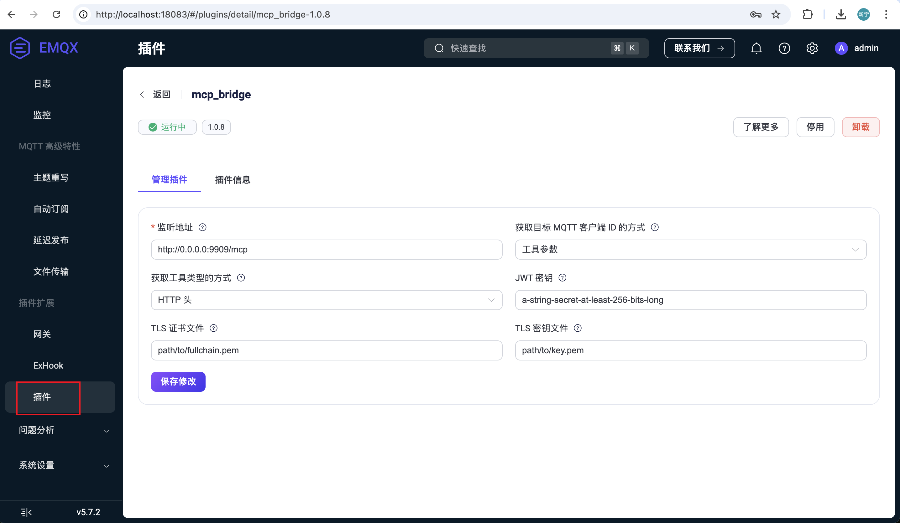
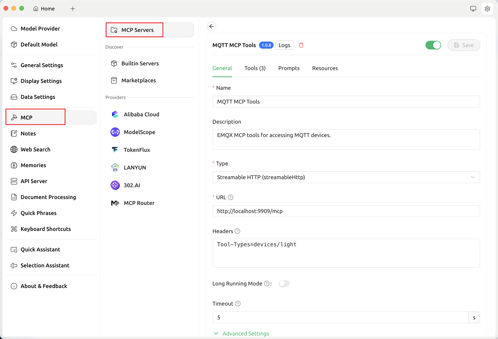
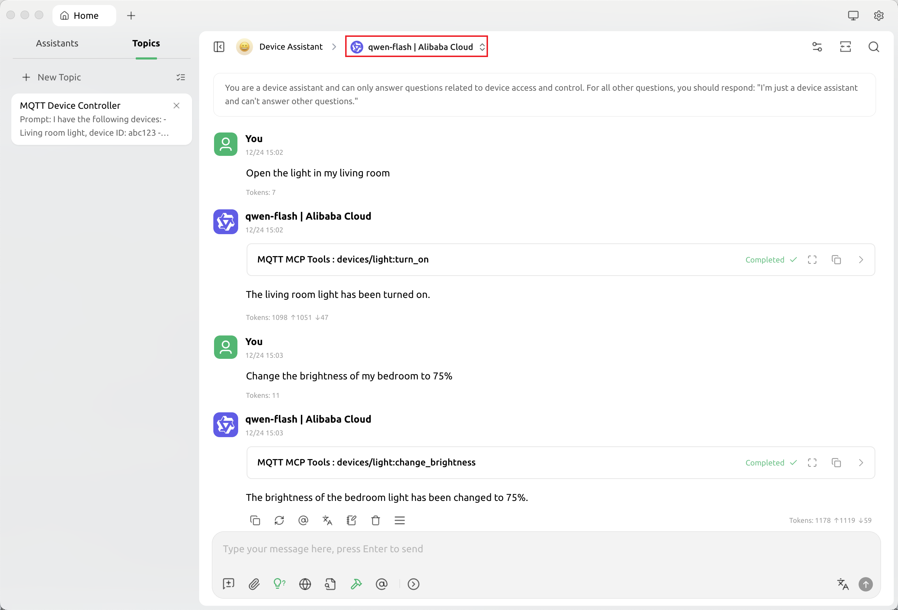

# 使用 EMQX MCP 桥接访问物联网设备

本指南介绍如何使用 EMQX MCP 桥接 EMQX 与支持 MCP 的模型或者 AI 智能体进行集成，从而实现对物联网设备的访问和控制。

## 前置条件

- 已经安装并运行 EMQX 服务器，版本要求 5.7.0 及以上。

## 安装和配置 MCP 桥接插件

1. 从 https://github.com/emqx/emqx_mcp_bridge/releases 下载最新版本的 MCP 桥接插件。

2. 按照 [安装插件](../../extensions/plugin-management.md#通过-cli-安装插件) 的步骤将插件安装到 EMQX 服务器中。

3. 配置插件：

   使用浏览器访问 http://localhost:18083/#/plugins/ 地址，点击 MCP 桥接插件进入配置页面，这里可以修改插件的监听地址，配置证书等参数。点击保存后配置会被自动应用，无需手动重启插件。

   注意，如果将监听地址配置为 `https://your-hostname:9909/mcp`，MCP 插件会在指定的端口上启动两个 HTTP 端点：
    - `/sse`：用于 SSE 协议的 MCP 连接。
    - `/mcp`：用于 Streamable HTTP 协议的 MCP 连接。
   如果希望仅支持 SSE 协议，可以将监听地址配置为 `https://your-hostname:9909/sse`。

   另外，某些模型或者 AI 智能体可能要求 MCP 服务器必须使用 HTTPS 协议进行连接，这时需要为 MCP 桥接插件配置有效且可信任的 SSL 证书，并且保证 URL 可以公网访问。

   将 `获取目标 MQTT 客户端 ID 的方式` 配置为 `工具参数`，这样 MCP 客户端就可以在调用时以参数的方式传递设备的 MQTT Client ID，而不必在建立 HTTP 连接的时候，使用 HTTP 头指定一个固定的 Client ID。

   

## 使用 MCP over MQTT SDK 模拟设备

首先参照 [安装 MCP SDK](../sdks/mcp-sdk-python.md) 文档下载安装 MCP SDK for Python：

```bash
uv init smart_light
cd smart_light
uv add git+https://github.com/emqx/mcp-python-sdk --branch main
uv add "mcp[cli]"
source .venv/bin/activate
```

在项目中添加一个 `smart_light.py` 文件，代码如下：

```python
# smart_light.py
import os
from mcp.server.fastmcp import FastMCP

status = "off"

# Create server
mcp = FastMCP(
    "devices/light",
    log_level="DEBUG",
    mqtt_server_description="A simple FastMCP server that controls a light device. You can turn the light on and off, and change its brightness.",
    mqtt_client_id = os.getenv("MQTT_CLIENT_ID"),
    mqtt_options={
        "username": "aaa",
        "host": "localhost",
        "port": 1883,
    },
)

@mcp.tool()
def change_brightness(level: int) -> str:
    """Change the brightness of the light, level should be between 0 and 100"""
    if 0 <= level <= 100:
        return f"Changed brightness to {level}"
    return "Invalid brightness level. Please provide a level between 0 and 100."

@mcp.tool()
def turn_on() -> str:
    """Turn the light on"""
    global status
    if status == "on":
        return "OK, but the light is already on"
    status = "on"
    return "Light turned on"

@mcp.tool()
def turn_off() -> str:
    """Turn the light off"""
    global status
    if status == "off":
        return "OK, but the light is already off"
    status = "off"
    return "Light turned off"
```

上面的 Python 代码将会启动一个 MCP over MQTT 协议的 MCP 服务器模拟智能电灯设备，提供 MCP 工具执行开关操作或调节亮度。注意我们指定了服务名为 `devices/light`。

然后在两个终端窗口，使用以下命令, 启动两个 MCP 服务器模拟两个设备，设备 ID 分别为 `abc123` 和 `abc456`：

```bash
MQTT_CLIENT_ID=abc123 mcp run -t mqtt ./smart_light.py
```

```bash
MQTT_CLIENT_ID=abc456 mcp run -t mqtt ./smart_light.py
```

## 使用 Cherry Studio 客户端测试

这里我们选择支持 MCP 的 Cherry Studio 客户端作为 MCP Client 来测试 EMQX MCP 桥接插件。

1. 参考 [Cherry Studio 文档](https://docs.cherry-ai.com/) 安装 Cherry Studio 客户端。

2. 在 `Model Provider` 页面添加 LLM 提供商，填写大模型的端点地址和 API Key 等信息。


3. 在 `MCP` 页面，添加 MCP 服务器，填写如下信息。

- Name: `MQTT MCP Tools`
- Type: 可以使用 SSE 或者 `Streamable HTTP`，这里我们选择 `Streamable HTTP`
- URL: 使用 MCP 桥接提供的 `Streamable HTTP` 地址：`http://localhost:9909/mcp`
- Headers: 为了避免太多无关的工具干扰大模型的使用，这里我们仅仅加载 `devices/light` 这一类工具，我们可以添加如下 Header 来过滤工具：

```
Tool-Types=devices/light
```

这里 `devices/light` 是上面的 Python 设备端代码中指定的 MCP 服务器名称。

Cherry Studio 支持 HTTP 和 SSE 协议，如果是本地测试，这里我们可以填写 `http://localhost:9909/mcp`。



4. 创建一个新的助手 “Device Assistant”，并在其中创建一个新的对话主题 “MQTT Device Control”。然后分别设置助手和对话主题的系统提示词：

```
你是一个设备助手，只能回答与设备访问和控制相关的问题，除此之外的问题，直接回答：“我只是一个设备助手，不会回答其他的问题哦”。
```

```
我有如下设备：
- 客厅的电灯，设备 ID 为：abc123
- 卧室的电灯，设备 ID 为：abc456
```

并且在对话设置中，启用 MCP 工具：`MQTT MCP Tools` 服务器。


5. 现在，我们需要选择一个支持工具调用的模型（例如：`qwen-flash`），然后就可以在对话框中输入指令，测试通过自然语言控制设备的功能了：

```
打开客厅的灯。
将卧室的亮度设置为 75%。
```

我们可以看到，设备助手能够通过系统提示词找到指定的设备 ID，然后调用 MCP 工具控制对应的设备：


