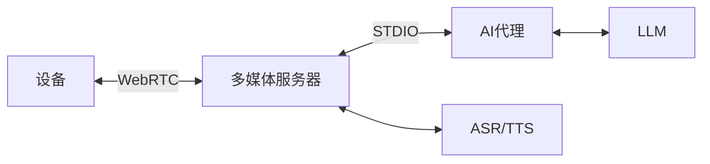
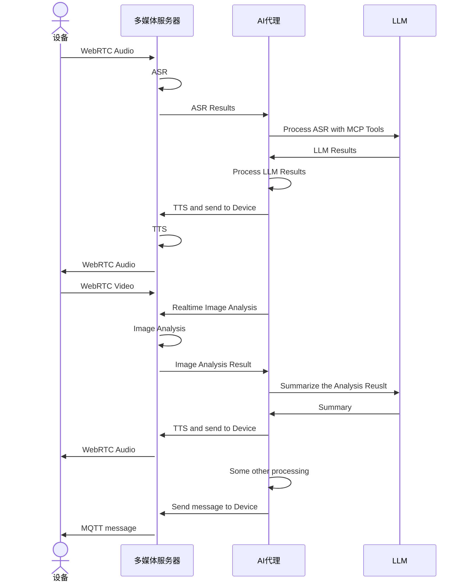

# 多媒体服务器架构

多媒体服务器使用 WebRTC 与客户端进行点对点的音视频数据传输，使用 MQTT 协议传输普通消息和 WebRTC 信令消息。用户可以使用 Python 编写 AI 代理程序，通过 STDIO 与多媒体服务器进行通信，以实现更复杂的业务逻辑。

下图展示了使用多媒体服务器的 AI 系统的整体架构：

- **设备**: 通过 WebRTC 与多媒体服务器进行音视频数据的交互。
- **多媒体服务器**: 负责处理来自设备的音视频数据，提供 ASR（自动语音识别）、 TTS（文本转语音）等功能，并与 AI 代理进行通信。
- **AI 代理**: 通过 STDIO 接受多媒体服务器传递的 ASR 结果，包含了 AI 应用的核心业务逻辑，调用 LLM（大语言模型）处理文本自然语言，并调用多媒体服务提供的 API 发送文字或音频流给设备。
- **ASR/TTS**: 语音和视觉模型提供商，提供自动语音识别和文本转语音服务。
- **LLM**：大语言模型，用于自然语言处理与文本生成。

## 工作流程

下图展示了各组件之间的交互流程：

