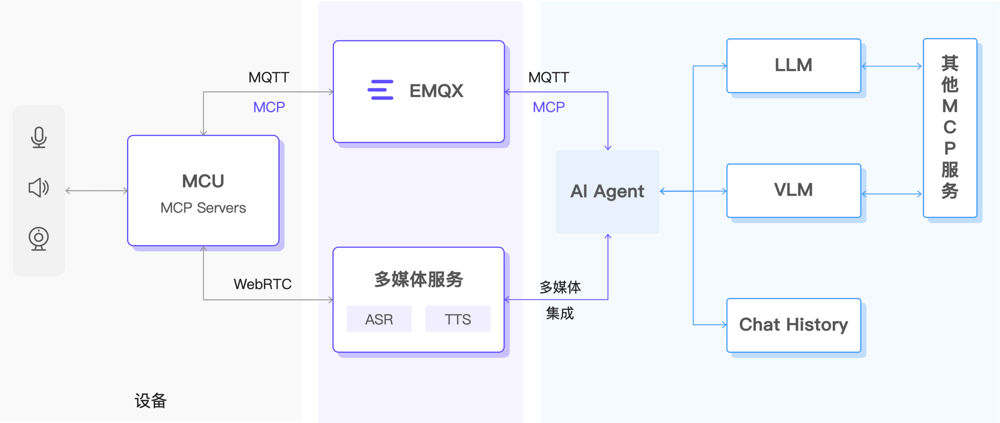

# EMQX 助力构建智能物联网系统

## 背景

随着大模型技术的迅猛演进，AI 正在深入重塑各行各业，而物联网行业也迎来前所未有的变革。过去的智能硬件大多是围绕固定功能设计，更多扮演“被动执行者”。但如今，设备正逐步具备感知、理解、交互与行动的综合能力，从单一的工具演化为真正具备自主性与智能判断的智能体。这一变化正在推动众多场景发生颠覆性的升级。

在情感陪伴领域，曾经只会播放声音或做简单动作的电子玩具，正演变为能够识别情绪、理解语境并提供暖心反馈的智能伙伴；在智能家居市场，智能单品逐渐让位于能够全屋协同的智能生态，用户期待通过自然语言完成对家中设备的无缝控制；在机器人行业，具身智能机器人（无论是家用服务机器人、工业机器人还是人形机器人）都在快速发展，它们需要实时观察环境、理解意图并即时行动；在汽车领域，智能汽车已经成为移动的智能空间，车载 AI 助手能够处理复杂的交通场景，并以连续自然的语音交互提升驾驶体验。

## 实时、准确和丰富的上下文感知与多媒体交互是 AI 硬件的核心

尽管大模型具备强大的推理和生成能力，但其表现依赖于所提供的上下文质量。当系统无法准确理解当下情境、大环境变化或用户真实需求时，模型可能出现幻觉、答非所问等问题。人类在缺乏信息时也会“盲人摸象”，但掌握完整上下文后往往能做出准确判断。对于智能硬件而言，让 AI “理解真实世界”是提升交互稳定性与可信度的关键。因此，一个可靠的 AI 智能体需要具备以下三类核心能力：

1. 多源数据：让 AI 具备真实世界的理解

来自不同来源的数据构成 AI 的“世界模型”：

- 环境数据：温度、湿度、亮度、重力等物理信息，为系统提供实时状态；
- 云端知识：地图、天气、交通、充电桩等信息，让设备具备更广阔的认知；
- 第三方上下文：内容服务、知识库等，使设备能理解更复杂的问题与需求。

数据源越丰富，系统越能精准定义 “现在正在发生什么” 与 “用户真正需要什么”。

2. 实时事件感知：让 AI 在毫秒级理解变化

事件是构建上下文的锚点，是驱动 LLM/VLM 的关键入口：

- 环境突变：如房间亮度急剧变化
- 状态变化：例如玩具突然倾倒
- 特殊场景：汽车锁车后，后座压力传感器异常

能否在毫秒级捕捉事件，决定了系统智能反应的快与准。

3. 多媒体交互：让 AI 具备自然的人机沟通能力

多模态交互是从“语音助手”走向“智能体验”的关键飞跃：

- 语音：情感化表达、自然语调、多语言支持
- 视频：面部表情、场景识别与实时视觉反馈
- 控制能力：通过语音 + 视觉理解结合，实现更智能的场景驱动

## 构建智能硬件的六个要素

我们从输入和输出两个方面，通过六个角度定义出构建合格的智能硬件所必需有的要素。

### 输入能力

- 可感知：智能体可以通过各种方式（传感器）来感知这个物理世界：通过温度传感器了解环境温度，使用定位知道自己所处位置，利用重力加速感应知道自己的运行状态等。
- 听得见：通过麦克风采集环境声音和用户语音，实现噪声抑制、回声消除，然后通过支持多种语言的语音识别技术，让设备能够「听见」用户的自然语言。
- 看得见：通过摄像头采集视觉信息，实现图像识别、目标检测、人脸识别和手势识别，让设备能够「看懂」周围环境和用户行为。

### 输出能力

- 能理解：通过集成 LLM/VLM 模型，实现语义理解、情感识别和上下文记忆，让设备能够理解用户意图并保持对话连贯性。
- 说得出：通过扬声器输出高质量语音，支持多音色合成、情感化表达和情境化语调，让设备能够自然流畅地与用户交流。
- 能行动：通过 MCP 协议控制各种设备功能，实现音量调节、摄像头开启、多设备协调等操作，让设备能够执行用户指令并做出相应行动。

## 以 EMQX 和 RTC 服务为核心的智能物联网架构

EMQX 端到端解决方案采用分层架构，将设备层、通信层、处理层与应用层整合为一个流畅协作的系统。从传感器采集、边缘处理、实时通信（MQTT + WebRTC）、到云端大模型，形成闭环的“感知 → 理解 → 行动”链路。这一架构既适用于轻量设备，也能支撑复杂场景如机器人与车载系统。

### 可感知：EMQX 提供构建 AI 世界模型所需的 “实时上下文”

感知是所有智能行为的前提。人类的输入主要来自视觉、听觉与触觉，真正用于表达的语言只占生活中 6%〜10% 的时间。对于 AI 智能体而言，如果缺乏实时的世界感知，它就只是一段算法，而不是生活在物理世界中的实体。

EMQX 为设备提供完善的“实时上下文基础设施”：

- 毫秒级数据链路：从设备到云端的消息转发延迟仅毫秒级，确保每个事件都能即时处理；
- 全场景 SDK：从低功耗 MCU 到 Linux 设备，提供统一接入方式，简化传感器接入；
- 海量设备管理能力：支持海量设备并发连接、消息处理与状态追踪，适用于从玩具到车载的各种大规模场景。

#### 扩展阅读

- [使用 EMQX 构建感知 -> 控制反馈能力](rtc-services/volcengine-rtc/scenarios/device-triggered-voice.md)

### 听得到、看得见、说得出：音、视频流数据接入与处理

WebRTC 是实时音视频交互领域的核心技术，其低延迟、高兼容性特性使其成为智能硬件进行多模态交互的首选方案。

- 语音输入：让设备真正“听懂”用户。高质量麦克风配合智能降噪、回声消除，使系统能够在复杂环境中保持语音的清晰度。实时 ASR 技术将语音转为文字，支持多语言识别，为后续语义理解打下基础。

- 视觉输入：让设备拥有“眼睛”。摄像头提供高清画面，结合目标识别、人脸识别和动作理解，让设备可以“看见”用户的状态与动作。手势交互让体验更加自然，无需触碰即可操作。

- 语音输出：让沟通更加自然。现代 TTS 提供多音色、多情绪合成能力，可根据场景自动调整语调与节奏，让机器的表达更加拟人化与亲切。自然语音反馈让设备真正成为能“沟通”的智能伙伴。

#### 扩展阅读：

- [基于火山引擎构建音视频接入](rtc-services/volcengine-rtc/overview.md)

### 能理解：接入 LLM / VLM

LLM 负责语言理解与生成，VLM 负责视觉与语言的融合。它们让智能设备不仅能“听到、看到”，还能真正“理解”。相比传统规则引擎，现代大模型具备强大的推理、记忆与泛化能力，可适用于高度复杂与开放式的交互场景。

扩展阅读：

- [阿里千问模型](https://www.aliyun.com/product/tongyi)
- [火山云豆包大模型](https://www.volcengine.com/product/doubao)

### 能行动：MCP 设备控制 - AI 与设备的桥梁

MCP（Model Context Protocol）让 AI 能够自然、规范、动态地调用设备能力。

- MCP Server：部署在设备端，负责注册设备能力，如摄像头控制、音量控制、机械结构动作指令等；
- MCP Client：运行在云端或边缘节点，将 AI 的决策转换为可执行的设备控制命令；
- MCP Hosts：嵌入 AI 应用，负责将用户意图转换为工具调用，并与设备进行双向协作。

通过 MCP，AI 获得了动作能力，设备也获得了统一的控制接口，使多设备协同与复杂场景控制成为可能。

#### 扩展阅读：

- [MCP over MQTT 协议概述](./mcp-over-mqtt/overview.md)

#### 智能体交互典型场景

- 纯语音对话：以语音为唯一输入，基于 WebRTC 即可实现实时、高品质互动。
- 语音 / 视频控制设备：通过麦克风或摄像头操作设备功能，需要集成 WebRTC 与 MQTT 以确保稳定控制链路。
- 感知驱动的控制与多媒体交互：设备从传感器获取事件，再由 AI 决策，结合语音与视频输出，实现沉浸式的智能体验。与第二种场景类似，也需要集成 WebRTC 与 MQTT。
