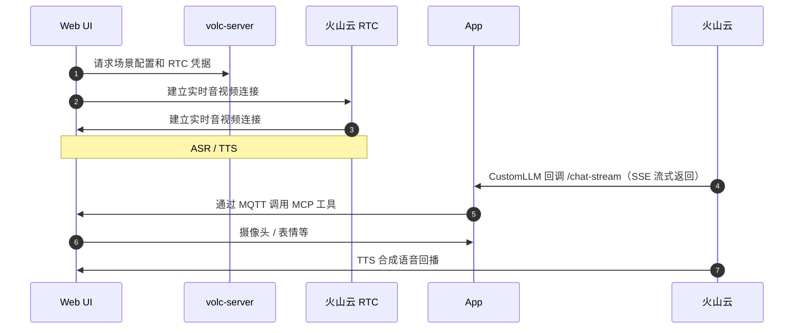
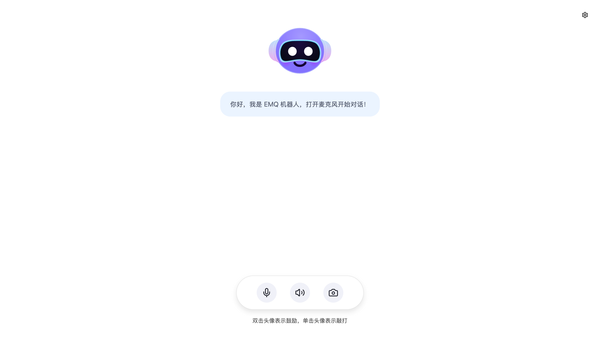
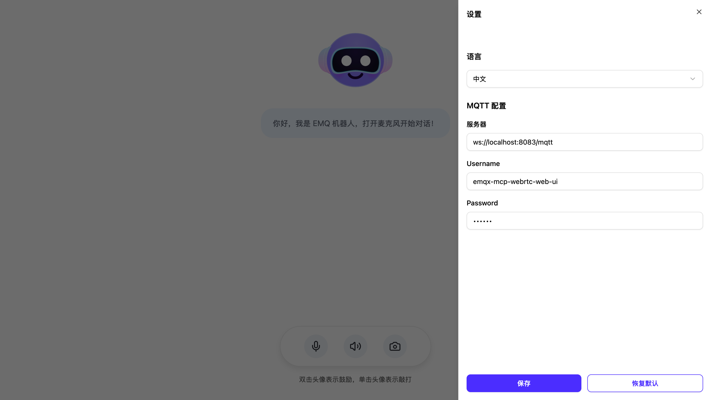
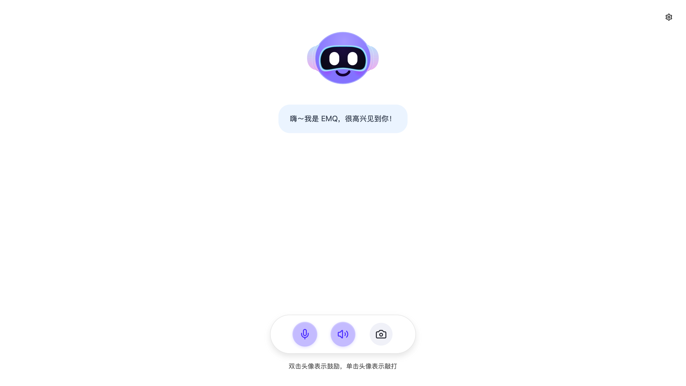
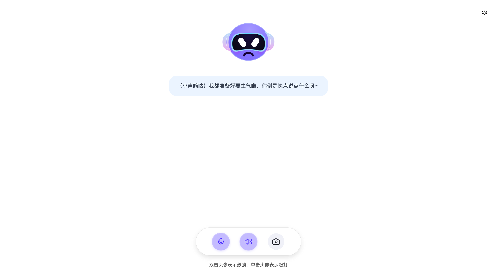
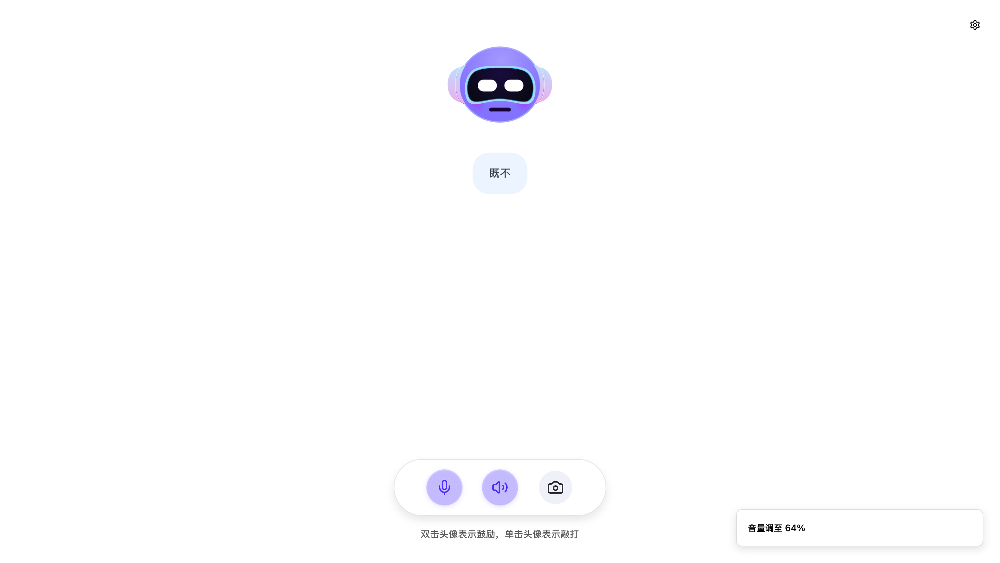

# 快速开始：基于 EMQ + 火山云语音服务搭建智能体

本文档介绍如何使用 Docker Compose 快速部署一个支持语音交互与设备控制的 AI 智能体演示系统。本项目通过 PC 端的浏览器模拟智能设备端（摄像头、表情、音量等硬件能力），展示 MCP over MQTT 协议如何实现 AI Agent 对设备的实时控制。系统集成火山云 RTC 实现语音通道，ASR/TTS 提供语音识别与合成，CustomLLM 模式对接自定义 AI Agent 服务完成多轮对话与工具调用。

观看[演示视频](https://www.bilibili.com/video/BV1P2WTzBEu4/)了解 Demo 完整效果。

## 架构速览

### 核心组件

本系统由三个核心组件构成：

| 组件 | 角色 | 端口 | 主要功能 |
|------|------|------|----------|
| **web** | MCP Server | 8080 | 前端 UI，暴露硬件控制工具（摄像头拍照/表情/音量） |
| **app** | MCP Client + AI Agent | 8081 | 提供 `/chat-stream` 端点，处理 LLM/VLM 推理与 MCP 工具调用 |
| **volc-server** | 火山云代理 | 3002 | 管理 RTC 房间/Token，配置 CustomLLM 地址，让火山服务能够请求至 app |

### 通信流程



### 核心能力

- **MCP over MQTT 协议**：通过 EMQX Broker 实现 AI Agent 对设备的跨网络工具调用（摄像头、表情、音量控制）。
- **多模态理解**：集成 VLM 视觉大模型，支持"看看我手里拿的是什么"等视觉场景。
- **实时语音交互**：基于火山云 RTC + ASR/TTS，端到端语音识别与合成，低延迟响应。
- **并行处理架构**：工具调用与语音合成异步执行，用户体验流畅无阻塞。

## 前置准备

### Docker 环境

- **版本要求**：Docker 24+
- **验证方式**：运行 `docker --version` 确认

### MQTT Broker

本项目需要一个可访问的 EMQX Broker 供 Web 服务（MCP Server）和 app（MCP Client + AI Agent）容器连接。

**部署方式（二选一）**：

- **自托管部署**：参考 [EMQX 安装文档](https://docs.emqx.com/en/emqx/latest/deploy/install.html)
- **托管服务**：使用 [EMQX Cloud](https://docs.emqx.com/en/cloud/latest/)

**默认配置**：

```bash
MQTT_BROKER_HOST=localhost
MQTT_BROKER_PORT=1883
```

**如需鉴权**，额外配置：

```bash
MQTT_USERNAME=your_username
MQTT_PASSWORD=your_password
```

### 获取 LLM API Key

本项目默认使用阿里云百炼的 `qwen-flash` 模型。

#### 开通阿里云百炼

1. 访问 [阿里云百炼控制台](https://bailian.console.aliyun.com)。
2. 如页面顶部显示开通提示，点击开通服务（开通不产生费用，仅模型调用超出免费额度后计费）。
3. 如需实名认证，请先完成认证。

#### 创建 API Key

1. 进入 [密钥管理](https://bailian.console.aliyun.com/#/api-key) 页面。
2. 在 **API-Key** 页签下点击 **创建 API-KEY**。
3. 选择归属账号和业务空间（通常选择默认业务空间），填写描述后确定。
4. 点击 API Key 旁的复制图标获取密钥。
5. 将获取的 API Key 填入 `app/.env` 的 `DASHSCOPE_API_KEY`。

#### 使用其他模型服务（可选）

如使用其他符合 OpenAI 接口规范的模型服务，需修改 `app/.env` 中的以下配置：

```bash
LLM_API_BASE=https://your-model-service.com/v1  # 模型服务 Base URL
LLM_API_KEY=your_api_key                        # 模型服务 API Key
LLM_MODEL=your_model_name                       # 模型名称
```

**常见模型服务**:

- **OpenAI**: `https://api.openai.com/v1`
- **DeepSeek**: `https://api.deepseek.com/v1`
- **其他兼容服务**: 参考对应文档配置

不同的大模型服务可能延迟和费用差异较大，请根据实际需求选择合适的模型，最快延迟效果推荐使用默认的阿里云百炼 `qwen-flash`。

### 开通火山云服务并配置凭据

#### 开通服务

本项目需要开通火山云的多个服务，请先访问 [火山引擎控制台](https://console.volcengine.com/home) 注册并登录账号。

**必需服务**:

- **RTC 服务** - [开通教程](https://www.volcengine.com/docs/6348/69865)
   - 开通后获取 `VOLC_RTC_APP_ID` 和 `VOLC_RTC_APP_KEY`
   - 获取地址: [RTC 控制台](https://console.volcengine.com/rtc/aigc/listRTC)

- **ASR/TTS 语音服务** - [豆包语音控制台](https://console.volcengine.com/speech/app)
   - 创建应用时选择:
     - **ASR**: 流式语音识别
     - **TTS**: 语音合成
   - 获取以下凭据:
     - `VOLC_ASR_APP_ID` - 语音识别应用 ID
     - `VOLC_TTS_APP_ID` - 语音合成应用 ID
     - `VOLC_TTS_APP_TOKEN` - TTS 应用 Token
     - `VOLC_TTS_RESOURCE_ID` - TTS 资源 ID (根据所选语音线路)

- **账号凭据** - [密钥管理](https://console.volcengine.com/iam/keymanage/)
   - `VOLC_ACCESS_KEY_ID` - Access Key ID
   - `VOLC_SECRET_KEY` - Secret Access Key

#### 权限配置

**必须完成**: 在 RTC 控制台配置跨服务授权，否则智能体无法正常调用 ASR/TTS/LLM 服务。

**主账号调用**（推荐，配置简单）:

1. 登录主账号 [RTC 控制台](https://console.volcengine.com/rtc)。
2. 进入 [跨服务授权](https://console.volcengine.com/rtc/aigc/iam)。
3. 点击 **一键开通跨服务授权** 配置 `VoiceChatRoleForRTC` 角色。
4. 使用主账号的 AK/SK 即可调用服务。

**子账号调用**（可选，需额外配置）:

为子账号添加调用实时对话式 AI 接口权限：

1. 登录主账号 [RTC 控制台](https://console.volcengine.com/rtc)。
2. 前往 [跨服务授权](https://console.volcengine.com/rtc/aigc/iam)，点击 **为子账号添加权限**。
3. 找到需要授权的子账号，点击添加权限。

> 完整的 RTC 服务开通教程请参考: [实时对话式AI前置准备](https://www.volcengine.com/docs/6348/1315561)。

#### LLM 配置

本项目使用 **CustomLLM 模式**，由火山云回调当前项目中的 app 自定义的 AI Agent 服务获取 LLM 响应。

**核心要求**:

- `VOLC_LLM_URL` - 指向 app 服务的 `/chat-stream` 端点
  - 本地部署: `http://app:8081/chat-stream` (容器内网络)
  - 生产部署: `https://your-domain.com/chat-stream` (需公网可达)
- `VOLC_LLM_API_KEY` - 自定义认证密钥，需与 app 的 `CUSTOM_LLM_API_KEY` 保持一致（详见下文"步骤 2：配置环境变量"）

**模型来源**(任选其一):

- **火山方舟**: 在 [方舟控制台](https://console.volcengine.com/ark/region:ark+cn-beijing/endpoint) 创建自定义推理接入点或应用
- **Coze 平台**: 在 [Coze](https://www.coze.cn) 创建智能体 - [创建教程](https://www.coze.cn/open/docs/guides/quickstart)
- **第三方模型**: 准备符合 OpenAI 接口规范的服务 URL - [接入要求](https://www.volcengine.com/docs/6348/1399966)

> **注意**: 本项目 app 服务已实现 CustomLLM 协议，您只需配置上述"3. LLM API Key 获取"中的 API Key (如 `DASHSCOPE_API_KEY`)，无需额外部署模型服务。

#### 快速获取参数

**推荐方式**: 使用火山云官方 Demo 快速验证配置。

1. 访问 [实时对话式 AI Demo](https://console.volcengine.com/rtc/aigc/run)。
2. 跑通 Demo 后点击右上角 **接入 API** 按钮。
3. 复制参数配置代码，提取所需的凭据信息。

### 网络要求

**端口开放**（默认配置，可在 Compose 文件中调整）：

- `8080`: Web UI
- `8081`: App 后端（SSE 端点）
- `3002`: volc-server 代理（火山服务配置）

**可达性要求**：

**重要**: 为保证完整体验本项目的 MCP over MQTT 功能，app 服务的 `/chat-stream` 端点**必须部署到公网可访问的 HTTPS 环境**，以便火山云服务回调。

- **生产部署**（推荐）：将 app 部署到公网 HTTPS 地址（如 `https://your-domain.com/chat-stream`），确保 SSE 响应以 `data: [DONE]` 正确结束。
- **本地测试**：非公网环境，仅可通过 API 测试 LLM 推理与 MCP over MQTT 工具调用，无法完整的体验到火山云语音交互功能。

## 快速教程：10 分钟搭建语音交互 + 设备控制演示

在完成所有前置条件准备后，按照以下步骤即可快速搭建一个支持语音交互和设备控制的 AI 智能体演示应用（Web 模拟设备端）。

### 步骤 1：获取代码

```bash
git clone -b volcengine/rtc https://github.com/emqx/mcp-ai-companion-demo.git
cd mcp-ai-companion-demo
```

### 步骤 2：配置环境变量

这是最关键的步骤。我们需要将前置条件中获取的凭据正确填入三个服务的配置文件。请仔细阅读每个配置项的说明和来源。

> **安全提示**：请勿将 `.env` 文件提交到 Git，建议添加到 `.gitignore`。

#### 配置 app 服务（AI Agent 后端）

**创建配置文件**：

```bash
cp app/.env.example app/.env
```

**编辑 `app/.env`，填入以下配置**：

```bash
# ===== LLM 配置 =====
# 来源：前置条件 "3. LLM API Key 获取"
# 作用：供 AI Agent 调用大语言模型进行对话推理
DASHSCOPE_API_KEY=sk-xxxxxxxxxxxxx  # 替换为阿里云百炼的 API Key

# 如使用其他模型服务，额外配置以下参数：
# LLM_API_BASE=https://api.openai.com/v1
# LLM_MODEL=gpt-4

# ===== CustomLLM 认证密钥 =====
# 来源：自行生成（建议使用强随机字符串）
# 作用：火山云通过此密钥认证回调请求的合法性
# 要求：必须与 volc-server 的 VOLC_LLM_API_KEY 保持完全一致
CUSTOM_LLM_API_KEY=your-strong-random-secret-key-here

# 生成示例（可在终端运行）：
# openssl rand -base64 32
# python3 -c "import secrets; print(secrets.token_urlsafe(32))"

# ===== MQTT Broker 配置 =====
# 来源：前置条件 "2. MQTT Broker"
# 作用：连接 EMQX Broker，实现 MCP over MQTT 协议通信
MQTT_BROKER_HOST=localhost        # EMQX Broker 地址
MQTT_BROKER_PORT=1883             # MQTT 端口

# 如 EMQX 开启了鉴权，填写以下配置：
MQTT_USERNAME=your_mqtt_username  # EMQX 用户名（可选）
MQTT_PASSWORD=your_mqtt_password  # EMQX 密码（可选）

# ===== 可选配置 =====
MCP_TOOLS_WAIT_SECONDS=5          # 等待 MCP 工具注册的秒数
PHOTO_UPLOAD_DIR=uploads          # 照片上传目录
# APP_SSL_CERTFILE=/path/to/cert  # HTTPS 证书路径（生产环境）
# APP_SSL_KEYFILE=/path/to/key    # HTTPS 密钥路径（生产环境）
```

**说明**：

- **`DASHSCOPE_API_KEY` vs `CUSTOM_LLM_API_KEY` 的区别**：
  - `DASHSCOPE_API_KEY`：用于 app 服务**主动调用**阿里云百炼（或其他 LLM 服务）获取 AI 响应
  - `CUSTOM_LLM_API_KEY`：用于 app 服务**被动接收**火山云的回调请求时进行身份验证（类似 API 网关的访问令牌）

- **`CUSTOM_LLM_API_KEY` 生成方法**（任选其一）：

  ```bash
  # 方法 1：使用 openssl 生成（推荐）
  openssl rand -base64 32
  
  # 方法 2：使用 Python 生成
  python3 -c "import secrets; print(secrets.token_urlsafe(32))"
  ```

  > **安全警告**：切勿使用在线工具生成密钥或将密钥提交到 Git，生产环境请使用环境变量或密钥管理服务。

#### 配置 volc-server 服务（火山云代理）

**创建配置文件**：

```bash
cp volc-server/.env.example volc-server/.env
```

**编辑 `volc-server/.env`，填入火山云凭据**：

```bash
# ===== 火山云账号凭据 =====
# 来源：前置条件 "4. 火山云凭据 > 开通服务 > 账号凭据"
# 获取地址：https://console.volcengine.com/iam/keymanage/
VOLC_ACCESS_KEY_ID=AKLT*********************
VOLC_SECRET_KEY=************************************

# ===== RTC 服务凭据 =====
# 来源：前置条件 "4. 火山云凭据 > 开通服务 > RTC 服务"
# 获取地址：https://console.volcengine.com/rtc/aigc/listRTC
VOLC_RTC_APP_ID=your_rtc_app_id
VOLC_RTC_APP_KEY=your_rtc_app_key

# ===== ASR/TTS 语音服务凭据 =====
# 来源：前置条件 "4. 火山云凭据 > 开通服务 > ASR/TTS 语音服务"
# 获取地址：https://console.volcengine.com/speech/app
VOLC_ASR_APP_ID=your_asr_app_id
VOLC_TTS_APP_ID=your_tts_app_id
VOLC_TTS_APP_TOKEN=your_tts_app_token
VOLC_TTS_RESOURCE_ID=your_tts_resource_id

# ===== CustomLLM 配置 =====
# 作用：告知火山云服务回调哪个地址获取 LLM 响应

# VOLC_LLM_URL - app 服务的 /chat-stream 端点地址
# 本地测试：使用 Docker 容器内网络访问
# VOLC_LLM_URL=http://app:8081/chat-stream
# 生产环境：必须改为公网 HTTPS 地址（火山云才能回调）
VOLC_LLM_URL=https://your-domain.com/chat-stream

# VOLC_LLM_API_KEY - CustomLLM 认证密钥
# 要求：必须与 app/.env 的 CUSTOM_LLM_API_KEY 完全一致
VOLC_LLM_API_KEY=your-strong-random-secret-key-here  # 与 app 保持一致
```

**配置检查清单**：

- `VOLC_ACCESS_KEY_ID` 和 `VOLC_SECRET_KEY` 已从火山云控制台获取。
- `VOLC_RTC_APP_ID` 和 `VOLC_RTC_APP_KEY` 来自 RTC 控制台。
- `VOLC_ASR_APP_ID`、`VOLC_TTS_APP_ID`、`VOLC_TTS_APP_TOKEN`、`VOLC_TTS_RESOURCE_ID` 来自豆包语音控制台。
- `VOLC_LLM_API_KEY` 与 `app/.env` 的 `CUSTOM_LLM_API_KEY` 完全一致。
- 已完成前置条件中的"权限配置"（跨服务授权）。

#### 配置 web 服务（前端 UI）

Web 服务使用**构建时**环境变量，默认配置已满足本地开发需求：

```bash
VITE_AIGC_PROXY_HOST=http://localhost:3002  # volc-server 代理地址
```

**仅在以下情况需要自定义**：

- volc-server 部署在远程服务器
- volc-server 使用非 3002 端口

**自定义方法**（在启动前导出环境变量）：

```bash
export VITE_AIGC_PROXY_HOST=http://your-remote-host:3002
```

#### 配置关系总结

```text
前置条件                          配置文件位置
├─ 3. LLM API Key          ──►  app/.env (DASHSCOPE_API_KEY)
├─ 4. 火山云凭据
│  ├─ 账号凭据             ──►  volc-server/.env (VOLC_ACCESS_KEY_ID/SECRET_KEY)
│  ├─ RTC 服务             ──►  volc-server/.env (VOLC_RTC_APP_ID/APP_KEY)
│  ├─ ASR/TTS 服务         ──►  volc-server/.env (VOLC_ASR_*/VOLC_TTS_*)
│  └─ LLM 配置             ──►  volc-server/.env (VOLC_LLM_URL/API_KEY)
└─ 2. MQTT Broker          ──►  app/.env (MQTT_BROKER_HOST/PORT/USERNAME/PASSWORD)

自行生成
└─ CUSTOM_LLM_API_KEY      ──►  app/.env + volc-server/.env (需要一致)
```

**核心要点**：

1. **`CUSTOM_LLM_API_KEY` 是唯一需要自行生成的密钥**，它必须在 `app/.env` 和 `volc-server/.env` 中保持完全一致
2. **`DASHSCOPE_API_KEY` 用于调用 LLM**，`CUSTOM_LLM_API_KEY` 用于认证火山云回调
3. **生产环境必须将 `VOLC_LLM_URL` 改为公网 HTTPS 地址**，否则火山云无法回调 app 服务

### 步骤 3：启动服务

使用 Docker Compose 一键启动所有服务：

```bash
docker compose -f docker/docker-compose.web-volc.yml up --build
```

**启动过程**：

1. 构建镜像：`mcp-app`、`mcp-volc-server`、`mcp-web`。
2. 启动容器并监听端口：
   - `8080` - Web UI
   - `8081` - AI Agent 后端
   - `3002` - 火山云代理

**首次启动**可能需要几分钟下载依赖和构建镜像，请耐心等待。

### 步骤 4：功能验证

#### 访问 Web UI

打开浏览器访问：[http://localhost:8080](http://localhost:8080)。

您将看到一个虚拟设备界面，包含对话机器人头像、语音，摄像头按钮等元素。



#### 配置 MQTT 连接（首次使用）

1. 点击页面右上角的 **设置** 图标。
2. 在设置面板中填入 EMQX Broker 配置：
   - **服务器（Broker）**: `ws://localhost:8083/mqtt`（注意使用 WebSocket 端口 8083，非 MQTT 端口 1883）
   - **Username**: 如 EMQX 开启鉴权则填写用户名
   - **Password**: 如 EMQX 开启鉴权则填写密码
3. 点击 **保存** 按钮。
4. 在弹出的确认对话框中点击 **确认**，页面将自动刷新并应用新配置，MQTT 连接将自动建立。



> **说明**：
>
> - Device ID 由系统自动生成（格式：`web-ui-hardware-controller/{随机ID}`），无需手动配置。
> - MQTT 连接成功后，MCP 工具将自动注册并可供 AI Agent 调用。
> - 如连接失败，请检查 EMQX Broker 的 WebSocket 监听器是否启用（默认端口 8083）。

#### 开始语音交互

1. 在页面底部中央找到三个圆形按钮（麦克风、扬声器、摄像头）。
2. 点击最左侧的 **麦克风按钮**（默认为灰色）。
3. 浏览器会请求麦克风权限，点击 **允许**。
4. 系统自动初始化：
   - 麦克风按钮显示连接动画。
   - 通过 volc-server 获取场景配置和 RTC Token。
   - 建立火山云 WebRTC 连接。
   - 初始化 ASR/TTS 语音服务。
   - 启动 CustomLLM 回调到 app 的 `/chat-stream` 端点。
5. 连接成功后：
   - 麦克风按钮变为紫色高亮状态。
   - 页面中央显示"嗨～我是 EMQ，很高兴见到你！"。
   - 对着麦克风说话即可开始语音交互。



**控制按钮说明**：

- **麦克风按钮**（最左）：灰色=未连接，紫色=已连接并启用麦克风，再次点击可关闭麦克风（保持连接）
- **扬声器按钮**（中间）：控制 TTS 语音播放的静音/取消静音
- **摄像头按钮**（最右）：开启/关闭本地摄像头预览（用于拍照工具调用）

**测试建议**：

**语音识别与回复**：

- 说"你好"或"给我说个小故事吧"测试基本对话。
- 页面中央对话框会实时显示 AI 回复文字。
- 同时播放 TTS 语音合成。

**设备控制（MCP 工具调用）**：

- 说 "看看我手里拿的是什么" → 触发摄像头拍照并进行视觉识别。
- 说 "把音量调到 80%" → 调整界面音量条。
- 说 "让表情变成开心" → 切换头像表情动画。
- 说 "把表情改成生气" → 再次切换表情。





#### 验证成功标志

✅ **语音交互正常**：

- ASR 正确转录语音为文字
- LLM 流式返回对话回复
- TTS 播放语音响应

✅ **MCP 工具调用正常**：

- 摄像头拍照成功并在界面显示
- 表情根据指令实时切换
- 音量调节立即生效

✅ **日志无错误**：

- app 日志显示成功调用 LLM 和工具
- Web UI 浏览器的控制台中无 MQTT 连接错误
- volc-server 日志显示成功回调 app

#### 部分功能测试

如只想验证 UI 和火山云配置（不包含自定义 AI Agent）：

```bash
docker compose -f docker/docker-compose.web-volc.yml up --build volc-server web
```

**此模式特点**：

- ✅ 可用：语音识别（ASR）、语音合成（TTS）、基础对话
- ❌ 不可用：MCP 工具调用（摄像头、表情、音量控制等）

**使用火山方舟平台 LLM 进行对话**：

1. 前往 [火山方舟控制台](https://console.volcengine.com/ark) 创建推理接入点或智能体应用。
2. 获取 `EndpointId`（推理接入点）或 `BotId`（智能体应用）。
3. 在 `volc-server/src/config.ts` 中配置 LLM：

   ```typescript
   llm: {
     mode: 'ArkV3',                    // 使用方舟平台 LLM
     endpointId: 'ep-xxx',             // 方式一：推理接入点 ID（二选一）
     // botId: 'bot-xxx',               // 方式二：智能体应用 ID（二选一）
     systemMessages: [
       { role: 'system', content: '你是一个友好的语音助手' }
     ],
     historyLength: 5,                 // 上下文历史轮数
   }
   ```

4. 重启 volc-server 服务，即可使用火山方舟平台的 LLM 进行对话。

### 步骤 5：停止服务

在完成上述流程后，如果需要停止相关组件运行，可执行以下命令：

```bash
docker compose -f docker/docker-compose.web-volc.yml down
```

## 常见问题与故障排查

### 常见问题

#### 服务启动问题

| 问题           | 可能原因          | 解决方案                                                     |
| -------------- | ----------------- | ------------------------------------------------------------ |
| 容器启动失败   | 端口被占用        | 1. 使用 `lsof -i :8080` 查看占用进程 2. 修改 compose 端口映射 3. 重新执行 `docker compose up --build` |
| 环境变量未生效 | .env 文件加载失败 | 1. 确认 `.env` 在正确目录 2. 检查文件权限 3. 重新构建镜像    |

#### 火山云服务问题

| 问题              | 可能原因            | 解决方案                                                     |
| ----------------- | ------------------- | ------------------------------------------------------------ |
| 停留在"AI 准备中" | 跨服务授权未配置    | 1. 检查"权限配置"是否完成 2. 确认服务已开通且有余额 3. 验证参数大小写 |
| 401/403 错误      | AK/SK 或 Token 错误 | 1. 检查 `VOLC_ACCESS_KEY_ID`/`VOLC_SECRET_KEY` 2. 确认 Token 未过期 3. 验证跨服务授权 |
| 子账号配额限制    | 默认配额不足        | 前往 [配额中心](https://console.volcengine.com/quota/productList/ParameterList?ProviderCode=iam) 提升配额 |

#### LLM 请求问题

| 问题               | 可能原因       | 解决方案                                                     |
| ------------------ | -------------- | ------------------------------------------------------------ |
| LLM 请求失败       | API Key 错误   | 1. 确认 `DASHSCOPE_API_KEY` 正确 2. 检查网络连接 3. 查看日志：`docker compose logs app` |
| CustomLLM 回调失败 | 认证密钥不一致 | 1. 确认两处 `CUSTOM_LLM_API_KEY` 一致 2. 验证 `VOLC_LLM_URL` 地址 3. 检查 volc-server 能否访问 app |
| HTTPS 回调失败     | 证书链不完整   | **必须使用 fullchain 证书**：`APP_SSL_CERTFILE` 指向 `fullchain.pem`（包含完整证书链），而非单个 `cert.pem`。火山云回调时需验证完整证书链，否则 SSL 握手失败 |

#### MCP 工具调用问题

| 问题           | 可能原因                   | 解决方案                                                     |
| -------------- | -------------------------- | ------------------------------------------------------------ |
| 工具不可用     | MQTT 连接或 device_id 问题 | 1. 查看浏览器控制台中 MQTT 状态 2. 确认 Device ID 一致 3. 增加 `MCP_TOOLS_WAIT_SECONDS=10` |
| 摄像头拍照失败 | 权限未授予                 | 1. 检查浏览器摄像头权限 2. 点击允许访问 3. 刷新页面          |

#### MQTT 连接问题

| 问题            | 可能原因             | 解决方案                                                     |
| --------------- | -------------------- | ------------------------------------------------------------ |
| MQTT 连接失败   | Broker 配置错误      | 1. 确认 EMQX Broker 运行中 2. 检查 `MQTT_BROKER_HOST`/`PORT` 3. 验证鉴权信息 4. 测试网络连通性 |
| Web UI 无法连接 | WebSocket 端口未开放 | 1. 确认 WebSocket 端口开放（默认 8083） 2. 使用 `ws://` 协议（如 `ws://localhost:8083/mqtt`） |

### 配置调整

#### 端口占用

如端口被占用，修改 `docker/docker-compose.web-volc.yml` 中的端口映射：

```yaml
services:
  web:
    ports:
      - "8888:8080"  # 修改 Web UI 端口
  app:
    ports:
      - "8082:8081"  # 修改 app 端口
  volc-server:
    ports:
      - "3003:3002"  # 修改 volc-server 端口
```

**注意**：修改 volc-server 端口后，需同步更新 `VITE_AIGC_PROXY_HOST` 环境变量。

#### 启用 HTTPS（生产环境）

1. 准备证书文件（`fullchain.pem`、`privkey.pem`）。

   > **重要**：必须使用 **fullchain**（完整证书链），而不是单个证书文件。火山云回调时需要验证完整的证书链，否则会导致 SSL 握手失败。
   >
   > - Let's Encrypt: 使用 `fullchain.pem`（包含证书 + 中间证书）
   > - 其他 CA: 确保证书文件包含完整证书链（服务器证书 + 中间证书）

2. 将证书文件放到项目目录（如 `certs/` 文件夹）。

3. 在 `app/.env` 中配置证书路径：

   ```bash
   APP_SSL_CERTFILE=./certs/fullchain.pem  # 必须是 fullchain
   APP_SSL_KEYFILE=./certs/privkey.pem
   ```

4. 修改 `volc-server/.env` 中的 `VOLC_LLM_URL` 为 HTTPS 地址（如 `https://your-domain.com:8081`）。

#### 单独构建镜像

如需单独构建某个服务的镜像：

```bash
docker build -t mcp-web:local ./web
docker build -t mcp-app:local ./app
docker build -t volc-server:local ./volc-server
```

### 日志查看

```bash
# 查看所有服务日志
docker compose -f docker/docker-compose.web-volc.yml logs -f

# 查看特定服务
docker compose -f docker/docker-compose.web-volc.yml logs -f app

# 查看最近 100 行
docker compose -f docker/docker-compose.web-volc.yml logs --tail=100 app
```

### 性能优化

- **LLM 延迟**：使用低延迟模型（推荐阿里云百炼 `qwen-flash`）
- **语音质量**：调整 `volc-server/src/config.ts` 中的 ASR VAD 阈值和 TTS 音色
- **工具调用延迟**：确保 app 与 web 服务网络连通性良好，降低 MQTT 通信延迟（建议部署在同一内网或低延迟网络环境）

**本地开发（非 Docker）**：

web 用 `pnpm dev`，app 用 `uv run ...`，volc-server 用 `bun run dev`
