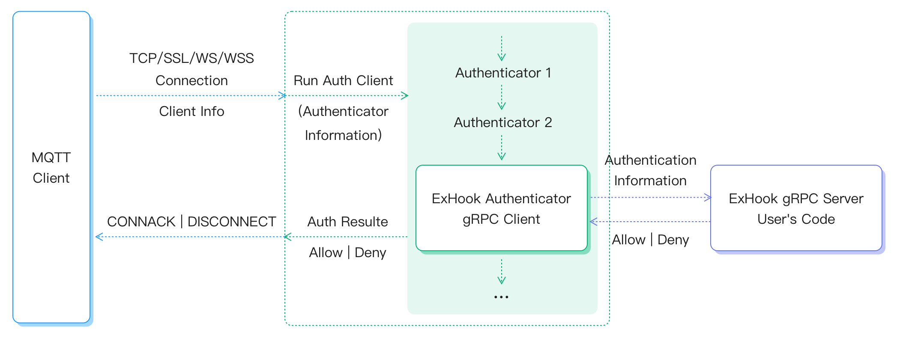
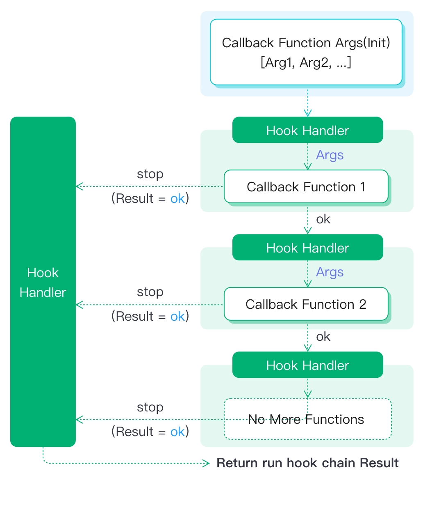

# 钩子

钩子 (Hooks) 是一种常见的扩展机制，允许开发者在特定的事件点执行自定义代码。

EMQX 支持钩子机制，通过拦截模块间的函数调用、消息传递、事件传递您可以灵活地修改或扩展系统功能。

## 钩子原理

对于用户来说，一个系统中整个事件处理流程从**事件 (Event) 的输入**，到**处理 (Handler)**，再到完成后的 **返回结果 (Result)** 对于用户来说，都是不可见且无法修改的。

如果在这个过程中加入一个可挂载函数的点 (HookPoint)，允许外部插件挂载多个回调函数，形成一个调用链，就可以达到对内部事件处理过程的扩展和修改。


EMQX 绝大部分功能都是通过钩子实现的，比如：

1. 在消息发布时对消息进行多步的流式处理(编码/解码等)。
2. 在消息发布时根据配置对消息进行缓存。
3. 使用钩子的阻塞机制实现消息的延迟发布。

EMQX 的认证授权就是按照该逻辑进行实现的，以 [多语言钩子扩展(ExHook)](./exhook.md) 为例，多语言钩子扩展执行认证流程如下：

1. 收到用户认证请求 (Authenticate)；

2. 使用客户端信息与钩子初始值执行 **认证事件的钩子**：

  ```erlang
  %% Default AccIn
  {ok, #{is_superuser => false}}
  ```

3. 回调函数执行到 `emqx_exhook` 模块，假设用户的 ExHook 服务认为此次登录合法且为超级用户，并返回 **允许登录且客户端为超级用户** 的结果：

  ```erlang
  %% AuthNResult
  {ok, #{is_superuser => true}}
  ```

4. 返回 **认证成功**，客户端成功以超级用户身份接入系统：


<!-- TODO 替换图片 -->



由此可见 EMQX 中，**钩子 (Hooks)** 机制极大地方便了系统的扩展。不需要对 EMQX 核心代码进行修改，仅需要向 **挂载点 (HookPoint)** 上挂载钩子函数，便能扩展 EMQX 的各种行为。

对于实现者来说仅需要关注：

1. **挂载点 (HookPoint)** 的位置：包括其作用、执行的时机、和如何挂载和取消挂载。
2. **回调函数** 的实现：包括回调函数的入参个数、作用、数据结构等，及返回值代表的含义。
3. 了解回调函数在 **链** 上执行的机制：包括回调函数执行的顺序，及如何提前终止链的执行。

如果你是在开发扩展插件中使用钩子，你应该能完全地明白这三点，尽量不要在钩子内部使用阻塞函数，这会影响系统的吞吐。

## 回调链

单个 **挂载点** 上可能会存在多个插件都需要关心该事件并执行相应操作，所以每个 **挂载点** 上都可能会存在多个回调函数。

我们称这种由多个回调函数顺序执行所构成的链为 **回调链 (Callback Functions Chain)**。

**回调链** 目前按照 [职责链(Chain-of-Responsibility)](https://en.wikipedia.org/wiki/Chain-of-responsibility_pattern) 的理念进行实现。为了满足钩子的功能和使用的灵活性，它具有以下特性：

- **顺序性**： 回调链上的回调函数必须按某种先后顺序执行。
- **链的入参**： 一定会存在一个/一些初始化参数，以及一个可选的，供链上回调函数修改的值。并且链上所有回调函数的参数模式应该一致，即相同的参数个数和类型。
- **输出传递性**： 链上每个函数必须有一个输出，对于不关心执行结果的回调函数应使用 `ok` 作为函数返回值。例如在通知类事件中，“某客户端已成功登录” 不需要返回值。
- **传递性**： 链上函数的输出具有传递性。并且为了可以更加灵活地使用钩子，我们设计了**两种**对链上的回调函数返回值的处理模式。
  - **传递返回值** <br />
    意思是，链上每一个回调函数都会接受链的入参，以及上一个回调函数的返回结果 (可理解为累加值) 作为参数。直到最后一个函数，最后一个函数的返回值则为整个链的返回值。特殊的，调用链时需要为累加值提供初值，以供链上第一个回调函数使用。
  - **透明返回值** <br />
    链上每一个函数仅关心链的入参，将会忽略上一个回调函数的返回值。并且链将会有固定的返回值 `ok` 。<br />
    这其实是第一类**传递返回值**的特殊情况。即初始累加值为 `ok` ，而且链上每个回调函数仅关心链的入参，并保持累加值为 `ok` 不变。<br />
    由于多数通知类事件遵循此逻辑，所以提供了这一种更通用的回调链模式。
- **回调链** 需要允许其上面的函数 *提前终止链* 和 *忽略本次操作*。
  - **提前终止**：本函数执行完成后，直接终止链的执行。忽略链上后续所有的回调函数。<br />
    例如：某认证器认为，此类客户端允许登录后便不需要再检查其他认证插件，所以需要提前终止。
  - **忽略本次操作**：不修改链上的累加值，直接透传给下一个回调函数。<br />
    例如：存在多个认证器的情况下，某认证器认为，此类客户端不属于其认证范围，所以我不需要修改认证结果，应当忽略本次操作，直接将前一个函数的返回值传递给链上的下一个函数。

由此，我们根据两种对链上回调函数返回值的处理方式，可以得到两种执行链的程序流图：

### 传递返回值模式

<!-- TODO 替换图片 -->


该图的含义是：

1. 图中链上一共注册了三个回调函数；分别为 `Fun1` `Fun2` `Fun3` 并按所表示的顺序执行。
2. 回调函数执行顺序，由一个优先级确定，同一优先级的按挂载的先后顺序执行。
3. 链的入参为进入调用链的 `Args` ，以及一个用于链上的函数修改的参数 `InitAcc`。
4. 链无论以何种方式终止执行，其均会有一个返回值，但取决于最后一个回调函数的返回形式。
   - 回调函数通过返回：
     - `ok`：忽略本次操作，以只读的 `Args` 和上个函数返回的 `Acc` 继续链的执行。
     - `{ok, NewAcc}`：执行了某些操作，修改了 Acc 内容，以只读的 `Args` 和新的 `NewAcc` 继续链的执行
   - 回调函数也可通过返回：
     - `stop`：表示终止链的传递，并且不对 `Acc` 进行修改，立即返回上个函数的结果 `Acc`。
     - `{stop, NewAcc}`：表示终止链的传递，立即返回本次修改的结果 `NewAcc`。

### 透明返回值模式

<!-- TODO 替换图片 -->



与第一种执行模式进行对比，可以看到忽略链上返回值的执行模式，实际是传递返回值模式的一种特殊情况。<br />
等价于 `InitAcc` 值为 `ok`，并且链上挂载的每个回调函数都返回  `ok | {ok, ok} | stop | {stop, ok}` 的情形。

以上为回调链的主要设计理念，它规范了钩子上的回调函数的执行逻辑

接下来 [挂载点](#hookpoint)，[回调函数](#callback) 两节中，对于钩子的所有操作都是依赖于 [emqx](https://github.com/emqx/emqx) 提供的 Erlang 代码级的 API。他们是整个钩子逻辑实现的基础。

- 如需寻求钩子与其他语言的应用，参见： [Multipe-Language-Support](./exhook.md)

## 钩子列表

EMQX 以一个客户端在其生命周期内事件为基础，预置了大量的钩子：

| 名称                 | 说明         | 执行时机                                              |
|----------------------|--------------|-------------------------------------------------------|
| client.connect       | 处理连接报文 | 服务端收到客户端的连接报文时                          |
| client.connack       | 下发连接应答 | 服务端准备下发连接应答报文时                          |
| client.connected     | 成功接入     | 客户端认证完成并成功接入系统后                        |
| client.disconnected  | 连接断开     | 客户端连接层在准备关闭时                              |
| client.authenticate  | 连接认证     | 执行完 `client.connect` 后                            |
| client.authorize     | 发布订阅鉴权 | 执行 `发布/订阅` 操作前                               |
| client.subscribe     | 订阅主题     | 收到订阅报文后，执行 `client.authorize` 鉴权前        |
| client.unsubscribe   | 取消订阅     | 收到取消订阅报文后                                    |
| session.created      | 会话创建     | `client.connected` 执行完成，且创建新的会话后         |
| session.subscribed   | 会话订阅主题 | 完成订阅操作后                                        |
| session.unsubscribed | 会话取消订阅 | 完成取消订阅操作后                                    |
| session.resumed      | 会话恢复     | `client.connected` 执行完成，且成功恢复旧的会话信息后 |
| session.discarded    | 会话被移除   | 会话由于被**移除**而终止后                            |
| session.takenover    | 会话被接管   | 会话由于被**接管**而终止后                            |
| session.terminated   | 会话终止     | 会话由于其他原因被终止后                              |
| message.publish      | 消息发布     | 服务端在发布（路由）消息前                            |
| message.delivered    | 消息投递     | 消息准备投递到客户端前                                |
| message.acked        | 消息回执     | 服务端在收到客户端发回的消息 ACK 后                   |
| message.dropped      | 消息丢弃     | 发布出的消息被丢弃后                                  |

::: tip

- **会话被移除** 是指：当客户端以 `清除会话` 的方式登入时，如果服务端中已存在该客户端的会话，那么旧的会话就会被丢弃。

- **会话被接管** 是指：当客户端以 `保留会话` 的方式登入时，如果服务端中已存在该客户端的会话，那么旧的会话就会被新的连接所接管。
:::

### 挂载与取消挂载

EMQX 提供了 API 进行钩子的挂载与取消挂载的操作。

**挂载**：

```erlang
%% Name：钩子的名称（挂载点）如：'client.authenticate'
%% {Module, Function, Args}：回调函数的模块、方法、和附加参数
%% Priority：优先级，整数; 不提供则默认为 0
emqx:hook(Name, {Module, Function, Args}, Priority).
```

挂载完成后，回调函数会按优先级从大到小执行，同一优先级按挂载的先后顺序执行。所有官方插件挂载的钩子优先级都为 `0`。

**取消挂载**：

```erlang
%% Name：钩子的名称（挂载点）如：'client.authenticate'
%% {Module, Function}：回调函数的模块、方法
emqx:unhook(Name, {Module, Function}).
```

## 回调函数

回调函数的入参及返回值要求，见下表：

(参数数据结构参见：[emqx_types.erl](https://github.com/emqx/emqx/tree/master/apps/emqx/src/emqx_types.erl))

| 名称                 | 入参                                                         | 返回                |
| -------------------- | ------------------------------------------------------------ | ------------------- |
| client.connect       | `ConnInfo`：客户端连接层参数<br />`Props`：MQTT v5.0  连接报文的 Properties 属性 | 新的 `Props`        |
| client.connack       | `ConnInfo`：客户端连接层参数 <br />`Rc`：返回码<br />`Props`：MQTT v5.0  连接应答报文的 Properties 属性 | 新的 `Props`        |
| client.connected     | `ClientInfo`：客户端信息参数<br />`ConnInfo`： 客户端连接层参数 | -                   |
| client.disconnected  | `ClientInfo`：客户端信息参数<br />`ConnInfo`：客户端连接层参数<br />`ReasonCode`：错误码 | -                   |
| client.authenticate  | `ClientInfo`：客户端信息参数<br />`AuthNResult`：认证结果    | 新的 `AuthNResult`  |
| client.authorize     | `ClientInfo`：客户端信息参数<br />`Topic`：发布/订阅的主题<br />`PubSub`：发布或订阅<br />`AuthZResult`：授权结果 | 新的 `AuthZResult`  |
| client.subscribe     | `ClientInfo`：客户端信息参数<br />`Props`：MQTT v5.0 订阅报文的 Properties 参数<br />`TopicFilters`：需订阅的主题列表 | 新的 `TopicFilters` |
| client.unsubscribe   | `ClientInfo`：客户端信息参数<br />`Props`：MQTT v5.0 取消订阅报文的 Properties 参数<br />`TopicFilters`：需取消订阅的主题列表 | 新的 `TopicFilters` |
| session.created      | `ClientInfo`：客户端信息参数<br />`SessInfo`：会话信息       | -                   |
| session.subscribed   | `ClientInfo`：客户端信息参数<br />`Topic`：订阅的主题<br />`SubOpts`：订阅操作的配置选项 | -                   |
| session.unsubscribed | `ClientInfo`：客户端信息参数<br />`Topic`：取消订阅的主题<br />`SubOpts`：取消订阅操作的配置选项 | -                   |
| session.resumed      | `ClientInfo`：客户端信息参数<br />`SessInfo`：会话信息       | -                   |
| session.discarded    | `ClientInfo`：客户端信息参数<br />`SessInfo`：会话信息       | -                   |
| session.takenover    | `ClientInfo`：客户端信息参数<br />`SessInfo`：会话信息       |                     |
| session.terminated   | `ClientInfo`：客户端信息参数<br />`Reason`：终止原因 <br />`SessInfo`：会话信息 | -                   |
| message.publish      | `Message`：消息对象                                          | 新的 `Message`      |
| message.delivered    | `ClientInfo`：客户端信息参数<br />`Message`：消息对象        | 新的 `Message`      |
| message.acked        | `ClientInfo`：客户端信息参数<br />`Message`：消息对象        | -                   |
| message.dropped      | `Message`：消息对象<br />`By`：被谁丢弃<br />`Reason`：丢弃原因 | -                   |

具体对于这些钩子的应用，参见：[emqx_plugin_template](https://github.com/emqx/emqx-plugin-template)
