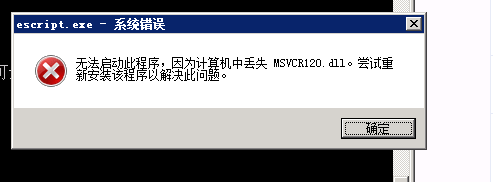

---
# 编写日期
date: 2020-02-20 12:44:32
# 作者 Github 名称
author: wivwiv
# 关键字
keywords:
# 描述
description:
# 分类
category:
# 引用
ref:
---

# 常见错误
## EMQ X 无法连接 MySQL 8.0

**标签:** [*MySQL*](tags.md#mysql)  [*认证*](tags.md#认证)


不同于以往版本，MySQL 8.0 对账号密码配置默认使用`caching_sha2_password`插件，需要将密码插件改成`mysql_native_password`

  + 修改 `mysql.user` 表

    ```
    ## 切换到 mysql 数据库
    mysql> use mysql;

    ## 查看 user 表

    mysql> select user, host, plugin from user;
    +------------------+-----------+-----------------------+
    | user             | host      | plugin                |
    +------------------+-----------+-----------------------+
    | root             | %         | caching_sha2_password |
    | mysql.infoschema | localhost | caching_sha2_password |
    | mysql.session    | localhost | caching_sha2_password |
    | mysql.sys        | localhost | caching_sha2_password |
    | root             | localhost | caching_sha2_password |
    +------------------+-----------+-----------------------+

    ## 修改密码插件
    mysql> ALTER USER 'your_username'@'your_host' IDENTIFIED WITH mysql_native_password BY 'your_password';
    Query OK, 0 rows affected (0.01 sec)

    ## 刷新
    mysql> FLUSH PRIVILEGES;
    Query OK, 0 rows affected (0.00 sec)
    ```

  + 修改 `my.conf`
    
    在 `my.cnf` 配置文件里面的 [mysqld] 下面加一行
    ```
    default_authentication_plugin=mysql_native_password
    ```

  + 重启 MySQL 即可


## OPENSSL 版本不正确

**标签:** [*启动失败*](tags.md#启动失败)

### 现象

执行  `./bin/emqx console` 输出的错误内容包含：

```bash
{application_start_failure,kernel,{{shutdown,{failed_to_start_child,kernel_safe_sup,{on_load_function_failed,crypto}}}, ..}
```

它表示，EMQ X 依赖的 Erlang/OTP 中的 `crypto` 应用启动失败。

### 解决方法

#### Linux

进入到 EMQ X 的安装目录（如果使用包管理工具安装 EMQ X，则应该进入与 EMQ X 的 `lib` 目录同级的位置）

```bash
## 安装包安装
$ cd emqx

## 包管理器安装，例如 yum。则它的 lib 目录应该在 /lib/emqx
$ cd /lib/emqx
```

查询 `crypto`依赖的 `.so` 动态库列表及其在内存中的地址：

``` bash
$ ldd lib/crypto-*/priv/lib/crypto.so

lib/crypto-4.6/priv/lib/crypto.so: /lib64/libcrypto.so.10: version `OPENSSL_1.1.1' not found (required by lib/crypto-4.6/priv/lib/crypto.so)
        linux-vdso.so.1 =>  (0x00007fff67bfc000)
        libcrypto.so.10 => /lib64/libcrypto.so.10 (0x00007fee749ca000)
        libc.so.6 => /lib64/libc.so.6 (0x00007fee74609000)
        libdl.so.2 => /lib64/libdl.so.2 (0x00007fee74404000)
        libz.so.1 => /lib64/libz.so.1 (0x00007fee741ee000)
        /lib64/ld-linux-x86-64.so.2 (0x00007fee74fe5000)

```

其中 `OPENSSL_1.1.1' not found`表明指定的 OPENSSL 版本的 `.so` 库未正确安装。

源码编译安装 OPENSSL 1.1.1，并将其 so 文件放置到可以被系统识别的路径：

```bash
## 下在最新版本 1.1.1
$ wget https://www.openssl.org/source/openssl-1.1.1c.tar.gz

## 上传至 ct-test-ha
$ scp openssl-1.1.1c.tar.gz ct-test-ha:~/

## 解压并编译安装
$ tar zxf   openssl-1.1.1c.tar.gz
$ cd openssl-1.1.1c
$ ./config
$ make test   		# 执行测试；如果输出 PASS 则继续
$ make install 

## 确保库的引用
$ ln -s /usr/local/lib64/libssl.so.1.1 /usr/lib64/libssl.so.1.1
$ ln -s /usr/local/lib64/libcrypto.so.1.1 /usr/lib64/libcrypto.so.1.1
```

完成后，执行在 EMQ X 的 lib 同级目录下执行 `ldd lib/crypto-*/priv/lib/crypto.so` ，检查是否已能正确识别。如果不在有 `not found` 的 `.so` 库，即可正常启动 EMQ X。


#### macOS

进入到 EMQ X 的安装目录：

```bash
## 安装包安装
$ cd emqx

## brew 安装
$ cd /usr/local/Cellar/emqx/<version>/
```

查询 `crypto`依赖的 `.so` 动态库列表：

```bash
$ otool -L lib/crypto-*/priv/lib/crypto.so

lib/crypto-4.4.2.1/priv/lib/crypto.so:
	/usr/local/opt/openssl@1.1/lib/libcrypto.1.1.dylib (compatibility version 1.1.0, current version 1.1.0)
	/usr/lib/libSystem.B.dylib (compatibility version 1.0.0, current version 1252.200.5)
```

检查其显示 OPENSSL 已成功安装至指定的目录：

```bash
$ ls /usr/local/opt/openssl@1.1/lib/libcrypto.1.1.dylib
ls: /usr/local/opt/openssl@1.1/lib/libcrypto.1.1.dylib: No such file or directory
```


若不存在该文件，则需安装与 `otool` 打印出来的对应的 OPENSSL  版本，例如此处显示的为 `openssl@1.1`：

```bash
$ brew install openssl@1.1
```

安装完成后，即可正常启动 EMQ X。

## Windows 缺失 MSVCR120.dll

**标签:** [*启动失败*](tags.md#启动失败)

### 现象

Windows 执行  `./bin/emqx console` 弹出错误窗口：

```bash
无法启动次程序，因为计算机中丢失 MSVCR120.dll。请尝试重新安装该程序以解决此问题。
```



### 解决方法

安装 [Microsoft Visual C++ RedistributablePackage](https://www.microsoft.com/en-us/download/search.aspx?q=redistributable+package.)
