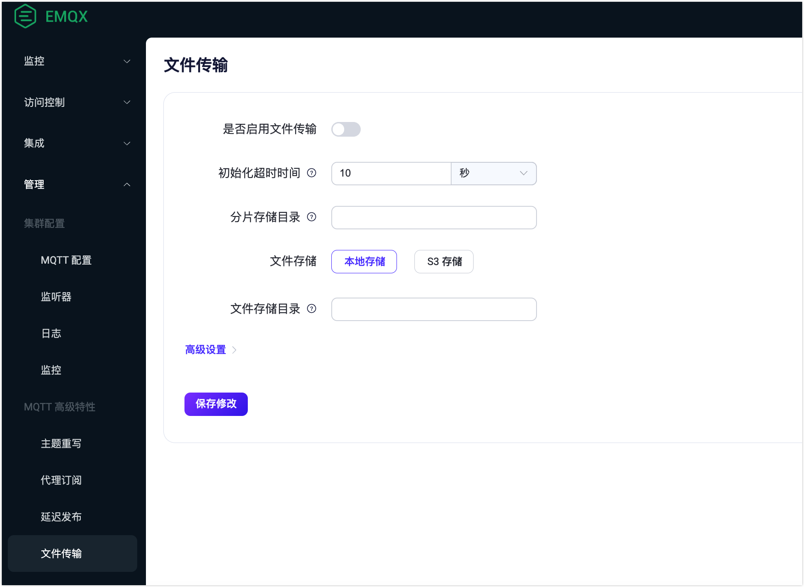

# 文件传输服务端配置

EMQX 默认情况下不启用 MQTT 文件传输功能。若您希望使用该功能，您需要在配置文件或 Dashboard 中进行设置。

本页主要介绍了如何启用 EMQX 中的文件传输功能并在 EMQX 服务端配置文件传输的各项功能，包括分片存储，在本地磁盘和 S3 存储桶中导出合并后的文件。同时还介绍了如何进行 MQTT 传输的配置以优化服务端对文件传输的操作。以下章节具体介绍了如何通过配置文件来进行配置操作：

- [启用文件传输](#启用文件传输)
- [配置分片存储](#配置分片存储)
- [配置文件导出](#配置文件导出)
- [配置 MQTT 传输](#配置-mqtt-传输)

您也可以通过 Dashboard 来启用和配置文件传输功能，详细内容参阅：[通过 Dashboard 启用和配置文件传输](#通过-dashboard-启用和配置文件传输)。

本页还介绍了如何通过 REST API 管理导出的文件。具体内容参阅：[管理导出的文件](#管理导出的文件)。

## 启用文件传输

在 EMQX 中，文件传输功能默认是关闭的，您需要在配置文件中启用该功能。

```bash
file_transfer {
  enable = true
}
```

添加此配置后，EMQX 会默认将分片文件存储在 `data/file_transfer/segments` 目录下，并启用本地磁盘导出功能，将合并后的文件导出到 `data/transfers/exports` 目录下。

如果您需要进一步配置文件传输功能，可以参考后续的配置说明。

## 配置分片存储

EMQX 支持客户端上传文件分片，并在接收到所有分片后将其合并为完整的文件。为了支持这一点，EMQX 需要暂存传输过程中的分片文件，并对其进行管理。

目前 EMQX 仅支持将分片文件存储到磁盘，您可以配置分片的存储位置。

文件完成上传后，分片将会被自动清理。对于超时未完成上传的文件，您也可以配置分片的有效期和定时清理时间，避免磁盘空间被占满。

```bash
file_transfer {
  # 启用文件传输功能
  enable = true

  # 分片存储配置
  storage.local.segments = {
    # 分片存储目录，建议优先设置到高 I/O 性能的磁盘上。
    root = "./data/file_transfer/segments"
    
    # 定时清理已过期的分片文件
    gc {
      # 清理间隔
      interval = "1h"

      # 分片存储最大有效期，达到有效期之后，即使分片未被合并也将被清除。
      # 客户端指定的有效期不得超过此值。
      maximum_segments_ttl = "24h"
    }
  }
}
```

您需要根据预期的文件大小、并发传输数量和可用磁盘空间设置合理的配置。

## 配置文件导出

在所有分片传输完成后，EMQX 支持合并分片为完整文件，并将完整文件文件导出到本地磁盘或 S3 存储桶，以便应用集成使用。

:::tip

不配置文件导出的情况下，默认导出到本地磁盘。EMQX 不支持同时配置两种导出方式，只能选择其中一种使用。

:::

### 文件导出到本地磁盘

使用以下配置示例会将合并后的完整文件保存在本地磁盘上，您可以配置导出文件的存储位置和有效期。

```bash
file_transfer {
  # 启用文件传输功能
  enable = true


  # 分片存储配置
  # ...

  # 启用本地磁盘文件导出
  storage.local.exporter.local {
    enable = true
    # 导出文件存储目录，建议优先设置到高 I/O 性能的磁盘上。
    root = "./data/transfers/exports"
  }
}
```

### 文件导出到 S3 存储桶

使用以下配置示例会将合并后的完整文件保存到 S3 存储桶中。

```bash
file_transfer {
  # 启用文件传输功能
  enable = true

  # 分片存储配置
  # ...

  # 启用 s3 存储桶文件导出
  storage.local.exporter.s3 {
    enable = true

    host = "s3.us-east-1.amazonaws.com"
    port = 443

    # 用于访问 S3 的凭证
    access_key_id = "AKIA27EZDDM9XLINWXFE"
    secret_access_key = "******"

    # 导出文件存储桶
    bucket = "my-bucket"

    # 共享 URL 过期时间
    # EMQX 会生成一个临时的共享 URL，用于客户端直接从 S3 中下载文件。此参数用于指定 EMQX 通过 API 返回的文件下载 URL 的过期时间，过期后 URL 将不可用，实际 S3 中文件仍然存在。
    #url_expire_time = "1h"

    # 用于与 S3 的底层 HTTP(S) 连接的设置，允许安全文件上传和连接池管理。
    transport_options {
      ssl.enable = true
      connect_timeout = 15s
    }
  }
}
```

## 配置 MQTT 传输

为了优化文件传输操作并防止客户端等待时间过长，我们可以为文件传输操作设置特定的超时时间，可以配置以下 MQTT 传输设置：

```bash
file_transfer {
  enable = true

  init_timeout = "10s"
  store_segment_timeout = "10s"
  assemble_timeout = "60s"
}
```

- `init_timeout`：初始化操作的超时时间。
- `store_segment_timeout`：文件分片存储超时时间。
- `assemble_timeout`：文件分片拼接超时时间。

如果这些操作中的任何一个超过了指定的超时时间，MQTT 客户端将收到带有 `RC_UNSPECIFIED_ERROR` 代码的 PUBACK 数据包。

## 通过 Dashboard 启用和配置文件传输

本节演示如何在 Dashboard 上启用文件传输并配置其功能。

转到 EMQX Dashboard 并点击 **管理** -> **文件传输**。在文件传输页面，您可以点击 **启用** 开关以启用文件传输功能。您可以参考[常规设置](#常规设置)和[高级设置](#高级设置)来配置功能。配置完成后，点击 **保存修改**。



### 常规设置

您可以配置以下常规设置：

- **初始化超时时间**：`init` 命令执行超时的最大时间。例如，如果系统过载且无法在此时间内处理 `init` 命令，则操作将超时。在这种情况下，将发送带有错误代码（0x80）的 PUBACK 消息以指示失败。默认值为 `10s`。
- **分片存储目录**：上传文件的临时分片存储的目录路径。选择绝对路径至关重要，最好位于具有高 I/O 性能的磁盘上。这样可以在高负载下有效处理文件分片。
- **文件存储**：选择文件的导出方法，选项包括 `本地存储`和 `S3 存储`。选择 `S3 存储`时，需要进行额外配置：
  - **地址**：S3 服务的端点。例如 `s3.us-east-1.amazonaws.com`。
  - **端口**：用于连接 S3 服务的端口，例如 `443`，表示安全的 HTTPS 连接。
  - **访问密钥 ID** 和 **访问密钥**：用于访问 S3 存储桶的凭据。应安全地保存。
  - **存储桶**：存储文件的 S3 存储桶的名称，例如 `my-bucket`。
  - **启用 TLS**：确定是否使用 TLS（传输层安全性）进行安全文件传输。有关更多信息，请参阅[启用 TLS 加密访问外部资源](../network/overview.md/#tls-for-external-resource-access)。
- **文件存储目录**：指定文件存储的目录，需要为绝对路径。当选择 `本地存储` 作为文件存储方法时，此目录用于存储已合并的文件。

### 高级设置

根据您在常规设置中配置的文件存储方法，可以配置不同的高级设置。

#### 本地存储

如果选择将文件导出到本地存储，您可以配置以下高级设置。

| 字段名称           | 描述                                                         | 推荐值    |
| ------------------ | ------------------------------------------------------------ | --------- |
| 分片存储超时时间   | 指定使用 `segment` 命令存储文件段的最大时间。如果超出此时间（例如，由于系统过载），将发送带有错误代码（0x80）的 PUBACK 消息，表示超时。 | `5` 分钟  |
| 文件拼接超时时间   | 定义允许 `fin` 命令完成文件拼接过程的最大持续时间。如果超时，则将发送带有错误代码（0x80）的 PUBACK 消息。此设置在系统资源受限导致文件拼接延迟的情况下至关重要。 | `5` 分钟  |
| 存储垃圾回收间隔   | 设置文件存储系统中运行存储垃圾收集过程的间隔。这个过程有助于通过删除不必要的数据来管理存储空间。 | `1` 小时  |
| 分片存储最大有效期 | 设置分片存储的最大生存时间（TTL）。超过此 TTL 的分片将自动清理，无论它们是否已合并成完整文件或在文件传输期间指定了更长的 TTL。 | `24` 小时 |
| 分片存储最小有效期 | 设置分片存储的最小生存时间（TTL）。即使它们已经合并成完整文件或在文件传输期间指定了更短的 TTL，段也不会在此 TTL 过期之前被删除。这确保了分片在任何后处理或冗余要求下至少可用最小持续时间。 | `5` 分钟  |

#### S3 存储

如果选择将文件导出到 S3 存储，除了与本地存储相同的设置外，还可以配置以下高级设置。

| 字段名称      | 描述                                                         | 推荐值   |
| ------------- | ------------------------------------------------------------ | -------- |
| URL 过期时间  | 确定生成的用于访问 S3 上上传文件的 URL 的有效期。一旦过期，URL 将无法再用于访问文件。 | -        |
| 最小分片大小  | 指定将文件分成多个分片上传到 S3 时每个分片的最小大小。较小的分片大小可以增加上传频率，但可能有助于在不稳定连接环境中处理大文件。 | `5 MB`   |
| 最大分片大小  | 定义多个分片上传到 S3 时每个分片的最大大小限制。更大的分片意味着更少的上传操作，这对于高带宽环境可能有效，但可能消耗更多内存。 | `5 MB`   |
| ACL           | 访问控制列表（ACL）指定上传到 S3 存储桶的对象的权限。不同的 ACL 选项提供不同级别的访问控制：<br />`private`：仅所有者具有完全访问权限。<br />`public_read`：所有人都有读取权限。<br />`public_read_write`：所有人都有读写权限。<br />`authenticated_read`：仅经过身份验证的用户具有读取权限。<br />`bucket_owner_read`：存储桶所有者具有读取权限。<br />`bucket_owner_full_control`：存储桶所有者具有完全控制权。 | -        |
| IPV6 探针     | 确定是否检查 IPv6 连接。如果您的网络支持 IPv6，则启用此选项可能有利，确保兼容性并可能提高性能。 | 启用     |
| 连接超时      | 允许建立到 S3 服务器的连接的最大时间。如果连接时间超过此持续时间，则超时。此设置确保来自服务器的及时响应。 | -        |
| 连接池类型    | 指定用于管理 S3 连接的连接池的类型：<br />`random`：随机选择连接。<br />`hash`：使用哈希函数选择连接。这个选择可能会影响连接到 S3 的性能和可靠性。 | `random` |
| 连接池大小    | 定义 S3 连接的连接池的大小。更大的池可以处理更多的并发连接，但消耗更多资源。 | `8`      |
| HTTP 管道     | 指定在不等待每个响应的情况下可以发送的 HTTP 请求数量。这可以提高吞吐量，但可能增加复杂性。 | `100`    |
| 请求头        | 允许为 S3 请求添加自定义请求头。这可以用于向 S3 服务传递额外信息或控制参数。点击 **添加** 来指定键值对。 | -        |
| 最大重试次数  | 指定在发送请求错误时 S3 请求的最大重试次数。增加此值可以提高可靠性，但可能导致潜在的延迟。 | -        |
| HTTP 请求超时 | 允许 S3 请求完成的最大时间。如果请求耗时更长，则会超时。     |          |

## 管理导出的文件

您可以对导出的文件进行管理，比如列出文件以浏览文件的详细信息、移动文件、删除文件或下载文件。您通过 REST API 进行这些管理操作，也可以进行手动管理。未来版本将添加 Dashboard 界面用于管理导出文件。

### 通过 REST API 管理导出文件

EMQX 提供了 REST API 用于管理导出的文件，您可以使用 [MQTT 文件传输管理 API](https://docs.emqx.com/zh/enterprise/v5.3/admin/api-docs.html#tag/File-Transfer) 进行管理，实现文件的浏览与下载。

### 手动管理磁盘导出文件

如果您需要直接在磁盘上管理导出的文件，例如进行移动、使用自建的 FTP 或 HTTP 服务下载，可以参考以下说明获取文件存储位置。

为了解决文件名冲突和单个目录下文件数量过多的问题，EMQX 在保存导出文件时，使用了分桶存储方案。该方案工作原理如下：

- 先计算出文件 ID 和客户端 ID 的 sha256 哈希值，比如：`ABCDEFG012345...`。
- 将文件存储在 6 级目录层次结构中，每一级定义如下：
  1. 哈希的前两个字节作为第一级目录名称；
  2. 接下来的两个字节作为第二级目录名称；
  3. 剩余的哈希作为第三级目录名称；
  4. 转义的客户端 ID;
  5. 转义的文件 ID;
  6. 元数据中的文件名作为最后一层。

例如，导出的文件会存储在这样的位置中：`AB/CD/EFGH.../{clientid}/{file_id}/{filename}`。

### 手动管理 S3 存储桶导出文件

对于 S3 存储桶，您可以使用 S3 客户端工具或 S3 提供的 REST API 进行管理，实现文件删除、下载等操作。您可以可以参考以下说明获取文件存储位置。

与本地导出使用的分桶存储方案不同，使用 S3 存储桶导出的文件使用更简单的 3 级层次结构存储：

1. 转义的客户端 ID;
2. 转义文件 ID;
3. 文件名。

例如，导出的文件会存储在这样的位置中：`{clientid}/{file_id}/{filename}`。

::: tip

更多关于使用 S3 客户端工具或 REST API 的操作，可以参考以下资源：

-  [Amazon S3](https://aws.amazon.com/cn/s3/) 以及其[用户指南](https://docs.aws.amazon.com/zh_cn/AmazonS3/latest/userguide/Welcome.html)
-  [MinIO 对象存储系统](https://min.io/)

:::
