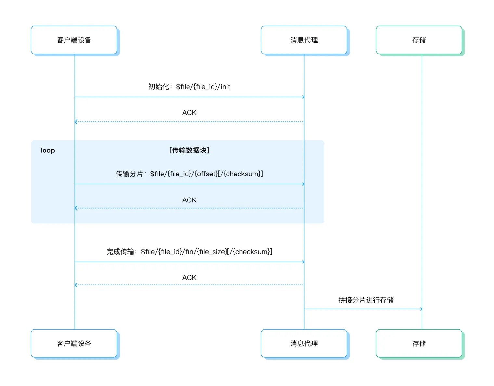

# 文件传输客户端开发

本页提供了从客户端角度对文件传输过程的概述，并提供了用于上传文件到 EMQX 的命令的详细信息，帮助您为客户端开发实现文件传输功能。

## 文件传输流程

在复用现有 MQTT 连接的情况下，客户端通过特定前缀的主题，发布预定的消息来控制文件传输会话。

客户端侧文件传输流程如下：

1. **传输前准备**：客户端设备选择要上传的文件，并生成一个唯一的`file_id`，用于标识传输会话。
2. **初始化文件传输**：客户端设备向 `$file/{file_id}/init` 主题发布 `init` 命令。消息内容为 JSON 格式，包含文件的元数据，例如文件名、大小和校验和。
3. **分片文件传输**：客户端通过连续发布消息到 `$file/{file_id}/{offset}[/{checksum}]` 主题来传输文件。消息内容为当前分片的文件数据块，可选的 `checksum` 字段为数据块的校验和。
4. **完成文件传输**：客户端向 `$file/{file_id}/fin/{file_size}[/{checksum}]` 主题发布 `fin` 命令，表示文件传输完成。消息内容为空，`file_size` 参数表示文件的总大小，而 `checksum`字段为整个文件的校验和。

每个步骤中传输命令详细介绍及注意事项请参照下文。



## 文件传输命令

文件传输命令是具有特定主题格式和消息内容的 MQTT 消息：

- **主题**：主题前缀包括 `$file/` 与 `$file-async/`，分别用于同步传输与异步传输，允许客户端在同一文件传输会话不同命令中混合使用。
  - **同步传输**：客户端需要等待 EMQX 确认命令的执行结果，然后才能继续执行后续操作。
  - **异步传输**：客户端不需要等待 EMQX 确认命令的执行，可以在一个命令发送后立即继续发送新的命令，能够加快速度。

- **QoS**：所有命令均以 QoS 1 消息等级发布，以确保可靠性。
- **消息体**：JSON 格式或包含数据块的消息体。

每个命令发布完成后，可以通过消息的 PUBACK 或响应主题来[获取命令执行结果](#获取命令执行结果)。

:::tip

1. 所有文件传输命令均不会发送到其他 MQTT 客户端，而是由 EMQX 代理处理。
2. 异步传输模式在 EMQX 企业版 v5.3.2 及之后版本中可用。
3. 对于 MQTT v3.1/v3.1.1 客户端，由于 PUBACK 原因代码（Reason Code）不可用，推荐使用异步传输模式。

:::

### init 命令

`init` 命令用于初始化文件传输会话。

- 主题：`$file/{file_id}/init` 或 `$file-async/{file_id}/init`

- 消息体：一个带有以下字段的 JSON 对象：

  ```json
  {
    "name": "{name}",
    "size": {size},
    "checksum": "{checksum}",
    "expire_at": {expire_at},
    "segments_ttl": {segments_ttl},
    "user_data": {user_data}
  }
  ```

| 字段           | 描述                                                                                                                                                 |
| -------------- | ---------------------------------------------------------------------------------------------------------------------------------------------------- |
| `file_id`      | 文件传输会话的唯一标识符。                                                                                                                           |
| `name`         | 文件名。如果与保留的文件名（例如“.”、“..”）冲突或包含特殊字符，将进行百分比编码。文件名的二进制长度不应超过 240 字节。                               |
| `size`         | 文件的大小。                                                                                                                                         |
| `checksum`     | 文件的 SHA256 校验和（可选），如果提供， EMQX 将验证文件的校验和。                                                                                   |
| `expire_at`    | 文件可能从存储中删除的时间戳（自纪元以来的秒数）。                                                                                                   |
| `segments_ttl` | 文件分片的有效期（单位：秒）。此值被限定在 `minimum_segments_ttl` 和 `maximum_segments_ttl` 参数设置的范围内。详见[分片存储](./broker.md#分片存储)。 |
| `user_data`    | 用于存储有关文件的其他信息及其元数据的任意 JSON 对象。                                                                                               |

在消息体中，唯一必需的字段是 `name`。

示例：

```json
{
  "name": "ml-logs-data.log",
  "size": 12345,
  "checksum": "1234567890abcdef1234567890abcdef1234567890abcdef1234567890abcdef",
  "expire_at": 1696659943,
  "segments_ttl": 600
}
```

### segment 命令

`segment` 命令用于上传文件的一个数据块。

- 主题：`$file/{file_id}/{offset}[/{checksum}]` 或 `$file-async/{file_id}/{offset}[/{checksum}]`

- 消息体：文件块的二进制数据。

| 字段       | 描述                                                         |
| ---------- | ------------------------------------------------------------ |
| `file_id`  | 文件传输会话的唯一标识符。                                   |
| `offset`   | 文件块应写入的起始偏移量（以字节为单位），从文件的开头计算。 |
| `checksum` | 可选，文件块的 SHA256 校验和。                               |

### fin 命令

`fin` 命令用于完成文件传输会话。

- 主题：`$file/{file_id}/fin/{file_size}[/{checksum}]` 或 `$file-async/{file_id}/fin/{file_size}[/{checksum}]`

- 消息体：空消息体。

| 字段        | 描述                                                                                           |
| ----------- | ---------------------------------------------------------------------------------------------- |
| `file_id`   | 文件传输会话的唯一标识符。                                                                     |
| `file_size` | 文件的总大小（以字节为单位）。                                                                 |
| `checksum`  | 可选，整个文件的 SHA256 校验和。如果指定此值，它将优先于 `init` 命令中提供的 `checksum` 字段。 |

在接收到 `fin` 命令后，EMQX 将验证是否已接收到组装文件所需的所有片段。如果文件成功导出并且其校验和有效，EMQX 将以成功的原因代码（Reason Code）进行响应。如果有任何错误，则发送适当的错误响应。

## 获取命令执行结果

命令执行结果通过 MQTT PUBACK 原因代码（Reason Code）标识：

- **同步传输**：PUBACK 原因代码表示最终的操作结果。
- **异步传输**：PUBACK 非零原因代码表示操作立即失败，零原因代码表示该命令已被接受进行处理，但操作结果将在处理完成后通过响应消息返回。

### PUBACK 原因代码

<!-- https://github.com/emqx/eip/blob/fbc379fc57957e0174760daee0277fcab74e4168/implemented/0021-transfer-files-over-mqtt.md#reason-codes-1 -->

| 原因代码 | MQTT 中的含义    | 文件传输中的含义                                                                                     |
| -------- | ---------------- | ---------------------------------------------------------------------------------------------------- |
| 空       |                  | 与 0x00 相同                                                                                         |
| 0x00     | 成功             | 文件块已成功持久化                                                                                   |
| 0x10     | 没有匹配的订阅者 | 服务器要求客户端重新传输所有文件块                                                                   |
| 0x80     | 未指定的错误     | 对于 `segment` 命令，服务器要求客户端重传当前文件块；对于 `fin` 命令，服务器要求客户端重传所有文件块 |
| 0x83     | 特定错误         | 服务器要求客户端取消传输                                                                             |
| 0x97     | 超出配额         | 服务器请求客户端暂停传输，客户端在尝试再次重新传输文件段之前应等待                                   |

### 响应消息

- 主题： `$file-response/{clientId}` ，其中 `clientId` 为客户端 ID。
- 消息：包含响应结果的 JSON 对象。

示例:

```json
{
  "vsn": "0.1",
  "topic": "$file-async/[COMMAND]",
  "packet_id": 1,
  "reason_code": 0,
  "reason_description": "success"
}
```

| 字段                 | 描述                                                             |
| -------------------- | ---------------------------------------------------------------- |
| `vsn`                | 响应消息格式版本                                                 |
| `topic`              | 响应的命令主题，例如 `$file-async/somefileid/init`               |
| `packet_id`          | 响应的命令消息 MQTT 消息 ID                                      |
| `reason_code`        | 命令的执行结果代码。详细信息请参阅[原因代码](#PUBACK-原因代码) |
| `reason_description` | 命令的执行结果描述                                               |

无论同步还是异步操作，客户端均可以通过 `$file-response/{clientId}` 主题获得命令的实际操作结果。

## 注意事项

1. 如果在文件传输过程中客户端断开连接，或需要中断传输以进行更高优先级的消息传递，只需在文件传输恢复后重新发送未确认的数据块或命令，即可恢复文件传输。这种方式可以避免重新传输整个文件，提高传输效率。
2. 由于 EMQX 需要从接收到的文件分片中组装文件并将其导出到配置的存储中，`fin` 命令可能需要较长时间进行处理。在此期间，客户端可以在等待 `fin` 命令完成时继续发送其他命令。如果在 `fin` 命令期间发生断开连接，客户端可以简单地重新发送命令以恢复文件传输。如果文件传输已经完成，EMQX 将立即回复传输成功。

## 客户端代码示例

以下是不同语言和客户端库的文件传输客户端代码示例：

- [C - Paho](https://github.com/emqx/MQTT-Client-Examples/blob/master/mqtt-client-C-paho/emqx_file_transfer.c)
- [Python3 - Paho](https://github.com/emqx/MQTT-Client-Examples/blob/master/mqtt-client-Python3/file_transfer.py)
- [Java - Paho](https://github.com/emqx/MQTT-Client-Examples/blob/master/mqtt-client-Java/src/main/java/io/emqx/mqtt/MqttFileTransferSample.java)
- [Golang - Paho](https://github.com/emqx/MQTT-Client-Examples/pull/110/files#diff-ea542153b4dd7109626626beff78b699ed649f9a7c05af362e5d67cce0866a94)
- [Node.js - MQTT.js](https://github.com/emqx/MQTT-Client-Examples/blob/master/mqtt-client-Node.js/emqx-file-transfer.js)
