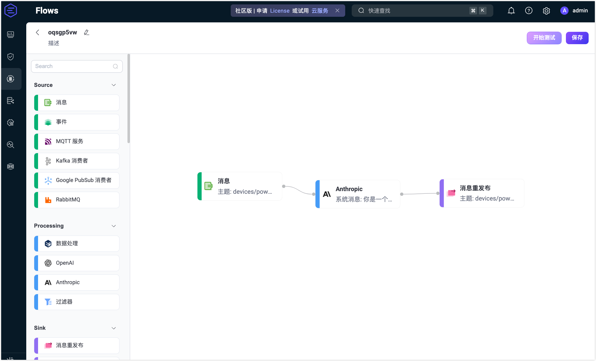
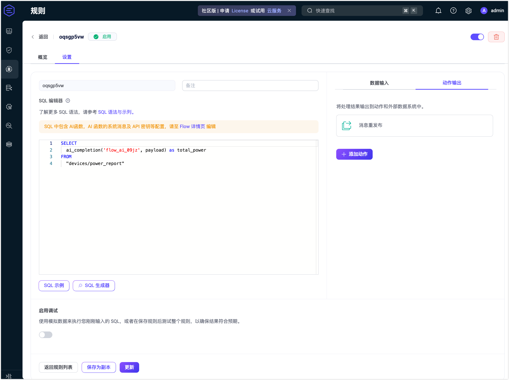
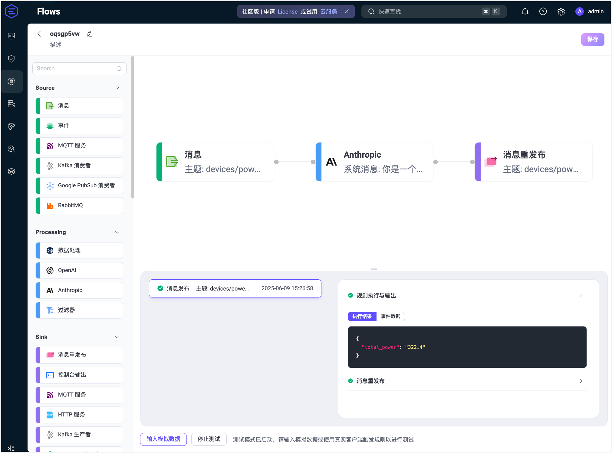
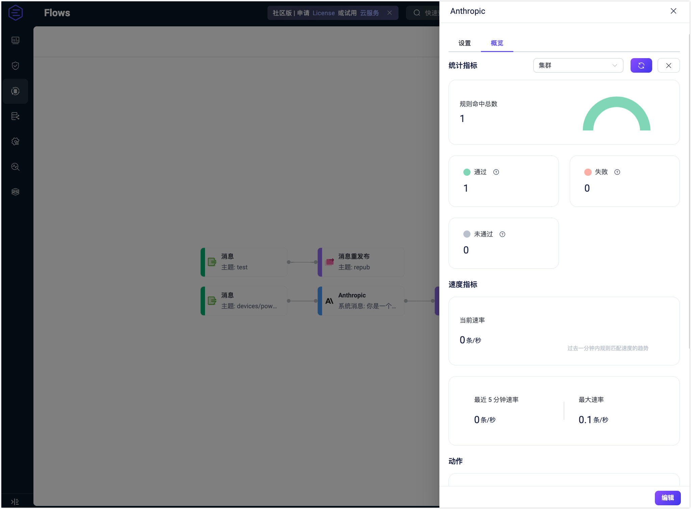

# 快速开始：使用 Anthropic 节点创建 Flow

本页面展示如何使用 Claude 3 Sonnet 模型，对接收到的遥测数据进行数值聚合处理。该示例模拟一个真实场景，在智能工厂或楼宇等物联网系统中，设备通过 MQTT 发送状态消息，系统需要对这些数据进行自动化、智能化的处理。

## 场景描述

在许多工业或智能楼宇应用中，IoT 设备会在一条 MQTT 消息中同时上报多个指标。例如，一个电力监测设备可能会一次性上报多个回路的电力数据。

每条消息发布到主题 `devices/power_report`，其字段包括：

- `device_id`：设备唯一标识
- 多个数值型字段，例如 `circuit_1`、`circuit_2`、`circuit_3` 等
- 其他非数值字段，如 `status` 或 `timestamp`

目标是使用 LLM（Claude 3 Sonnet）对消息中的所有数值字段进行求和（即各个回路的总耗电量），并将结果以数值形式转发到下游用于计费或存储处理。

**示例消息**

```json
{
  "device_id": "pmu-1008",
  "circuit_1": 120.5,
  "circuit_2": 98.7,
  "circuit_3": 103.2,
  "status": "nominal",
  "timestamp": "2025-06-06T10:00:00Z"
}
```

**预期输出（由 Claude 模型生成）**

```
322.4
```

即所有回路电量字段的总和。

## 创建 Flow

::: tip 前置条件

请确保你拥有有效的 **Anthropic API Key**，并设置正确的 API 版本（如 `2023-06-01`）。

:::

1. 在 **Flows** 页面点击 **Create Flow** 创建新的流程。

2. 添加**消息**节点：

   - 从左侧 Source 区域拖拽一个**消息**节点到画布中。
   - 设置订阅主题为 `devices/power_report`。
   - 点击**保存**。

3. 添加 **Anthropic** 节点：

   - 从 Processing 区域拖拽一个 **Anthropic** 节点并连接到上一步的消息节点。

   - 配置节点如下：

     - **输入**：填入 `payload`。

     - **系统消息**：输入如下提示词：

       ```
       You are a power consumption calculator. Given an input JSON object with various keys, sum all numeric values (e.g., circuit readings) and return only the total.
       ```
       
     - **模型**：选择 `claude-3-sonnet-20240620`。
     
     - **Max Tokens**：输入 `50`。

     - **Anthropic Version**：输入 `2023-06-01`。

     - **API 密钥**：输入你的 Anthropic API 密钥。

     - **基础 URL**：留空（使用默认地址）。

     - **输出结果别名**：输入 `total_power`。

   - 点击**保存**以保存节点配置。

4. 添加**消息重发布**节点：

   - 从 Sink 区域拖拽一个**消息重发布**节点，并连接到 Anthropic 节点。
   - 设置目标主题为 `devices/power_total`。
   - 设置 Payload 为 `${total_power}`。
   - 点击**保存**。

5. 点击右上角的**保存**按钮保存整个 Flow。

   

6. Flow 和表单规则是互通的。你也可以在 Rule 页面中查看对应的 SQL 和规则配置。

   

## 测试 Flow

1. 使用 MQTT 客户端连接到 EMQX。

   你可以使用 Dashboard 的 **诊断工具** -> **WebSocket 客户端**模拟 MQTT 客户端，也可以使用 [MQTTX](https://mqttx.app/zh) 或实际 MQTT 客户端：

   - 连接至 EMQX 服务端。
   - 订阅主题 `devices/power_total`。

2. 开始测试：

   - 在 Flow 设计器中点击任意节点，打开编辑面板。

   - 点击**编辑**，然后点击**开始测试**打开底部测试面板。

   - 点击**输入模拟数据**，设置消息主题为`devices/power_report`，在 **Payload** 中输入以下测试消息，然后点击**提交测试**发布到：

     ```json
     {
       "device_id": "pmu-1008",
       "circuit_1": 120.5,
       "circuit_2": 98.7,
       "circuit_3": 103.2,
       "status": "nominal",
       "timestamp": "2025-06-06T10:00:00Z"
     }
     ```
   
3. 查看结果和节点运行指标：

   - 你将看到 Flow 成功执行并产出结果。

     

   - 回到 **WebSocket 客户端** 页面，你应能收到类似以下的 AI 输出结果：

     > 322.4

   - 若测试失败，页面会显示对应错误信息。

   - 若需查看该 **Anthropic** 节点的运行统计，在 Flows 页面中点击节点，在弹出的编辑面板中点击**概览**选项卡。

     