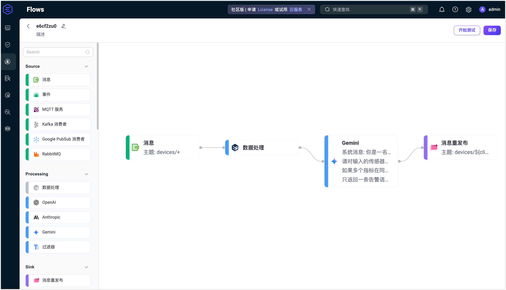
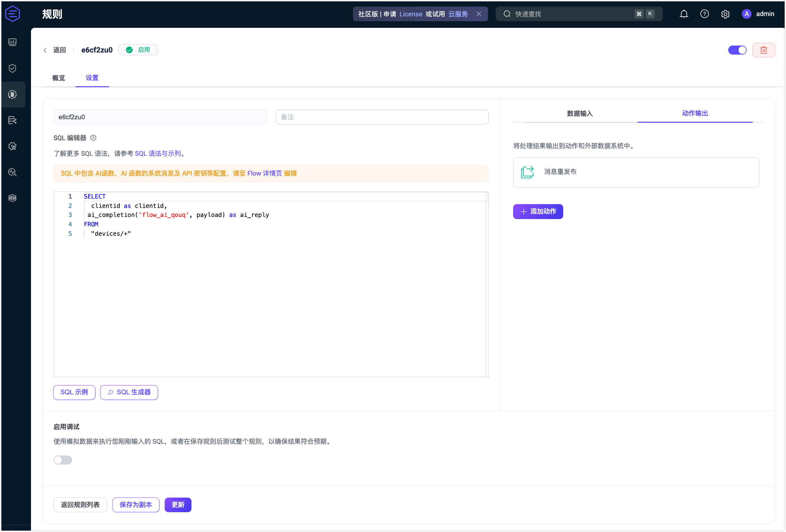
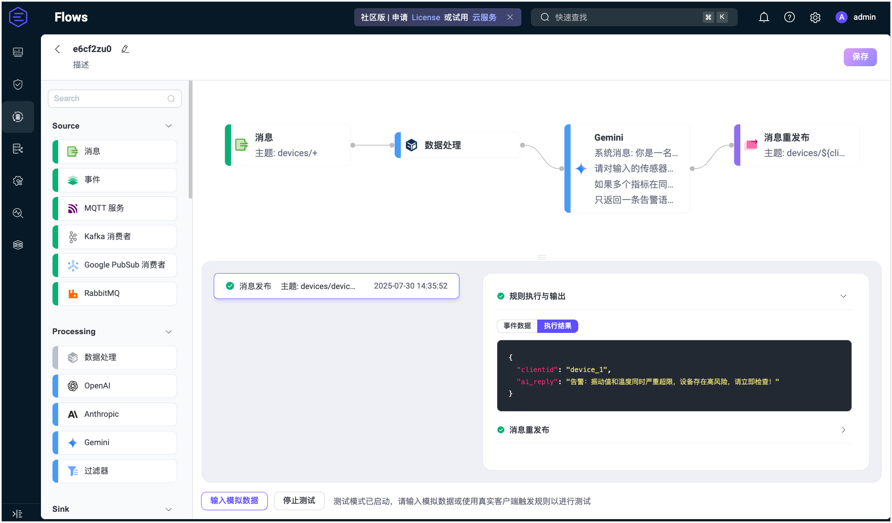
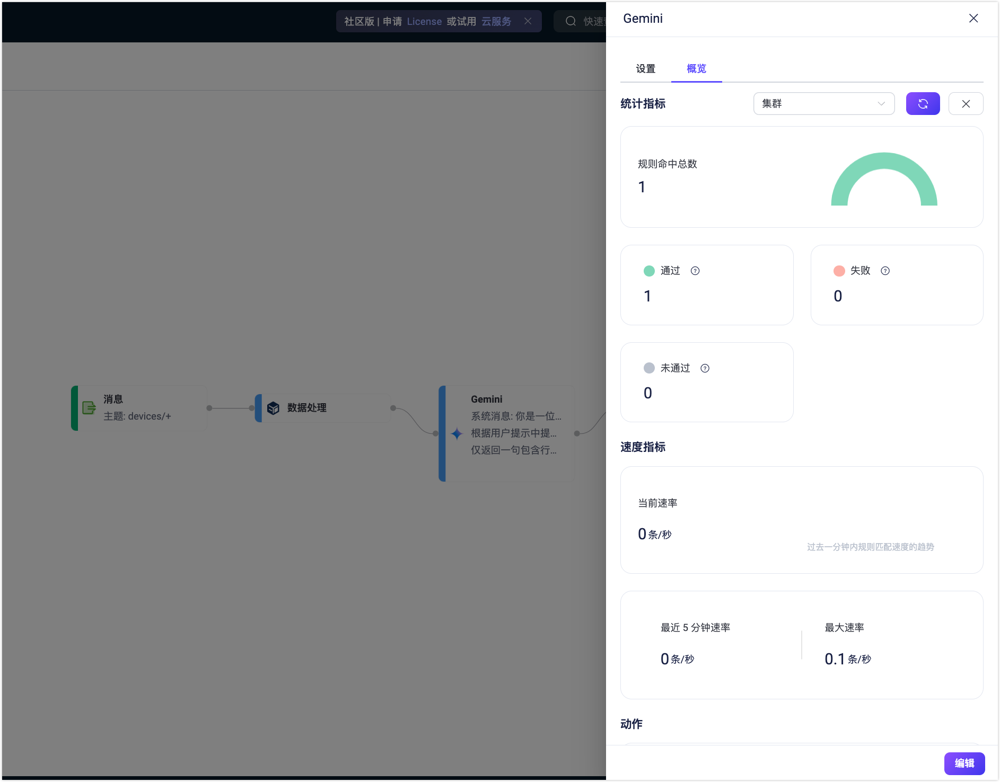

# 快速开始：使用 Gemini 节点创建 Flow

本页演示如何通过一个实际用例，在 Flow 设计器中快速创建并测试一个使用 Gemini 节点进行数据处理的 Flow。

此示例展示了如何构建一个 Flow，集成 Gemini LLM 用于处理包含结构化传感器数据的 MQTT 设备消息，同时保留 `clientid` 用于后续消息路由。Gemini 节点根据消息 payload 内容生成智能回复，Republish 节点将 AI 结果发送至每个设备专属主题  `devices/${clientid}/reply`，确保每台设备都能收到定制化响应。

## 场景描述

在工业监测场景中，每台设备会定期将结构化的传感器数据（JSON 格式）发布至主题 `devices/<device_id>`。传统的基于阈值的告警（例如温度超标）可能会遗漏潜在的模式或多项异常组合。

该 Flow 利用 Gemini 对多个字段（如振动、温度、压力）进行整体分析，从而检测出可能存在的复杂异常，例如机械故障风险。比如，当振动与温度同时升高时，Gemini 可推断出更严重的风险（如轴承过载），并输出精确可解释的告警信息。

- **数据处理**：提取负载中的设备读数，并暴露 `clientid`（如 `device_1`）供下游节点使用。
- **LLM 处理**：将完整的消息 payload 发送至 Gemini，进行跨字段的综合分析。
- **消息重发布**：将 AI 生成的告警信息发布至每个设备专属的主题 `devices/<device_id>/reply`。

**示例消息（发布到 `devices/device_1`）：**

```json
{
  "振动值": 9.5,
  "温度": 85,
  "压力": 1.2
}
```

**期望输出（由 LLM 生成，发布到 `devices/device_1/reply`）：**

```
紧急告警：检测到剧烈振动与高温并发，表明设备存在严重故障风险。
```

## 创建流程

::: tip 前置条件

确保您拥有有效的 Gemini API 密钥。

:::

1. 点击 **Flows** 页面上的 **创建 Flow** 按钮。

2. 添加一个**消息**节点：

    - 从左侧面板的 **Source** 区域拖拽一个**消息**节点。
    - 设置订阅主题为 `devices/+`。
    - 点击**保存**。

3. 添加一个 **Processing** 节点：

   - 从 **Processing** 区域拖拽一个**数据处理**节点。
   - 在表单中填写以下配置。此设置会将 `clientid` 暴露出来，以便在后续节点中使用（例如在重发布主题中使用 `${clientid}`）。
     - **字段**：`clientid`
     - **转换**：留空
     - **别名**：`clientid`
   - 点击**保存**。

4. 添加一个 **Gemini** 节点：

   - 从 **Processing** 区域拖拽一个 **Gemini** 节点。

   - 配置节点参数如下：

     - **输入**：填写 `payload`。

     - **系统消息**：填写以下提示消息：

       ```
       你是一名工业异常检测助手。
       请对输入的传感器数据（振动、温度、压力）进行整体分析。
       如果多个指标在同一条读数中同时超过风险阈值（例如振动值 > 8 且温度 > 80），其综合风险远高于单一指标异常。在这种情况下，请生成一条精准的告警信息。
       只返回一条告警语句，不要添加额外说明。
       ```

     - **模型**：保持默认的 `gemini-2.0-flash`。

     - **API 密钥**：填写你的 Gemini API 密钥。

     - **基础 URL**：留空以使用默认端点。

     - **输出结果别名**：`ai_reply`。

   - 点击**保存**。

5. 添加一个**消息重发布**节点：

   - 从 **Sink** 区域拖拽一个**消息重发布**节点。
   - 设置**主题**为：`devices/${clientid}/reply`。
   - 设置 **Payload** 为：`${ai_reply}`。
   - 点击**保存**。

6. 将所有节点连接，然后点击页面右上角**保存**，完成 Flow 创建。

   

   Flow 与规则引擎的表单规则兼容，也可以在规则页面中查看对应的 SQL 和配置。

   

## 测试 Flow

1. 使用 MQTT 客户端连接至 EMQX。

   你可以使用 Dashboard 中的**诊断工具 -> WebSocket 客户端**模拟发布者，也可以使用 [MQTTX](https://mqttx.app/zh) 或真实设备：

   - 连接至 EMQX；
   - 订阅主题 `devices/device_1/reply`。

2. 启动测试：

   - 在 Flow 设计器中点击任意节点打开编辑面板。

   - 点击**编辑**，再点击**开始测试**，底部将出现测试窗口。

   - 点击**输入模拟数据**，并发布如下消息至主题 `devices/device_1`：

     ```json
     {
       "振动值": 9.5,
       "温度": 85,
       "压力": 1.2
     }
     ```

3. 查看测试结果：

   - 若流程执行成功，将显示响应内容：

     

   - 返回 WebSocket 客户端页面，可收到类似以下内容：

     > "高风险告警：振动值和温度同时超阀值，设备状态异常，请立即检查。"

   - 若测试失败，系统会提示错误原因。

   - 若需查看该 **Gemini** 节点的运行统计，退出编辑页面，在创建 Flow 页面中点击节点，在弹出的编辑面板中点击**概览**选项卡。

     