# Flow 设计器

::: tip Note

Flow 设计器是 EMQX 企业版功能。

:::

Flow 设计器是强大的可视化工具，在早期版本的可视化查看工具 Flows 的基础上增加了创建和编辑数据处理流程 (Flow) 的能力，使数据处理和集成的配置变得更加简单和高效。从 EMQX v5.8.0 开始，您还可以对创建的数据处理流程进行测试。

在 Flow 中创建的规则和表单规则是互通的，也就是说可以使用 Flow 创建一个规则，在规则页面里查看规则 SQL 和相关配置，也可以在表单 SQL 编辑器里实现规则，然后在 Flow 中查看到规则的数据流处理相关配置。


## 主要功能

在 EMQX Dashboard 左侧菜单中点击**集成** -> **Flow 设计器**可以进入 Flows 页面。如果您已经创建了规则或数据集成，您可以看到由多个节点组成的有向无环图，每个节点代表一个数据处理步骤。

Flows 页面展示了通过规则引擎、Webhook 以及 Flow 设计器创建的所有数据处理流程。创建好的 Flow 能够直观得描述客户端消息与事件的处理流程，包括数据来源、数据处理与过滤、数据流出三个流程，例如从某个主题，事件或 Source 中读取数据、通过规则转换数据，再使用动作或 Sink 转发数据等。通过 Flows，您可以清晰地看到数据流向，即数据如何从设备或客户端经过规则处理后流向外部数据系统的数据流向，或者从外部数据系统经过规则处理后流向设备的数据流向。当有规则和数据集成发生变化时，刷新该页面就能看到最新的状态。

点击右上角的**创建**按钮，可进入 Flow 创建页面进行可视化配置。通过拖拽的方式选择每个步骤所需的节点，并将节点连线即可实现流程处理。


### Source

数据的输入，支持消息、事件，或者外部数据系统流入的消息。Flow 中至少包含一个 Source 节点，同一个 Flow 中可以同时支持多个数据输入节点，目前支持的 Source 如下：

- **消息**：通过主题与主题通配符指定客户端发布的消息来源。
- **事件**：支持 EMQX 内的所有客户端事件，参考[客户端事件](../data-integration/rule-sql-events-and-fields.md#客户端事件)。
- **外部数据系统**：
  - [MQTT 服务](../data-integration/data-bridge-mqtt.md)
  - [Kafka 消费者](../data-integration/data-bridge-kafka.md)
  - [GCP PubSub 消费者](../data-integration/data-bridge-gcp-pubsub.md)
  - [RabbitMQ](../data-integration/data-bridge-rabbitmq.md)

### Processing

使用函数与过滤器节点来进行数据的处理和过滤。该步骤是可选的，同一个 Flow 至多支持一个函数以及一个过滤器节点：

- **数据处理**：支持所有规则引擎[内置函数](../data-integration/rule-sql-builtin-functions.md)。
- **过滤器**：支持对来自 Source 中的数据字段进行比较过滤，支持的比较操作有 `>, <, <=, >=, <>, !=, =, =~`。

除了可视化的表单编辑外，Processing 节点还支持切换到表达式模式，使用规则 SQL 中的语法进行编辑。过滤器节点只能连接在函数之后，即要求先进行处理、再过滤数据。

### Sink

将数据来源以及处理结果输出到特定节点和外部数据系统中。同一个 Flow 中至少包含一个 Sink 节点，支持的 Sink 节点如下：

- **消息重发布**：将消息发布到本地指定的 MQTT 主题中。
- **控制台输出**：将消息打印到日志中，用于调试输出。
- **外部数据系统**：支持 40 余种数据系统，例如 MySQL，Kafka，具体参考[数据集成](../data-integration/data-bridges.md)。

### Flow 编辑和测试

Flow 创建时系统将随机产生一个编号，点击编号旁边的编辑图标可以修改 Flow 的名称和描述。

将鼠标移动到 Flow 中的节点上，点击节点右上角的叉便可以删除该节点。点击节点可以进入编辑模式，您可以修改此节点中配置的信息并保存修改，最后点击**保存**以保存整个 Flow。点击**开始测试**按钮可以输入模拟数据或通过真实客户端测试 Flow 是否能正确执行。

## 特性与优势

Flow 设计器是一个功能丰富且易于使用的工具，有助于用户更加高效地处理和集成数据，推动业务创新，并提高数据管理的可视性和控制性。其主要特点和优势包括：

- **直观的可视化界面：** 用户可以利用直观的拖拽和连接功能，轻松创建、调整和定制数据处理流程，即使没有编程经验的用户也可以快速上手，设计复杂的数据集成逻辑。
- **快速实时处理：** 用户能够在几分钟内建立消息和事件的实时处理流程，有助于企业更迅速地响应不断涌现的数据和事件，支持实时业务需求。
- **广泛的集成能力：** 支持与超过 40 种数据系统无缝集成，为用户提供了灵活的数据连接和交换选项。
- **一体化管理和监控：** 用户可以通过统一的视图清晰地管理整个数据集成流程，了解每个处理节点的状态和性能，有助于实时监控和追踪数据流，以确保数据的高可靠性和完整性。
- **EMQX 数据处理能力：** Flow 设计器底层利用规则 SQL 和 Sink/Source，继承了 EMQX 强大的数据处理和性能优势。用户可以根据需要在 UI 和 SQL 编辑器之间自由切换，从而在保留 SQL 编辑的灵活性的同时，提供了更简单、更快速的上手体验。这意味着用户无需深入学习 EMQX 规则 SQL 语法，也能够利用其强大的数据处理功能，实现业务创新和数据驱动决策。

## 快速体验

本节通过一个使用场景为您演示如何在 Flow 设计器中快速创建一个 Flow，并对创建的 Flow 进行测试。

该演示将创建一个数据处理流程用于接收设备温度过高的告警，通过 MQTT 主题接收设备温湿度传感器数据，设置数据过滤和转换规则，并在温度超过 40°C 时重发布告警信息到新主题 `alert`。最后，通过测试验证规则的有效性以及数据处理的结果。

### 场景描述

假设有一个设备里面包含温湿度传感器，每隔 5 秒发送一次数据到 MQTT 主题 `sensor/temperature`。EMQX 规则引擎将处理这些数据，步骤包括：

1. 数据过滤：只处理温度大于 40°C 的数据。
2. 数据转换：
   - 提取设备 ID。
   - 提取温度信息。
   - 使用内置函数将 payload 中的时间戳信息转换为日期。
3. 消息重发布：将处理后的数据整理为一条告警信息发布到新的主题 `alert`。

重发布的数据样例：

```json
{
  "device_id": "device123",
  "temperature": 22.5,
  "humidity": 60
}
```

### 创建 Flow

1. 点击 Flows 页面上的**创建 Flow** 按钮。

2. 从数据输入（**Source**） 中拖动一个**消息**节点到画布上，并配置一个消息源主题，例如 `sensor/temperature`，然后点击**保存**。这一步通过主题指定客户端发布的消息来源。

   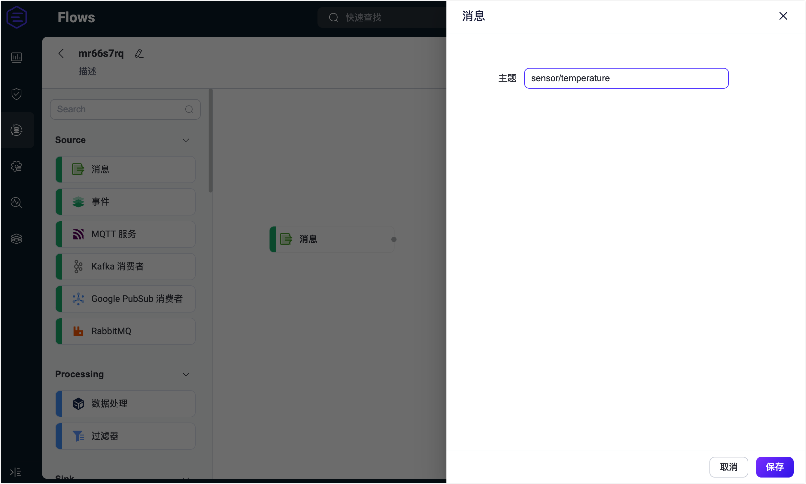

3. 从数据处理 （**Processing**） 中拖动一个`数据处理`节点到画布上，并配置数据处理规则，从消息中提取以下字段：

   - `payload.device_id`：设置别名为 `device_id`。
   - `payload.temperature`：设置别名为 `temperature`。
   - `timestamp`：使用 `format_date` 函数将发布过来的消息时间戳数值转换为可读的日期时间格式。设置别名为 `date`。
     - `Time Unit`：选择 `milisecond`。
     - `Time Offset`：输入 `+08:00`。
     - `Data Format`：输入 `%Y-%m-%d %H:%M:%S.%6N%z`。参考[日期与时间转换函数](../data-integration/rule-sql-builtin-functions.md#format-date-unit-string-offset-string-integer-formatstring-string-time-integer-string)。
     - `Timestamp`：输入 `timestamp`。

   完成后点击**保存**。

   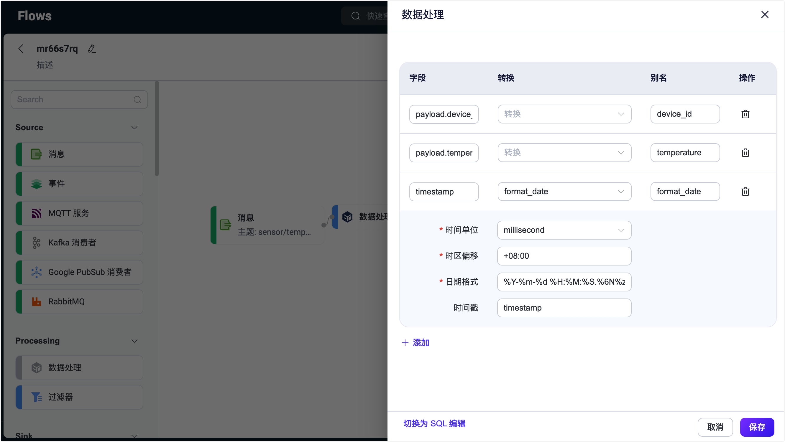

4. 从 **Processing** 中再拖动一个**过滤器**节点，并配置一个过滤条件以实现一个数据过滤规则。添加一个过滤项并输入 `payload.temperature`，选择操作符 `>=`，输入 `40`，然后点击**保存**。

   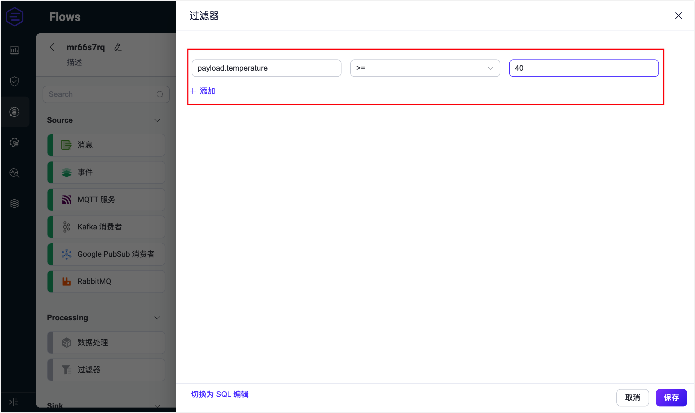

5. 从数据输出（**Sink**）中选择一个**消息重发布**节点，并配置转发消息的主题，这里设置为 `alert`。通过设置以下 payload 将处理和转换后的数据整理为一条告警信息：

   ```bash
   ${device_id} device reported a high temperature of ${temperature}°C at ${date}.
   ```

   点击**保存**。

   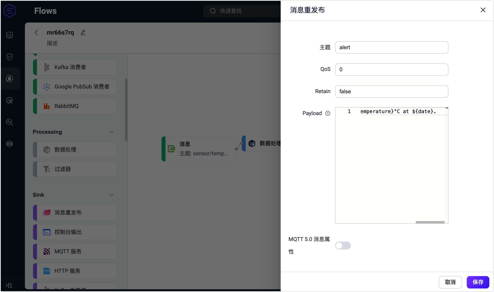

6. 您可以在页面上看到新建的 Flow。击页面右上角的**保存**以保存 Flow。

   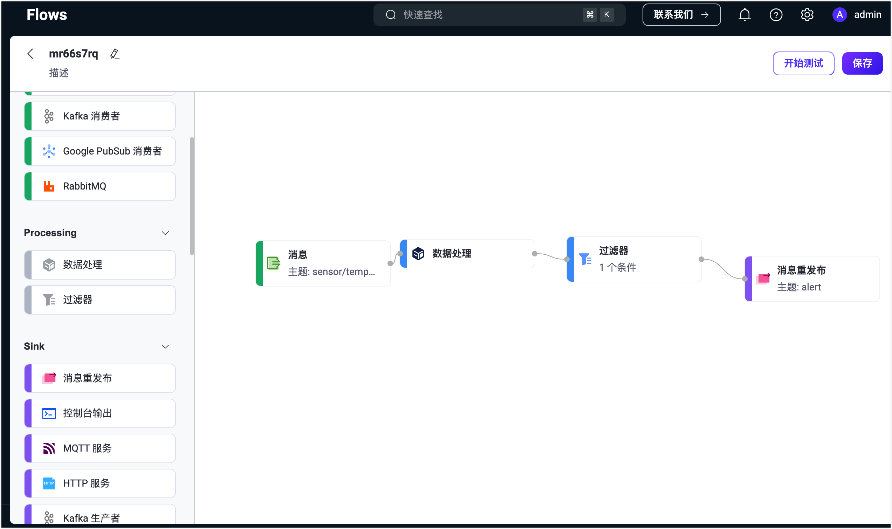

   Flow 和表单规则是互通的，您也可以在规则页面里查看刚才创建的规则 SQL 和相关配置。

   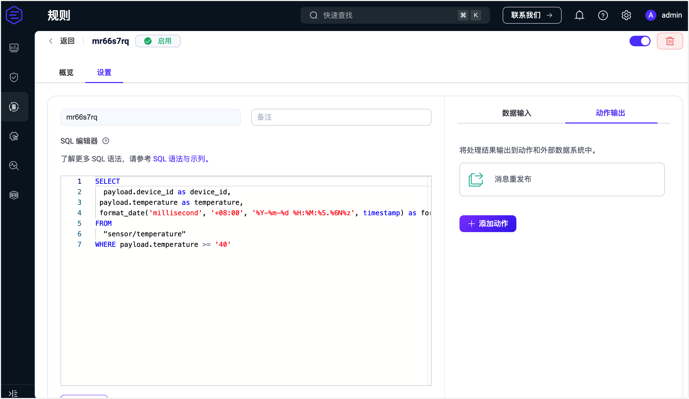

### 测试 Flow

1. 创建完成后，点击**保存**按钮旁的**开始测试**，将出现一个底部弹出框。

   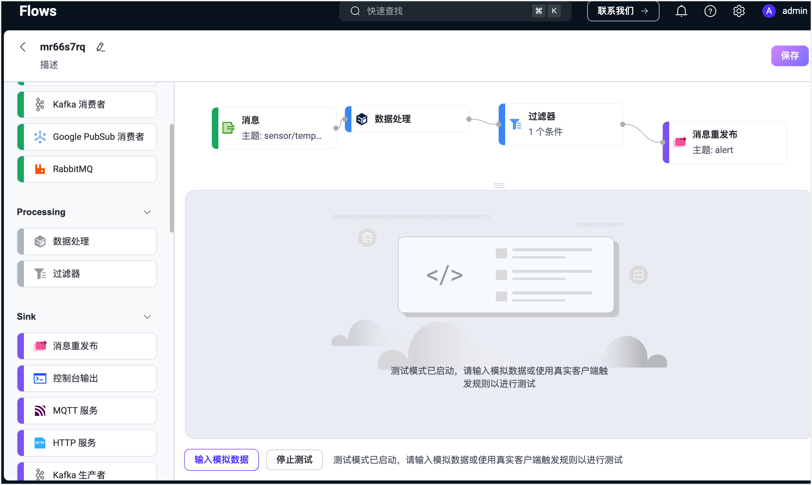

2. 点击**输入模拟数据**。您可以在弹出的页面中输入模拟数据，也可以直接使用一个真实的客户端发布消息来查看结果。该演示将使用 [MQTTX](https://mqttx.app/zh)，发布一条真实数据。

3. 先发送一个低于 40 度的消息。可以看到消息没有达到条件，规则 SQL 没有执行结果。

   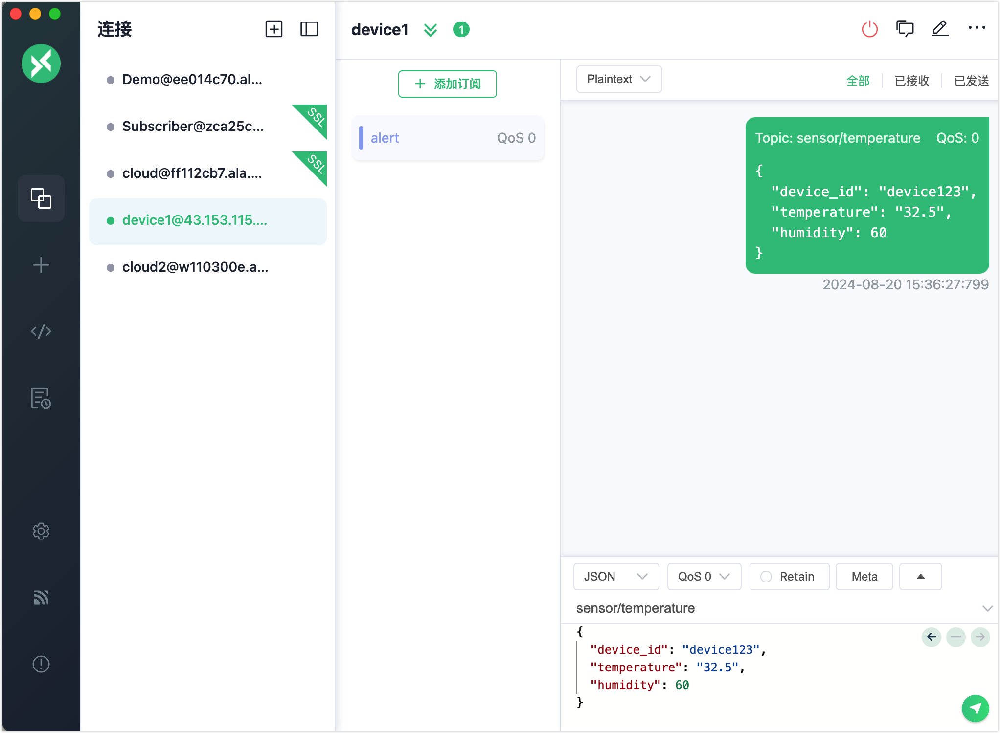

4. 再发布一条温度大于 40 度的消息。可以看到 `alert` 主题接收到了告警信息。

   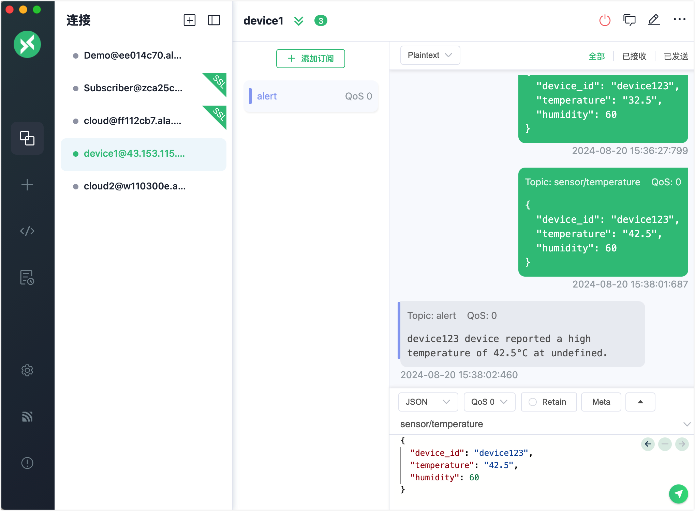

5. 回到测试页面，同样可以查看到测试结果成功。

   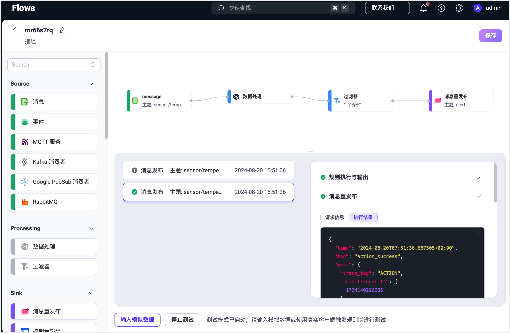

   如果测试结果失败，有错误信息，也会显示到对应的测试结果中。

   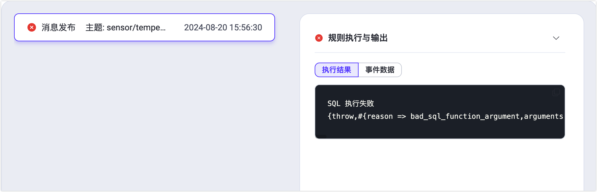
