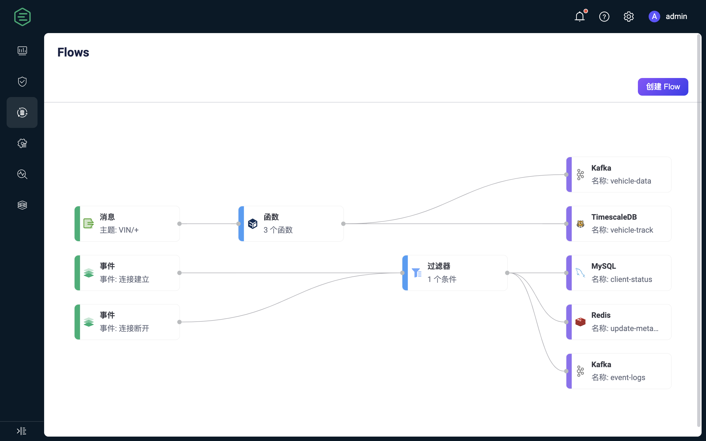
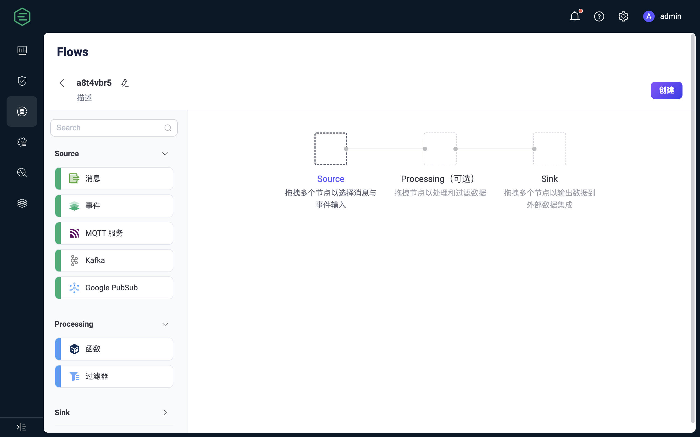

# Flow 设计器

Flow 设计器是强大的可视化工具，它基于早些版本的可视化查看工具 Flows，增加了创建和编辑的能力，旨在使数据处理和集成的配置变得更加简单和高效。

## 特性

Flow 设计器是一个功能丰富且易于使用的工具，有助于用户更加高效地处理和集成数据，推动业务创新，并提高数据管理的可视性和控制性。其主要特点和优势包括：

- **直观的可视化界面：** 用户可以利用直观的拖拽和连接功能，轻松创建、调整和定制数据处理流程。这意味着即使没有编程经验的用户也可以快速上手，设计复杂的数据集成逻辑。
- **快速实时处理：** Flow 设计器使用户能够在几分钟内建立消息和事件的实时处理流程。这有助于企业更迅速地响应不断涌现的数据和事件，支持实时业务需求。
- **广泛的集成能力：** 支持与超过 40 种数据系统无缝集成，为用户提供了灵活的数据连接和交换选项。无论您的数据位于哪个系统中，Flow 设计器都能够帮助您实现集成。
- **一体化管理和监控：** 用户可以通过统一的视图清晰地管理整个数据集成流程，了解每个处理节点的状态和性能。这有助于实时监控和追踪数据流，以确保数据的高可靠性和完整性。
- **EMQX 数据处理能力：** Flow 设计器底层利用规则 SQL 和数据桥接，继承了 EMQX 强大的数据处理和性能优势。用户可以根据需要在 UI 和 SQL 编辑器之间自由切换，从而在保留 SQL 编辑的灵活性的同时，提供了更简单、更快速的上手体验。这意味着用户无需深入学习 EMQX 规则 SQL 语法，也能够利用其强大的数据处理功能，实现业务创新和数据驱动决策。

总之，它是物联网应用开发中不可或缺的组成部分，支持各种数据处理和数据交换快速配置需求。

## 开始使用

Flow 设计器位于 Dashboard **数据集成** 菜单下，该页面包含了来自规则引擎、Webhook 以及 Flow 设计器创建的所有数据处理流程。

Flow 描述了客户端消息与事件的处理流程，它包含数据来源、数据处理与过滤、数据流出三个流程。点击 **创建** 按钮后，可进入 Flow 创建页面进行可视化配置。通过拖拽的方式选择每个步骤所需的节点，并将节点连线即可实现流程处理。

### Source

数据的输入，支持消息、事件，或者外部数据系统流入的消息。Flow 中至少包含一个 Source 节点，同一个 Flow 中可以同时支持多个数据输入节点，目前支持的 Source 如下：

- **消息**：通过主题与主题通配符指定客户端发布的消息来源
- **事件**：支持 EMQX 内的所有客户端事件，参考 [客户端事件](../data-integration/rule-sql-events-and-fields.md#客户端事件)
- **外部数据系统**：
  - [MQTT 服务](../data-integration/data-bridge-mqtt.md)
  - [Kafka](../data-integration/data-bridge-kafka.md)
  - [GCP PubSub](../data-integration/data-bridge-gcp-pubsub.md)

### Processing

使用函数与过滤器节点来进行数据的处理和过滤。该步骤是可选的，同一个 Flow 至多支持一个函数以及一个过滤器节点：

- **函数**：支持所有规则引擎[内置函数](../data-integration/rule-sql-builtin-functions.md)
- **过滤器**：支持对来自 Source 中的数据字段进行比较过滤，支持的比较操作有 `>, <, <=, >=, <>, !=, =, =~`

除了可视化的表单编辑外，Processing 节点还支持切换到表达式模式，使用规则 SQL 中的语法进行编辑。过滤器节点只能连接在函数之后，即要求先进行处理、再过滤数据。

### Sink

将数据来源以及处理结果输出到特定节点和外部数据系统中。同一个 Flow 中至少包含一个 Sink 节点，支持的 Sink 节点如下：

- **消息重发布**：将消息发布到本地指定的 MQTT 主题中
- **控制台输出**：将消息打印到日志中，用于调试输出
- **外部数据系统**：支持 40 余种数据系统，例如 MySQL，Kafka，参考 [数据集成](../data-integration/data-bridges.md)
