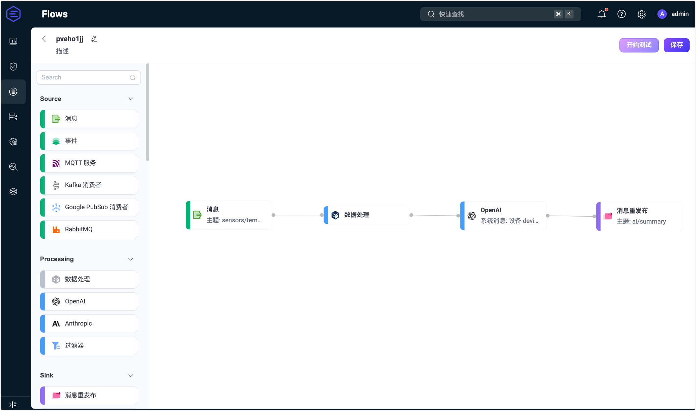
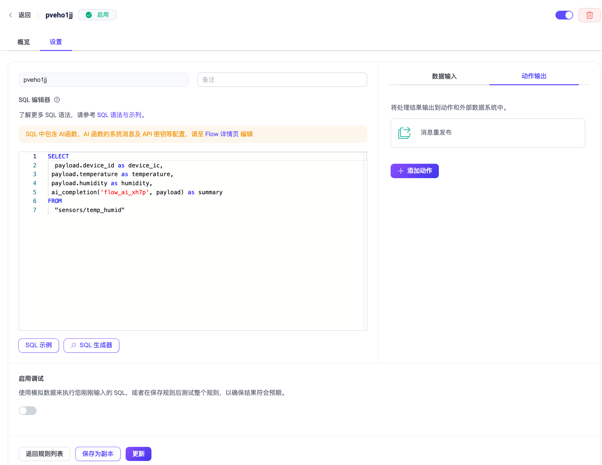
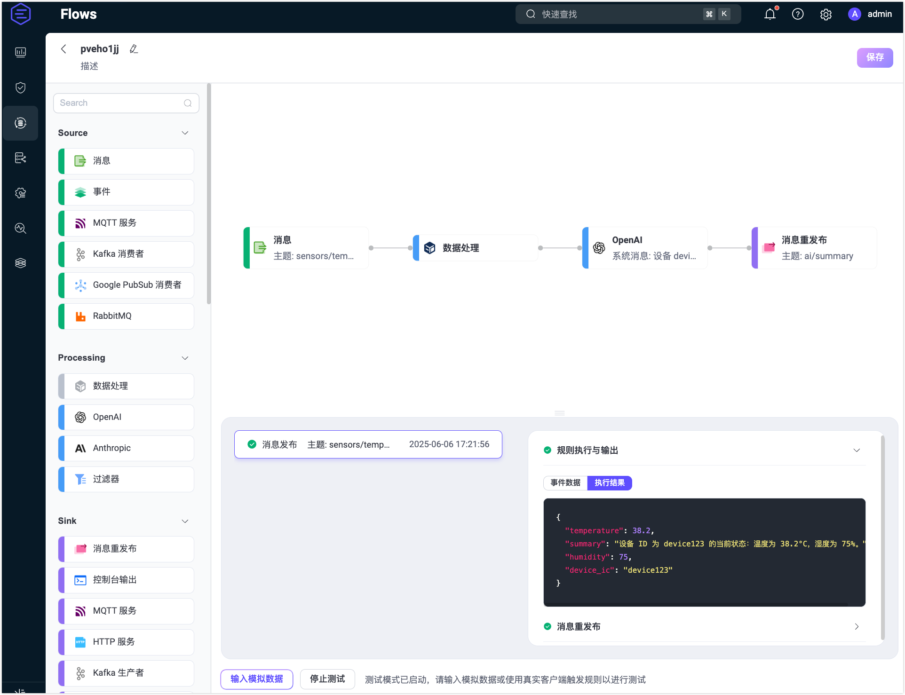
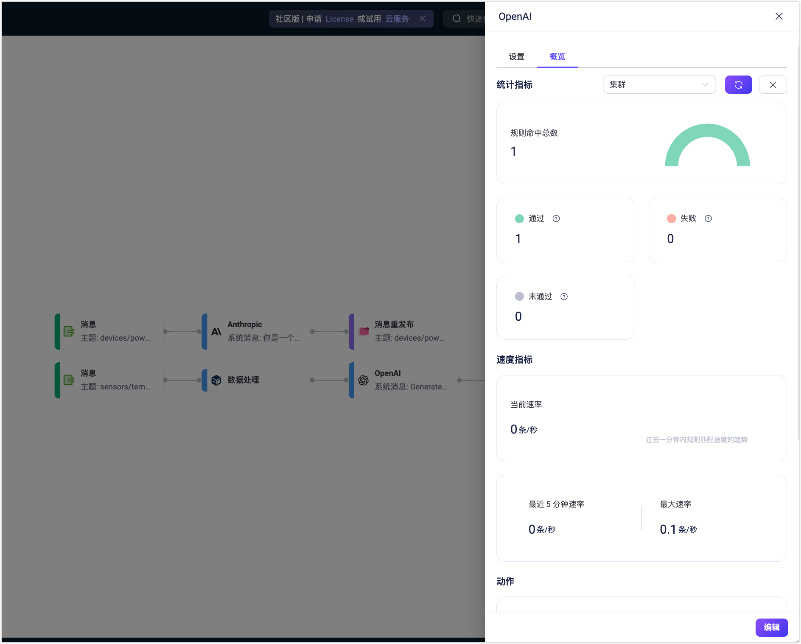

# 快速开始：使用 OpenAI 节点创建 Flow

本节将通过一个实际示例，演示如何在 Flow Designer 中快速创建并测试一个基于 LLM 的 Flow。

该示例展示如何构建一个 Flow，从 MQTT 主题接收传感器数据，并使用 LLM（如 OpenAI GPT）对数据进行理解与自然语言摘要。最终生成的摘要将被发布到新主题 `ai/summary`，供下游系统使用。

## 场景说明

假设某设备周期性地向 MQTT 主题 `sensors/temp_humid` 上报温度和湿度数据，每条消息为 JSON 格式。EMQX 的 Flow 将执行以下步骤：

- **数据处理**：提取设备 ID 及传感器数值；
- **LLM 处理**：使用 OpenAI 模型对数据进行摘要；
- **消息转发**：将生成的摘要发布到新主题 `ai/summary`。

**示例消息：**

```json
{
  "device_id": "device123",
  "temperature": 38.2,
  "humidity": 75,
  "timestamp": 1717568000000
}
```

**期望输出（由 LLM 生成）：**

```
设备 device123 当前温度为 38.2°C，湿度为 75%。
```

## 创建 Flow

::: tip 前置条件

请确保你拥有有效的 OpenAI API 密钥。

:::

1. 点击 **Flows** 页面上的 **创建 Flow** 按钮。

2. 添加一个**消息**节点：

   - 从左侧面板的 **Source** 区域拖拽一个**消息**节点。
   - 设置订阅主题为 `sensors/temp_humid`。
   - 点击**保存**。

3. 添加一个 **Processing** 节点：

   - 从 **Processing** 区域拖拽一个**数据处理**节点。
   - 添加以下字段映射：
     - `payload.device_id` → `device_id`
     - `payload.temperature` → `temperature`
     - `payload.humidity` → `humidity`
   - 点击**保存**。

4. 添加一个 **OpenAI** 节点：

   - 从 **Processing** 区域拖拽一个 **OpenAI** 节点并连接至 Data Processing 节点。
   
   - 配置节点参数如下：
     - **输入**：填写 `payload`。
     
     - **系统消息**：填写`生成一段简洁、便于阅读的设备传感器读数摘要。`。
     
     - **模型**：选择 `gpt-4o`。
     
     - **API 密钥**：填写你的 OpenAI API Key。
     
     - **基础 URL**：留空即可使用默认。
     
       ::: tip
     
       您可以通过填写自定义服务提供商 API 基础地址和你的 API 密钥，连接其他兼容 OpenAI 协议的服务。
     
       :::
     
     - **输出结果别名**：填写 `summary`。
     
   - 点击**保存**。
   
5. 添加一个**消息重发布**节点：

   - 从 **Sink** 区域拖拽一个**消息重发布**节点并连接至 OpenAI 节点。
   - 设置**主题**为 `ai/summary`。
   - 设置消息 **payload** 内容为 `${summary}`。
   - 点击**保存**。

6. 将所有节点连接，然后点击页面右上角**保存**，完成 Flow 创建。

   

   Flow 与规则引擎的表单规则兼容，也可以在规则页面中查看对应的 SQL 和配置。

   

## 测试 Flow

1. 使用 MQTT 客户端连接至 EMQX。

   你可以使用 Dashboard 中的**诊断工具 -> WebSocket 客户端**模拟发布者，也可以使用 [MQTTX](https://mqttx.app/zh) 或真实设备：

   - 连接至 EMQX；
   - 订阅主题 `ai/summary`。

2. 启动测试：

   - 在 Flow Designer 中点击任意节点打开编辑面板。

   - 点击**编辑**，再点击**开始测试**，底部将出现测试窗口。

   - 点击**输入模拟数据**，并发布如下消息至主题 `sensors/temp_humid`：

     ```json
     {
       "device_id": "device123",
       "temperature": 38.2,
       "humidity": 75
     }
     ```

3. 查看测试结果：

   - 若流程执行成功，将显示响应内容：

     

   - 返回 WebSocket 客户端页面，可收到类似以下内容：

     > "设备 ID 为 device123 的当前状态：温度为 38.2°C，湿度为 75%。"

   - 若测试失败，系统会提示错误原因。
   
   - 若需查看该 **OpenAI** 节点的运行统计，退出编辑页面，在创建 Flow 页面中点击节点，在弹出的编辑面板中点击**概览**选项卡。
   
     