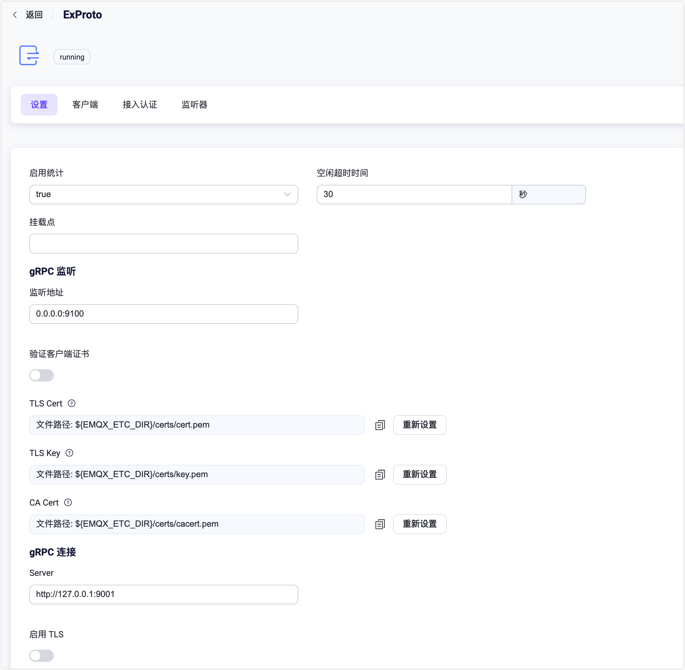
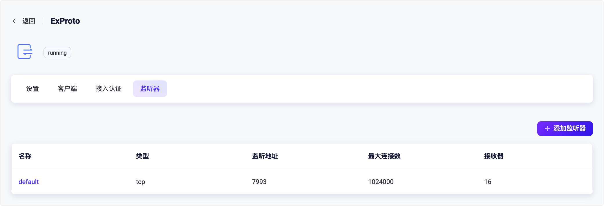
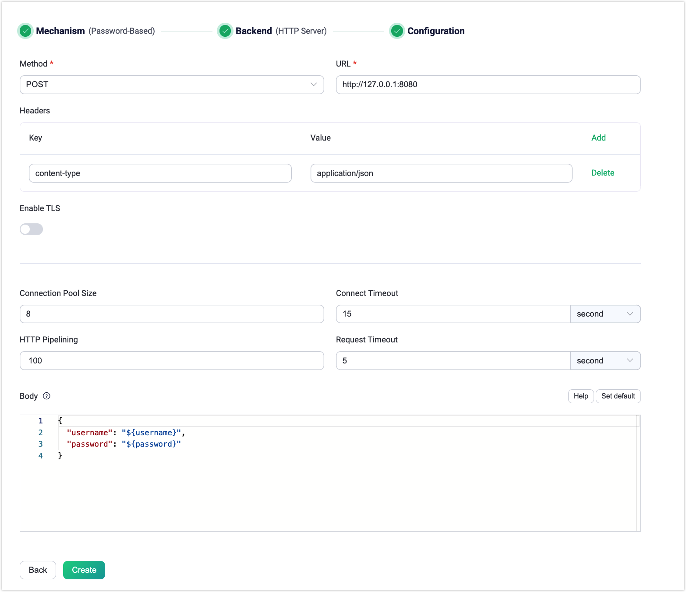
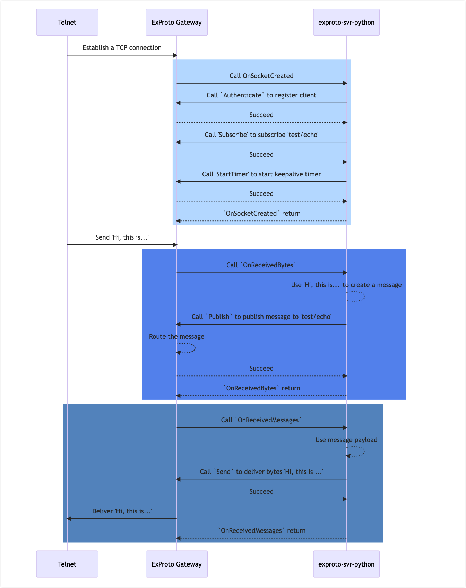

# ExProto 协议网关

Extension Protocol (ExProto) 协议是一个基于 gRPC 通信实现的自定义协议解析网关。它允许用户使用其熟悉的编程语言（如 Java、Python、Go 等）开发 gRPC 服务，用于解析设备的网络协议，并完成设备连接、身份验证和消息传输等功能。

本页介绍了如何在 EMQX 中配置和使用 ExProto 网关。

<!--a brief introduction of the architecture-->

## ExProto 网关和 gPRC 服务的工作原理

当 ExProto 网关在 EMQX 中启用 ，它将在特定端口（例如7993）上监听设备连接。当它接收到客户端设备的连接时，它将传递客户端设备生成的字节数据和事件给用户的 gRPC 服务。这需要 ExProto网 关中的 gRPC 客户端调用用户 gRPC 服务器中使用的`ConnectionUnaryHandler` 服务中的方法。

用户的 gRPC 服务器中的 gRPC 服务接收来自 ExProto 网关的字节数据和事件，解析客户端的网络协议，并将字节数据和事件转换为Pub/Sub 请求，并将它们发送回  ExProto网关。ExProto网关中的 `ConnectionAdapter` 服务提供了与用户的 gRPC 服务器进行交互的接口。最后通过 ExProto 网关，客户端设备可以向 EMQX 发布消息、订阅主题和管理客户端连接。

下图展示了 ExProto 网关和 gRPC 服务工作的架构。


### `exproto.proto` 文件

`exproto.proto` 文件定义了 ExProto 网关和用户 gRPC  服务之间的接口。该文件指定了以下两个服务：

- `ConnectionAdapter` 服务：由 ExProto 网关实现，为 gPRC 服务器提供接口。
- `ConnectionUnaryHandler` 服务：由用户的 gRPC 服务器实现，用于定义处理客户端 socket 连接和字节解析的方法。

### `ConnectionUnaryHandler` 服务

`ConnectionUnaryHandler` 服务由用户的 gRPC 服务器实现，用于处理客户端 socket 连接和字节解析。

该服务包括以下方法：

| 方法               | 描述                                                    |
| ------------------ | ------------------------------------------------------- |
| OnSocketCreated    | 每当有新的 socket 连接到 ExProto 网关时，将触发此回调。 |
| OnSocketClosed     | 每当 socket 关闭时，将触发此回调。                      |
| OnReceivedBytes    | 每当从客户端 socket 接收到数据时，将触发此回调。        |
| OnTimerTimeout     | 每当定时器超时时，将触发此回调。                        |
| OnReceivedMessages | 每当接收到订阅主题的消息时，将触发此回调。              |

当  ExProto 网关调用这些方法时，它将在参数中传递一个唯一标识符 `conn`，以标记是哪个套接字发送了该事件。例如，在 `OnSocketCreated` 函数的参数中：

```
javaCopy code
message SocketCreatedRequest {
  string conn = 1;
  ConnInfo conninfo = 2;
}
```

::: tip

由于 ExProto 网关无法识别私有协议消息帧的起始和结束位置，如果存在 TCP 数据包粘连或分割，需要在 `OnReceivedBytes` 回调中处理。

:::

### `ConnectionAdapter` 服务

`ConnectionAdapter` 服务由 ExProto 网关实现，为 gRPC 服务提供订阅初始化、消息发布、定时器启动和关闭连接等管理连接的功能。它包括以下方法：

| 方法         | 描述                                             |
| ------------ | ------------------------------------------------ |
| Send         | 向指定连接发送字节。                             |
| Close        | 关闭指定连接。                                   |
| Authenticate | 在 ExProto 网关中注册客户端并完成身份验证。      |
| StartTimer   | 为指定连接启动定时器，通常用于检测连接是否存活。 |
| Publish      | 从指定连接向 EMQX 发布消息。                     |
| Subscribe    | 为指定连接创建订阅。                             |
| Unsubscribe  | 删除指定连接的订阅。                             |
| RawPublish   | 发布消息到 EMQX。                                |

## 启用 ExProto 网关

从 EMQX 5.0 开始，您可以通过 Dashboard，HTTP API 或配置文件 `emqx.conf` 启用和配置 ExProto 网关。本节演示了如何通过 Dashboard 启用 ExProto 网关。

在 EMQX Dashboard 左侧导航目录中点击**管理** -> **网关**。**网关**页面上列出了所有支持的网关。找到 **ExProto** 并点击**操作**列中的**配置**按钮，您将进入**初始化 ExProto** 页面。

::: tip

如果 EMQX 在集群中运行，通过 Dashboard 或 HTTP API 的配置将在整个集群中生效。如果您只希望针对单个节点进行设置，可以使用配置文件 `emqx.conf` 配置网关。

:::

为了简化配置过程，EMQX 为**网关**页面上所有必填的字段提供了默认值。如果不需要自定义配置，您只需以下 3 步就可启用 ExProto 网关:

1. 接受**基础参数**步骤页面上所有的默认设置，点击**下一步**。
2. 然后您将被导航到**监听器**步骤页面，在该页面中，EMQX 已经预配置了一个端口为 `7993` 的 TCP 监听器。再次点击**下一步**以确认设置。
3. 点击**启用**按钮以激活 ExProto 网关。

完成网关激活过程后，您可以返回**网关**页面并看到 ExProto 网关现在显示为**已启用**状态。


以上配置也可通过 REST API 完成。

**示例代码：**

```bash
curl -X 'PUT' 'http://127.0.0.1:18083/api/v5/gateway/exproto' \
  -u <your-application-key>:<your-security-key> \
  -H 'Content-Type: application/json' \
  -d '{
  "name": "exproto",
  "enable": true,
  "mountpoint": "exproto/",
  "server": {
    "bind": "0.0.0.0:9100"
  }
  "handler": {
    "address": "http://127.0.0.1:9001"
    "ssl_options": {"enable": false}
  }
  "listeners": [
    {
      "type": "tcp",
      "bind": "7993",
      "name": "default",
      "max_conn_rate": 1000,
      "max_connections": 1024000
    }
  ]
}'
```

更多信息，参考 [REST API](../admin/api.md)。

如果您有一些定制化的需求，比如想要添加更多监听器或增加认证规则，您可以继续阅读 [自定义您的 ExProto 网关](#自定义您的-exproto-网关)。

## 自定义您的 ExProto 网关

除了默认设置外，EMQX 还提供了各种配置选项，以更好地适应您的特定业务需求。本节提供了关于**网关**页面上可用配置选项的深入概述。

### 基本设置

在**网关**页面，找到 **ExProto**，点击**操作**列中的**设置**。在**设置**页，您可以自定义 ConnectionUnaryHandler 服务地址、ConnectionAdapter 监听端口，并设置该网关的挂载点字符串。



- **启用统计**: 设置是否允许网关收集和报告统计信息；默认值：`true`，可选值：`true`，`false`。
- **空闲超时时间**: 设置连接客户端在无活动状态下被视为断开连接的持续时间（以秒为单位）。默认值：`30秒`。
- **挂载点**: 设置一个字符串，用于在发布或订阅时作为所有主题的前缀，提供在不同协议之间实现消息路由隔离的方法，例如 `mqttsn/`。此主题前缀由网关管理。客户端在发布和订阅时无需显式添加此前缀。
- **gRPC 监听**: 配置 ExProto 网关需要启动的 `ConnectionAdapter` 服务。
  - **绑定**: 服务监听地址和端口。监听地址。默认值：**0.0.0.0:9100**。
  - **验证客户端证书**：启用或禁用对等验证。默认为禁用，如果启用，您可以配置相关的 **TLS 证书**，**TLS 密钥**和 **CA 证书**信息，可以通过输入文件内容或使用**选择文件**按钮上传。详细信息请参阅 [开启 SSL/TLS 连接](../network/emqx-mqtt-tls.md)。
- **gRPC 连接**: 配置 ExProto 网关需要请求的 `ConnectionHandler` 服务地址。
  - **服务器**: 对端 gRPC 服务器地址。
  - **启用 TLS**：启用 TLS 连接。默认为禁用，如果启用，您可以继续进行以下设置：
    - **验证服务器证书 **：启用或禁用对等验证。默认为禁用，如果启用，您可以配置相关的 **TLS 证书**，**TLS 密钥**和 **CA 证书**信息，可以通过输入文件内容或使用**选择文件**按钮上传。
    - **SNI**：指定要在 TLS 服务器名称指示扩展中使用的主机名。

### 添加监听器

默认情况下，已经在端口 `7993` 上配置了一个名为 **default** 的 TCP 监听器，允许每秒最多 1,000 个连接，并支持高达 1,024,000 个并发连接。您可以点击**监听器**页签进行更多自定义设置，包括编辑、 删除监听器，或添加新的监听器。



点击 **+ 添加监听器**，您可以在弹出的**添加监听器**页面中进行以下配置：

**基本设置**

- **名称**: 为监听器设置一个唯一标识符。
- **类型**: 选择协议类型，对于 ExProto，可以选择 `udp` 或 `dtls`。
- **监听地址**: 设置监听器接受传入连接的端口号。
- **挂载点**（可选）: 设置一个字符串，作为发布或订阅时所有主题的前缀，提供在不同协议之间实现消息路由隔离的方法。

**监听器设置**

- **接收器**: 设置接收器池的大小，默认值：`16`。
- **最大连接数**: 设置监听器可以处理的最大并发连接数，默认值：`1024000`。
- **最大连接速率**: 设置监听器每秒钟可以接受的最大新连接数，默认值：`1000`。
- **代理协议**：是否开启 Proxy Protocol V1/2。默认值`false`。
- **代理协议超时**：接收 Proxy Protocol 报文头的超时时间。如果在超时内没有收到 Proxy Protocol 包，EMQX 将关闭 TCP 连接。默认值：`3` 秒。

**TCP 设置**

- **ActiveN**: 设置套接字的 `{active, N}` 选项，即套接字可以主动处理的传入数据包数量。详细信息请参阅 [Erlang文档 - setopts/2](https://erlang.org/doc/man/inet.html#setopts-2)。
- **Buffer**: 设置用于存储传入和传出数据包的缓冲区大小，单位：KB。
- **TCP_NODELAY**: 设置连接的 TCP_NODELAY 标识。默认值：`false`。
- **SO_REUSEADDR**: 设置是否允许本地重用端口号。默认值：`true`。<!--不太确定这是什么意思-->
- **发送超时时间**：连接的 TCP 发送超时。默认值：`15` 秒。
- **关闭发送超时连接**：如果发送超时，则关闭连接。默认值 `true`。

**TLS 设置**（仅适用于 SSL 监听器）

您可以通过设置切换开关来启用 TLS 验证。但在此之前，您需要配置相关的 **TLS 证书**，**TLS 密钥**和 **CA 证书**信息，可以通过输入文件内容或使用**选择文件**按钮上传。详细信息请参阅 [开启 SSL/TLS 连接](../network/emqx-mqtt-tls.md)。

然后您可以继续设置：

- **SSL 版本**: 设置支持的 TLS 版本，默认值：`tlsv1`，`tlsv1.1`，`tlsv1.2` 和 `tlsv1.3`。
- **没有证书则 SSL 失败**: 设置当客户端发送空证书时，EMQX 是否拒绝连接，默认值：`false`，可选值：`true`，`false`。
- **CA 证书深度**: 设置可以包含在对等证书后的有效认证路径中的非自签发中间证书的最大数量，默认值：`10`。
- **密钥文件密码**: 设置用户的密码，仅在私钥受密码保护时使用。


### 配置接入认证

ExProto 网关支持各种类型的认证器，例如：

- [内置数据库认证](../access-control/authn/mnesia.md)
- [MySQL 认证](../access-control/authn/mysql.md)
- [MongoDB 认证](../access-control/authn/mongodb.md)
- [PostgreSQL 认证](../access-control/authn/postgresql.md)
- [Redis 认证](../access-control/authn/redis.md)
- [HTTP 服务器认证](../access-control/authn/http.md)
- [JWT 认证](../access-control/authn/jwt.md)
- [LDAP 认证](../access-control/authn/ldap.md)

客户端信息的客户端 ID、用户名和密码都是从 ConnectionAdapter 的 Authenticate 方法中传递的参数中获取的。

本节以 Dashboard 为例，说明如何进行接入认证配置。点击**接入认证**页签。

点击 **+ 添加认证**，选择 **Password-Based** 作为**认证方式**，并选择 **HTTP 服务**作为**数据源**，点击**下一步**。然后在**配置参数**中，您可以设置身份验证规则。对于每一项配置的具体解释，您可以参考[使用 HTTP 服务进行密码认证](../access-control/authn/http.md)。



以上配置也可以通过 REST API 设置。

**示例代码：**

```bash
curl -X 'POST' 'http://127.0.0.1:18083/api/v5/gateway/exproto/authentication' \
  -u <your-application-key>:<your-security-key> \
  -H 'Content-Type: application/json' \
  -d '{
  "method": "post",
  "url": "http://127.0.0.1:8080",
  "headers": {
    "content-type": "application/json"
  },
  "body": {
    "username": "${username}",
    "password": "${password}"
  },
  "pool_size": 8,
  "connect_timeout": "5s",
  "request_timeout": "5s",
  "enable_pipelining": 100,
  "ssl": {
    "enable": false,
    "verify": "verify_none"
  },
  "backend": "http",
  "mechanism": "password_based",
  "enable": true
}'
```

## 开启 gRPC 服务示例进行测试

本节将带您启动一个 gRPC 服务示例，以了解 ExProto 网关和 gRPC 服务是如何协同工作的。

您可以在 [emqx-extension-examples](https://github.com/emqx/emqx-extension-examples) 中找到各种语言的示例程序。在这个代码库中，`exproto-svr-python` 是一个使用 Python 实现的 Echo 程序，它通过 ExProto 网关的 ConnectionUnaryHandler 将从 TCP 客户端接收到的任何数据简单地返回回去。以下步骤以 `exproto-svr-python` 为例：

::: tip 前置准备

在开始之前，请确保已完成以下操作：

- 运行 EMQX 5.1.0 或更高版本，并使用默认配置启用 ExProto 网关。

- 安装 Python 3.7 或更高版本，并安装以下依赖项：

  ```
  python -m pip install grpcio
  python -m pip install grpcio-tools
  ```

:::

1. 在与运行 EMQX 的同一台机器上，克隆示例代码并进入 `exproto-svr-python` 目录：

   ```
   git clone https://github.com/emqx/emqx-extension-examples
   cd exproto-svr-python
   ```

2. 使用以下命令启动 gRPC 服务器：

   ```
   python exproto_server.py
   ```

   成功启动后，将会打印类似以下的输出：

   ```
   ConnectionUnaryHandler started successfully, listening on 9001
   
   Tips: If the Listener of EMQX ExProto gateway listen on 7993:
         You can use the telnet to test the server, for example:
   
         telnet 127.0.0.1 7993
   
   Waiting for client connections...
   ```

3. 使用 `telnet` 访问 ExProto 网关监听的 7993 端口，并输入 `Hi, this is tcp client!` 来测试 gRPC 服务器是否正常工作。例如：

   ```
   $ telnet 127.0.0.1 7993
   Trying 127.0.0.1...
   Connected to 127.0.0.1.
   Escape character is '^]'.
   Hi, this is tcp client!
   Hi, this is tcp client!
   ```

4. 进入 EMQX Dashboard，从左侧导航菜单点击**管理** -> **网关**。点击 ExProto 的 **Clients**。在 ExProto 页面上，您可以看到使用 telnet 连接的客户端。

   

### 示例时序图

下面的图表显示了此示例中连接和消息传递的顺序。




