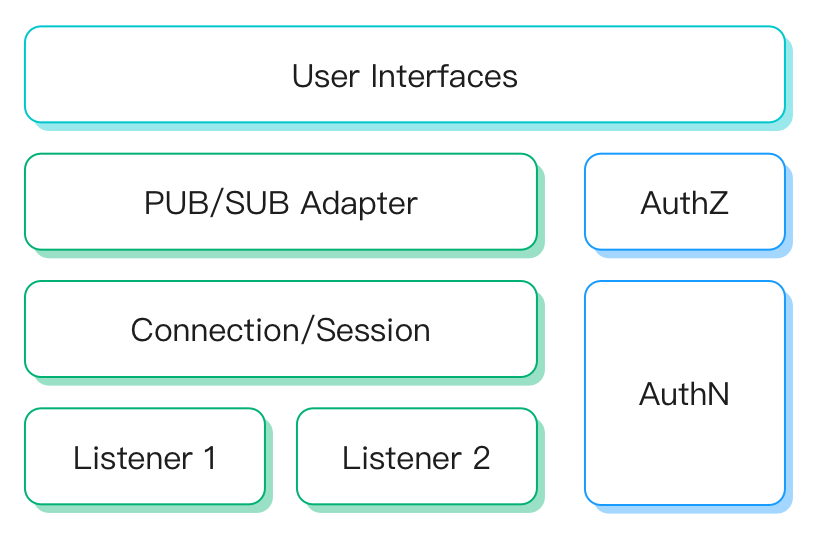

# 介绍

网关（Gateway）负责处理所有非 MQTT 协议的连接、认证和消息收发，并为其提供统一的用户层接口和概念。

在 EMQX 5.0 之前，非 MQTT 协议的接入分别由不同的接入插件实现（例如，`emqx_lwm2m` 插件用于处理 LwM2M 的协议接入）
这些插件之间存在设计和实现上差异，这导致使用这些接入插件会很难以理解。 在 5.0 中，EMQX 为其定义了统一的概念和操作模型以降低使用难度。

常用的网关快速开始：[Stomp](./stomp.md)、[MQTT-SN](./mqttsn.md)、[CoAP](./coap.md)

## 设计

为统一各接入协议的模型，网关抽象了以下概念：

- 监听器（Listener）：网关支持的监听器类型有：TCP、SSL、UDP、DTLS。每个网关都可以启用多个监听器。
- 连接（Connection）/ 会话（Session）：网关每接收一个客户端连接都会为其创建一个会话。在会话中会管理客户端消息的订阅状态、收发队列和重传逻辑等。
- 发布/订阅（PUB/SUB）：每种类型的网关都定义了如何和 MQTT 协议的 PUB/SUB 消息模型进行适配，例如：
    * LwM2M 协议未定义发布/订阅的概念，那么在 LwM2M 网关中则需要定义使用哪些主题来发送和接收消息。
    * MQTT-SN 协议中定义了发布/订阅的概念，那么在 MQTT-SN 网关中则直接不需要预定义主题来发布/接收消息。
- 用户层接口（User Interfaces）：定义了如何使用配置文件、HTTP API 来管理网关，客户端等。



### 接入认证

网关会给每个连接构建客户端信息，它要求：

- 无论哪种网关，其客户端信息都包含通用字段例如 Client ID，Username，Password 等（即使该协议无该字段的定义，网关会为其设置合适的默认值）
- 同时，不同的网关也有其特定的客户端属性，例如 LwM2M 有 Endpoint Name 和 Life Time 等属性。
- 不同网关下的 Client ID 允许重复，但同一网关下重复的 Client ID 登录会踢出旧的连接。

5.0 中，网关可配置认证器、并使用上述的客户端信息进行登录授权：

- 每个网关都可以独立的配置认证器，它们之间配置和数据是隔离的。
- 某网关如果不配置认证器则认为允许任何客户端登录。
- 由于不同的网关的客户端信息格式不同，导致所支持的认证器类型是存在差别，但每个网关都支持基于 HTTP 的认证。

:::tip
在配置文件中，还支持配置监听器级别的认证器；这表示允许一个网关下不同的监听端口可以配置为不同的认证方式和数据来源.
:::

### 发布订阅和权限控制

为了适配 EMQX 的 PUB/SUB 消息模型，每种类型的网关都必须完成对这种消息模型的兼容，以达到相互通信的目的。

对于 PUB/SUB 类型的协议网关，例如 MQTT-SN，Stomp 通常定义了主题和消息负载的概念；则：
- 网关在处理其消息收发时直接使用客户端指定的主题和消息内容，即可接入到 EMQX 的消息系统。
- 需要在 [授权（Authorization）](../access-control/authz/authz.md) 中为其配置主题发布订阅权限。

但对于非 PUB/SUB 类型的协议，它缺少对主题、发布、订阅等概念的定义；则
- 需要为其指定消息主题。例如 LwM2M 网关，用户可以配置各个类型消息的主题。
- 需要为其设计消息内容的格式。每种类型的网关都可能会使用不同的消息格式。
- 需要在 [授权（Authorization）](../access-control/authz/authz.md) 中为其配置主题发布订阅权限。

::: tip
认证（Authentication）是可以在网关中进行配置，并且分属于每个网关自身他们之间是相互独立的；
但是网关中不存在单独的授权（Authorization）概念，如果需要给某网关的客户端主题设置权限，需要在全局的授权中进行配置。
:::

详细的介绍可参考各个协议的文档。

## 使用与集成

### 配置和管理

5.0 中，网关可以直接在 Dashboard 中进行启用和配置。

也使用 HTTP API 或 emqx.conf 进行管理，例如：

:::: tabs type:card

::: tab HTTP API

```bash
curl -X 'POST' 'http://127.0.0.1:18083/api/v5/gateway' \
  -u admin:public \
  -H 'Content-Type: application/json' \
  -d '{
  "name": "stomp",
  "enable": true,
  "mountpoint": "stomp/",
  "listeners": [
    {
      "bind": "61613",
      "max_conn_rate": 1000,
      "max_connections": 1024000,
      "name": "default",
      "type": "tcp"
    }
  ]
}'
```

:::

::: tab Configuration

```properties
gateway.stomp {

  mountpoint = "stomp/"

  listeners.tcp.default {
    bind = 61613
    acceptors = 16
    max_connections = 1024000
    max_conn_rate = 1000
  }
}
```

:::

::::

详细参考：
- [HTTP API - Gateway](../admin/api.md)
- [配置文档-网关配置](../configuration/configuration-manual.md)

::: tip
通过配置文件配置网关，需要在每个节点中进行修改，但通过 Dashboard 或者 HTTP API 进行配置则会在整个集群中生效。
:::

### 监听器级认证和消息隔离

除了可以在网关层给不同的网关配置不同的认证器和主题挂载点。也支持为不同监听器单独配置 `mountpoint` 和 `authentication` 来重载网关级的这两项配置。 这样的话，可以通过启用多个监听器，并为其配置不同的主题挂载点和认证逻辑。以 Stomp 网关为例：

```properties
gateway.stomp {

  listeners.tcp.default {
    bind = 61613
    ## 例如，为 61613 端口的监听器配置基于内置数据库的认证器
    authentication {
      mechanism = password_based
      backend = built_in_database
      user_id_type = username
    }
  }

  listeners.tcp.default2 {
    bind = 61614
    ## 例如，为 61614 端口的监听器配置基于 HTTP Server 的认证器
    authentication {
      mechanism = password_based
      backend = http
      method = post
      url = "http://127.0.0.1:9000/stomp/auth"
      headers {
        content-type = "application/json"
      }
      body {
        username = "${username}"
        password = "${password}"
      }
    }
  }
}
```

::: tip
在 EMQX 5.0  中给每个监听器配置不同的认证器功能，仅在配置文件中支持；暂未在 HTTP API 和 Dashboard 中支持。
:::

### 钩子和事件

为了更好的与外部系统进行集成，网关同样支持在 EMQX 核心中定义的钩子。

由于协议间的语义存在异构，所以仅部分核心的钩子。

客户端连接相关钩子，支持性如下：

| 钩子名称               | 支持性 |  描述                                |
| ---------------------- | ------ | ------------------------------------ |
| `client.connect`       | 可选   | 原用于 MQTT 协议；仅部分网关支持     |
| `client.connack`       | 可选   | 原用于 MQTT 协议；仅部分网关支持     |
| `client.authenticate`  | 支持   | 客户端认证请求，所有网关都支持       |
| `client.connected`     | 支持   | 客户端已成功接入，所有网关都支持     |
| `client.disconnected`  | 支持   | 客户端连接已断开，所有网关都支持     |
| `client.authorize`     | 支持   | 客户端发布订阅授权请求，所有网关都支持 |
| `client.subscribe`     | 可选   | 原用于 MQTT 协议；仅部分网关支持     |
| `client.unsubscribe`   | 可选   | 原用于 MQTT 协议；仅部分网关支持     |

会话和消息相关的钩子无协议间的异构问题，所以在网关中这些钩子都完全支持。
