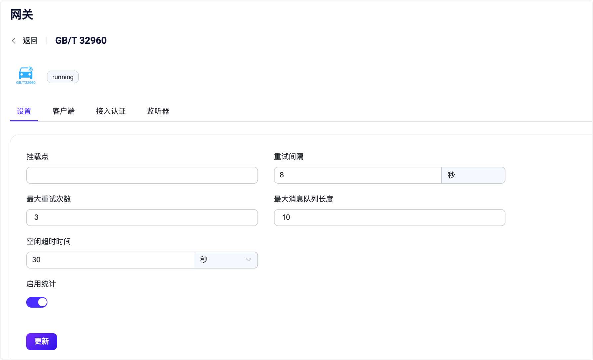

# GB/T 32960 协议网关

EMQX GB/T 32960 网关是一种消息协议转换器，用于桥接 GB/T 32960 和 MQTT 协议之间的差异，允许客户端使用这些协议相互通信 GB/T 32960 网关为客户端和服务器提供了轻量级和简单的消息解决方案，使其能够在各种消息环境中交换消息。凭借对 TCP 和 SSL 类型监听器的支持，GB/T 32960 网关是构建消息系统的灵活多用途工具。

本页面介绍了如何在 EMQX 中配置和使用 GB/T 32960 网关。

## 启用 GB/T 32960 网关

从 EMQX 5.4 开始，您可以通过 Dashboard、REST API 和配置文件 `emqx.conf` 来配置和启用 GB/T 32960 网关。

::: tip

如果您在集群中运行 EMQX，则通过 Dashboard 或 REST API 所做的设置将影响整个集群。如果您只想更改一个节点的设置，请使用 [`emqx.conf`](../configuration/configuration.md) 进行配置。

:::

本节展示如何通过 Dashboard 和 REST API 启用 GB/T 32960 网关。

在 EMQX Dashboard 左侧导航目录中点击**管理** -> **网关**。**网关**页面上列出了所有支持的网关。找到 **GB/T 32960** 并在 **操作** 列中点击 **设置**。然后，您将被引导至 **初始化 GB/T 32960** 页面。

为了简化配置过程，EMQX 在 **网关** 页面为所有必填字段提供了默认值。如果您不需要广泛的自定义，您可以只需3步启用 GB/T 32960 网关：

1. 接受**基础参数**步骤页面上所有的默认设置，点击**下一步**。
2. 然后您将被导航到**监听器**步骤页面，在该页面中，EMQX 已经预配置了端口 `7325` 上的 TCP 监听器。再次点击 **下一步** 来确认设置。
3. 接着点击 **启用** 按钮以激活 GB/T 32960 网关。

完成网关激活过程后，您可以返回到 **网关** 页面并看到 GB/T 32960 网关现在显示为 **已启用** 状态。


以上配置也可通过 REST API 完成。

**示例代码：**

```bash
curl -X 'PUT' 'http://127.0.0.1:18083/api/v5/gateway/gbt32960' \
  -u <your-application-key>:<your-security-key> \
  -H 'Content-Type: application/json' \
  -d '{
  "name": "gbt32960",
  "enable": true,
  "mountpoint": "gbt32960/${clientid}/",
  "retry_interval": "8s",
  "max_retry_times": 3,
  "message_queue_len": 10,
  "listeners": [
    {
      "type": "tcp",
      "name": "default",
      "bind": "7325",
      "max_conn_rate": 1000,
      "max_connections": 1024000
    }
  ]
}'
```

更多信息，参考 [REST API](../admin/api.md)。

如果您有一些定制化的需求，比如想要添加更多监听器或增加认证规则，您可以继续阅读 [自定义您的 GB/T 32960 网关](#自定义您的-gbt-32960-网关)。

## 与 GB/T 32960 客户端进行信息转换

GB/T 32960 网关一旦在 EMQX 中启用 ，它便可以充当 GB/T 32960 协议与 MQTT 之间的翻译器和路由器，允许 GB/T 32960 客户端与使用 MQTT 进行消息传递的系统之间进行通信。由于 GB/T 32960 协议与 MQTT 规范之间存在明显差异，无法直接将 GB/T 32960 命令映射到 MQTT 消息。为此，我们建立了特定的转换规则，以便于这两个系统之间的通信：

1. **命令转换为 MQTT**：GB/T 32960 客户端发出的每个命令都被转换成 MQTT 消息。这个消息的主题遵循格式 `${mountpoint}/upstream/${command}`，其载荷结构为 JSON 格式，包含命令的详细信息。
2. **向 GB/T 32960 客户端发送命令**：用户可以通过向主题 `${mountpoint}/dnstream` 发布 JSON 格式的消息来向 GB/T 32960 客户端发送命令。
3. **处理来自 GB/T 32960 客户端的响应**：从 GB/T 32960 客户端收到的响应被转换成主题为 `${mountpoint}/upstream/response` 的 MQTT 消息。

要全面了解 GB/T 32960 与 MQTT 之间的信息转换过程，请参阅我们详细的[数据交换指南](https://github.com/emqx/emqx/blob/release-54/apps/emqx_gateway_gbt32960/doc/Data_Exchange_Guide_EN.md)。

## 自定义您的 GB/T 32960 网关

除了默认设置外，EMQX 还提供了各种配置选项，以更好地适应您的特定业务需求。本节提供了关于**网关**页面上可用配置选项的深入概述。

### 基本设置

在**网关**页面，找到 **GB/T 32960**，点击**操作**列中的**设置**。在**设置**页，您可以自定义设置该网关的挂载点字符串以及是否启用统计等。有关每个字段的全面解释，请参阅屏幕截图下方的文本。



- **挂载点**：设置一个字符串，用于在发布或订阅时作为所有主题的前缀，提供在不同协议之间实现消息路由隔离的方法，例如 `stomp/`。此主题前缀由网关管理。客户端在发布和订阅时无需显式添加此前缀。
- **重试间隔**：重新发送的时间间隔，默认为 `8s`。
- **最大重试次数**：最大重发次数，默认为 `3`。
- **最大消息队列长度**：最大消息队列长度，默认为 `10`。
- **空闲超时时间**：设置因连接客户端无活动状态而关闭连接之前，网关等待 GB/T 32960 帧的最长时间（以秒为单位）。默认值：`30秒`。
- **启用统计**: 设置是否允许网关收集和报告统计信息；默认值：`true`，可选值：`true`，`false`。

### 添加监听器

默认情况下，已经在端口 `7325` 上配置了一个名为 **default** 的 TCP 监听器，允许每秒最多 1,000 个连接，并支持高达 1,024,000 个并发连接。您可以点击**监听器**页签进行更多自定义设置，包括编辑、 删除监听器，或添加新的监听器。

::: tip

GB/T 32960 网关仅支持 TCP 和 SSL 类型的监听器。

:::


点击 **添加监听器**，您可以在弹出的**添加监听器**页面中进行以下配置：

**基本设置**

- **名称**: 为监听器设置一个唯一标识符。
- **类型**: 选择协议类型，对于 GB/T 32960，可以选择 `tcp` 或 `ssl`。
- **监听地址**: 设置监听器接受传入连接的端口号。
- **挂载点**（可选）: 设置一个字符串，作为发布或订阅时所有主题的前缀，提供在不同协议之间实现消息路由隔离的方法。

**监听器设置**

- **接收器**: 设置接收器池的大小，默认值：`16`。
- **最大连接数**: 设置监听器可以处理的最大并发连接数，默认值：`1024000`。
- **最大连接速率**: 设置监听器每秒钟可以接受的最大新连接数，默认值：`1000`。
- **代理协议**：设置当 EMQX 部署在[负载均衡器](../deploy/cluster/lb.md)后，是否开启 Proxy Protocol V1/2。默认值：`false`。
- **代理协议超时**：接收 Proxy Protocol 报文头的超时时间。如果在超时内没有收到 Proxy Protocol 包，EMQX 将关闭 TCP 连接。默认值：`3` 秒。

**TCP 设置**

- **ActiveN**: 设置套接字的 `{active, N}` 选项，即套接字可以主动处理的传入数据包数量。详细信息请参阅 [Erlang文档 - setopts/2](https://erlang.org/doc/man/inet.html#setopts-2)。
- **Buffer**: 设置用于存储传入和传出数据包的缓冲区大小，单位：KB。
- **TCP_NODELAY**: 设置连接的 TCP_NODELAY 标识。默认值：`false`。
- **SO_REUSEADDR**: 设置是否允许本地重用端口号。默认值：`true`。<!--不太确定这是什么意思-->
- **发送超时时间**：连接的 TCP 发送超时。默认值：`15` 秒。
- **关闭发送超时连接**：如果发送超时，则关闭连接。默认值 `true`。

**SSL 设置**（仅适用于 SSL 监听器）

您可以通过设置切换开关来启用 TLS 验证。但在此之前，您需要配置相关的 **TLS 证书**，**TLS 密钥**和 **CA 证书**信息，可以通过输入文件内容或使用**选择文件**按钮上传。详细信息请参阅 [开启 SSL/TLS 连接](../network/emqx-mqtt-tls.md)。

然后您可以继续设置：

- **SSL 版本**: 设置支持的 TLS 版本，默认值：`tlsv1`，`tlsv1.1`，`tlsv1.2` 和 `tlsv1.3`。
- **没有证书则 SSL 失败**: 设置当客户端发送空证书时，EMQX 是否拒绝连接，默认值：`false`，可选值：`true`，`false`。
- **CA 证书深度**: 设置可以包含在对等证书后的有效认证路径中的非自签发中间证书的最大数量，默认值：`10`。
- **密钥文件密码**: 设置用户的密码，仅在私钥受密码保护时使用。

### 配置接入认证

GB/T 32960 网关仅支持 [HTTP Server 认证](../access-control/authn/http.md)。网关使用 `login` 命令中的信息，并使用 `vin` 代码作为 `clientid` 来为客户端生成认证字段：

- 客户端 ID：`vin` 代码
- 用户名：`vin` 代码

您可以通过 REST API 或 `emqx.conf` 为 GB/T 32960 网关创建 HTTP 认证：

:::: tabs type:card

::: tab REST API

```bash
curl -X 'POST' 'http://127.0.0.1:18083/api/v5/gateway/gbt32960/authentication' \
  -u <your-application-key>:<your-security-key> \
  -H 'Content-Type: application/json' \
  -d '{
  "method": "post",
  "url": "http://127.0.0.1:8080",
  "headers": {
    "content-type": "application/json"
  },
  "body": {
    "vin": "${clientid}"
  },
  "pool_size": 8,
  "connect_timeout": "5s",
  "request_timeout": "5s",
  "enable_pipelining": 100,
  "ssl": {
    "enable": false,
    "verify": "verify_none"
  },
  "backend": "http",
  "mechanism": "password_based",
  "enable": true
}'
```

:::

::: tab 配置文件

```properties
gateway.bgt32960 {
  authentication {
    enable = true
    backend = "http"
    mechanism = "password_based"
    method = "post"
    connect_timeout = "5s"
    enable_pipelining = 100
    url = "http://127.0.0.1:8080"
    headers {
      "content-type" = "application/json"
    }
    body {
      "vin": "${clientid}"
    }
    pool_size = 8
    request_timeout = "5s"
    ssl.enable = false
  }
}
```

:::

::::
