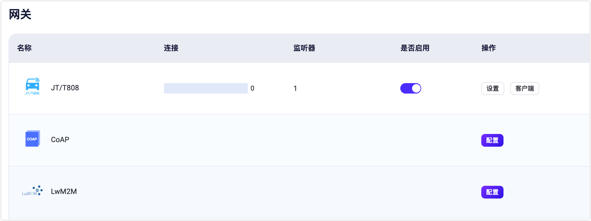
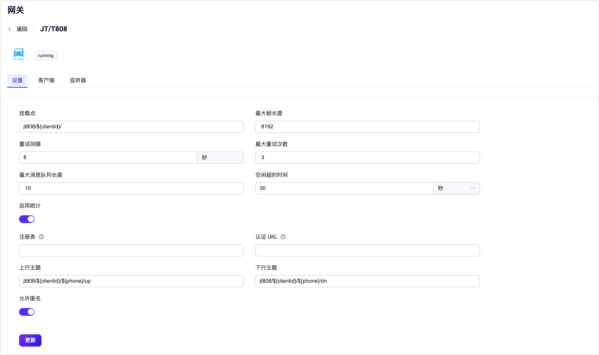
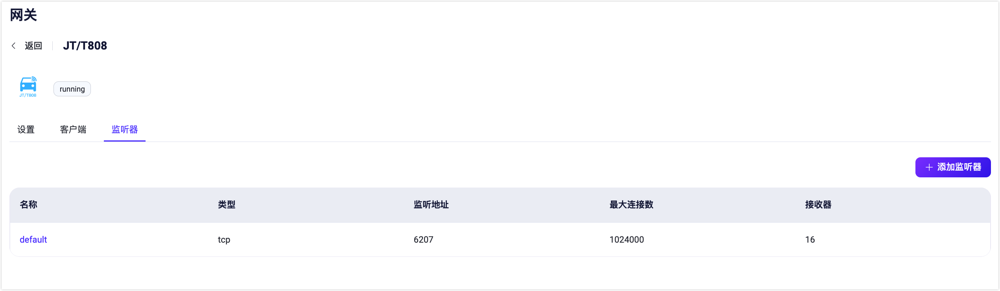

# JT/T 808 协议网关

JT/T 808 协议是一种在中国广泛应用的车载终端通信协议，用于车辆与监控中心之间的数据通信。

EMQX 中的 JT/T 808 网关可以接收 JT/T 808 客户端连接并将其事件和消息转换为 MQTT Publish 消息。

在当前的实现中，它有以下限制：
- 基于 TCP 传输。
- 仅支持 JT/T 808 2013。暂时不支持 JT/T 808 2021。
- 无法使用 SMS 方式发送终端注册和终端注销消息。
- 无法使用 EMQX 内建的认证器系统，需要配置终端注册/终端接入鉴权的的 HTTP 服务地址。

## 启用 JT/T 808 网关

您可以通过 Dashboard，HTTP API 或配置文件 `emqx.conf` 启用和配置 JT/T 808 网关。

### 通过 Dashboard 启用

本节演示了如何通过 Dashboard 启用和配置 JT/T 808 网关。

在 EMQX Dashboard 左侧导航目录中点击**管理** -> **网关**。**网关**页面上列出了所有支持的网关。找到 **JT/T 808** 并点击**操作**列中的**配置**按钮，您将进入**初始化 JT/T 808** 页面。

::: tip

如果 EMQX 在集群中运行，通过 Dashboard 或 HTTP API 的配置将在整个集群中生效。如果您只希望针对单个节点进行设置，可以使用配置文件 `emqx.conf` 配置网关。

:::

为了简化配置过程，EMQX 为**网关**页面上所有必填的字段提供了默认值。如果不需要自定义配置，您只需以下 3 步就可启用 JT/T 808 网关:

1. 接受**基础参数**步骤页面上所有的默认设置，点击**下一步**。
2. 然后您将被导航到**监听器**步骤页面，在该页面中，EMQX 已经预配置了一个端口为 6207 的 TCP 监听器。再次点击**下一步**以确认设置。
3. 点击**启用**按钮以激活 JT/T 808 网关。

完成网关激活过程后，您可以返回**网关**页面并看到 JT/T 808 网关现在显示为**已启用**状态。



### 通过 HTTP API 或配置文件启用

您也可以通过 HTTP API 或 `emqx.conf` 来启用和配置 JT/T 808 网关，例如：

:::: tabs type:card

::: tab HTTP API

```bash
curl -X 'PUT' 'http://127.0.0.1:18083/api/v5/gateways/jt808' \
  -u <your-application-key>:<your-security-key> \
  -H 'Content-Type: application/json' \
  -d '{
  "name": "jt808",
  "frame": {
    "max_length": 8192
  },
  "proto": {
    "auth": {
      "allow_anonymous": true
    },
    "up_topic":"jt808/${clientid}/${phone}/up",
    "dn_topic":"jt808/${clientid}/${phone}/dn"
  },
  "mountpoint": "jt808/${clientid}/",
  "retry_interval": "8s",
  "max_retry_times": 3,
  "message_queue_len": 10,
  "enable_stats": true,
  "idle_timeout": "30s",
  "listeners": [
    {
      "type":"tcp",
      "name":"default",
      "bind":"6207",
      "acceptors":16,
      "max_conn_rate":1000,
      "max_connections":1024000,
      "id":"jt808:tcp:default"
    }
  ]
  }'
```
:::

::: tab 配置文件

```properties
gateway {
  jt808 {
    enable_stats = true
    frame {max_length = 8192}
    idle_timeout = 30s
    listeners {
      tcp {
        default {
          acceptors = 16
          bind = "6207"
          max_conn_rate = 1000
          max_connections = 1024000
        }
      }
    }
    max_retry_times = 3
    message_queue_len = 10
    mountpoint = "jt808/${clientid}/"
    proto {
      auth {allow_anonymous = true}
      dn_topic = "jt808/${clientid}/${phone}/dn"
      up_topic = "jt808/${clientid}/${phone}/up"
    }
    retry_interval = 8s
  }
}
```
:::

::::

::: tip
通过配置文件进行配置网关，需要在每个节点中进行配置；<br/>
通过 Dashboard 或者 HTTP API 管理则会在整个集群中生效。
:::

JT/T 808 网关仅支持 TCP 类型的监听器，其完整可配置的参数列表参考：[网关配置 - 监听器](https://docs.emqx.com/zh/enterprise/v@EE_VERSION@/hocon/)。

## 自定义您的 JT/T 808 网关

除了默认设置外，EMQX 还提供了各种配置选项，以更好地适应您的特定业务需求。本节提供了关于**网关**页面上可用配置选项的深入概述。

### 基本设置

在**网关**页面，找到 **JT/T 808**，点击**操作**列中的**设置**。在**设置**页，您可以自定义 JT/T 808 网关的配置项。



- **挂载点**：设置一个字符串作为发布或订阅时所有主题的前缀，提供一种在不同协议之间实现消息路由隔离的方法，例如 `jt808/${clientid}/`。此主题前缀由网关管理，客户端在发布和订阅时无需显式添加此前缀。
- **最大帧长度**：网关能够处理的帧的最大大小。默认值设置为 `8192`，使网关能够适应各种数据包大小。
- **重试间隔**：消息发送失败时网关尝试重发的时间间隔。默认值为 `8秒`。
- **最大重试次数**：网关尝试发送消息的最大尝试次数。超过此数值后，如果消息仍无法发送，则会被丢弃。默认值为：`3`。
- **最大消息队列长度**：下行流消息传递的最大消息队列长度。默认值为：`10`。
- **空闲超时时间**：设置客户端无活动状态下被视为断开连接的持续时间（以秒为单位）。默认值：`30秒`。
- **启用统计**：设置是否允许网关收集和报告统计信息；默认值为：`true`，可选值为：`true`、`false`。
- **注册 URL**：JT/T 808 设备注册中心。如果 `allow_anonymous` 设置为 `false`，则此设置为必需。当网关收到 JT/T 808 注册消息时，会将注册信息以 HTTP 请求的形式发送到此地址。详见：[配置接入认证/鉴权](#配置接入认证-鉴权)。
- **鉴权 URL**：指定用于客户端认证的外部服务的 URL。
- **上行主题**：用于发布消息从网关到 EMQX 的 MQTT 主题模式。定义了 JT/T 808 客户端消息如何映射到 MQTT 主题进行上行通信。默认主题为：`jt808/${clientid}/${phone}/up`。
- **下行主题**：用于从代理到网关再到 JT/T 808 客户端发送消息的 MQTT 主题模式。定义了 MQTT 代理的消息如何路由到 JT/T 808 客户端进行下行通信。默认主题为：`jt808/${clientid}/${phone}/dn`。
- **允许匿名**：此设置决定网关是否允许客户端无需认证即可连接。如果设置为 `true`，客户端可以在不提供认证凭证的情况下连接。

### 添加监听器

默认情况下，已经在端口 `6207` 上配置了一个名为 **default** 的 TCP 监听器，允许每秒最多 1,000 个连接，并支持高达 1,024,000 个并发连接。您可以点击**监听器**页签进行更多自定义设置，包括编辑、 删除监听器，或添加新的监听器。



点击 **+ 添加监听器**，您可以在弹出的**添加监听器**页面中进行以下配置：

**基本设置**

- **名称**: 为监听器设置一个唯一标识符。
- **类型**: 选择协议类型，对于 JT/T 808，可以选择 `tcp` 或 `ssl`。
- **监听地址**: 设置监听器接受传入连接的端口号。
- **挂载点**（可选）: 设置一个字符串，作为发布或订阅时所有主题的前缀，提供在不同协议之间实现消息路由隔离的方法。

**监听器设置**

- **接收器**: 设置接收器池的大小，默认值：`16`。
- **最大连接数**: 设置监听器可以处理的最大并发连接数，默认值：`1024000`。
- **最大连接速率**: 设置监听器每秒钟可以接受的最大新连接数，默认值：`1000`。
- **代理协议**：是否开启 Proxy Protocol V1/2。默认值`false`。
- **代理协议超时**：接收 Proxy Protocol 报文头的超时时间。如果在超时内没有收到 Proxy Protocol 包，EMQX 将关闭 TCP 连接。默认值：`3` 秒。

**TCP 设置**

- **ActiveN**: 设置套接字的 `{active, N}` 选项，即套接字可以主动处理的传入数据包数量。详细信息请参阅 [Erlang文档 - setopts/2](https://erlang.org/doc/man/inet.html#setopts-2)。
- **Buffer**: 设置用于存储传入和传出数据包的缓冲区大小，单位：KB。
- **TCP_NODELAY**: 设置连接的 TCP_NODELAY 标识。默认值：`false`。
- **SO_REUSEADDR**: 设置是否允许本地重用端口号。默认值：`true`。
- **发送超时时间**：连接的 TCP 发送超时。默认值：`15` 秒。
- **关闭发送超时连接**：如果发送超时，则关闭连接。默认值 `true`。

### 配置接入认证/鉴权

由于 JT/T 808 协议规范中特有的注册/鉴权逻辑，因此，JT/T 808 网关仅支持一种认证方式：向特定的注册服务 HTTP 服务请求进行注册/鉴权。

::: tip
此处的术语 "鉴权" 为 JT/T 808 协议中的定义的鉴权，非 MQTT Pub/Sub 的授权访问控制。
:::

您也可以配置 `gateway.jt808.proto.auth.allow_anonymous = true` 以开启匿名认证，即跳过客户端的注册/鉴权逻辑。

注册/鉴权请求详细格式如下：

#### 注册请求
```properties
URL: http://127.0.0.1:8991/jt808/registry
Method: POST
Body:
   { "province": 58,
     "city": 59,
     "manufacturer": "Infinity",
     "model": "Q2",
     "license_number": "ZA334455",
     "dev_id": "xx11344",
     "color": 3,
     "phone", "00123456789"
   }
```

**注册应答：**
:::: tabs type:card

::: tab 注册应答结果实例 1
```json
{
  "code": 0,
  "authcode": "132456789"
}

```
:::

::: tab 注册应答结果示例 2
```json
{
  "code": 1
}
```

:::

::::

其中返回码可以为：

0: 成功<br/>
1: 车辆已被注册<br/>
2: 数据库中无该车辆<br/>
3: 终端已被注册<br/>
4: 数据库中无该终端<br/>

#### 鉴权请求

```properties
URL: http://127.0.0.1:8991/jt808/auth
Method: POST
Body:
   { "code": "authcode",
     "phone", "00123456789"
   }
```

**鉴权应答：**

```
HTTP 状态码 200: 鉴权成功
其他: 鉴权失败
```

注意：鉴权请求只会在系统未保存鉴权码时调用（即终端直接发送鉴权报文进行登录系统）。

## 数据交换格式

请参考 [JT/T 808 网关数据交换格式](./jt808_data_exchange.md)。

## 用户层接口

- 详细配置说明参考：[网关配置 - JT/T 808 网关](https://docs.emqx.com/zh/enterprise/v@EE_VERSION@/hocon/#V-gateway)
- 详细 HTTP API 接口参考：[HTTP API - 网关](../admin/api.md)
