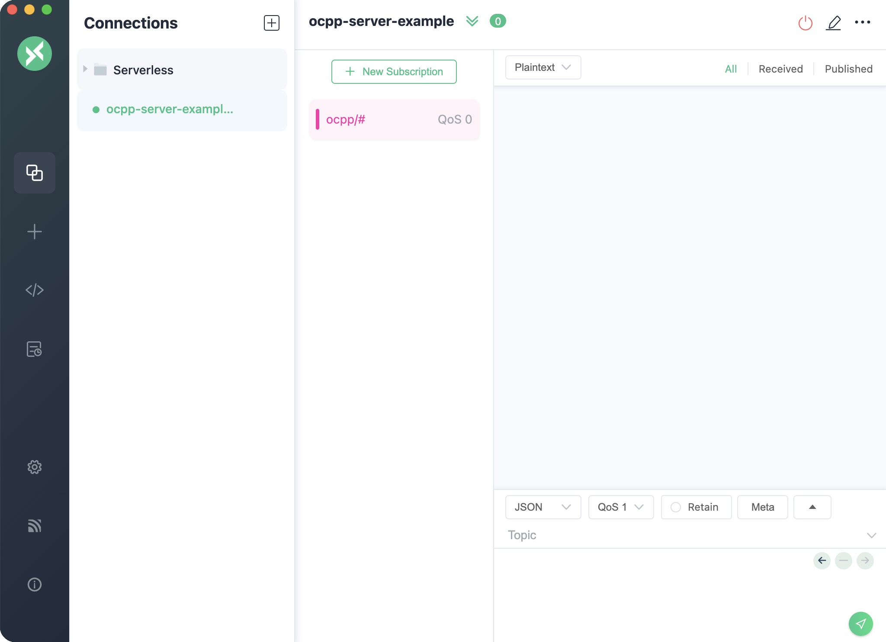
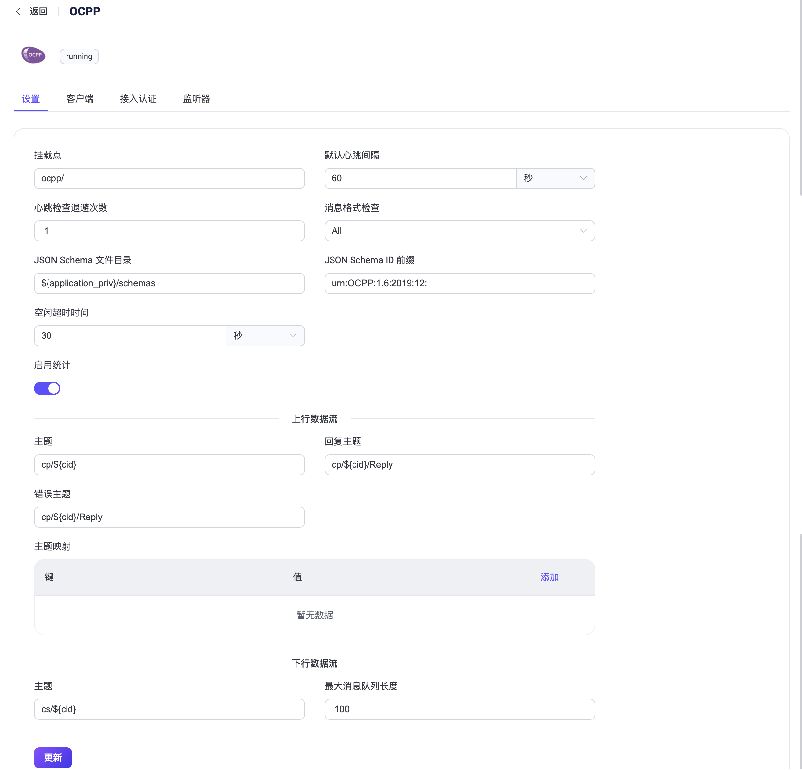

# OCPP 协议网关

EMQX OCPP 网关是一个消息协议转换器，它解决了 [OCPP](https://www.openchargealliance.org/) 和 MQTT 协议之间的差距，使用这些协议的客户端能够相互通信。

::: tip

OCPP 网关基于 [OCPP v1.6](https://www.openchargealliance.org/protocols/ocpp-16/)

:::

## 快速开始

在 EMQX 5.0 中，可以通过 Dashboard、HTTP API 和 配置文件 `emqx.conf` 来启用 OCPP 网关。

以 Dashboard 为例，在 EMQX 仪表板上，点击左侧导航菜单中的 **管理** -> **网关**。在网关页面上，列出了所有支持的网关。找到 OCPP，点击配置。然后，您将被引导到初始化页面。

::: tip

如果您使用集群方式运行 EMQX，通过 Dashboard 或 HTTP API 进行的设置将会在整个集群范围生效。如果您只想更改一个节点的设置，请使用 [`emqx.conf`](../configuration/configuration.md) 进行配置。

:::

为了简化配置过程，EMQX 在网关页面上提供了所有必填字段的默认值。如果您不需要进行详细的自定义配置，只需要3次点击即可启用 OCPP 网关：

1. 在基本配置选项卡中点击 **下一步**，接受所有默认设置。
2. 然后您将被引导到监听器选项卡，在这里 EMQX 预先配置了一个 Websocket 监听器，端口为 33033。再次点击下一步确认设置。
3. 然后点击 **启用**按钮激活 OCP P网关。

完成网关激活过程后，您可以返回网关列表页面，观察到 OCPP 网关现在显示为已启用状态。


在 EMQX 5.0 中，可以通过 Dashboard 配置和启用 OCP P网关。

上述配置也可以通过 HTTP API进行配置：

**示例代码**：

```bash
curl -X 'PUT' 'http://127.0.0.1:18083/api/v5/gateways/ocpp' \
  -u <your-application-key>:<your-security-key> \
  -H 'Content-Type: application/json' \
  -d '{
  "name": "ocpp",
  "enable": true,
  "mountpoint": "ocpp/",
  "listeners": [
    {
      "type": "ws",
      "name": "default",
      "bind": "33033",
      "websocket": {
        "path": "/ocpp"
      }
    }
  ]
}'
```

## 客户端接入示例

成功启用 OCPP 网关后，可以使用 OCPP 客户端工具测试连接，并确保一切按预期运行。

以 [ocpp-go](https://github.com/lorenzodonini/ocpp-go) 为例，本节将展示如何访问 OCPP 网关。

1. 我们需要准备一个 MQTT 客户端与 OCPP 网关进行交互。以 [MQTTX](https://mqttx.app/downloads) 为例，我们将连接到EMQX并订阅主题 `ocpp/#`。



2. 运行 ocpp-go 客户端并连接到 OCPP 网关：

注意：您需要将以下命令中的`<host>` 替换为运行 EMQX 机器的地址。

```shell
docker run -e CLIENT_ID=chargePointSim -e CENTRAL_SYSTEM_URL=ws://<host>:33033/ocpp -it --rm --name charge-point ldonini/ocpp1.6-charge- point:latest
```

成功连接到 EMQX 后，将打印类似以下内容的日志：
```
INFO[2023-12-01T03:08:39Z] connecting to server logger=websocket
INFO[2023-12-01T03:08:39Z] connected to server as chargePointSim logger=websocket
INFO[2023-12-01T03:08:39Z] connected to central system at ws://172.31.1.103:33033/ocpp
INFO[2023-12-01T03:08:39Z] dispatched request 1200012677 to server logger=ocppj
```

3. 此时，观察到 MQTTX 接收了以下格式的消息：
```json
Topic: ocpp/cp/chargePointSim
{
  "UniqueId": "1200012677",
  "Payload": {
    "chargePointVendor": "vendor1", "chargePointModel".
    "chargePointModel": "model1"
  },
  "Action": "BootNotification"
}
```
此消息表示 ocpp-go 客户端已连接到 OCPP 网关并发送了一个 `BootNotification` 请求。

4. 在 MQTTX 的消息体中填入以下内容，并发送到 `ocpp/cs/chargePointSim` 主题。

注意：消息体中的 `UniqueId`，即前一步中收到的 `UniqueId`。

```json
{
  "MessageTypeId": 3,
  "UniqueId": "***",
  "Payload": {
    "currentTime": "2023-12-01T14:20:39+00:00",
    "interval": 300,
    "status": "Accepted"
  }
}
```

5. 此后，您会看到 MQTTX 立即接收到一个 `StatusNotification` 状态报告。这意味着 OCPP 客户端已成功与 OCPP 网关建立了连接。

```json
Topic: ocpp/cp/chargePointSim
Payload:
{
  "UniqueId": "3062609974",
  "Payload": {
    "status": "Available",
    "errorCode": "NoError",
    "connectorId": 0
  },
  "MessageTypeId": 2,
  "Action": "StatusNotification"
}
```

## 配置网关

除了默认设置外，EMQX 还提供了多种配置选项，以更好地满足您的特定业务需求。本节将深入介绍 **Gateways** 页面上可用的各种字段。

### 基础配置

在 **基本配置** 选项卡中，您可以设置上下行主题格式、消息格式检查或设置此网关的主题挂载点字符串。请参考屏幕截图下方的文本，以获得对每个字段的全面解释。



1. **挂载点**：设置一个字符串，在发布或订阅时作为所有主题的前缀，为不同协议之间实现消息路由隔离提供一种方式，例如，`ocpp/`。

2. **默认心跳间隔**：默认的心跳间隔时间，默认值：`60` 秒。

3. **心跳检查退避倍数**：网关以多少倍的心跳时间来启动心跳定时器, 默认：`1` 倍。

4. **消息格式检查**：是否启用消息格式合法性检查。OCPP 网关会将上行数据流和下行数据流的消息格式与 JSON Schema 中定义的格式进行检查。当检查失败时，OCPP 网关会回复相应的错误消息。检查策略可以是以下值之一：
    - `all`：检查上下行所有消息。 
    - `upstream_only`：仅检查上行消息。
    - `dnstream_only`：仅检查下行消息。
    - `disable`：不检查任何消息。

5. **JSON Schema 文件目录**：配置存放 OCPP 消息的 JSON Schema 文件目录，默认值：`${application}/priv/schemas`。

6. **JSON Schema ID 前缀**：JSON Schema 消息 ID 的前缀，默认值: `urn:OCPP:1.6:2019:12:`。

7. **空闲超时时间**：设置 **OCPP 网关** 在新的 TCP 连接接入后等待首个 OCPP 帧的最长时间（以秒为单位），超过该时间将关闭连接。

8. **上行数据流**：
  - **主题**: 上行 `Call Request` 类型消息的主题，所有该类型的 OCPP 消息都会发布到该主题上，默认值: `cp/${cid}`。
  - **回复主题**: 上行 `Reply` 类型消息的主题，所有该类型的 OCPP 消息都会发布到该主题上，默认值：`cp/${cid}/Reply`。
  - **错误主题**: 上行 `Error` 类型消息的主题，所有该类型的 OCPP 消息都会发布到该主题上，默认值：`cp/${cid}/Reply`。
  - **主题映射**: 用于重载上行 `Call Request` 消息的主题，其中配置的键为消息体中的 `Action`，值为新的主题格式。例如：`BootNotification: ocpp/cp/${cid}/Notify/${action}`。

9. **下行数据流**：
    - **主题**：配置一个主题用于接收来自 EMQX 的 **请求/控制** 消息，默认值：`cs/${cid}`。
    - **最大消息队列长度**：下行消息在 OCPP 网关中的最大消息队列长度，默认值：`100`。

### 添加监听器

默认配置中，已在端口 `33033` 上配置了名为 **default** 的 Websocket 监听器，它允许有最多 acceptor 用于并发的处理新进入的连接，并支持高达 1,024,000 个并发连接。您可以点击设置以进行更多自定义设置。

::: tip

OCPP 网关仅支持 Websocket 和 Websocket over TLS 类型的监听器。

:::

点击 **添加监听器** 打开新增页面，可以看到以下配置：

**基础设置**

- **名称**：为该监听器配置唯一的名称。
- **类型**：选择监听器类型，可以为 **ws** 或 **wss**。
- **监听地址**：配置端口号，或监听地址。
- **挂载点**：设置一个前缀字符串，该字符串在发布或订阅时添加到所有主题之前，提供了一种在不同协议之间实现消息路由隔离的方式。该配置会重载网关级别的挂载点配置。默认为空。

**监听器配置**

- **Path**：设置连接地址的路径前缀。客户端在进行连接时必须携带整个地址，默认值为 `/ocpp`。
- **接收器**：设置接收器线程池的大小，默认为16。
- **最大连接数**：设置监听器可以处理的最大并发连接数，默认值为 `1024000`。
- **最大连接速率**：设置监听器每秒可以接受的新连接的最大速率，默认为 `1000`。
- **代理协议**：设置是否需要处理 Proxy Protocl 当 EMQX 部署在 [负载均衡](../deploy/cluster/lb.md) 后面时.
- **代理协议超时**：设置网关在等待 Proxy Protocol 包超时之前的最大时间（单位：秒），如果超时则关闭该 TCP 连接，默认值为3秒。

**TCP 设置**

- **ActiveN**：设置 socket 的 `{active, N}` 参数，详情请参考 [Erlang Documentation -  setopts/2](https://erlang.org/doc/man/inet.html#setopts-2)。
- **Buffer**：设置用于存储传入/传出数据包的缓冲区大小，单位为 KB。
- **TCP_NODELAY**：设置是否为启用 `TCP_NODELAY` 标志，即在发送数据时是否进行一个短的等待以降低 I/O 访问次数。默认值为false。
- **SO_REUSEADDR**：设置是否允许本地端口号重用。
- **发送超时时间**：设置 socket 的报文发送的超时时间，超过该时间则会被认为该次报文发送失败，默认 **15s**。
- **关闭发送超时连接**：设置发送超时时是否关闭连接。

**SSL 设置**(仅需要在 wss 类型的监听器上配置)

您可以通过切换监听器类型设置是否启用 TLS 验证。但在此之前，您需要配置相关的 TLS 证书（TLS Cert）、TLS密钥（TLS Key）和 CA 证书（CA Cert）信息，可以通过输入文件内容或使用 **选择文件**按钮上传。详情请参考[启用SSL/TLS连接](../network/emqx-mqtt-tls.md)。

然后，您可以继续设置以下内容：

- **SSL 版本**：设置支持的SSL版本，默认为**tlsv1.3**、**tlsv1.2**、**tlsv1.1**和**tlsv1**。
- **没有证书则 SSL 失败**：设置当客户端发送空证书时，EMQX 是否拒绝连接。默认值为**false**，可选值为**true**和**false**。
- **CA 证书深度**：设置在对等证书之后的有效认证路径中可以包括的非自我签发中间证书的最大数量，默认为**10**。
- **密钥密码**：设置用户密码，仅在私钥受密码保护时使用。

## 配置认证

鉴于 OCPP 协议的连接消息中已经定义了用户名和密码的概念，OCPP 可支持多种身份验证器类型，例如：

- [Built-in Database Authentication](../access-control/authn/mnesia.md)
- [MySQL Authentication](../access-control/authn/mysql.md)
- [MongoDB Authentication](../access-control/authn/mongodb.md)
- [PostgreSQL Authentication](../access-control/authn/postgresql.md)
- [Redis Authentication](../access-control/authn/redis.md)
- [HTTP Server Authentication](../access-control/authn/http.md)
- [JWT Authentication](../access-control/authn/jwt.md)

OCPP 网关使用 Websocket 握手消息中的 Basic Authentication 信息来生成客户端的身份验证字段：

- **Client ID**：客户端连接地址中固定路径前缀（Path）后的部分。
- **Username**：Basic Authentication 中的用户名的值。
- **Password**：Basic Authentication 中的密码的值。

您还可以使用 HTTP API 为 OCPP 网关创建内置数据库身份验证。

**示例代码：**

```bash
curl -X 'POST' \
  'http://127.0.0.1:18083/api/v5/gateways/ocpp/authentication' \
  -u <your-application-key>:<your-security-key> \
  -H 'accept: application/json' \
  -H 'Content-Type: application/json' \
  -d '{
  "backend": "built_in_database",
  "mechanism": "password_based",
  "password_hash_algorithm": {
    "name": "sha256",
    "salt_position": "suffix"
  },
  "user_id_type": "username"
}'
```

::: tip

与MQTT协议不同，**网关仅支持创建一个身份验证器，而不是身份验证器列表（或身份验证链）**。

当没有启用身份验证器时，所有OCPP客户端都被允许登录。

:::
