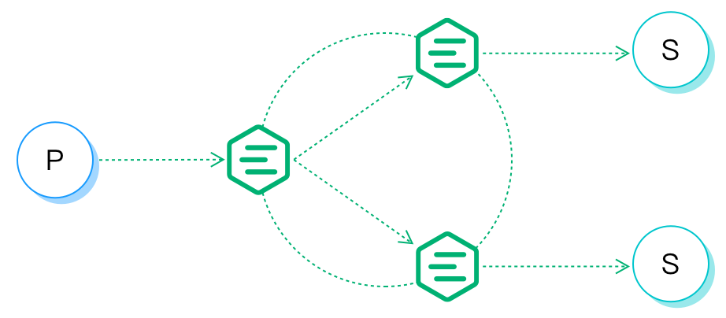

# 分布式集群

## Erlang/OTP 分布式编程

Erlang/OTP 最初是爱立信为开发电信设备系统设计的编程语言平台，电信设备(路由器、接入网关等)典型设计是通过背板连接主控板卡与多块业务板卡的分布式系统。

Erlang/OTP 语言平台的分布式程序，由分布互联的 Erlang 运行系统组成，每个 Erlang 运行系统被称为节点(Node)，节点(Node) 间通过 TCP 互联，消息传递的方式通信:


### 节点(Node)

Erlang 节点由唯一的节点名称标识，节点间通过名称进行通信寻址。 例如在本机启动四个 Erlang 节点，节点名称分别为:

```bash
erl -name node1@127.0.0.1
erl -name node2@127.0.0.1
erl -name node3@127.0.0.1
erl -name node4@127.0.0.1
```
node1@127.0.0.1 控制台下建立与其他节点的连接:

```bash
(node1@127.0.0.1)1> net_kernel:connect_node('node2@127.0.0.1').
true
(node1@127.0.0.1)2> net_kernel:connect_node('node3@127.0.0.1').
true
(node1@127.0.0.1)3> net_kernel:connect_node('node4@127.0.0.1').
true
(node1@127.0.0.1)4> nodes().
['node2@127.0.0.1','node3@127.0.0.1','node4@127.0.0.1']
```

## EMQ X 分布集群设计

EMQ X 消息服务器集群基于 Erlang/OTP 分布式设计，集群原理可简述为下述两条规则:

MQTT 客户端订阅主题时，所在节点订阅成功后广播通知其他节点：某个主题(Topic)被本节点订阅。

MQTT 客户端发布消息时，所在节点会根据消息主题(Topic)，检索订阅并路由消息到相关节点。

EMQ X 消息服务器同一集群的所有节点，都会复制一份主题(Topic) -> 节点(Node)映射的路由表，例如:

```bash
topic1 -> node1, node2
topic2 -> node3
topic3 -> node2, node4
```

### 主题树(Topic Trie)与路由表(Route Table)

EMQ X 消息服务器每个集群节点，都保存一份主题树(Topic Trie)和路由表。

例如下述主题订阅关系:

| 客户端  | 节点  | 订阅主题     |
| ------- | ----- | ------------ |
| client1 | node1 | t/+/x, t/+/y |
| client2 | node2 | t/#          |
| client3 | node3 | t/+/x, t/a   |


最终会生成如下主题树(Topic Trie)和路由表(Route Table):


### 订阅(Subscription)与消息派发

客户端的主题订阅(Subscription)关系，只保存在客户端所在节点，用于本节点内派发消息到客户端。

例如client1向主题’t/a’发布消息，消息在节点间的路由与派发流程:

```bash
title: Message Route and Deliver

client1 -> node1: Publish[t/a]
    node1 --> node2: Route[t/#]
        node2 --> client2: Deliver[t/#]
    node1 --> node3: Route[t/a]
        node3 --> client3: Deliver[t/a]
```




## 节点发现与自动集群
EMQ X 支持基于 Ekka 库的集群自动发现 (Autocluster)。Ekka 是为 Erlang/OTP 应用开发的集群管理库，支持
Erlang 节点自动发现 (Service Discovery)、自动集群 (Autocluster)、脑裂自动愈合 (Network Partition
Autoheal)、自动删除宕机节点 (Autoclean)。

EMQ X 支持多种节点发现策略:

| 策略     | 说明                |
| ------ | ----------------- |
| manual | 手动命令创建集群         |
| static | 静态节点列表自动集群     |
| mcast  | UDP 组播方式自动集群     |
| dns    | DNS A 记录自动集群      |
| etcd   | 通过 etcd 自动集群      |
| k8s    | Kubernetes 服务自动集群 |

### 手动(manual) 方式管理集群介绍
假设要在两台服务器 s1.emqx.io, s2.emqx.io 上部署 EMQ X 集群:

|                节点名                 | 主机名 (FQDN)  |   IP 地址    |
| ------------------------------------ | ------------- | ------------ |
| emqx@s1.emqx.io 或 emqx@192.168.0.10 | s1.emqx.io    | 192.168.0.10 |
| emqx@s2.emqx.io 或 emqx@192.168.0.20 | s2.emqx.io    | 192.168.0.20 |

**注意：** 节点名格式为 <Name@Host>, Host 必须是 IP 地址或 FQDN (主机名。域名)

#### 配置 emqx@s1.emqx.io 节点

emqx/etc/emqx.conf:

```bash
node.name = emqx@s1.emqx.io
# 或
node.name = emqx@192.168.0.10
```

也可通过环境变量:

```bash
export EMQX_NODE_NAME=emqx@s1.emqx.io && ./bin/emqx start
```

**注意:** 节点启动加入集群后，节点名称不能变更。

#### 配置 emqx@s2.emqx.io 节点

emqx/etc/emqx.conf:

```bash
node.name = emqx@s2.emqx.io
# 或
node.name = emqx@192.168.0.20
```

#### 节点加入集群

启动两台节点后，在 s2.emqx.io 上执行:

```bash
$ ./bin/emqx_ctl cluster join emqx@s1.emqx.io

Join the cluster successfully.
Cluster status: [{running_nodes,['emqx@s1.emqx.io','emqx@s2.emqx.io']}]
```
**注意:** s2.emqx.io加入集群后会清除本身全部的数据，同步s1.emqx.io节点的数据。如果还有s3.emqx.io节点，那么需要在s3.emqx.io节点去执行命令加入emqx@s1.emqx.io或者emqx@s2.emqx.io， 已经在集群的节点不能在join到其他节点，否则会退出当前集群和join的节点组成一个新的集群


在任意节点上查询集群状态:

```bash
$ ./bin/emqx_ctl cluster status

Cluster status: [{running_nodes,['emqx@s1.emqx.io','emqx@s2.emqx.io']}]
```

#### 退出集群

节点退出集群，两种方式:

1. leave: 让本节点退出集群
2. force-leave: 从集群删除其他节点

让 emqx@s2.emqx.io 主动退出集群:

```bash
$ ./bin/emqx_ctl cluster leave
```

或在 s1.emqx.io 上，从集群删除 emqx@s2.emqx.io 节点:

```bash
$ ./bin/emqx_ctl cluster force-leave emqx@s2.emqx.io
```


## 防火墙设置
若预先设置了环境变量 WITH_EPMD=1, 启动 emqx 时会使用启动 epmd (监听端口 4369) 做节点发现。称为 `epmd 模式`。
若环境变量 WITH_EPMD 没有设置，则启动 emqx 时不启用 epmd，而使用 emqx ekka 的节点发现，这也是 4.0 之后的默认节点发现方式。称为 `ekka 模式`。

**epmd 模式：**
如果集群节点间存在防火墙，防火墙需要开启 TCP 4369 端口和一个 TCP 端口段。4369 由 epmd 端口映射服务使用，TCP
端口段用于节点间建立连接与通信。

防火墙设置后，需要在 `emqx/etc/emqx.conf` 中配置相同的端口段:

```bash
## Distributed node port range
node.dist_listen_min = 6369
node.dist_listen_max = 7369
```

**ekka 模式（4.0 版本之后的默认模式）：**

如果集群节点间存在防火墙，默认情况下，只需要开启 TCP 4370 端口。

但如果 node.name 配置制定的节点名字里，带有数字后缀(Offset)，则需要开启 4370 + Offset 端口。

比如：

```
node.name = emqx-1@192.168.0.12
```

则需要开启 4371 端口。

