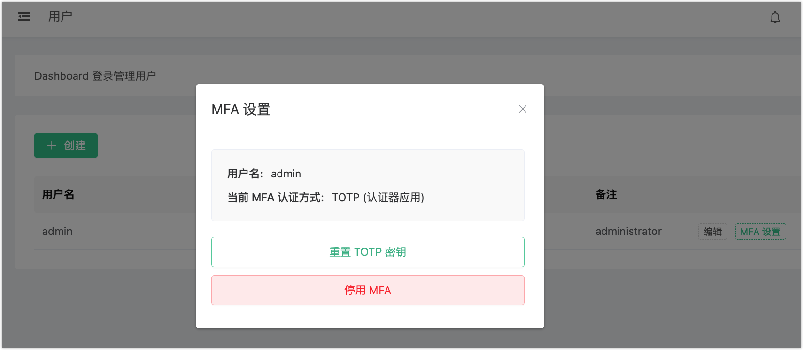

# Dashboard 多因素认证

多因素认证（MFA）为 Dashboard 登录增加了第二道安全屏障。用户输入用户名和密码后，还需提供由认证应用生成的基于时间的一次性密码（TOTP）。即使账户凭据泄露，Dashboard 也能得到有效保护。

MFA 兼容所有符合 TOTP 标准的认证应用，包括：

- Google Authenticator
- Microsoft Authenticator
- Authy

认证应用中显示的发行方名称为 **EMQX**。

管理员可以为单个用户启用 MFA，也可以通过 SAML 模块的 `force_mfa` 参数强制所有 SAML SSO 用户使用 MFA。用户账户的创建与管理详见 [Dashboard 用户与角色管理](./dashboard-users.md)。

本页同时从管理员和用户的角度出发解释了如何为 EMQX Dashboard 设置和使用 MFA。

## 关键概念

- **MFA**：一种安全功能，要求提供两种身份验证方式：用户的密码和第二种因素，如由身份验证器应用生成的TOTP。
- **TOTP**：由身份验证应用程序（如 Google Authenticator）生成的临时验证码，基于应用程序与服务器之间共享的密钥。
- **二维码**：共享密钥的图形表示，可以通过身份验证应用程序扫描以简化设置过程。

## MFA 工作原理

EMQX Dashboard 的 MFA 遵循状态机模型。每个用户的 MFA 状态按以下路径流转：

```
未启用 MFA
  │
  ▼ （管理员启用，或 force_mfa 生效）
需要设置
  │
  ▼ （用户扫描 QR 码）
设置进行中
  │
  ▼ （用户验证 TOTP 码）
已启用
  │
  ▼ （管理员禁用）
已禁用
```

当用户 MFA 处于**已启用**状态时，登录需要提供三项信息：用户名、密码以及当前 TOTP 码。服务端在密码验证通过后会签发一个短期有效的 **MFA 状态令牌**（JWT，有效期 5 分钟），用于后续 MFA 验证请求的鉴权。

:::tip

MFA 状态令牌 5 分钟后过期。若用户未在此时间窗口内完成 MFA 验证，需重新发起登录流程。

:::

## 启用和配置 MFA

MFA 默认为禁用状态。要为用户启用 MFA，管理员必须配置系统以支持 MFA，并为各个用户设置它。只有具有管理员权限的用户才能为其他用户启用或禁用 MFA。

### 通过 EMQX Dashboard 启用 MFA

管理员可以直接通过 Dashboard 启用 MFA，步骤如下：

1. 在 Dashboard 中，点击左侧菜单的**通用** -> **用户**。
2. 在**用户**页面中，您将看到一个用户列表。点击您要为其启用 MFA 的用户旁边的 **MFA 设置**。
3. 在 **MFA 设置**对话框中，点击**启用 MFA** 为所选用户启用 MFA。

启用后，用户将在下次登录时需要完成 MFA 设置过程。

::: tip 提示

如果您通过 Dashboard 为自己的账户启用 MFA，系统会在当前会话中立即提示您完成 MFA 设置（参见[首次设置](#首次设置)）。

如果管理员为其他用户启用 MFA，MFA 绑定步骤将延后至该用户下次登录时进行。

:::

### 重置 TOTP 密钥

设置了 MFA 后，如果用户需要重置其 TOTP 设置（例如，如果身份验证应用程序被卸载或密钥被泄露），管理员可以通过 **MFA 设置**对话框重置该用户的 TOTP 密钥。

1. 在**通用** -> **用户**页面中，找到您要重置 TOTP 密钥的用户。点击该用户旁边的 **MFA 设置**。

2. 在 **MFA 设置**对话框中，您将看到**重置 TOTP 密钥**按钮。点击该按钮将启动重置过程。

   

   会出现一个确认提示，通知您重置密钥将使之前的密钥无效。用户将在下次登录时需要设置一个新的 TOTP 密钥。

3. 点击**确定**以继续重置。重置后，用户将在下次登录时需要遵循首次 MFA 设置过程（扫描新的二维码或将新密钥输入到身份验证应用程序中）。

### 通过 REST API 启用和管理 MFA

管理员可以通过 REST API 启用或管理用户的 MFA。

::: tip

在 `/users/{username}/mfa` 端点上使用 POST 和 DELETE 方法时，仅管理员或当前身份验证令牌（即 “Bearer token”）的所有者可以使用此接口。也就是说，具有“查看者”角色的用户无法修改其他用户的 MFA 设置。只有与当前身份验证令牌关联的用户（“Bearer token” 拥有者）才能修改自己的 MFA 设置。

有关基于角色的访问控制（RBAC）的更多信息，请参见[角色说明](./dashboard-users.md)。

:::

#### 启用特定用户的 MFA

要为特定用户启用 MFA，管理员可以向 `/users/{username}/mfa` API 端点发送 POST 请求：

**请求：**

```bash
POST /api/v4/users/:username/mfa/enable
```

**示例：**

```bash
curl -u admin:public -X POST http://localhost:18083/api/v4/users/alice/mfa/enable
```

**响应：**

```json
{
  "code": 0,
  "data": {
    "message": "MFA setup required on next login"
  }
}
```

管理员为其他用户启用 MFA 后，该用户下次登录时会看到 **MFA 设置提示**，必须完成设置流程才能访问 Dashboard。

若管理员为自己启用 MFA，API 响应中会直接包含 QR 码 URI 和密钥，无需等到下次登录。

:::tip

可随时通过 `GET /api/v4/users/:username/mfa` 查询用户的 MFA 状态，详见[查询 MFA 状态](#查询-mfa-状态)。

:::

#### 停用特定用户的 MFA

管理员可为任意用户禁用 MFA。禁用后，用户只需使用用户名和密码即可登录。管理员可以向 `/users/{username}/mfa` API 端点发送 DELETE 请求。

**请求**：

```bash
POST /api/v4/users/:username/mfa/disable
```

**示例**：

```bash
curl -u admin:public -X POST http://localhost:18083/api/v4/users/alice/mfa/disable
```

**响应：**

```json
{
  "code": 0,
  "data": {
    "message": "MFA disabled"
  }
}
```

:::tip

即使 SAML 模块设置了 `force_mfa=true`，管理员仍可为单个 SSO 用户禁用 MFA。该设置在用户后续登录时生效。

:::

#### 重置 TOTP 密钥

管理员可使用以下请求重置 TOTP 密钥。旧密钥立即失效，用户下次登录时将重新进入设置流程。

```bash
POST /api/v4/users/:username/mfa/enable
```

加入 `reset=true` 参数：

```bash
curl -u admin:public \
     -H "Content-Type: application/json" \
     -X POST http://localhost:18083/api/v4/users/alice/mfa/enable \
     -d '{"reset": true}'
```

若管理员重置自己的密钥，响应中会立即包含新的 QR 码 URI 和密钥。

若管理员重置其他用户的密钥，该用户将回到**需要设置**状态，下次登录时须重新完成设置流程。

#### 查询 MFA 状态

管理员可查询任意用户的 MFA 状态。

```bash
GET /api/v4/users/:username/mfa
```

```bash
curl -u admin:public http://localhost:18083/api/v4/users/alice/mfa
```

**响应：**

```json
{
  "code": 0,
  "data": {
    "enabled": true,
    "setup_required": false
  }
}
```

用户列表接口也会为每个账户包含 MFA 相关字段：

```bash
GET /api/v4/users/
```

响应中每个用户对象包含：

```json
{
  "username": "alice",
  "mfa_enabled": true,
  "mfa_setup_required": false
}
```

## 使用 MFA 登录

当 MFA 为您的账户启用后，您需要按照以下步骤登录 EMQX Dashboard：

### 首次设置

在启用 MFA 后的首次登录时，您需要设置身份验证应用程序。

1. **输入您的用户名和密码**： 在登录页面，按通常方式输入您的用户名和密码。

2. **扫描二维码或输入设置密钥**： 在初步验证密码后，Dashboard 将提示您扫描二维码或手动将设置密钥输入到您的身份验证应用程序中以完成设置。

   :::warning 注意

   请将密钥或备份码保存在安全位置。若认证应用丢失，需由管理员重置 MFA 密钥，详见[重置 TOTP 密钥](#重置-totp-密钥)。

   :::

3. **验证应用程序中的代码**： 应用程序将生成未来登录的时效性验证码。输入应用程序中的验证码并点击**确定**。

   该验证码仅在短时间内有效（通常为 30 秒），因此请确保快速输入。


### 后续登录

完成初次设置后，您可以使用身份验证应用程序登录。

1. **输入您的用户名和密码**： 在后续的登录尝试中，输入您的用户名和密码。
2. **输入 TOTP 代码**： 验证密码后，系统会提示您输入由身份验证应用程序生成的 TOTP 代码。
3. **成功登录**： 如果验证码有效，您将成功登录 Dashboard。
4. **验证码无效**： 如果验证码错误或过期，您将看到一条错误消息。在这种情况下，您可以尝试重新输入当前身份验证应用程序中的验证码。

## MFA 与 SAML SSO

当 SAML 模块配置了 `force_mfa=true` 时，所有新 SSO 用户在首次登录时必须设置 MFA。SAML 登录重定向包含一个 `login_meta` 字段，指示所需操作：

- `mfa_setup_required: true`：用户必须先完成 MFA 设置才能访问 Dashboard。
- `mfa_required: true`：MFA 已配置，用户需提交 TOTP 码。

SSO 用户的设置流程和挑战流程与 [首次设置](#首次设置)和[使用 MFA 登录](#使用-mfa-登录)中描述的完全相同。

:::tip

即使模块级别设置了 `force_mfa=true`，管理员仍可为单个 SSO 用户禁用 MFA，详见[停用特定用户的 MFA](#停用特定用户的-mfa)。

:::

## 安全说明

- MFA 状态令牌（密码验证通过后签发）有效期为 **5 分钟**。
- TOTP 密钥存储在服务端的 Mnesia 数据库中，并在集群所有节点间同步复制。
- 未完成验证的待处理 MFA 会话每隔 5 分钟自动清理一次。

:::warning 注意

TOTP 码在其 30 秒周期前后的短暂时间窗口内有效。请确保服务器时钟与认证设备时钟同步，避免验证失败。

:::

## API 参考

| 接口 | 方法 | 鉴权 | 说明 |
|---|---|---|---|
| `/api/v4/auth` | POST | Basic | 登录。若 MFA 已启用，返回 `mfa_required` 或 `mfa_setup_required`。 |
| `/api/v4/auth/mfa_challenge` | POST | Bearer（MFA 状态令牌） | 提交 TOTP 码以完成登录。 |
| `/api/v4/mfa/setup` | POST | Bearer（MFA 状态令牌） | 获取初始 MFA 设置所需的 QR 码和密钥。 |
| `/api/v4/mfa/setup/verify` | POST | Bearer（验证令牌） | 通过验证 TOTP 码完成 MFA 设置。 |
| `/api/v4/users/:username/mfa/enable` | POST | Basic | 为用户启用 MFA。传入 `reset=true` 可重新生成密钥。 |
| `/api/v4/users/:username/mfa/disable` | POST | Basic | 为用户禁用 MFA。 |
| `/api/v4/users/:username/mfa` | GET | Basic | 查询用户的 MFA 状态。 |
