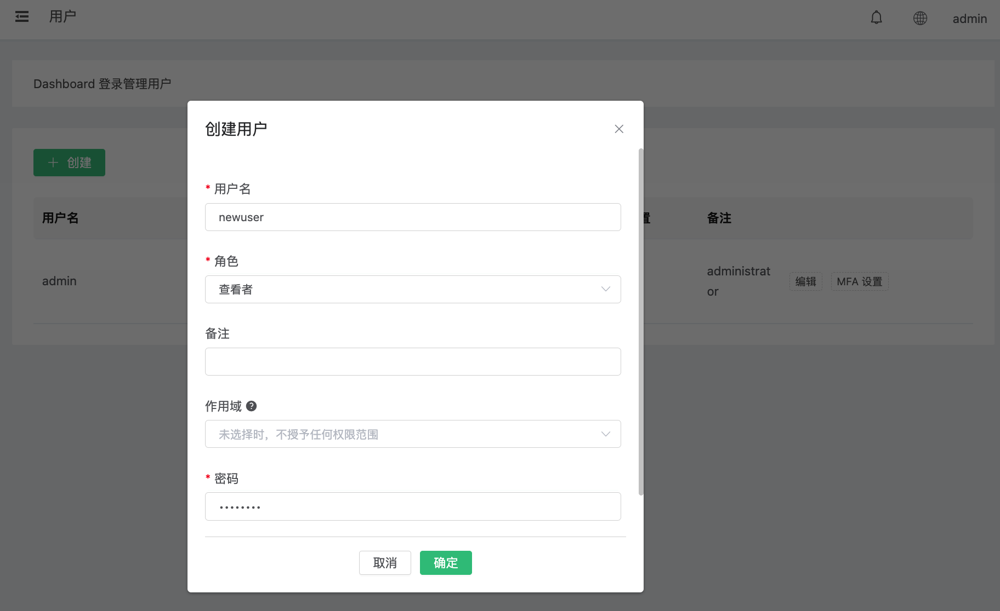

# Dashboard 用户与角色管理

EMQX Dashboard 支持多用户访问，并提供基于角色的访问控制（RBAC）。每个 Dashboard 账户都会被分配一个角色，该角色决定了账户可以查看和修改的内容。本页介绍如何通过 Dashboard 界面管理 Dashboard 用户与角色。

## 角色说明

EMQX Dashboard 内置两种角色：

| 角色 | 说明 |
|------|------|
| `administrator` | 拥有所有 Dashboard 功能和 REST API 的完整访问权限。可管理用户、模块、规则、客户端及集群的所有配置。 |
| `viewer` | 只读权限。可查看监控数据、客户端列表、订阅信息和统计数据，但无法修改任何配置。 |

:::tip
默认账户 `admin` 拥有 `administrator` 角色，且无法被删除。在生产环境部署前，请务必修改其密码。
:::

## 用户管理

本节介绍如何创建、查看、更新和删除 Dashboard 用户，以及如何修改用户密码。所有操作均需要 `administrator` 角色。

### 创建用户

1. 在左侧导航菜单中点击**用户**。

2. 点击**添加用户**。

3. 填写用户名、密码、角色及可选描述。

   | 字段 | 说明 |
   |------|------|
   | 用户名 | 允许使用字母、数字、下划线和连字符。 |
   | 密码 | 长度为 8-64 个字符，至少包含以下两种字符类型：字母、数字、特殊字符。仅支持 ASCII 字符。 |
   | 角色 | `administrator` 或 `viewer`，默认为 `viewer`。 |
   | 描述 | 用户的可选描述信息。 |
   | 启用 MFA | 设置后，该用户在首次登录时将被要求配置 MFA。详见 [Dashboard 多因素认证](./dashboard-mfa.md)。 |

4. 点击**确认**。

   

### 查看用户列表

在左侧导航菜单中点击**用户**，即可查看所有 Dashboard 用户及其角色信息。

### 更新用户

1. 在左侧导航菜单中点击**用户**。
2. 在用户列表中点击目标用户的**编辑**按钮。
3. 修改角色或描述信息后点击**确认**。

此操作不支持修改用户名或密码。如需修改密码，见[修改密码](#修改密码)。

### 删除用户

1. 在左侧导航菜单中点击**用户**。
2. 在用户列表中点击目标用户的**删除**按钮。
3. 在确认弹窗中点击**确认**。

:::danger
内置的 `admin` 用户不可删除，尝试删除将返回错误。
:::

:::warning
删除用户后，该用户的 MFA 配置将立即被清除，所有有效 Token 也会失效。该用户的所有活跃会话将被终止。
:::

### 修改密码

用户可以修改自己的密码。管理员可以修改任意用户的密码。

1. 在左侧导航菜单中点击**用户**。
2. 在用户列表中点击目标用户的**编辑**按钮。
3. 填写新密码后点击**确认**。

**密码规则：**
- 长度为 8 到 64 个字符
- 至少包含以下两种字符类型：字母、数字、特殊字符
- 仅支持 ASCII 字符

## 基于 Category 的精细权限控制

除了上述基于角色的访问控制，EMQX Enterprise 还支持对 Dashboard 用户进行基于 Category（权限类别）的细粒度权限控制。管理员可以通过分配具体的权限类别（scope），在角色权限的基础上进一步收窄用户的访问能力。

### 权限类别

EMQX 定义了 9 个权限类别（Category）：

| 类别 | 适用对象 | 说明 |
|------|---------|------|
| `banned` | API Key + Dashboard 用户 | 黑名单管理 |
| `rule_engine` | API Key + Dashboard 用户 | 规则引擎与动作 |
| `resources` | API Key + Dashboard 用户 | 连接器与桥接 |
| `plugins` | API Key + Dashboard 用户 | 插件管理 |
| `modules` | API Key + Dashboard 用户 | 模块配置 |
| `others` | API Key + Dashboard 用户 | 其他杂项端点 |
| `user_management` | 仅 Dashboard 用户 | 管理其他 Dashboard 账号 |
| `mfa_management` | 仅 Dashboard 用户 | 管理其他用户的 MFA |
| `app_management` | 仅 Dashboard 用户 | 管理 API Key |

前 6 类为原有的业务类别，同时适用于 API Key 与 Dashboard 用户。后 3 类为 Dashboard 用户专属，不可分配给 API Key。

### 角色与 Scope 兼容性

| 角色 | 可分配的 Scope | 角色默认值（未设置 scopes 时） |
|------|--------------|---------------------------|
| `administrator` | 全部 9 个类别 | 保持升级前行为：可访问所有端点 |
| `viewer` | 4 个通用类别 + 3 个 Dashboard 类别。`user_management` 和 `app_management` **不允许**分配给浏览者。 | 4 个通用类别 + `mfa_management`。只读（GET）端点不受 scope 限制，因为 GET 请求在 scope 层之上被短路。 |

用户修改自己的密码、管理自己的 MFA 以及登出操作始终允许，与 scope 设置无关。

### 为用户设置 Scope

在创建或更新用户时，管理员可以设置 `scopes` 字段以限制该用户的权限范围：

- **不设置**（使用角色默认值）：用户保持升级前基于角色的行为。
- **空数组 `[]`**：用户被拒绝访问所有需要 scope 的端点（自服务路径仍可用）。
- **非空数组**：用户只能访问属于所列类别的端点。

:::tip 示例
创建一个只能查看监控数据和自助管理 MFA 的浏览者：
```
scopes: ["modules", "mfa_management"]
```
:::

:::warning
浏览者无法被分配 `user_management` 或 `app_management`。尝试分配将返回错误。
:::

### 默认管理员保护

由 `dashboard.default_user.login` 配置的默认管理员账号具有额外的保护措施：

- 不可被降级为 `viewer` 角色。
- 不可设置显式的 `scopes` 字段（始终拥有全部类别）。
- 不可被删除。

这些保护机制确保集群始终拥有一个可恢复意外权限误配置的 break-glass 管理员账号。

## SSO 用户

当用户首次通过 SAML 单点登录（SSO）进行认证时，EMQX 会自动为其创建一个 Dashboard 账户，并分配 `viewer` 角色。

- SSO 用户的内部密码为随机生成，无法直接使用用户名和密码方式登录。
- 管理员可通过 Dashboard 用户页面修改 SSO 用户的角色。
- SAML SSO 的配置详情请参考 [SAML 2.0 单点登录](../modules/saml_sso.md)文档。

:::tip
如需为 SSO 用户授予管理员权限，可在**用户**页面编辑该用户，将其角色更改为 `administrator`。
:::
