---
# 编写日期
date: 2020-02-25 17:15:26
# 作者 Github 名称
author: tigercl
# 关键字
keywords:
# 描述
description:
# 分类
category: 
# 引用
ref:
---

# Dashboard

## 简介

EMQ X 提供了 Dashboard 以方便用户管理设备与监控相关指标。通过 Dashboard，你可以查看服务器基本信息、负载情况和统计数据，可以查看某个客户端的连接状态等信息甚至断开其连接，也可以动态加载和卸载指定插件。除此之外，EMQ X Dashboard 还提供了规则引擎的可视化操作界面，同时集成了一个简易的 MQTT 客户端工具供用户测试使用。

## 启用 Dashboard

EMQ X Dashboard 功能由 [emqx-dashboard](https://github.com/emqx/emqx-dashboard) 插件实现，该插件默认处于启用状态，它将在 EMQ X 启动时自动加载。如果你希望禁用 Dashboard 功能，你可以将 `data/loaded_plugins`（请参见 [插件](../advanced/plugins.md#)）中的 `{emqx_dashboard, true}` 修改为 `{emqx_dashboard, false}`。

```bash
{emqx_dashboard, true}.
```

## 查看 Dashboard

EMQ X Dashboard 是一个 Web 应用程序，你可以直接通过浏览器来访问它，无需安装任何其他软件。

当 EMQ X 成功运行在你的本地计算机上且 EMQ X Dashboard 被默认启用时，你可以访问 http://localhost:18083 来查看你的 Dashboard，默认用户名是 `admin`，密码是 `public`。

## 配置 Dashboard

您可以在 `etc/plugins/emqx_dashboard.conf` 中查看或修改 EMQ X Dashboard 的配置，注意此处的 `etc` 并非指系统目录，请参见 [目录结构](directory.md#)。

EMQ X Dashboard 配置项可以分为**默认用户**与**监听器**两个部分：

**默认用户**

EMQ X Dashboard 可以配置多个用户，但在配置文件中仅支持配置默认用户。

需要注意的是，一旦您通过 Dashboard 修改了默认用户的密码，则默认用户的相关信息将以您在 Dashboard 上的最新改动为准，配置文件中的默认用户配置将被忽略。

**监听器**

EMQ X Dashboard 支持 HTTP 和 HTTPS 两种 Listener，但默认只启用了监听端口为 18083 的 HTTP Listener，关于 Listener 的介绍请参见 [配置说明](config.md#)。

关于 Dashboard 的详细配置项说明，请参见 [配置项](../configuration/configuration.md)。

:::: tabs

::: tab 开源版
## Dashboard 界面

为了使用户在操作和浏览中可以快速地定位和切换当前位置，EMQ X Dashboard 采用了侧边导航的模式，默认情况下 Dashboard 包含以下一级导航项目：  

| 导航项目    | 说明                                              |
| ----------- | ------------------------------------------------- |
| MONITORING  | 提供了服务端与客户端监控信息的展示页面            |
| RULE ENGINE | 提供了规则引擎的可视化操作页面                    |
| MANAGEMENT  | 提供了扩展插件与应用的管理页面                    |
| TOOLS       | 提供了 WebSocket 客户端工具以及 HTTP API 速查页面 |
| ADMIN       | 提供了 Dashboard 用户管理和显示设置等页面         |

### MONITORING

EMQ X Dashboard 提供了非常丰富的数据监控项目，完整地覆盖了服务端与客户端，这些信息都将在 `MONITORING` 下的页面中被合理地展示给用户。

#### Overview

`Overview` 作为 Dashboard 的默认展示页面，提供了 EMQ X 当前节点的详细信息和集群其他节点的关键信息，以帮助用户快速掌握每个节点的状态。


#### Clients

`Clients` 页面提供了连接到指定节点的客户端列表，同时支持通过 `Client ID` 直接搜索客户端。除了查看客户端的基本信息，您还可以点击每条记录右侧的 `Kick Out` 按钮踢掉该客户端，注意此操作将断开客户端连接并终结其会话。

`Clients` 页面使用快照的方式来展示客户端列表，因此当客户端状态发生变化时页面并不会自动刷新，需要您手动刷新浏览器来获取最新客户端数据。

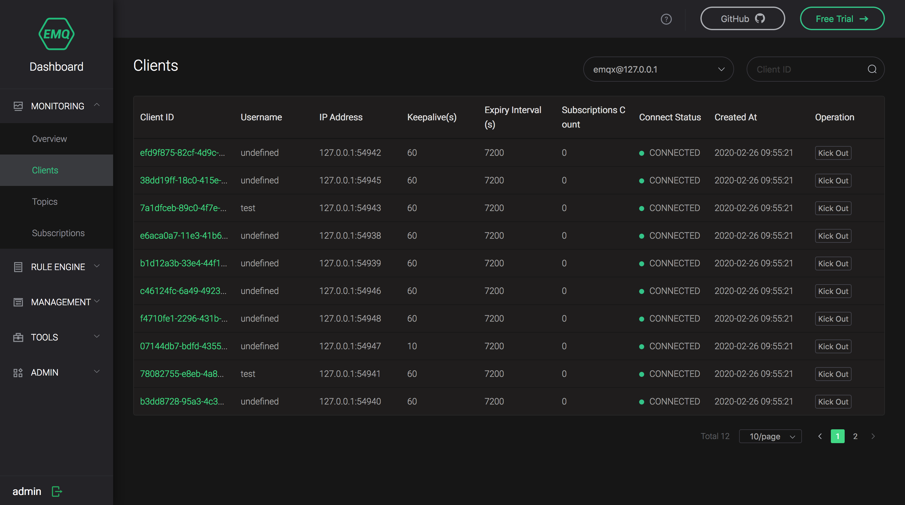

如果你无法在客户端列表获取到你需要的信息，你可以单击 `Client ID` 来查看客户端的详细信息。


我们将客户端详情中的各个字段分为了 **连接**，**会话** 和 **指标** 三类，以下为各字段的说明：

**连接**

| 字段名            | 说明                                                       |
| ----------------- | ---------------------------------------------------------- |
| Node              | 客户端连接的节点名称                                       |
| Client ID         | 客户端标识符                                               |
| Username          | 客户端连接时使用的用户名，出于安全性考虑，密码将不会被展示 |
| Protocol          | 客户端使用的协议名称及其版本                               |
| IP Address        | 客户端的网络 IP 地址，地址可以是 IPv4 或 IPv6              |
| Port              | 客户端源端口                                               |
| Is Bridge         | 指示客户端是否通过桥接方式连接                             |
| Connected At      | 客户端连接时间                                             |
| Disconnected At   | 客户端离线时间                                             |
| Connection Status | 客户端连接状态                                             |
| Zone              | 指示客户端所使用的配置组                                   |
| Keepalive         | 保持连接时间，单位：秒                                     |

**会话**

| 字段名                             | 说明                                             |
| ---------------------------------- | ------------------------------------------------ |
| Clean Session                      | 指示客户端是否使用了全新的会话                   |
| Expiry Interval                    | 会话过期间隔，单位：秒                           |
| Created At                         | 会话创建时间                                     |
| Subscriptions Count                | 当前订阅数量                                     |
| Maximum Subscriptions Count        | 允许建立的最大订阅数量                           |
| Inflight Window Size                | 当前飞行窗口大小，请参见 [飞行窗口与消息队列](../advanced/inflight-window-and-message-queue.md#) |
| Maximum Inflight Window Size        | 飞行窗口最大大小                                 |
| Message Queue Size                 | 当前消息队列大小，请参见 [飞行窗口与消息队列](../advanced/inflight-window-and-message-queue.md#) |
| Maximum Message Queue Size         | 消息队列最大大小                                 |
| Uncomfirmed PUBREC Packets         | 未确认的 PUBREC 报文数量                         |
| Maximum Uncomfirmed PUBREC Packets | 允许存在未确认的 PUBREC 报文的最大数量           |

**指标**

| 字段名                             | 说明                                   |
| ---------------------------------- | -------------------------------------- |
| Number of Bytes Received           | EMQ X Broker（下同）接收的字节数量 |
| Number of TCP Packets Received     | 接收的 TCP 报文数量                    |
| Number of MQTT Packets Received    | 接收的 MQTT 报文数量                   |
| Number of PUBLISH Packets Received | 接收的 PUBLISH 报文数量                |
| Number of Bytes Sent               | 发送的字节数量                         |
| Number of TCP Packets Sent         | 发送的 TCP 报文数量                    |
| Number of MQTT Packets Sent        | 发送的 MQTT 报文数量                   |
| Number of PUBLISH Packets Sent     | 发送的 PUBLISH 报文数量                |

在客户端详情的 `Subscriptions` 标签页中，您可以查看当前客户端的订阅信息，以及新建或取消订阅：


#### Subscriptions

`Subscriptions` 页面提供了指定节点下的所有订阅信息，并且支持用户通过 `Client ID` 查询指定客户端的所有订阅。


### RULE ENGINE

使用 EMQ X 的规则引擎可以灵活地处理消息和事件，例如将消息转换成指定格式后存入数据库表或者重新发送到消息队列等等。为了方便用户更好地使用规则引擎，EMQ X Dashboard 提供了相应的可视化操作页面，您可以点击 `RULE ENGINE` 导航项目来访问这些页面。

鉴于规则引擎的相关概念比较复杂， 涉及到的操作可能会占据相当大的篇幅，考虑到您的阅读体验，我们将通过额外的文档来介绍规则引擎，请参见 [规则引擎](../rule/rule-engine.md#)。

### MANAGEMENT

目前 EMQ X Dashboard 的 `MANAGEMENT` 导航项目下主要包括扩展插件（请参见 [插件](../advanced/plugins.md#)）的监控管理页面和用于 HTTP API 认证的 AppID 与 AppSerect（请参见 [HTTP API](../advanced/http-api.md#)）的管理页面。

#### Plugins

`Plugins` 页面列举了 EMQ X 能够发现的所有插件，包括 EMQ X 官方插件与您遵循 EMQ X 官方标准自行开发的插件，您可以在此页面查看插件当前的运行状态以及随时启停插件。

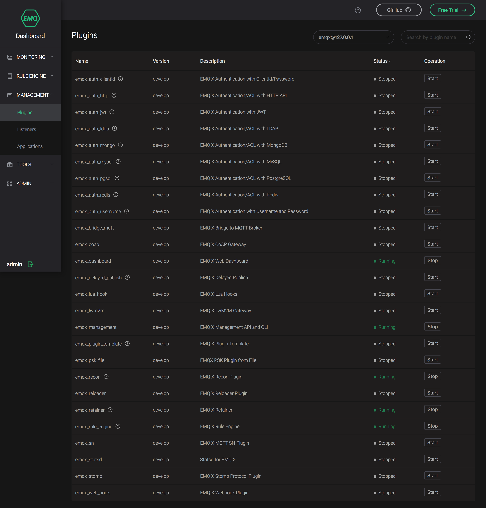

您可以看到，除了 [emqx-dashboard](https://github.com/emqx/emqx-dashboard) 以外，EMQ X 还将默认启动 [emqx-rule-engine](https://github.com/emqx/emqx-rule-engine) 等 4 个插件：


#### Applications

`Applications` 页面列举了当前已创建的应用，您可以在此页面进行诸如创建应用、临时禁用或启动某个应用的访问权限等操作。EMQ X 会创建一个 AppID 为 `admin`，AppSecret 为 `publish` 的默认应用方便用户首次访问：


您可以点击 `Application` 页面右上角的 `New App` 按钮来创建一个新的应用，其中 AppID 与 AppSecret 是必选项。创建完成后您可以点击 `View` 按钮来查看应用详情，AppSecret 也会在详情中显示。以下是相关字段的说明：

| 字段名       | 说明                                                         |
| ------------ | ------------------------------------------------------------ |
| AppID        | 应用标识符，用于区分不同的应用，因此不可重复，在创建应用时 Dashboard 将自动为你生成一个随机的建议应用标识符 |
| AppName      | 应用名称，可以重复，但为了方便您自己使用，我们不建议使用重复的应用名称 |
| AppSecret    | 由 EMQ X 分配的应用密钥，可以在应用详情中查看                |
| Expired date | 应用的过期时间，默认为永不过期                               |
| Remark       | 您对应用的描述，方便后期管理                                 |
| Status       | 应用状态，只有 Allowed 与 Denied 两种，Denied 状态下 EMQ X 将拒绝使用该 AppID 与 App Secret 的 HTTP API 的访问请求 |

### TOOLS

目前 EMQ X Dashboard 的 `TOOLS` 导航项目下主要包括 WebSocket 客户端工具页面以及 HTTP API 速查页面。

#### Websocket

`Websocket` 页面为您提供了一个简易但有效的 WebSocket 客户端工具，它包含了连接、订阅和发布功能，同时还能查看自己发送和接收的报文数据，我们期望它可以帮助您快速地完成某些场景或功能的测试验证：


#### HTTP API

`HTTP API` 页面列举了 EMQ X 目前支持的所有 HTTP API 及其说明：


### ADMIN

#### Users

您可以在 `Users` 页面查看和管理能够访问和操作 Dashboard 的用户：


#### Settings

目前 EMQ X Dashboard 仅支持修改主题和语言两种设置：


#### Help

如果您在使用 EMQ X 的过程中遇到了任何问题，我们在 `Help` 页面为您提供了 FAQ 等文档的链接。如果我们现有的文档依然无法解决您的问题，您可以前往我们在 Github 的开源社区咨询我们的技术人员。

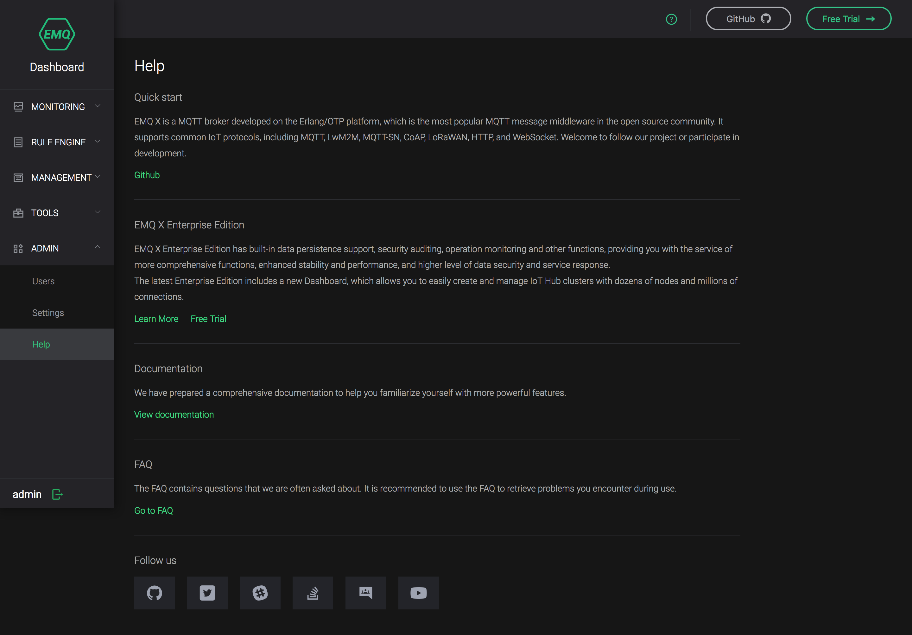

:::

::: tab 企业版
## 基本使用

如果 EMQ X 安装在本机，则使用浏览器打开地址 <http://127.0.0.1:18083> ，如需登录输入默认用户名 `admin`
与默认密码 `public` ，登录进入
Dashboard。如果忘记管理用户账号信息，点击登录页面**忘记密码**按钮按指引操作或使用管理命令重置或新建管理账号。

Dashboard 界面如下图所示，包含左侧导航栏、顶部控制栏和中间内容区，顶部控制栏（红框区域）四个功能分别是：

  - 告警信息：EMQ X 告警信息，由资源使用过高、EMQ X 内部错误触发显示告警数量，点击可查看告警列表；
  - 用户信息：当前登录 Dashboard 用户名，可进行登出、修改密码等操作；
  - 多语言切换：Dashboard 根据用户浏览器语言默认显示中/英文，点击可进行语言切换；
  - 最近页面导航：最近打开的页面将以 Tab
形式显示，点击可以快速进行页面切换。

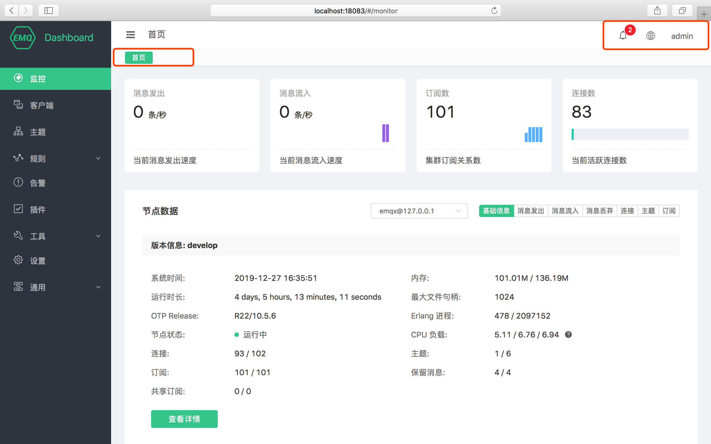

## 监控

**监控**页面可查看 EMQ X 当前集群的运行指标，界面从上到下功能区如下：

### 集群运行指标

页面顶部四个指标卡片，包含**集群**的消息发出、消息流入速率，订阅数和当前连接数。

### 节点数据

点击节点下拉列表可以切换查看节点的基本信息包括 EMQ X 版本信息、运行时间、资源占用、连接和订阅等数据。 部分信息释义如下：

  - 内存： Erlang 虚拟机使用的当前内存/最大内存，其中**最大内存由 EMQ X 视资源使用情况自动向系统申请**，并非 EMQ X
    所在节点服务器物理内存用户无需干预；
  - 最大文件句柄：允许当前会话/进程打开文件句柄数，**该值过小会限制 EMQ X 并发性能**，在远小于 License
    授权最大连接数时，请参照测试调优或联系 EMQ 技术人员进行修改；
  - Erlang 进程、连接、主题、订阅、保留消息、共享订阅：该四个值通过 `/`
分割为两组，分别是当前值与最大值。

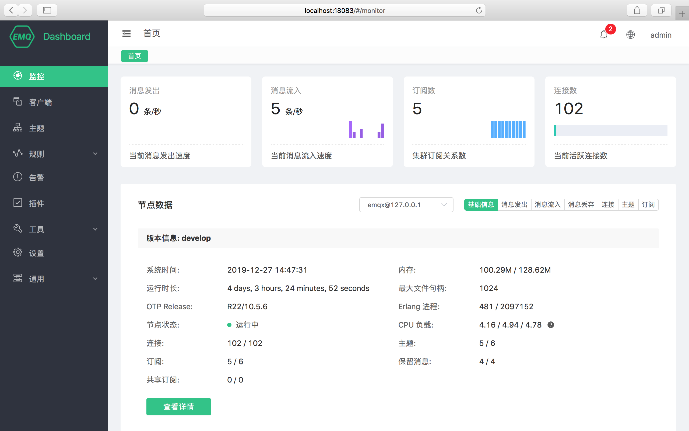

### 历史数据

点击**节点数据**区域右侧按钮组可以切换查看近期集群运行数据图表，图表数值均为抽样周期内实际数值：


### 节点详细信息

点击节点数据下方 **查看详情** 按钮可以跳转至节点详情，查看当前节点的**基础信息**、**监听器**及连接情况，**度量指标**等信息。

#### 监听器

监听器为当前 EMQ X 监听网络端口列表，字段信息如下：

  - 监听协议：监听的网络/应用协议，包含协议与功能信息：
      - mqtt:ssl： MQTT TCP TLS 加密协议，默认最大连接数 102400
      - mqtt:tcp： MQTT TCP 协议，默认最大连接数 1024000
      - <http:dashboard：Dashboard> 使用的 HTTP 协议，默认最大连接数 512
      - <http:management：EMQ> X REST API 使用的 HTTP 协议，默认最大连接数 512
      - mqtt:ws：MQTT WebSocket 协议，默认最大连接数 102400
      - mqtt:wss：MQTT WebSocket TLS 加密协议，默认最大连接数 102400
  - 监听地址：监听绑定的网络地址与端口，默认监听全部 IP 地址；
  - Acceptors：监听处理器线程池，可通过各自协议 `*.acceptors`
    字段配置；
  - 连接：包含一组**当前值/最大值**，当前值为实际建立连接数量，最大值为配置文件配置的最大连接数量，**每个监听器超出最大值后将无法建立新连接。**

#### 最大连接数说明

实际可用连接最大由 License 规格与配置文件共同决定：

1.  节点内每个监听协议连接数不能超过配置文件最大连接数；
2.  集群内 mqtt 协议的连接总数不能超过 License 规格上限。

系统调优与当前资源使用情况也可能会影响最大连接数，此处请参照
[测试调优](https://docs.emqx.io/broker/v3/cn/tune.html) 或联系 EMQ
技术人员进行确认。


### License 信息

监控页面底部为 License 信息卡片，可以查看当前集群内 License 信息：

  - 签发对象：同商务合同客户公司或部门名称；
  - License 使用情况：License 规格与当前使用量；
  - 签发邮箱：同商务合同客户联系邮箱；
  - License 类型：右下角标识 License 信息，为试用版或正式版。

证书到期后您需要续签商务合同获取新的 License 证书并按照 License 更新方式或联系 EMQ 技术人员更新 License
证书，证书到期前 EMQ
将通过邮件通知签发邮箱，请留意信息接收以免错过续期时间对业务造成影响。

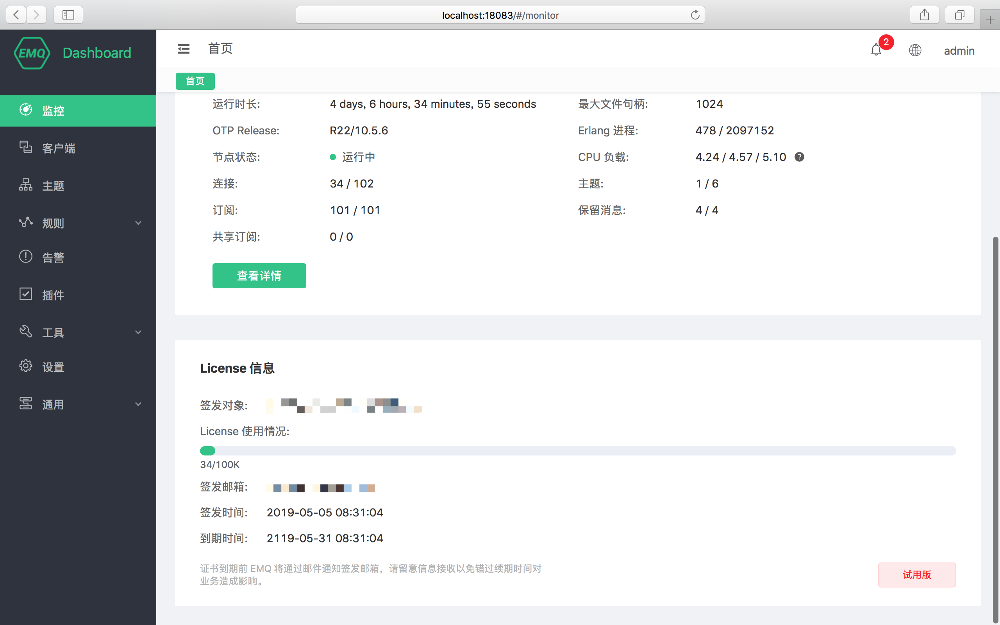

## 客户端

### 客户端列表

客户端列表页面显示当前连接客户端列表，列表中几个重要信息如下：

  - 客户端 ID、用户名：分别是 MQTT Client ID 与 MQTT Username，点击绿色**客户端
    ID**可以查看客户端详情与订阅列表信息；
  - IP 地址：客户端 IP + 端口信息；
  - 连接状态：客户端在线状态，如果客户端已断开连接，但启用了**保留会话（Clean
    Session**）且会话未过期，此处将显示显示为**未连接**；
  - 断开连接/清除会话：对于在线的客户端，将断开其连接并清除会话，如果客户端不在线，点击清除会话将清除客户端订阅关系等会话信息。


### 基本信息

点击绿色**客户端
ID**可以查看客户端详情与订阅列表信息，**基本信息**包含所选客户端连接信息与会话信息，包含消息流量、消息统计等关键业务信息。


### 订阅列表

**订阅列表**包含所选客户端订阅信息。

  - 取消订阅：点击取消按钮将删除设备与主题的订阅关系，对于设备该操作是无感的；
  - 添加订阅：为所选客户端代理订阅指定主题。


## 主题

主题页面包含**集群**内全部主题（Topic）信息。


## 规则引擎

### 规则列表

规则引擎使用 SQL 设定规则，对消息数据进行筛选、编解码、变型，灵活地将处理后的数据无缝转发至数据库、流处理、API 网关等数据目的地。

规则引擎不仅提供了清晰、灵活的"配置式"的业务集成方案，简化了业务开发流程，提升用户易用性，降低业务系统与 EMQ X
的耦合度；也为用户私有功能定制提供了一个更优秀的基础架构。

规则引擎列表数据如下：

  - ID：规则集群内唯一 ID，可用在管理命令和 REST API
操作中；
  - 主题：规则对应的消息主题或事件主题；
  - 监控：点击将弹出所选规则执行情况统计，包括规则命中次数与执行次数，动作触发成功/失败次数统计；
  - 响应动作：一个或多个规则的响应动作。

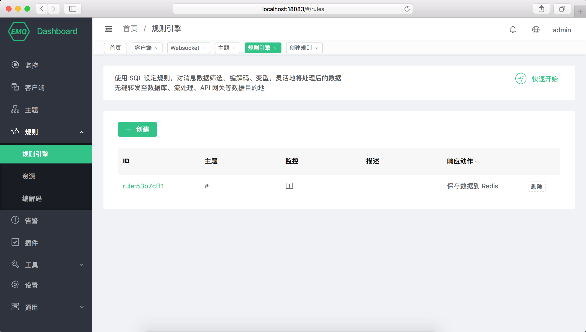

### 创建规则

EMQ X 在消息发布、事件触发时将触发规则引擎，满足触发条件的规则将执行各自的 SQL 语句筛选并处理消息和事件的上下文信息。

规则引擎借助响应动作可将特定主题的消息处理结果存储到数据库，发送到 HTTP Server，转发到消息队列 Kafka 或
RabbitMQ，重新发布到新的主题甚至是另一个 Broker 集群中，每个规则可以配置多个响应动作。

1.  选择发布到 t/\# 主题的消息，并筛选出全部字段：

<!-- end list -->

```sql
SELECT * FROM "t/#"
```

2.  选择发布到 t/a 主题的消息，并从 JSON 格式的消息内容中筛选出 "x" 字段：

<!-- end list -->

```sql
SELECT payload.x as x FROM "t/a"
```

规则引擎使用 **$events/** 开头的虚拟主题（**事件主题**）处理 EMQ X
内置事件，内置事件提供更精细的消息控制和客户端动作处理能力，可用在
QoS 1 QoS 2 的消息抵达记录、设备上下线记录等业务中。

1.  选择客户端连接事件，筛选 Username 为 'emqx'
的设备并获取连接信息：

<!-- end list -->

```sql
SELECT clientid, connected_at FROM "$events/client_connected" WHERE username = 'emqx'
```

规则引擎数据和 SQL
语句格式，事件主题列表详细教程参见该文档规则引擎部分。


## 资源

资源保存了规则引擎动作所需的资源实例(如数据库连接实例，Web Server 的连接信息)，创建规则前需要创建相关动作所需资源并保证资源可用。

### 资源列表

资源列表数据如下：

  - ID：资源集群内唯一 ID，可用在管理命令和 REST API
操作中；
  - 状态：资源创建后，集群中的每个节点都将与资源建立连接，点击展开节点上资源状态；
  - 删除：规则引擎正在使用中的资源无法删除，请先删除依赖所选资源的规则再进行删除操作。

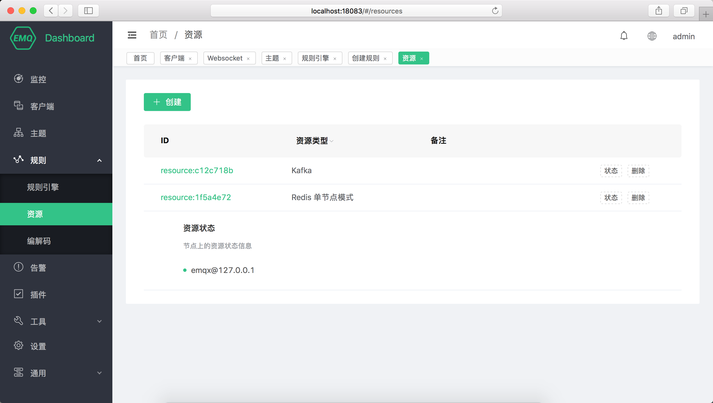

### 创建资源

点击**新建**按钮打开资源创建弹出框，选择资源类型、输入对应的连接信息即可创建资源，点击**测试连接**可在创建前进行资源连通性检查。


## 编解码

编解码（Schema Registry） 用于管理编解码使用的 Schema、处理编码或解码请求并返回结果。编解码配合规则引擎，可进行
Protobuf、Avro 以及私有协议上/下行消息解析处理，实现如消息加密、消息压缩、任意二进制-JSON 消息互转等复杂操作。

## 模块

模块页面用于查看 EMQ X 创建管理模块功能操作。

Dashboard 上模块的创建、启动、停止操作是集群同步的，如果模块启动失败，请检查集群内每个节点的配置是否正确，任意集群启动失败都无法成功启动模块。

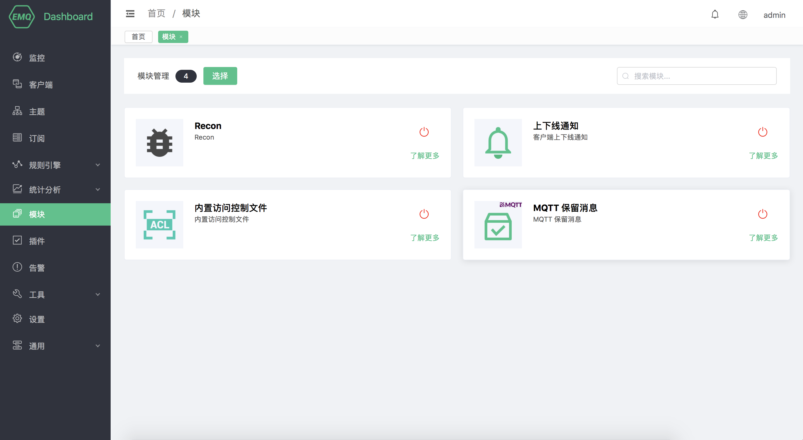

## 插件

插件页面用于查看 EMQ X 内置插件列表、进行插件的启动、停止操作。

不同于命令行插件管理，Dashboard 上插件的启动、停止操作是集群同步的，如果插件启动失败，请检查集群内每个节点的配置是否正确，任意集群启动失败都无法成功启动插件。


## 告警

用于展示 EMQ X 基础的告警信息，包含当前告警与历史告警信息。更高级的告警与日志与监控管理由 EMQ X Control Center
提供，如有需要请联系 EMQ
技术人员获取。

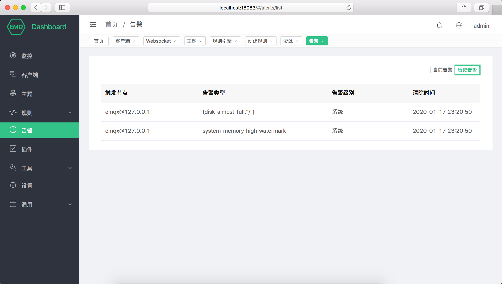

## 工具

提供 WebSocket MQTT 客户端测试工具，可同时实现多个 MQTT 连接的发布、订阅测试。

## 设置

设置页面提供 EMQ X 集群的基础参数配置（热配置）与集群配置。

### 基础设置

基础在设置开放了 `emqx.conf` 中可以进行热更新的部分配置项，您无需重启 EMQ X 即可完成大部分关键信息如是否开启匿名认证、ACL
缓存事件、ACL 缓存开关等配置。

基础设置是以 Zone 来组织的，默认情况下 external Zone 关联了 1883 端口所在监听器。


### zones设置
动态设置zones相关配置，修改后在整个集群生效，并且会持久化在emqx内部。(不会同步到etc/zones.conf)
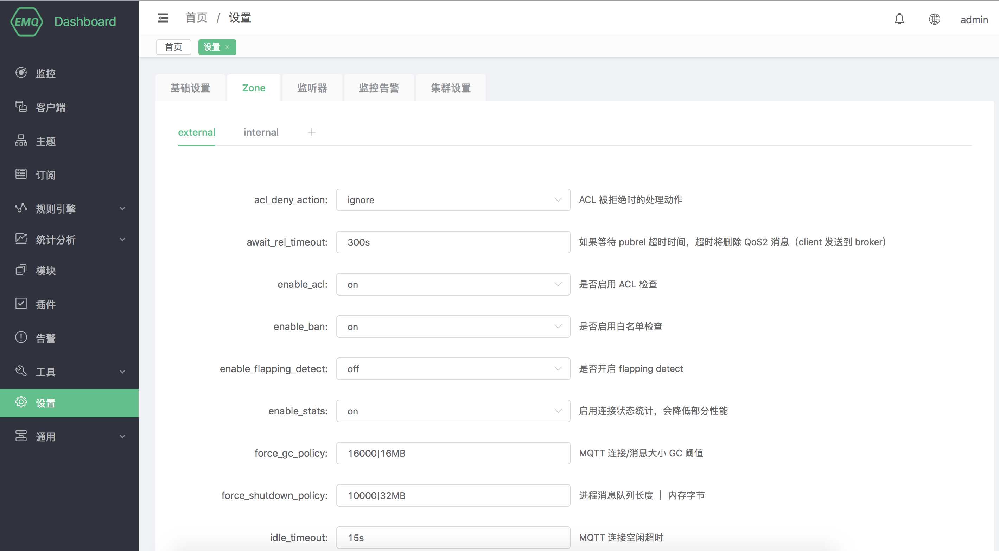

### 监听器设置
动态设置监听器相关配置，修改后在整个集群生效，并且会持久化在emqx内部。(不会同步到etc/listeners.conf)
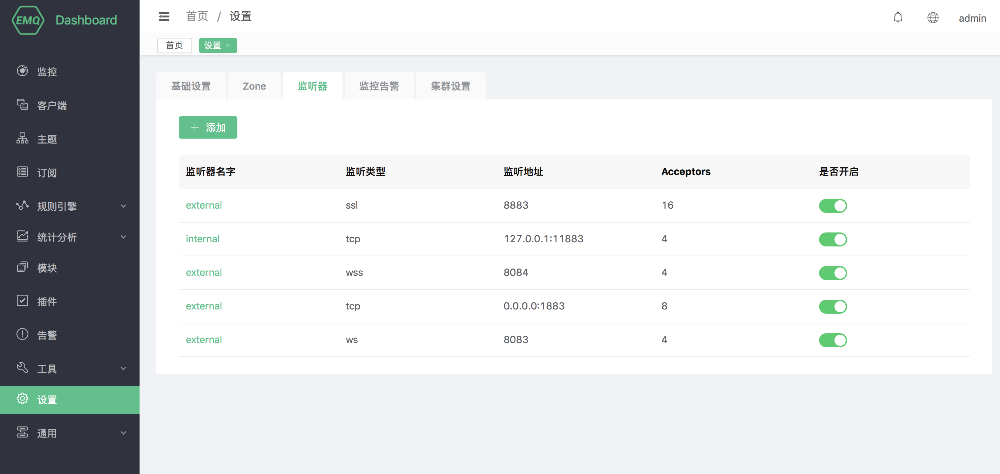

### 监控告警设置
动态设置监控告警配置，修改后在整个集群生效，并且会持久化在emqx内部。(不会同步到etc/sys_momn.conf)
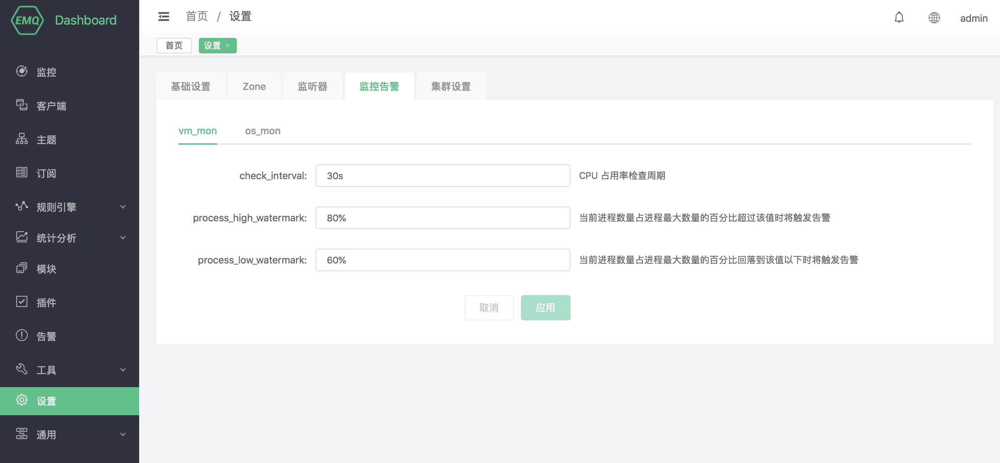

### 集群设置

集群设置无法更改集群方式，但可用于手工集群邀请节点加入集群。

## 通用

### 应用

应用为调用 REST API 认证凭证，通过 REST API 查询、调整 EMQ X 集群信息，对客户端连接、插件、EMQ X
集群进行管理操作。

应用创建成功后，点击应用列表 **App ID** 列中的应用 ID 可以查看应用 ID
与应用密钥，您可以编辑应用状态与到期时间，新建或删除应用。

### 用户

Dashboard 登录用户管理，您可以创建、编辑、删除用户，如果忘记用户密码，可通过管理命令进行密码重置。

### 黑名单

黑名单用于禁止客户端建立连接，该功能适用于管理少量客户端，黑名单在有效时间到期后将失效。

黑名单支持以下三种方式禁止客户端连接：

  - clientid：通过客户端 ID（Client ID） 进行封禁；
  - username：通过用户名（Username）进行封禁；
  - peerhost：通过对等主机（如 IP
地址）进行封禁。

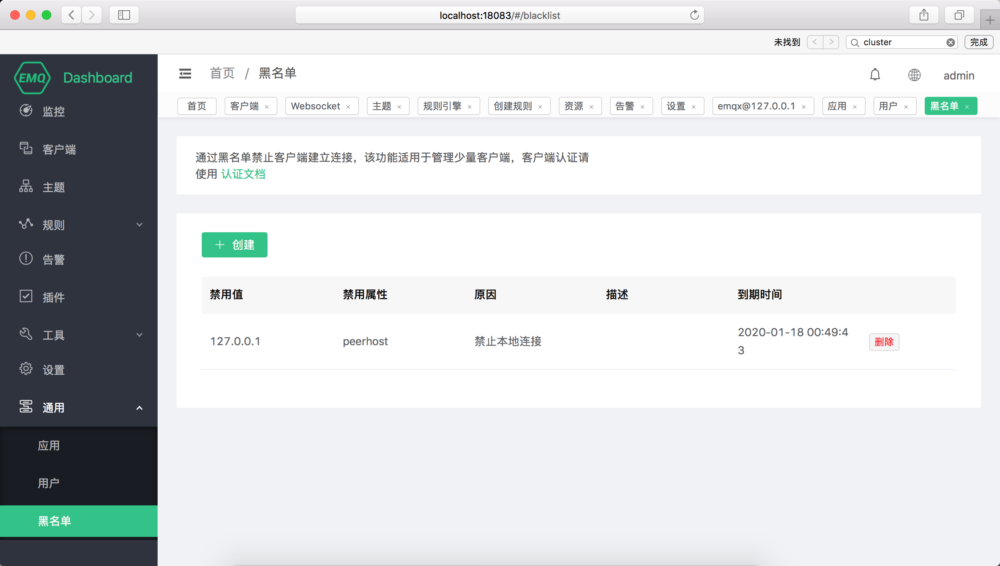

:::

::::
