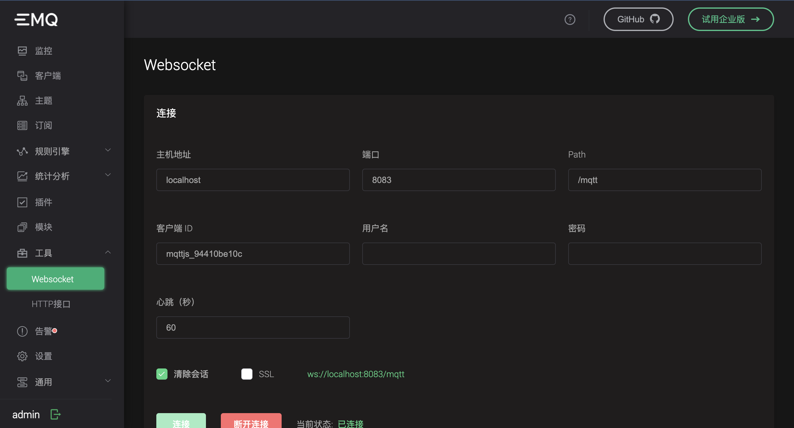
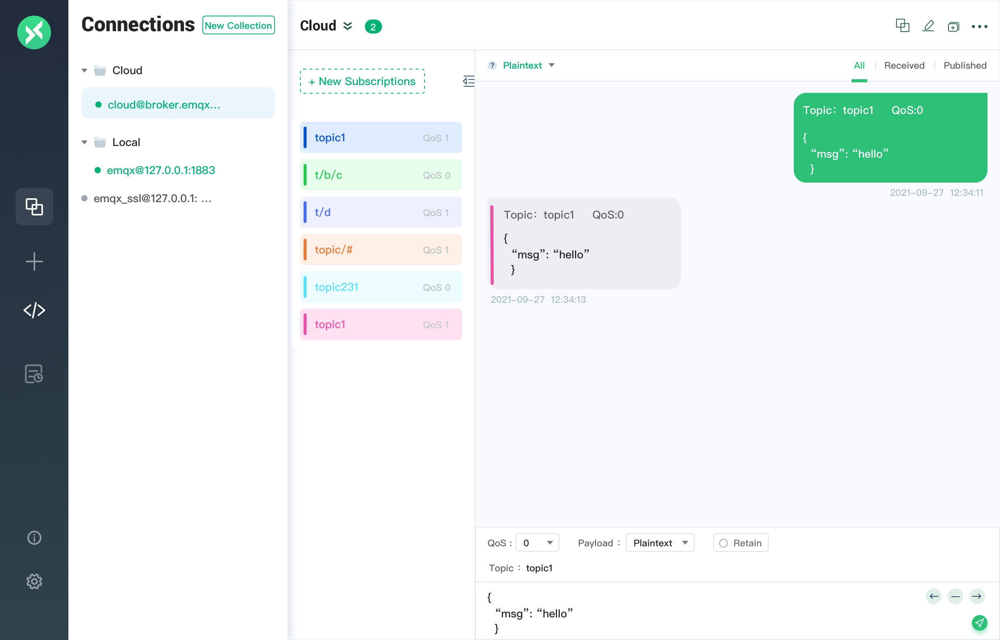

---
# 编写日期
date: 2022-01-25 09:53:20
# 作者 Github 名称
author: wivwiv
# 关键字
keywords:
# 描述
description:
# 分类
category:
# 引用
ref:
---

# 快速开始

本章节将指导您从下载安装开始，快速开始使用 EMQ X。

## 版本选择

EMQ X 提供开源版和企业版下载安装，也提供了全托管的 MQTT 云服务 EMQ X Cloud，您可以选择合适您的部署方式，快速开始使用。

:::: tabs type:card

::: tab EMQ X 开源版
大规模可弹性伸缩的云原生分布式物联网 MQTT 消息服务器，高效可靠连接海量物联网设备，高性能实时处理消息与事件流数据，助力构建关键业务的物联网平台与应用。

- 基于 APL 2.0 开放源码协议
- 完整 MQTT 3.x 和 5.0 规范
- Masterless 高可用集群架构
- 高并发、低时延、高性能
- 可扩展的网关和插件体系

[下载安装](https://www.emqx.com/zh/try?product=broker)
:::

::: tab EMQ X Cloud
通过可靠、实时的物联网数据移动、处理和集成，连接您的海量物联网设备。加快您的物联网应用开发，免除基础设施管理维护负担。

- 全托管的 MQTT 5.0 服务
- 基于 SQL 的 IoT 规则引擎
- 多种数据库与云服务集成
- 关键业务的高可用高可靠
- 在任何地方运行，随用随付

[免费试用](https://www.emqx.com/zh/try?product=cloud)
:::

::: tab EMQ X 企业版

**「随处运行，无限连接，任意集成」**云原生分布式物联网接入平台，一体化的分布式 MQTT 消息服务和强大的 IoT 规则引擎，为高可靠、高性能的物联网实时数据移动、处理和集成提供动力，助力企业快速构建关键业务的 IoT 平台与应用。

- 标准或专有多协议支持
- 基于 SQL 的 IoT 规则引擎
- 数据持久化与数据桥接
- 管理与监控中心
- 7x24 小时技术支持服务

[**免费试用**](https://www.emqx.com/zh/try?product=enterprise)
:::
::::

## 安装 EMQ X

### 在 EMQ X Cloud 中运行

EMQ X Cloud 是全球首个全托管的 MQTT 5.0 公有云服务。在 [EMQ X Cloud](https://www.emqx.com/zh/cloud) 支持下，您可以在云上创建 EMQ X 集群并使用 EMQ X 企业版全部功能。这使您可以将更多的时间花费在业务对接上，而将较少的时间用于 EMQ X 的运维和管理。

- [创建并登录 EMQ X Cloud 账户](https://docs.emqx.com/zh/cloud/latest/quick_start/introduction.html#创建和登录-emq-x-cloud-账户)
- [创建免费试用部署](https://docs.emqx.com/zh/cloud/latest/quick_start/create_free_trial.html)

### 通过 Docker 容器运行

EMQ X 提供了一个容器镜像，您可以在 [Docker Hub](https://hub.docker.com/r/emqx/emqx)上了解该镜像的详细信息。通过容器化部署是快速开始体验 EMQ X 的最快方式。

1. 获取 Docker 镜像

```bash
1docker pull emqx/emqx:latest
```

1. 启动 Docker 容器

```bash
1docker run -d --name emqx -p 1883:1883 -p 8081:8081 -p 8083:8083 -p 8084:8084 -p 8883:8883 -p 18083:18083 emqx/emqx:latest
```

更多 Docker 安装、Docker Compose 快速搭建集群集群请参考[通过 Docker 运行 (包含简单的 docker-compose 集群)](./install.md#通过-docker-运行-包含简单的-docker-compose-集群)。

### Kubernetes 安装部署

对于使用 Kubernetes 的用户，EMQ X 提供了 [EMQ X Kubernetes Operator](https://www.emqx.com/zh/emqx-kubernetes-operator)。该 Operator 可以帮助您在 Kubernetes 环境下快速部署一个可用于生产环境的，功能完备的 EMQ X 集群。

EMQ X Kubernetes Operator 是基于 Kubernetes 原生 API 的应用编排工具，用于 EMQ X 集群的自动化部署和生命周期管理。您可以查阅[文档](https://github.com/emqx/emqx-operator/blob/main/docs/user-guides/get-started.md)来了解如何使用 Operator 部署 EMQ X。

### Terraform 安装部署

通过 Terraform 在主流公有云上一键部署包含 EMQ X Enterprise 集群在内的所有基础设施。在公有云上部署 EMQ X Enterprise 集群最快捷的方式：

- [在阿里云上部署](https://github.com/emqx/tf-alicloud)

- [在 AWS 上部署](https://github.com/emqx/tf-aws)  

更多有关 Terraform 安装部署的信息请参考 [EMQ X Terraform](https://www.emqx.com/zh/emqx-terraform)。

### 在虚拟机或物理机中运行

EMQ X 可以直接部署在物理服务器或者虚拟机上。最小仅需 2 核 4G 的机器即可运行 EMQ X 程序。可支持 CentOS, Debian, Ubuntu, MacOS 等操作系统。

- [Shell 脚本一键安装 (Linux)](./install.md#shell-脚本一键安装-linux)
- [CentOS 系统安装](./install.md#centos)
- [Ubuntu、Debian 安装](./install.md#ubuntu、debian)
- [MacOS、Windows、Linux ZIP 包安装](./install.md#zip-压缩包安装-linux、maxos、windows)

如果您需要 FreeBSD、国产硬件平台以及操作系统适配（如麒麟、深度、红旗等）或其他 Linux 发行版安装包，可参考 [源码编译安装](./install.md#源码编译安装) 或 [联系我们](https://www.emqx.com/zh/contact) 获取支持。

## 启动 EMQ X

安装成功后，可通过 `systemctl` 或 `emqx` 命令来启动 EMQ X，更多启动方式和注意事项参考 [启动 EMQ X](./start.md)。

EMQ X 成功启动之后可以通过浏览器打开 [http://localhost:18083/](http://localhost:18083/)（将 localhost 替换为您实际 IP 地址）以访问 [EMQ X Dashboard](./dashboard.md) 管理控制台，进行设备连接与相关指标监控管理。

### 后台启动 EMQ X

```bash
emqx start
```

启动成功后可以使用 `emqx ping` 命令检测节点运行状态，返回 `pong` 则表示正常运行：

```bash
emqx ping
```

### systemctl 启动

```bash
sudo systemctl start emqx
```

检查服务是否正常工作：

```bash
sudo systemctl status emqx
```

### ZIP 安装包启动

切换到 EMQ X 解压目录，执行以下命令启动 EMQ X：

```bash
./bin/emqx start
```

开发模式下可以使用 `console` 命令在控制台启动 EMQ X，该模式可以实时查看 EMQ X 启动和运行输出日志信息：

```bash
./bin/emqx console
```

## EMQ X 快速体验

EMQ X 提供了标准的 MQTT 协议支持，启动后即可接入 MQTT 客户端，您可以使用以下客户端工具或客户端库接入 EMQ X 进行消息通信以完成某些场景或功能的测试验证。

### Dashboard Websocket 工具

打开 Dashboard，进入 **工具 -> Websocket** 页面中可以使用 MQTT over Websokcet 客户端快速接入 EMQ X。

Websocket 页面为您提供了一个简易但有效的 WebSocket 客户端工具，它包含了连接、订阅和发布功能，同时还能查看自己发送和接收的报文数据。



### MQTT X 桌面客户端工具

MQTT X 是一款优雅的跨平台 MQTT 5.0 开源桌面客户端工具，支持在 macOS, Linux 和 Windows 上运行。

MQTT X 有诸多特性，提供了简洁的图形界面和操作逻辑，支持 MQTT/MQTT over Websocket 接入以及单/双向 SSL 认证，同时支持 Payload 格式转换、自定义脚本模拟测试数据、 $SYS 主题自动订阅查看流量统计等诸多实用功能。

下载与使用可参考 [MQTT X 官网](https://mqttx.app/zh)。



## EMQ X 客户端库

以下是各个编程语言中热门 MQTT 客户端库介绍说明，各个库的连接（包含 TLS 连接）、发布、订阅、取消订阅基本功能代码示例。

### 客户端库介绍

- [MQTT C 客户端库](../development/c.md)
- [MQTT Java 客户端库](../development/java.md)
- [MQTT Go 客户端库](../development/go.md)
- [MQTT Erlang 客户端库](../development/erlang.md)
- [MQTT JavaScript 客户端库](../development/javascript.md)
- [MQTT Python 客户端库](../development/python.md)
- [MQTT 微信小程序接入](../development/wechat-miniprogram.md)

### 客户端库项目工程代码示例

MQTT 客户端库接入示例工程项目代码，涵盖 [Android](https://github.com/emqx/MQTT-Client-Examples/tree/master/mqtt-client-Android)、[Csharp-MqttNet](https://github.com/emqx/MQTT-Client-Examples/tree/master/mqtt-client-Csharp-MqttNet)、[ESP32](https://github.com/emqx/MQTT-Client-Examples/tree/master/mqtt-client-ESP32)、[ESP8266](https://github.com/emqx/MQTT-Client-Examples/tree/master/mqtt-client-ESP8266)、[Electron](https://github.com/emqx/MQTT-Client-Examples/tree/master/mqtt-client-Electron)、[Flutter](https://github.com/emqx/MQTT-Client-Examples/tree/master/mqtt-client-Flutter)、[Go](https://github.com/emqx/MQTT-Client-Examples/tree/master/mqtt-client-Go)、[Java](https://github.com/emqx/MQTT-Client-Examples/tree/master/mqtt-client-Java)、[PHP](https://github.com/emqx/MQTT-Client-Examples/tree/master/mqtt-client-PHP)、[Qt](https://github.com/emqx/MQTT-Client-Examples/tree/master/mqtt-client-Qt)、[SpringBoot](https://github.com/emqx/MQTT-Client-Examples/tree/master/mqtt-client-SpringBoot)、[Vue.js](https://github.com/emqx/MQTT-Client-Examples/tree/master/mqtt-client-Vue.js)、[swift](https://github.com/emqx/MQTT-Client-Examples/tree/master/mqtt-client-swift)、[wechat-miniprogram](https://github.com/emqx/MQTT-Client-Examples/tree/master/mqtt-client-wechat-miniprogram) 等数十种主流编程语言和技术，详细列表请查看 [MQTT-Client-Examples](https://github.com/emqx/MQTT-Client-Examples)。

## 进阶操作

完成基本的安装、启动、接入测试之后，您可以继续阅读以下操作文档进行进阶操作配置。

### 认证鉴权

身份认证与是大多数应用的重要组成部分，启用身份认证能有效阻止非法客户端的连接。发布订阅 ACL 可以对客户端发布 /订阅操作进行权限控制。

- [认证简介](../advanced/auth.md)：选择内置插件、外部数据库、JWT 或者 HTTP 服务作为认证数据源，验证客户端连接合法性。
- [发布订阅 ACL](../advanced/acl.md)：选择内置插件、外部数据库、或者 HTTP 服务作为 ACL 数据源，验证客户端发布订阅权限。

### 规则引擎

基于 SQL 的内置规则引擎可以实时提取、过滤、丰富和转换设备与业务系统之间的 IoT 数据，无需编写代码即可将物联网数据转发到 Webhook、其他 MQTT Broker 中，在企业版中还能够与 Kafka、各类 SQL / NoSQL / 时序数据库以及 SAP 等企业系统集成。

- [规则引擎](../rule/rule-engine.md)：规则引擎的概念、基础使用方式。
- [创建规则](../rule/rule-create.md)：如何创建一条规则。
- [使用示例](../rule/rule-example.md#发送数据到-web-服务)：规则引擎使用各类数据源的教程。

### HTTP API

HTTP API 是物联网平台开发与 EMQ X 运维中频繁使用的功能，HTTP API 可以实现与外部系统的集成，例如查询并管理客户端信息、代理订阅、发布消息和创建规则等。

- [HTTP API](../advanced/http-api.md)：包含 HTTP API 接入点、接入认证方式。
- [基本信息](../advanced/http-api.md#endpoint-brokers)：获取 EMQ X 版本、运行状态等基本信息。
- [节点](../advanced/http-api.md#endpoint-nodes)：获取 EMQ X 节点信息。
- [客户端](../advanced/http-api.md#endpoint-clients)：查看在线客户端信息，支持踢出客户端。
- [订阅信息](../advanced/http-api.md#endpoint-subscriptions)：查看订阅主题列表与订阅关系。
- [路由](../advanced/http-api.md#endpoint-routes)：查看已订阅的主题。
- [消息发布](../advanced/http-api.md#endpoint-publish)：通过 HTTP 调用 EMQ X 发布 MQTT 消息，应用程序与客户端通信可靠的方式。
- [主题订阅](../advanced/http-api.md#endpoint-subscribe)：动态管理客户端订阅列表，无需客户端主动发起订阅/取消订阅。
- [插件](../advanced/http-api.md#endpoint-plugins)：插件的状态管理，启动、停止操作。

接入认证方式以及更多 API 请查看 [HTTP API](../advanced/http-api.md#数据遥测)。

### 运维部署

包含官方使用指南、最佳实践等信息。

- [设备管理](../tutorial/device-management.md)
- [系统调优](../tutorial/tune.md)
- [生产部署](../tutorial/deploy.md)
- [Prometheus 监控告警](../tutorial/prometheus.md)
- [性能测试](../tutorial/benchmark.md)

### 常见问题解答

[FAQ 常见问题解答](../faq/faq.md) 定期收集整理 EMQ X 用户常见问题和经常遇到的错误，如 Topic 数量限制、外部资源连接错误、启动失败原因等。

除此之外，您可以访问 [EMQ 问答社区](https://askemq.com/) 参与交流，提出、解答 EMQ X 以及 EMQ 相关产品使用问题，与 EMQ X 用户交流物联网相关技术的使用经验。
