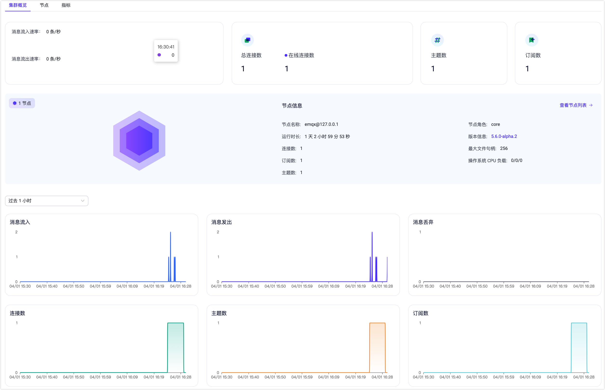

# 快速开始

作为全球最具扩展性的 MQTT 消息服务器，EMQX 提供了高效可靠海量物联网设备连接，能够高性能实时移动与处理消息和事件流数据，帮助您快速构建关键业务的物联网平台与应用。

本章节将带您体验从下载安装开始，到启动 EMQX 服务，到通过 WebSocket 工具或 MQTT 客户端测试连接并进行消息发布订阅的完整流程。

::: tip
除了私有部署外，我们也提供了全托管的 EMQX Cloud 服务，您只需几步注册即可轻松体验 EMQX 提供的 MQTT 消息服务，欢迎前往 [EMQX Cloud 门户](https://cloud.emqx.com/)页面免费试用。
:::

## 安装 EMQX

EMQX 支持多种安装方式，比如[容器化部署](../deploy/install-docker.md)，通过 [EMQX Kubernetes Operator](https://www.emqx.com/zh/emqx-kubernetes-operator) 安装部署、或通过安装包的形式部署在物理服务器或虚拟机上，针对安装包部署形式，目前我们支持以下操作系统：

- RedHat
- CentOS
- RockyLinux
- AmazonLinux
- Ubuntu
- Debian
- macOS
- Linux

如您需要 FreeBSD、国产硬件平台以及操作系统适配（如麒麟、深度、红旗等）或其他 Linux 发行版安装包，可参考[源码编译安装](../deploy/install-source.md)（EMQX 开源版）或[联系我们](https://www.emqx.com/zh/contact)获取支持。

此外，您还可通过 [EMQX Terraform](https://www.emqx.com/zh/emqx-terraform) 在主流公有云上一键部署包含 EMQX Enterprise 集群在内的所有基础设施，如[阿里云](https://github.com/emqx/tf-alicloud)、[亚马逊云科技](https://github.com/emqx/tf-aws)。<!-- TODO @wivwiv Update K8s link when EMQX Terraform 5.0 document ready -->

### 通过 Docker 容器运行

容器化部署是体验 EMQX 的最快方式，本节将以容器化部署为例，带您快速开始使用 EMQX。

:::: tabs type:card

::: tab EMQX 开源版

1. 在命令行工具中输入如下命令，下载并运行最新版 EMQX。

   运行此命令前，请确保 [Docker](https://www.docker.com/) 已安装且已启动。

   ```bash
   docker run -d --name emqx -p 1883:1883 -p 8083:8083 -p 8084:8084 -p 8883:8883 -p 18083:18083 emqx/emqx:latest
   ```
   
2. 通过浏览器访问 [http://localhost:18083/](http://localhost:18083/)（localhost 可替换为您的实际 IP 地址）以访问 [EMQX Dashboard](../dashboard/introduction.md) 管理控制台，进行设备连接与相关指标监控管理。

​        默认用户名及密码：

​       `admin`

​       `public`

<!--后续补上 dashboard的截图-->

:::

::: tab EMQX 企业版

1. 在命令行工具中输入如下命令，下载并运行最新版 EMQX。

   运行此命令前，请确保 [Docker](https://www.docker.com/) 已安装且已启动。

   ```bash
   docker run -d --name emqx -p 1883:1883 -p 8083:8083 -p 8084:8084 -p 8883:8883 -p 18083:18083 emqx/emqx-enterprise:latest
   ```

2. 通过浏览器访问 [http://localhost:18083/](http://localhost:18083/)（localhost 可替换为您的实际 IP 地址）以访问 [EMQX Dashboard](../dashboard/introduction.md) 管理控制台，进行设备连接与相关指标监控管理。

​        默认用户名及密码：

​       `admin`

​       `public`

:::

::::

### 通过安装包快速安装

您也可以选择通过安装包的形式在本地进行安装部署，方便后续进行配置调整以及性能调优。以下步骤将以 macOS13 amd64 为例演示如何下载并安装 EMQX。

由于手动安装过程中涉及比较多的依赖项目，因此推荐在测试或热升级环境中采用安装包方式，**不建议**在生产环境中使用。

:::: tabs type:card

::: tab EMQX 开源版

1. 前往 [EMQX 官方下载页面的 macOS 页签](https://www.emqx.com/zh/downloads-and-install/broker?os=macOS)。

2. 选择最新版本 `@CE_VERSION@`，在**安装包类型**中选择 `macOS 13 amd64 / zip`。

2. 直接点击下方的下载链接。您也可以参照页面中的命令指导步骤进行下载与安装。

4. 运行以下命令启动 EMQX。

   前台启动

   ```bash
   ./emqx/bin/emqx foreground
   ```

   或后台（不推荐）启动

   ```bash
   ./emqx/bin/emqx start
   ```

5. 现在您可通过浏览器访问 [http://localhost:18083/](http://localhost:18083/)（localhost 可替换为您的实际 IP 地址）以访问 [EMQX Dashboard](../dashboard/introduction.md) 管理控制台，进行设备连接与相关指标监控管理。

   默认用户名及密码：

   `admin`

   `public`

6. 运行以下命令停止 EMQX。

   ```bash
   ./emqx/bin/emqx stop
   ```

后续如需卸载 EMQX，直接删除 EMQX 目录即可完成卸载。

:::

::: tab EMQX 企业版

1. 前往 [EMQX 官方下载页面的 macOS 页签](https://www.emqx.com/zh/downloads-and-install/enterprise?os=macOS)。

2. 选择最新版本 `@EE_VERSION@`，在**安装包类型**中选择 `macOS 13 amd64 / zip`。

3. 直接点击下方的下载链接。您也可以参照页面中的命令指导步骤进行下载与安装。

4. 运行以下命令启动 EMQX。

   前台启动
   ```bash
   ./emqx/bin/emqx foreground
   ```
   或后台（不推荐）启动
   ```bash
   ./emqx/bin/emqx start
   ```

5. 现在您可通过浏览器访问 [http://localhost:18083/](http://localhost:18083/)（localhost 可替换为您的实际 IP 地址）以访问 [EMQX Dashboard](../dashboard/introduction.md) 管理控制台，进行设备连接与相关指标监控管理。

   默认用户名及密码：

   `admin`

   `public`

6. 运行以下命令停止 EMQX。

   ```bash
   ./emqx/bin/emqx stop
   ```

后续如需卸载 EMQX，直接删除 EMQX 目录即可完成卸载。

:::

::::

## 通过 MQTTX 快速验证
[MQTTX](https://mqttx.app/zh) 是一款开源的跨平台 MQTT 5.0 客户端工具，它支持 macOS、Linux 并且支持自定义脚本模拟测试、MQTT 消息格式转换、日志记录等多个功能。您可通过 MQTTX 一键式的连接方式和图形界面，您可轻松测试 MQTT/TCP、MQTT/TLS、MQTT/WebSocket 连接。

本节介绍如何使用 [MQTTX Web 版](https://mqttx.app/zh/web)模拟客户端快速连接到 EMQX，无需下载或安装任何程序。

:::tip 前置准备

测试连接之前，应首先获取：

- **服务器地址**：通常是您的服务器 IP 地址；
- **端口信息**：可在 EMQX Dashboard **功能配置**的**监听器**部分获取。

:::

### 创建连接

1. 访问  [MQTTX Web](http://www.emqx.io/online-mqtt-client#/recent_connections) 页面。

2. 配置并建立 MQTT 连接。点击 **+** **新建连接** 进入配置页面，您只需配置：

   - **名称**：连接名称，如 `MQTTX_Test`。

   - **服务器地址**

     - 通过选择该连接的协议类型，如 WebSockets 协议，选择 `ws://`；目前 MQTTX Web 端仅支持 WebSocket 协议，如希望测试 SSL/TLS 认证连接，请下载 [MQTTX 桌面版](https://mqttx.app/zh/downloads)。
     - 填入之前获取的 EMQX 地址，如 `emqx@127.0.0.1`。

   - **端口**：如 WebSockets 协议对应的 **8083** 端口。

     其他项目保持默认配置，你也可以根据具体业务场景修改。有关页面字段的配置说明，可参考 [MQTT 手册 - 快速建立连接](https://mqttx.app/zh/docs/get-started)。


3. 配置完成后，点击页面右上角的**连接**按钮建立连接。

### 订阅和发布消息

连接成功后即可快速订阅多个主题并向主题发送消息。

1. 点击页面中部的**添加订阅**按钮，按照默认配置，我们将订阅匹配 testtopic/# 主题的所有消息，QoS 等级为 0。您可多次重复该项操作以订阅不同主题，MQTTX Web 会通过不同颜色区分各主题。

2. 测试消息的发送与接收。点击页面右下角聊天区域的发送按钮，可以在上方的聊天窗口中看到消息已成功发送。


除上述测试外，您也可以通过 MQTTX 进行单/双向 SSL 认证、或通过自定义脚本模拟测试数据。更多消息，可访问 [MQTTX 官方网页](https://mqttx.app/zh)。

### 查看数据

回到 EMQX Dashboard 的**监控** -> **集群概览**，可以看到**连接数**、**主题数**、和**订阅数**部分数据的变化，在下方的可视化窗格，还可以看到这段时间流入的消息数量曲线。



## 下一步

至此，我们已经完成基本的 EMQX 安装、启动和接入测试，您还可以继续进行[访问控制](../access-control/authn/authn.md)、[规则引擎数据处理](../data-integration/rules.md)等操作。

## 常见问题解答

您可以访问 [EMQ 问答社区](https://askemq.com/)参与交流，提出、解答 EMQX 以及 EMQ 相关产品使用问题，与 EMQX 用户交流物联网相关技术的使用经验，此外也欢迎随时[联系我们](https://www.emqx.com/zh/contact)获取专业技术支持。

