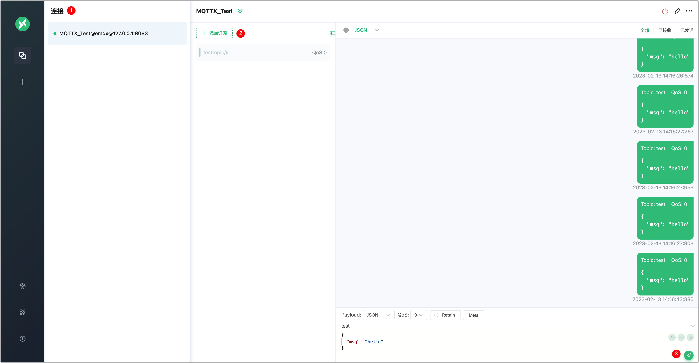
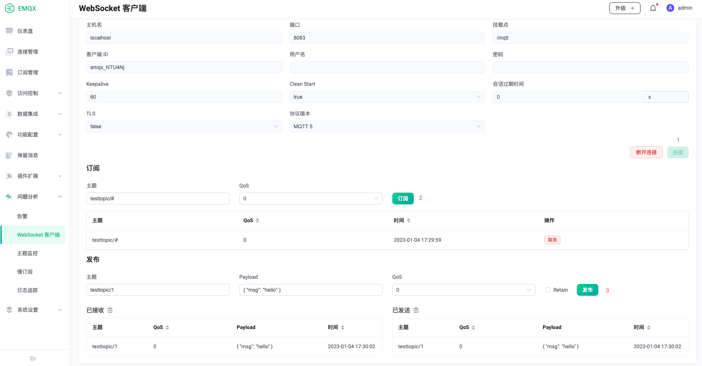

# 快速开始

作为全球最具扩展性的 MQTT 消息服务器，EMQX 提供了高效可靠海量物联网设备连接，能够高性能实时移动与处理消息和事件流数据，帮助您快速构建关键业务的物联网平台与应用。

本章节将带您从下载安装开始，带您体验从启动 EMQX 服务，到通过 WebSocket 工具或 MQTT 客户端测试连接并进行消息发布订阅的完整流程。

::: tip
除了私有部署外，我们也提供了全托管的 EMQX Cloud 服务，您只需几步注册即可轻松体验 EMQX 提供的 MQTT 消息服务，欢迎前往 [EMQX Cloud 门户](https://cloud.emqx.com/)页面免费试用。
:::



## 版本选择

EMQX 目前提供开源和企业版两个版本，您可根据需要点击下方链接下载对应版本：

- [开源版](https://www.emqx.com/zh/try?product=broker)
- [企业版](https://www.emqx.com/zh/try?product=enterprise)

:::: tabs type:card

::: tab EMQX 开源版
大规模可弹性伸缩的云原生分布式物联网 MQTT 消息服务器，高效可靠连接海量物联网设备，高性能实时处理消息与事件流数据，助力构建关键业务的物联网平台与应用。

- 基于 APL 2.0 开放源码协议
- 完整 MQTT 3.1.0、3.1.1 和 5.0 规范，支持 MQTT-SN
- Masterless 高可用集群架构
- 高并发、低时延、高性能
- 可扩展的网关和插件体系

[下载安装](https://www.emqx.io/zh/downloads)
:::

::: tab EMQX 企业版

**「随处运行，无限连接，任意集成」** 云原生分布式物联网接入平台，一体化的分布式 MQTT 消息服务和强大的 IoT 规则引擎，为高可靠、高性能的物联网实时数据移动、处理和集成提供动力，助力企业快速构建关键业务的 IoT 平台与应用。

- 标准或专有多协议支持
- 基于 SQL 的 IoT 数据集成
- 数据持久化与数据桥接
- 管理与监控中心
- 7x24 小时技术支持服务

[**免费试用**](https://www.emqx.com/zh/try?product=enterprise)
:::

::::



## 安装 EMQX

EMQX 支持多种安装方式，比如[容器化部署](../deploy/install-docker.md)，通过 [EMQX Kubernetes Operator](../deploy/install-k8s.md) 安装部署、或通过安装包的形式部署在物理服务器或虚拟机上，针对安装包部署形式，目前我们支持以下操作系统：



- RedHat
- CentOS
- RockyLinux
- AmazonLinux
- Ubuntu
- Debian
- MacOS
- Linux
- Windows





- RedHat
- CentOS
- RockyLinux
- AmazonLinux
- Ubuntu
- Debian
- MacOS
- Linux





如您需要 FreeBSD、国产硬件平台以及操作系统适配（如麒麟、深度、红旗等）或其他 Linux 发行版安装包，可参考 [源码编译安装](../deploy/install-source.md) 或 [联系我们](https://www.emqx.com/zh/contact) 获取支持。





如您需要 FreeBSD、国产硬件平台以及操作系统适配（如麒麟、深度、红旗等）或其他 Linux 发行版安装包，可 [联系我们](https://www.emqx.com/zh/contact) 获取支持。







如您需要 FreeBSD、国产硬件平台以及操作系统适配（如麒麟、深度、红旗等）或其他 Linux 发行版安装包，可 [联系我们](https://www.emqx.com/zh/contact) 获取支持。<!--后续在安装页面完成后，重新调整排序以及插入超链接-->



此外，您还可通过 [EMQX Terraform](https://www.emqx.com/zh/emqx-terraform) 在主流公有云上一键部署包含 EMQX Enterprise 集群在内的所有基础设施，如[阿里云](https://github.com/emqx/tf-alicloud)、[亚马逊云科技](https://github.com/emqx/tf-aws)。<!-- TODO @wivwiv Update K8s link when EMQX Terraform 5.0 document ready -->

### 快速安装启动

在本篇快速上手中，我们将带您通过容器化部署或解压安装的形式快速体验 EMQX。

:::: tabs type:card

::: tab 通过 Docker 容器运行

容器化部署是体验 EMQX 的最快方式，因此本节将以容器化部署为例，带您开始完整的 EMQX 使用旅程。 



1. 在命令行工具中输入如下命令，下载并运行最新版 EMQX：

```bash
docker run -d --name emqx -p 1883:1883 -p 8083:8083 -p 8084:8084 -p 8883:8883 -p 18083:18083 emqx/emqx:latest
```





1. 在命令行工具中输入如下命令，下载并运行最新版 EMQX：

```bash
docker run -d --name emqx -p 1883:1883 -p 8083:8083 -p 8084:8084 -p 8883:8883 -p 18083:18083 emqx/emqx-enterprise:latest
```




运行此命令前，请确保 [Docker](https://www.docker.com/) 已安装且已启动。

2. 通过浏览器访问 [http://localhost:18083/](http://localhost:18083/)（localhost 可替换为您的实际 IP 地址）以访问 [EMQX Dashboard](../dashboard/introduction.md) 管理控制台，进行设备连接与相关指标监控管理。

   默认用户名及密码：
   
   `admin`
   
   `public`
   
   <!--后续补上 dashboard的截图-->

:::

::: tab 通过 zip/tar.gz 压缩包快速安装

您也可以选择通过 zip/tar.gz 压缩包的形式在本地进行安装部署，方便后续进行配置调整以及性能调优。本节我们将以 [macOS](https://www.emqx.io/zh/downloads?os=macOS) (macOS11 amd64) 为例演示如何下载并安装 EMQX。

由于手动安装过程中涉及比较多的依赖项目，因此推荐在测试或热升级环境中采用安装包方式，**不建议**在生产环境中使用。




1. 在命令行工具中输入如下命令，下载 zip 文件。

   ```
   wget https://www.emqx.com/zh/downloads/broker/5.0.14/emqx-5.0.14-macos11-amd64.zip
   ```

2. 通过以下命令安装 EMQX。

   ```
   mkdir -p emqx && unzip emqx-5.0.14-macos11-amd64.zip -d emqx
   ```





1. 在命令行工具中输入如下命令，下载 zip 文件。

   ```
      wget https://www.emqx.com/en/downloads/enterprise/5.0.0/emqx-enterprise-5.0.0-macos11-amd64.zip
   ```

2. 通过以下命令安装 EMQX。

   ```
   mkdir -p emqx && unzip emqx-enterprise-5.0.0-macos11-amd64.zip -d emqx
   ```



3. 运行以下命令启动 EMQX。

   ```
   ./emqx/bin/emqx start
   ```
   
4. 现在您可通过浏览器访问 [http://localhost:18083/](http://localhost:18083/)（localhost 可替换为您的实际 IP 地址）以访问 [EMQX Dashboard](../dashboard/introduction.md) 管理控制台，进行设备连接与相关指标监控管理。

   默认用户名及密码：
   
   `admin`
   
   `public`
   
5. 运行以下命令停止 EMQX。
   
   ```
   ./emqx/bin/emqx stop
   ```

后续如需卸载 EMQX，您可直接删除 EMQX 目录即可完成卸载。

:::

::::

## 快速验证

您可通过 [MQTT X](https://mqttx.app/zh) 或 EMQX 自带的 WebSocket 工具快速验证 MQTT 连接。

:::: tabs type:card

::: tab 通过 MQTT X Web 快速验证

[MQTT X](https://mqttx.app/zh) 是 EMQ 开源的一款跨平台 MQTT 5.0 客户端工具，它支持 macOS、Linux、Windows，并且支持自定义脚本模拟测试、MQTT 消息格式转换、日志记录等多个功能。

MQTT X 提供了一键式的连接方式和简洁的图形界面，能够测试 MQTT/TCP、MQTT/TLS、MQTT/WebSocket 连接。您也可以使用浏览器打开 [MQTT X Web](http://www.emqx.io/online-mqtt-client#/recent_connections)，无需下载与安装即可通过 MQTT over WebSocket 完成 MQTT 开发和调试操作。

:::tip 前置准备

通过 MQTT X Web 测试连接之前，应首先获取：

- 服务器地址： 可在 EMQX Dashboard **仪表盘**的**节点信息**部分获取，即**节点名称**；
- 端口信息：可在 EMQX Dashboard **功能配置**的**监听器**部分获取；

:::

1. 访问  [MQTT X Web](http://www.emqx.io/online-mqtt-client#/recent_connections) 页面。

2. 配置并建立 MQTT 连接。点击 **+** **新建连接** 进入配置页面，您只需配置：

   - **名称**：连接名称，如 **MQTTX_Test**；

   - **服务器地址**

     - 通过选择该连接的协议类型，如 WebSockets 协议，**ws://**；如希望测试 SSL/TLS 认证连接，应选择 **wss://**；
     - 填入之前获取的 EMQX 地址，如 **emqx@127.0.0.1**

   - **端口**：如 WebSockets 协议对应的 **8083** 端口

     其他项目保持默认配置，你也可以根据具体业务场景修改。有关页面字段的配置说明，可参考 [MQTT 手册 - 快速建立连接](https://mqttx.app/zh/docs/get-started)。

   配置完成后，点击页面右上角的**连接**按钮建立连接。

3. 订阅相关主题。连接成功后即可快速订阅多个主题。点击页面中部的**添加订阅**按钮，按照默认配置，我们将订阅匹配 testtopic/# 主题的所有消息，QoS 等级为 0。您可多次重复该项操作以订阅不同主题，MQTT X Web 会通过不同颜色区分各主题。

4. 测试消息的发送与接收。点击页面右下角聊天区域的发送按钮，可以在上方的聊天窗口中看到消息已成功发送。



除上述测试外，您也可以通过 MQTT X 进行单/双向 SSL 认证、或通过自定义脚本模拟测试数据。更多消息，可访问 [MQTT X 官方网页](https://mqttx.app/zh)。

:::

::: tab 通过 WebSocket 工具快速验证

此外，您也可以通过 EMQX 内置的 WebSocket 客户端工具接入 EMQX，进行消息通信验证。

在 Dashboard 页面，点击左侧导航栏的 **问题分析 -> WebSocket 客户端**，即可进入相关页面。您可按照如下步骤完成客户端与 EMQX 的连接、订阅相关主题，并测试消息的发送与接收情况。

1. 连接客户端与 EMQX。点击页面右侧的**连接**按钮，系统将提示当前客户端已成功连接。
2. 订阅相关主题。点击页面中部的**订阅**按钮，此时我们将订阅 `testtopic/#`主题下所有 QoS 为 0 的消息，您可以根据需要增加多个主题或测试其他 QoS 等级。
3. 测试消息的接收。点击页面底部的**发布**按钮，此时可以看到页面底部的已发送和已接收窗格各出现了一条消息，证明连接已成成功。



:::

::::

回到 EMQX Dashboard 的**仪表盘**部分，可以看到**连接数**、**主题数**、和**订阅数**部分数据的变化，在下方的可视化窗格，还可以看到这段时间流入的消息数量曲线。


## 进阶操作

至此，我们已经完成基本的 EMQX 安装、启动和接入测试，您还可以继续进行 [访问控制](../access-control/authn/authn.md)、[集成数据系统](../data-integration/introduction.md) 等操作。

## 常见问题解答

您可以访问 [EMQ 问答社区](https://askemq.com/) 参与交流，提出、解答 EMQX 以及 EMQ 相关产品使用问题，与 EMQX 用户交流物联网相关技术的使用经验，此外也欢迎随时 [联系我们](https://www.emqx.com/zh/contact) 获取专业技术支持。
