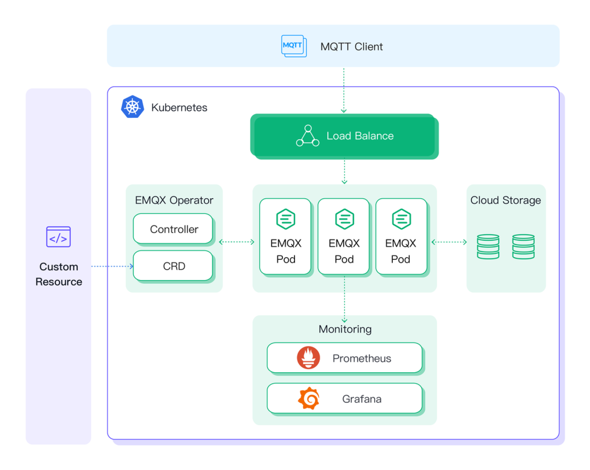

# 全新功能

EMQX 5.0 是 MQTT 领域的一个里程碑式的成果。它不仅是全球首个单集群支持 1 亿连接的分布式 MQTT 消息服务器，也是首个将 QUIC 引入 MQTT 的开创性产品。

## 可扩展性及可靠性显著提升，单集群 1 亿 MQTT 连接

通过采用 Erlang 的 Mnesia 数据库的新 Mria 扩展，以及即将在后续 5.x 版本中提供的基于 RocksDB 的会话持久化，EMQX 5.0 的横向扩展能力及消息传输可靠性得到了指数级提升。

最新的性能测试表明，EMQX 5.0 可以轻松支持单个集群的 [1 亿 MQTT 连接](https://www.emqx.com/zh/blog/reaching-100m-mqtt-connections-with-emqx-5-0) —— 比以前的版本增加了 10 倍，这使得 EMQX 5.0 成为目前全球最具扩展性的 MQTT Broker，能够轻松承载超大规模的物联网应用。

## 全球首个实现 MQTT over QUIC 的消息服务器

QUIC 是下一代互联网协议 HTTP/3 的底层传输协议，与 TCP 协议相比，它在减少连接开销与消息延迟的同时，提升了整体吞吐量和移动连接的稳定性。

基于 QUIC 这些极适用于物联网消息传输场景的优势，EMQX 5.0 设计了独特的消息传输机制和管理方式，以不断的技术革新持续为行业、社区和客户提供最先进、最具竞争力的 MQTT 消息服务器。

## 全新物联网数据集成 ：Flow 可视化编排 & 双向数据桥接

为物联网平台与应用提供高性能的实时数据处理与集成，一直是 EMQX 最重要的能力之一。

EMQX 5.0 将 Webhook、数据存储/桥接插件整合到一起，使用统一接口来管理南北向数据流，在原有数据采集上报场景进行规则处理的基础上，还可实现通过规则处理云端到设备的南向消息。

同时，EMQX 5.0 还提供了数据集成可视化查看能力（Flows）。通过 Dashboard 页面，用户可以清晰看到物联网数据如何通过规则处理，以及数据如何流向外部数据服务或设备。

后续版本还将支持在 Dashboard 上以拖拽的方式编排规则和数据桥接（Flow Editor），通过可视化界面将物联网硬件数据流轻松连接在一起。

## 灵活多样认证授权，零开发投入保障 IoT 安全

EMQX 5.0 对认证授权的配置方式和使用流程进行了优化，内置实现了客户端认证授权功能：用户通过简单配置，无需编写代码即可对接各类数据源与认证服务，实现各个级别与各类场景下的安全配置，以更高的开发效率获得更安全的保障。

**认证授权的创新包括**：

- 在 Dashboard 上完成配置、调试与管理。
- 支持调整认证器与授权检查器顺序。
- 提供执行速度与次数指标统计，实现认证授权可观测性。
- 允许监听器单独配置认证，更灵活的接入能力。

## 易操作、可观测的 EMQX Dashboard

EMQX 5.0 带来了全新 UI 设计风格的 EMQX Dashboard。优化了关键数据和指标数据的显示方式与内容，在提升视觉体验的同时，也提供了更全面、强大、易用的内置功能，如对于连接、订阅和发布时的认证与权限管理，支持使用数据桥接并搭配规则引擎进行数据集成转化等。

**全新 Dashboard 包括以下更新**：

- 全新 UI / UX 设计：实时可观测性大幅提升

- 菜单结构优化：快速直达访问内容

- 数据监控与管理：重要数据一目了然

- 可视化管理访问控制：开箱即用的认证授权管理

- 强大数据集成能力：Flow 可视化编排与双向数据桥接

- 在线配置更新：保存即刻生效的配置热更新

- 自定义扩展能力：内置网关、插件和 Hooks

- 更加全面的诊断工具：及时发现问题并解决

## EMQX Operator - 拥抱云原生的 EMQX 5.0

对于一个云原生应用来说，水平扩展和弹性集群是其应具备的重要特性。

现在，您可以通过 EMQ 发布的管理工具 [EMQX Kubernetes Operator](https://www.emqx.com/zh/emqx-kubernetes-operator)，利用 EMQX 5.0 的 Replicant 节点特性，在 Kubernetes 上通过 Deployment 资源实现无状态节点的部署，快速创建并管理可以承载大规模 MQTT 连接和消息吞吐的 EMQX 集群。

EMQX Kubernetes Operator 使部署和管理工作变成一种低成本、标准化、可重复性的能力，帮助用户高效实现集群扩容、无缝升级、故障处理和统一监控。

## 全新网关框架：轻松实现多物联网协议接入

EMQX 5.0 中，我们重构了多协议接入的底层架构，统一了配置格式和管理接口，提供了一个全新的扩展网关框架。同时规范了各类网关的实现，使得各个网关功能定义更为清晰。

现在，所有网关由一个统一的框架提供通用操作的支持，包括：

- **统一的用户层接口**：该框架提供了风格统一的配置文件、HTTP API 和命令行接口。以监听器参数配置为例，4.x 版本中不同协议插件对于监听器暴露的参数各不相同，而在 5.0 版本中这些参数的风格都将是统一的。
- **统一的统计和监控指标**：提供了网关和客户端级别的统计指标，例如收发字节数、消息等。
- **独立的连接和会话管理**：每个网关都有在自己的客户端管理页面，且不同的网关允许使用相同的 Client ID ，而不是像 4.x 版本一样都混合在 MQTT 客户端列表中进行管理。
- **独立的客户端认证**：支持为每个网关配置独立的认证，不再像 4.x 像一样与 MQTT 客户端认证混合在一起。
- **易扩展和规格清晰化**：框架抽象了一套标准的概念和接口使自定义网关变得更加容易。

网关框架实现多种协议的接入和统一管理，进一步提升了 EMQX 的易用性，第三方协议也能够充分享受 EMQX 强大的数据集成、安全可靠的认证授权，以及亿级的水平扩展能力等诸多优势功能特性。

## **更多功能更新**

- **全新极简配置，易用性大幅提升**：全新的 Dashboard 菜单栏为不同角色的使用者进行了更加清晰的功能聚合，同时以简洁易读的 HOCON 格式配置文件、符合 OpenAPI 3.0 规范的 REST API 文档为开发者带来更好的使用体验；
- **可操作性与可观测性大幅提升**：在 Dashboard 上提供长达 7 天的详细监控指标，可以一键集成 Prometheus 与 Grafana、Datadog/StatsD 等指标监控告警系统。提供更多的诊断工具如慢订阅、在线追踪帮助用户快速排查生产环境中的问题，提供更友好的结构化日志以及 JSON 格式日志支持；
- **更灵活的拓展定制方式**：引入全新的插件架构，用户可用独立插件包的形式编译、分发、安装自己的拓展插件对 EMQX 进行自定义扩展。
