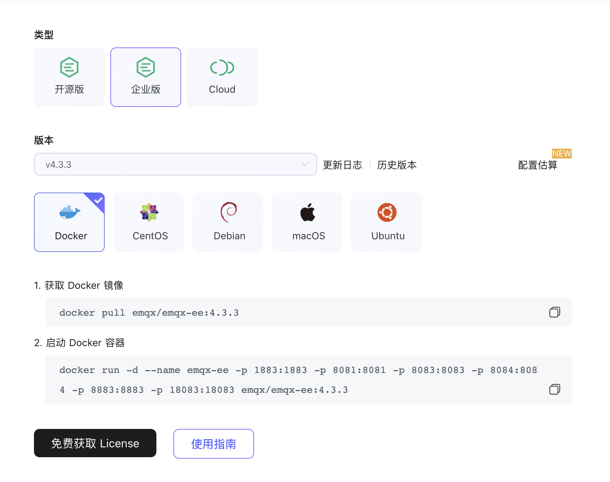

---
# 编写日期
date: 2020-02-07 17:15:26
# 作者 Github 名称
author: wivwiv
# 关键字
keywords:
# 描述
description:
# 分类
category:
# 引用
ref:
---

# 启动 EMQX

后台启动 EMQX

```bash
$ emqx start
EMQX v4.0.0 is started successfully!
```

systemctl 启动

```bash
$ sudo systemctl start emqx
EMQX v4.0.0 is started successfully!
```

service 启动

```bash
$ sudo service emqx start
EMQX v4.0.0 is started successfully!
```



::: tip
如果你使用的是 EMQX Enterprise 则需要导入 License 才能使用，导入步骤见下文**启动 EMQX Enterprise**。

通过 ZIP 压缩包安装的 EMQX 不支持通过 systemctl 和 service 启动。

4.2-rc.1 版本后，EMQX 开源版新加入[遥测](../advanced/telemetry.md)功能，启动前请[详细了解](../advanced/telemetry.md)。

:::



## 查看 EMQX 的状态

EMQX 正常启动:

```bash
$ emqx_ctl status
Node 'emqx@127.0.0.1' is started
emqx 4.0.0 is running
```

EMQX 未能正常启动:

```bash
$ emqx_ctl status
Node 'emqx@127.0.0.1' not responding to pings。
```

你可以查看 [`logs`](../getting-started/directory.md) 下的日志文件并确认是否属于 [常见错误](../faq/error.md#)。



## 基本命令

EMQX 提供了 `emqx` 命令行工具，方便用户对 EMQX 进行启动、关闭、进入控制台等操作。

+ `emqx start`

    后台启动 EMQX Broker；

+ `emqx stop`

    关闭 EMQX Broker；

+ `emqx restart`

    重启 EMQX Broker；

+ `emqx console`

    使用控制台启动 EMQX Broker；

+ `emqx foreground`

    使用控制台启动 EMQX Broker，与 `emqx console` 不同，`emqx foreground` 不支持输入 Erlang 命令；

+ `emqx ping`

    Ping EMQX Broker, 检查当前节点是否通信正常；

+ `emqx check_conf`

    检查配置文件格式是否正常，如果你修改了配置文件，推荐在启动前先执行此命令，来检查配置文件的格式是否符合要求。

以上命令为用户常用命令，此外 `emqx` 命令还有一些[其他选项](../advanced/cli.md)为方便开发者使用。

## 启动 EMQX Enterprise
EMQX Enterprise 需要 License 文件才能正常启动，EMQX 可以略过这一步。





## License

EMQX Enterprise 需要 License 文件才能正常启动，请联系销售人员或在线自助购买/申请试用以获取 License。

- 试用版 License：到期后将停止正在运行的 EMQX；
- 正式版 License：到期后不会停止正在运行的 EMQX，但是新节点或手动停止之后的节点将无法启动。




### 申请试用 License

- 访问 [EMQX Enterprise 下载页面](https://www.emqx.com/zh/downloads?product=enterprise)，点击 **[免费获取 License](https://www.emqx.com/zh/apply-licenses/emqx)**。

    

- 申请 License 文件试用，下载 License 文件。

    

### 放置 License

- 替换默认证书目录下的 License 文件（`etc/emqx.lic`），当然你也可以选择变更证书文件的读取路径，修改 `etc/emqx.conf` 文件中的 `license.file`，并确保 License 文件位于更新后的读取路径且 EMQX Enterprise 拥有读取权限，然后启动 EMQX Enterprise。EMQX Enterprise 的启动方式与 EMQX 相同，见下文。

- 如果正在运行的EMQX企业集群需要更新许可证文件，可以使用`emqx_ctl license reload [path of the license file]`命令直接更新许可证文件，而无需重启任何节点。 需要注意的是，`emqx_ctl license reload`命令加载的证书将应用于整个EMQX集群，它将被保存在每个节点的`licenses`子目录下的EMQX的数据目录中（即：`data/licenses/emqx.lic`）。 即使节点重新启动，这个新的许可证文件也会被加载和应用。
