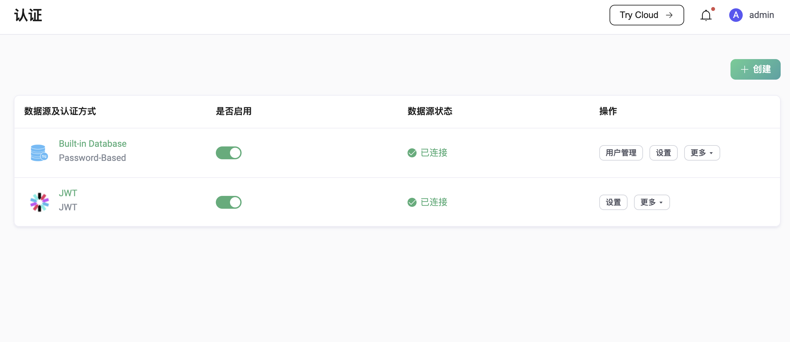

# 认证

身份认证是物联网应用的重要组成部分，可以帮助有效阻止非法客户端的连接。为了提供更好的安全保障，EMQX 支持多种认证机制，此外，EMQX 还支持 TLS 的双向认证（X.509 证书认证）和基于 PSK 的 TLS/DTLS 认证，在一定程度上满足了客户端和服务端之间的身份验证要求。

本节将向您介绍 EMQX 认证的基本概念和使用方式。

:::tip
EMQX 默认未开启认证功能，即允许所有客户端链接，如在生产环境中使用，请提前配置好至少一种认证方法。
:::

## 认证机制

EMQX 支持的认证机制包括 X.509 证书认证、JWT 认证、密码认证、基于 MQTT 5.0 协议的增强认证以及 PSK 认证。

### X.509 证书认证

EMQX 支持使用 [X.509 证书认证](./x509.md) 进行客户端认证。通过在 EMQX 中使用 X.509 证书认证，客户端和服务器可以通过 TLS/SSL 建立安全连接，确保通信双方的真实性和传输数据的完整性。EMQX 支持单向和双向认证：单向认证中，只有服务器被客户端认证；双向认证中，客户端和服务器相互验证对方的证书。这种灵活性适应了不同级别的安全需求和部署场景。

### JWT 认证

[JSON Web Token（JWT）](https://jwt.io/) 是一种基于 Token 的认证机制，它不需要服务器来保留客户端的认证信息或会话信息。客户端可以在密码或用户名中携带 Token，EMQX 通过预先配置的密钥或公钥对 JWT 签名进行验证。

此外，如果用户配置了 JWKS 端点，EMQX 也支持通过从 JWKS 端点查询到的公钥列表对 JWT 签名进行验证，从而能够批量为客户端签发认证信息。

### 密码认证

密码认证是最简单，也是使用最多的认证方式。此时，客户端需要提供能够表明身份的凭据，例如用户名、客户端 ID 以及对应的密码，或是 TLS 证书中的一些字段（例如证书公用名称）。这些身份凭据会提前存储到特定数据源（数据库）中，密码通常都会以加盐后散列的形式存储。

EMQX 支持通过密码进行身份验证。启用密码认证后，当客户端尝试连接时，需按要求提供身份凭证信息，EMQX 会在数据库中发起查询，并将返回得到的密码与客户端提供的信息进行匹配，匹配成功后，EMQX 将接受该客户端的连接请求。


除简单便捷的内置数据库外，EMQX 还支持通过与多类后端数据库的集成提供密码认证，包括 MySQL、PostgreSQL、MongoDB 和 Redis。

此外，EMQX 也支持通过 HTTP 方式对接用户自己开发的服务，借此实现更复杂的认证逻辑。

### MQTT 5.0 增强认证

[MQTT 5.0 增强认证](https://www.emqx.com/zh/blog/mqtt5-enhanced-authentication)是对密码认证的扩展，增强认证特性允许使用各种更安全的认证机制，例如 SCRAM 认证、Kerberos 认证等。目前 EMQX 具体实施了 SCRAM 认证，并支持将认证数据存储在内置数据库中或通过 REST API 访问外部 HTTP 服务获取认证数据。

### PSK 认证

EMQX 中的 [PSK 认证](../../network/psk-authentication.md) 提供了一个更简单但同样安全的替代方案，取代了基于证书的 TLS 认证。它依赖于客户端和服务器都知道的共享密钥，从而绕过了对数字证书的需求。这种机制在资源受限的环境中特别有用，因为在这些环境中处理证书的开销可能相当大。

## EMQX 认证器

按照认证方式和数据源来划分，EMQX 内置了以下认证器：

| 认证方式 | 数据源      | 说明                                                |
| -------- | ----------- | --------------------------------------------------- |
| 密码认证 | 内置数据库  | [使用内置数据库（Mnesia）进行密码认证](./mnesia.md) |
| 密码认证 | MySQL       | [使用 MySQL 进行密码认证](./mysql.md)                 |
| 密码认证 | PostgreSQL  | [使用 PostgreSQL 进行密码认证](./postgresql.md)       |
| 密码认证 | MongoDB     | [使用 MongoDB 进行密码认证](./mongodb.md)           |
| 密码认证 | Redis       | [使用 Redis 进行密码认证](./redis.md)               |
| 密码认证 | LDAP        | [使用 LDAP 进行密码认证](./ldap.md)                 |
| 密码认证 | HTTP Server | [使用 HTTP 服务进行密码认证](./http.md)             |
| JWT      | --          | [JWT 认证](./jwt.md)                                |
| 增强认证 | 内置数据库  | [MQTT 5.0 增强认证（SCRAM 认证）](./scram.md)       |
| 增强认证 | HTTP 服务   | [基于 REST API 的 MQTT 5.0 增强认证 （SCRAM 认证）](./scram_restapi.md) |
| 增强认证 | Kerberos    | [MQTT 5.0 增强认证 - Kerberos](./kerberos.md)          |
| 规则认证 | --          | [Client-info 认证](./cinfo.md)                      |

## 认证链

EMQX 允许创建多个认证器构成一条认证链，认证器将按照在链中的位置顺序执行，如果在当前认证器中未检索到身份凭证，将会切换至链上的下一个启用的认证器继续认证。认证链中的每个认证器必须是不同类型的（例如，一个 HTTP，一个 LDAP，一个内置数据库）。

::: tip

当前，EMQX 仅支持为 MQTT 客户端创建认证链。网关不支持认证链，仅支持使用单个认证器。

:::

### 认证链的工作机制

当启用认证链后，EMQX 会按照配置的顺序依次执行认证器，直到认证成功或所有认证器都执行完毕。

以密码认证为例，其执行流程如下：

1. **评估调用条件（如已配置）：**
    如果某个认证器配置了[调用条件](#认证器调用条件)，EMQX 会首先基于客户端属性信息（如 `listener`、`clientid`、`username` 等）评估该表达式。
   - 若表达式计算结果为 `true`，则执行该认证器；
   - 否则跳过此认证器。
2. **执行认证器：**
   - 如果找到了凭证且验证通过（如密码正确），则认证成功，允许客户端连接；
   - 如果找到了凭证但验证失败，则拒绝连接；
   - 如果未找到凭证，则继续尝试下一个认证器。
3. **错误或禁用时跳过：**
    如果认证器被禁用，或在执行过程中出现内部错误（如数据库不可用），该认证器也将被跳过。
4. **回退行为：**
    如果所有认证器都被跳过或均未能认证成功，EMQX 默认会拒绝客户端连接。


### 认证器调用条件

从 EMQX 5.9 开始，您可以为每个认证器配置一个调用条件，用于判断是否应触发该认证器来认证当前客户端。

调用条件是一个 [Variform 表达式](../../configuration/configuration.md#variform-表达式)，可基于客户端属性信息（例如 `listener`, `username`, `clientid` 等）进行逻辑判断。如果表达式的计算结果不是 `true`，该认证器将被跳过。

此功能在认证链中实现更灵活的认证逻辑。它允许对认证逻辑进行细粒度控制，例如根据客户端连接的不同监听器或客户端属性应用不同的认证器。这样，EMQX 只在合适的情况下调用认证器，避免了对外部系统的无谓请求。

#### 调用条件中支持的客户端属性

调用条件中支持的客户端属性包括：

- `username`：客户端的用户名
- `password`：客户端的密码
- `clientid`：客户端的客户端 ID
- `client_attrs.*`：客户端的自定义属性
- `cert_common_name`：客户端 TLS 证书中的主体字段
- `cert_subject`：客户端 TLS 证书中的公共名称（CN）
- `peersni`：TLS 客户端发送的 SNI（服务器名称指示）
- `listener`：监听器 ID（例如 `tcp:default`）
- `zone`：关联的配置区

#### 调用条件示例

- 仅对通过 `tcp:default` 监听器连接的客户端启用 HTTP 认证器：

  ```
  str_eq(listener, 'tcp:default')
  ```

- 仅对通过 `ssl:default` 监听器连接的客户端启用 PostgreSQL 认证器：

  ```
  str_eq(listener, 'ssl:default')
  ```

## 外部资源缓存

EMQX 提供认证结果缓存机制，用于提升性能并减少对外部认证后端（如 MySQL、MongoDB 和 Redis）的访问压力。该缓存功能会存储认证结果，避免重复查询外部资源，特别适用于高并发场景。

::: tip 注意

外部资源缓存仅针对外部数据源，对于本地数据源，如内置数据库等 EMQX 不进行缓存。

:::

### 外部资源缓存的工作原理

外部资源缓存以节点为单位存储认证结果，这些缓存结果在同一节点上的所有客户端会话中共享，可有效避免对外部认证后端的重复查询。

1. 客户端连接并触发认证操作。
2. EMQX 检查缓存中是否已有对应的认证结果：
   - 如果找到了有效的缓存结果，则视为**缓存命中**，无需访问外部后端；
   - 如果未找到缓存结果，则视为**缓存未命中**，EMQX 会向外部后端发起查询。
3. 从后端返回的认证结果将被存入缓存，用于后续请求，并计入**缓存写入**指标。

该机制有助于降低认证延迟、减少外部资源调用，并在高负载下维持系统响应能力。

### 启用并配置外部资源缓存

您可以通过 EMQX Dashboard 启用并配置外部资源缓存：

1. 进入**访问控制** -> **认证**页面。

2. 点击页面右上角的**外部资源缓存设置**按钮，右侧将弹出设置面板。

3. 在面板中，使用**启用外部资源缓存**开关启用或关闭缓存功能。启用后，您可以配置以下缓存参数：

   | 字段名称         | 描述                                                      |
   | ---------------- | --------------------------------------------------------- |
   | **最大缓存数量** | 每个节点允许缓存的最大认证结果条数。默认值：`1,000,000`。 |
   | **最大内存**     | 缓存允许使用的最大内存。默认值：`100 MB`。                |
   | **缓存过期时间** | 每条缓存数据的有效时长。默认值：`1 分钟`。                |

4. 点击**更新**以应用设置。

以上配置将在整个集群范围内生效，确保所有节点行为一致。

### 查看外部资源缓存状态

<!--@include: ../monitor-cache-status.md-->

## 超级用户与权限

通常情况下，认证只是验证了客户端的身份是否合法，而该客户端是否具备发布、订阅某些主题的权限，还需要由授权系统来判断。

EMQX 允许在认证阶段为客户端设置**超级用户**角色以及预设**权限**，用于后续的发布订阅权限检查。

::: tip

目前 JWT 认证和 HTTP 认证支持权限预设，允许通过 JWT Payload 和 HTTP 响应体携带当前客户端拥有的发布订阅[权限列表](./acl.md)，并在认证成功后预设到客户端。

:::

超级用户的判定发生在认证阶段，由数据库查询结果、HTTP 响应或者 JWT 声明中的 `is_superuser` 字段来指示。

## 密码散列

通过明文存储密码会有非常高的密码泄漏风险。因此 EMQX 支持多种密码散列算法以满足不同用户的安全性要求，同时我们建议生成一个随机的盐，数据库中存储盐与对密码加盐后散列得到的值（password_hash）。

### 工作原理

密码散列算法配置在认证时的原理如下：

1. 认证器使用配置的查询语句从数据库中查询符合条件的身份凭证，包括散列密码和盐值；
2. 根据认证器配置的散列算法和查询到的盐值，对客户端连接时提供的密码进行散列；
3. 将第 1 步从数据库查询到的散列密码和第 2 步计算出的散列值进行比较，一致则说明客户端的身份合法。

以下为 EMQX 目前支持的散列算法：

```hcl
# simple algorithms
password_hash_algorithm {
  name = sha256             # plain, md5, sha, sha512
  salt_position = suffix    # prefix, disable
}

# bcrypt
password_hash_algorithm {
  name = bcrypt
}

# pbkdf2
password_hash_algorithm {
  name = pbkdf2
  mac_fun = sha256          # md4, md5, ripemd160, sha, sha224, sha384, sha512
  iterations = 4096
  dk_length = 32           # optional, Unit: Byte
}
```

注意，不同散列算法之间可能存在较大的性能差异，请酌情选择。作为参考，以下是在 4 核 8GB 的机器中将各散列算法运行 100 次后取得的平均运行时间：


## 认证占位符

EMQX 允许使用占位符动态构造认证数据查询语句、HTTP 请求，占位符会在认证器执行时替换为真实的客户端信息，以构造出与当前客户端匹配的查询语句或 HTTP 请求。

一个有效的占位符格式为 ${PATH.TO.VALUE}，其中 PATH.TO.VALUE 是对象中值的点符号路径。允许的字符包括字母、数字、点（`.`）和下划线（`_`）。
如果占位符中包含不支持的字符，将被视为普通文本处理。

以 MySQL 认证器为例，默认的查询 SQL 中使用了 `${username}` 占位符：

```sql
SELECT password_hash, salt FROM mqtt_user where username = ${username} LIMIT 1
```

当用户名为 `emqx_u` 的客户端连接认证时，实际执行认证数据查询 SQL 将被替换为：

```sql
SELECT password_hash, salt FROM mqtt_user where username = 'emqx_u' LIMIT 1
```

目前 EMQX 支持以下占位符：

- `${clientid}`：将在运行时被替换为客户端 ID。客户端 ID 一般由客户端在 `CONNECT` 报文中显式指定，如果启用了 `use_username_as_clientid` 或 `peer_cert_as_clientid`，则会在连接时被用户名、证书中的字段或证书内容所覆盖。

- `${username}`：将在运行时被替换为用户名。用户名来自 `CONNECT` 报文中的 `Username` 字段。如果启用了 `peer_cert_as_username`，则会在连接时被证书中的字段或证书内容所覆盖。

- `${password}`：将在运行时被替换为密码。密码来自 `CONNECT` 报文中的 `Password` 字段。

- `${peerhost}`：将在运行时被替换为客户端的 IP 地址。EMQX 支持 [Proxy Protocol](http://www.haproxy.org/download/1.8/doc/proxy-protocol.txt)，即使 EMQX 部署在某些 TCP 代理或负载均衡器之后，用户也可以使用此占位符获得真实 IP 地址。

- `${peername}`：将在运行时被替换为客户端的 IP 地址和端口，格式为 `IP: PORT`。

- `${cert_subject}`：将在运行时被替换为客户端 TLS 证书的主题（Subject）。如果证书信息是从负载均衡器发送到 EMQX 的 TCP 端口，需要确保负载均衡器使用的是 Proxy Protocol v2。

- `${cert_common_name}`：将在运行时被替换为客户端 TLS 证书的通用名称（Common Name）。如果证书信息是从负载均衡器发送到 EMQX 的 TCP 端口，需要确保负载均衡器使用的是 Proxy Protocol v2。

- `${client_attrs.NAME}`：某个客户端属性。`NAME` 将在运行时根据预定义配置替换为属性名称。有客户端属性的详细信息，请参见 [MQTT 客户端属性](../../../develop/client-attributes/client-attributes.md)。

- `${zone}`：在运行时将替换为客户端的 Zone。`${zone}` 占位符可以直接用于认证模板中，简化规则创建，并支持基于 Zone 的特定配置。有关 Zone 的详细配置信息，请参见 [Zone 覆盖](../../configuration/configuration.md#zone-覆盖)。

  例如，以下 ACL 规则使用 `${zone}` 根据客户端的指定 zone 动态应用权限：

  ```
  {allow, all, all, ["${zone}/${username}/#"]}
  ```

## 认证配置方式

EMQX 提供了三种使用认证的配置方式，分别为：Dashboard、配置文件和 HTTP API。

### 通过 Dashboard 配置认证

Dashboard 底层调用了 HTTP API，提供了相对更加易用的可视化操作页面。在 Dashboard 中可以方便的查看认证器状态、调整认证器在认证链中的位置，如下图所示，我们已经成功添加了基于内置数据库和 JWT 两种认证机制。



### 通过配置文件配置认证

EMQX 支持为 MQTT 客户端配置多个认证器以组成认证链 <!--连接到对应概念-->，如以下代码示例中的 `authentication` 字段所示，认证器在数组中的顺序便是在认证链中执行的顺序：

```hcl
# Specific global authentication chain for all MQTT listeners
authentication = [
  ...
]

listeners.tcp.default {
  ...
  enable_authn = true
  # Specific authentication chain for the specified MQTT listener
  authentication = [
    ...
  ]
}

gateway.stomp {
  ...
  enable_authn = true
  # Specific global authenticator for all STOMP listeners
  authentication = {
    ...
  }

}
```

不同类型的认证器有着不同的配置项要求。关于各配置项的具体配置方法，可参考配置说明文档 <!--连接到对应文件-->，其中包含了每种认证器的所有配置字段的详细说明。

### 通过 HTTP API 配置认证

<!-- TODO 链接到 API 文档具体 API 上-->

与配置文件相比，HTTP API 支持运行时更新，能够自动将配置改动同步至整个集群，使用起来更加方便。

EMQX 提供的认证 API 允许对认证链和认证器进行管理，例如为全局认证创建一个认证器，以及更新指定认证器的配置。

- `/api/v5/authentication`: 管理 MQTT 全局认证
- `/api/v5/gateway/{protocol}/authentication`: 管理网关的全局认证
- `/api/v5/gateway/{protocol}/listeners/{listener_id}/authentication`: 管理网关监听器认证

#### 认证器 ID

如果想要对指定认证器进行操作，则需要在上面这些端点后面追加一个认证器 ID，例如 `/api/v5/authentication/{id}`。为了便于维护，这里的 ID 并不是 EMQX 自动生成然后由 API 返回的，而是遵循了一套预先定义的规范：

```bash
<mechanism>:<backend>
```

或者仅仅只有：

```bash
<mechanism>
```

例如：

1. `password_based:built_in_database`
2. `jwt`
3. `scram:built_in_database`

同样，对于监听器 ID，我们也有一套类似的约定，MQTT 监听器 ID 的格式为：

```bash
<transport_protocol>:<name>
```

网关监听器 ID 的格式为：

```bash
<protocol>:<transport_protocol>:<name>
```

我们可以把 MQTT 监听器 ID 看作是默认省略了最前面的协议名。

注意，不管是认证器 ID，还是监听器 ID，当它们在 URL 中使用时，都需要遵循 URL 编码规范。最直接的，我们需要将 `:` 替换为 `%3A`，示例：

```bash
PUT /api/v5/authentication/password_based%3Abuilt_in_database
```

#### 数据操作 API

对于通过内置数据库存储认证数据的认证方式，例如 [使用内置数据库进行密码认证](./mnesia.md) 和 [MQTT 5.0 增强认证](./scram.md)，EMQX 提供了相关的 HTTP API 来管理认证数据，如创建、更新、删除和查看等操作，具体可阅读 [通过 HTTP API 管理用户](./user_management.md)。

详细的请求方式与参数请参考 [HTTP API](../../api.md)。
