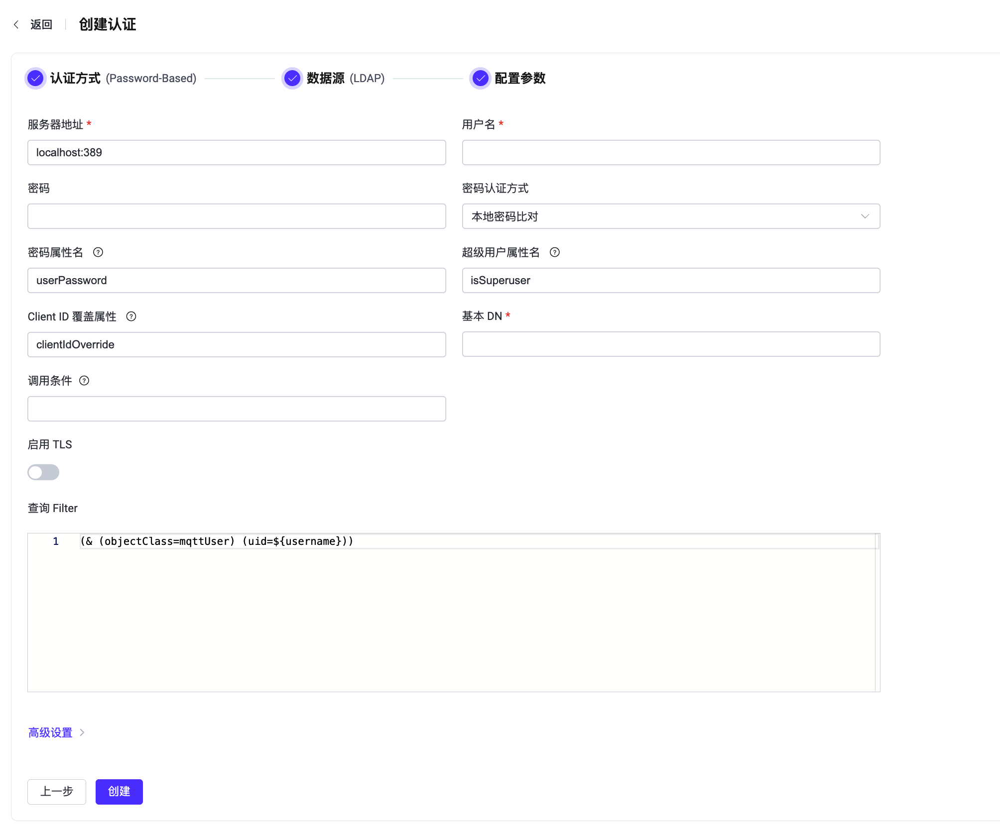

# 使用 LDAP 进行密码认证

[轻量级目录访问协议（LDAP）](https://ldap.com/) 是一种用于访问和管理目录信息的协议。EMQX 支持与 LDAP 服务器集成，用于密码认证。这种集成使用户能够使用其 LDAP 认证信息在 EMQX 中进行身份验证。

::: tip 前置准备

熟悉 [EMQX 认证基本概念](./authn.md)。

:::

## 密码认证方式

EMQX 的 LDAP 集成包括两种不同的密码认证方式：

- **LDAP 绑定验证**

  EMQX 通过 LDAP 的绑定（Bind）操作直接对用户名和密码进行认证。当客户端连接到 EMQX 时，EMQX 会接收用户名和密码，并根据配置的 `base_dn` 和 `filter` 构造出用户的唯一标识（DN，Distinguished Name）。随后，EMQX 使用这些凭据尝试以该用户身份绑定到 LDAP 服务器。如果绑定成功，则认证通过；否则连接会被拒绝。

  该方式完全依赖于 LDAP 中已有的用户条目，不需要 EMQX 获取或处理任何敏感信息（如密码哈希），设置简单，也无需修改 LDAP 的 Schema。

  此方式适用于以下场景：

  - LDAP 服务器中已经存在用户账户；
  - 不允许或不方便更改 LDAP 的 Schema；
  - 希望使用最小化配置，由 LDAP 服务器直接完成认证。

- **本地密码比对**

  EMQX 使用配置项 `username` 和 `password` 提供的 LDAP 绑定账号（即 bind DN）连接到 LDAP 服务器，查找客户端对应的 LDAP 条目，然后从指定属性中读取存储的密码（通常是哈希格式），并与客户端提交的密码进行比对。比对过程在 EMQX 本地完成。

  这种方式提供了更高的灵活性和可控性。它支持更复杂的验证逻辑和安全策略，并能够处理额外的用户属性。例如，EMQX 可以在查询用户密码的同时检索用户的 `isSuperUser` 标志。这意味着在进行认证的同时，EMQX 能够确定用户是否具有超级用户的特权，从而根据用户的权限级别提供不同的访问和操作能力。

  此方式适用于以下场景：

  - 需要存储或处理自定义认证属性（如 `isSuperuser`、ACL 规则）；
  - 有权限配置和管理 LDAP 中的数据结构和认证数据；
  - 需要比简单绑定认证更复杂的安全或验证逻辑。

## LDAP 数据结构与查询

::: tip 注意

本节内容仅适用于使用"本地密码比对"的认证方式。如果您使用的是 “LDAP 绑定验证”方式，请跳过。

:::

本节介绍了如何配置 LDAP 数据结构、创建并存储认证数据以用于密码验证。

LDAP 数据结构定义了在 LDAP 目录中组织和存储认证数据的结构和规则。LDAP 认证器支持几乎任何 LDAP 数据结构。 以下是用于 [OpenLDAP](https://www.openldap.org/) 的数据结构示例：

```sql

attributetype ( 1.3.6.1.4.1.11.2.53.2.2.3.1.2.3.1.4 NAME 'isSuperuser'
	EQUALITY booleanMatch
	SYNTAX 1.3.6.1.4.1.1466.115.121.1.7
	SINGLE-VALUE
	USAGE userApplications )

objectclass ( 1.3.6.1.4.1.11.2.53.2.2.3.1.2.3.4 NAME 'mqttUser'
    SUP top
	STRUCTURAL
	MAY ( isSuperuser )
    MUST ( uid $ userPassword ) )

```

此数据结构定义了一个名为 `isSuperuser` 的属性，用于指示用户是否为超级用户，还定义了一个对象类 `mqttUser`，用于表示用户，并且对像类必须包括 `userPassword` 属性。

要创建 LDAP 认证数据，用户需要定义一些必要的属性名称，基本对象 (object) 的专有名称 (Distinguished Name, DN) 以及 LDAP 查询筛选器 (filter)。以下是根据提供的 OpenLDAP 数据结构使用 LDAP 数据交换格式 (LDIF) 创建的一些示例 LDAP 认证数据：

```sql
## create organization: emqx.io
dn:dc=emqx,dc=io
objectclass: top
objectclass: dcobject
objectclass: organization
dc:emqx
o:emqx,Inc.

## create organization unit: testdevice.emqx.io
dn:ou=testdevice,dc=emqx,dc=io
objectClass: top
objectclass:organizationalUnit
ou:testdevice

## create user=mqttuser0001,
#         password=mqttuser0001,
#         passhash={SHA}mlb3fat40MKBTXUVZwCKmL73R/0=
#         base64passhash=e1NIQX1tbGIzZmF0NDBNS0JUWFVWWndDS21MNzNSLzA9
dn:uid=mqttuser0001,ou=testdevice,dc=emqx,dc=io
objectClass: top
objectClass: mqttUser
uid: mqttuser0001
userPassword:: e1NIQX1tbGIzZmF0NDBNS0JUWFVWWndDS21MNzNSLzA9

## create user=mqttuser0002
#         password=mqttuser0002,
#         passhash={SSHA}n9XdtoG4Q/TQ3TQF4Y+khJbMBH4qXj4M
#         base64passhash=e1NTSEF9bjlYZHRvRzRRL1RRM1RRRjRZK2toSmJNQkg0cVhqNE0=
dn:uid=mqttuser0002,ou=testdevice,dc=emqx,dc=io
objectClass: top
objectClass: mqttUser
uid: mqttuser0002
userPassword:: e1NTSEF9bjlYZHRvRzRRL1RRM1RRRjRZK2toSmJNQkg0cVhqNE0=

## create a superuser mqttuser0003
#         password=mqttuser0003,
#         passhash={MD5}ybsPGoaK3nDyiQvveiCOIw==
#         base64passhash=e01ENX15YnNQR29hSzNuRHlpUXZ2ZWlDT0l3PT0=
dn:uid=mqttuser0003,ou=testdevice,dc=emqx,dc=io
objectClass: top
objectClass: mqttUser
uid: mqttuser0003
isSuperuser: TRUE
userPassword:: e01ENX15YnNQR29hSzNuRHlpUXZ2ZWlDT0l3PT0=
```

编辑 LDAP 服务端配置文件 `slapd.conf`，使其包含数据结构和 LDIF 文件。在启动 LDAP 服务器时将引用数据结构。下面是一个示例`slapd.conf` 文件：

::: tip 提示

您可以根据您的业务需求决定如何存储和访问认证信息。

:::

```sh
include         /usr/local/etc/openldap/schema/core.schema
include         /usr/local/etc/openldap/schema/cosine.schema
include         /usr/local/etc/openldap/schema/inetorgperson.schema
include         /usr/local/etc/openldap/schema/emqx.schema

TLSCACertificateFile  /usr/local/etc/openldap/cacert.pem
TLSCertificateFile    /usr/local/etc/openldap/cert.pem
TLSCertificateKeyFile /usr/local/etc/openldap/key.pem

database mdb
suffix "dc=emqx,dc=io"
rootdn "cn=root,dc=emqx,dc=io"
rootpw {SSHA}eoF7NhNrejVYYyGHqnt+MdKNBh4r1w3W

directory       /usr/local/etc/openldap/data
```

## 通过 Dashboard 配置 LDAP 认证

您可以使用 EMQX Dashboard 配置如何使用 LDAP 进行密码认证。

1. 在 EMQX Dashboard 页面上点击左侧导航栏的**访问控制** -> **客户端认证**。

2. 在**客户端认证**页面，点击**创建**。

3. 依次选择**认证方式**为 `Password-Based`，**数据源**为 `LDAP`，点击**下一步**进入**配置参数**页签：

   

4. 按照以下说明进行配置：

   - 填写连接到 LDAP 服务器所需的信息。

     - **服务器**：指定 EMQX 要连接的服务器地址（`主机：端口`）。

     - **用户名**：指定 EMQX 用于绑定 LDAP 的账户名（即绑定 DN，bind DN），例如：`cn=root,dc=emqx,dc=io`。该账户需具备读取用户条目的权限，通常与 LDAP 配置文件（如 `slapd.conf`）中设置的 `rootdn` 一致。

     - **密码**：与**用户名**对应的明文密码，用于完成绑定操作。此密码应与 LDAP 配置中的 `rootpw` 实际值相对应。

   - 填写与认证相关的设置：

     - **基本 DN**：定义搜索操作的起始节点（即 base DN）。EMQX 会从该 DN 开始查找符合过滤器条件的用户条目。支持使用占位符（如 `${username}`）动态拼接客户端身份。有关更多信息，请参见 [RFC 4511搜索请求](https://datatracker.ietf.org/doc/html/rfc4511#section-4.5.1)。

       ::: tip 提示

       DN 指的是专有名称。这是每个条目的唯一标识符，它还描述了条目在信息树中的位置。

       :::

     - **密码认证方式**：选择认证方式：`LDAP 绑定验证`（默认）或 `本地密码比对`。

     - **绑定密码**：指定 EMQX 用于向 LDAP 服务器认证自身的密码，在执行任何操作或查询之前必须进行此认证。它通过占位符 `${password}` 引用，在运行时将使用配置选项**密码**中定义的实际密码来解析。
     
     - **密码属性名**：当选择 `本地密码比对` 作为认证方法时，指定代表用户密码的属性。此属性的值应遵循 [RFC 3112](https://datatracker.ietf.org/doc/html/rfc3112)，支持的算法有 `md5`、 `sha` 、`sha256`、 `sha384` 、`sha512` 和 `ssha`。
     
     - **超级用户属性名**：当选择 `本地密码比对` 作为认证方法时，用来标识用户是否为超级用户的 LDAP 属性名称。此属性的值应为布尔值，如果缺失则等于 `false`。
     
     - **Client ID 覆盖属性**：指定一个 LDAP 属性名，其值将在客户端连接时用于覆盖客户端原始的 Client ID。通过该功能，可根据认证数据动态生成唯一的 Client ID，有助于在多租户场景中避免多个客户端使用相同 ID 导致的会话冲突问题。
     
     - **调用条件**：一个 Variform 表达式，用于控制是否将此 LDAP 认证器应用于客户端连接。该表达式会根据客户端的属性（例如 `username`、`clientid`、`listener` 等）进行评估。如果表达式的结果为字符串 `"true"`，则会触发认证器。否则，认证器将被跳过。有关调用条件的更多信息，请参见[认证器调用条件](./authn.md#认证器调用条件)。


   - **启用 TLS**：如果要启用 TLS，请打开切换按钮。有关启用TLS的更多信息，请参见[网络和 TLS](../../network/overview.md)。

   - **查询 Filter**：LDAP 查询筛选器，定义搜索匹配给定条目必须满足的条件。 过滤器的语法遵循 [RFC 4515](https://www.rfc-editor.org/rfc/rfc4515)，也支持占位符。

   - **高级设置**：设置并发连接数和连接超时前的等待时间。
- **连接池大小**（可选）：输入一个整数值来定义 EMQX 节点到 LDAP 的并发连接数。默认值：`8`。
     
- **查询超时**（可选）：指定 EMQX 在查询超时之前的等待时间。默认值：`5` 秒。

5. 在完成设置后，点击**创建**。

## 通过配置文件配置 LDAP 认证

您也可通过配置文件配置 LDAP 认证器。

LDAP 认证通过 `mechanism = password_based` 和 `backend = ldap` 进行标识。

以下是使用 **本地密码比对** 方式的一个示例配置：

```bash
{
  backend = "ldap"
  mechanism = "password_based"
  method {
    type = hash
    password_attribute = "userPassword"
    is_superuser_attribute = "isSuperuser"
  }
  server = "127.0.0.1:389"
  query_timeout = "5s"
  username = "root"
  password = "root password"
  pool_size = 8
  base_dn = "uid=${username},ou=testdevice,dc=emqx,dc=io"
  filter = "(objectClass=mqttUser)"
}
```

以下是使用 **LDAP 绑定验证** 方式的一个示例配置：

```bash
{
  backend = "ldap"
  mechanism = "password_based"
  method {
    type = bind
    bind_password = "${password}"
  }
  server = "127.0.0.1:389"
  query_timeout = "5s"
  username = "root"
  password = "root password"
  pool_size = 8
  base_dn = "uid=${username},ou=testdevice,dc=emqx,dc=io"
  filter = "(objectClass=mqttUser)"
}
```

## 从 LDAP 获取 ACL 规则

除了对客户端进行身份认证外，EMQX 还可以从与认证过程中使用的相同 LDAP 条目中获取每个用户的 ACL（访问控制列表）规则。这使得身份认证和权限控制都可以通过 LDAP 集中管理。

在认证过程中，EMQX 使用配置的 `base_dn` 和 `filter` 来定位客户端用户在 LDAP 中的条目。如果找到了包含 ACL 信息的相关属性，EMQX 会将这些信息提取出来并缓存在客户端会话中。之后，EMQX 可根据这些规则执行权限检查（如发布/订阅权限），无需对 LDAP 进行重复查询。

### 支持的 ACL 属性

若要启用从 LDAP 获取 ACL 规则的功能，您需要在 LDAP 数据结构中定义以下任意一个或多个属性：

- **`mqttPublishTopic`**：客户端允许发布的主题白名单。
- **`mqttSubscriptionTopic`**：客户端允许订阅的主题白名单。
- **`mqttPubSubTopic`**：客户端允许同时发布和订阅的主题列表。
- **`mqttAclRule`**：以 JSON 格式定义的细粒度 ACL 规则，可对操作类型（如发布、订阅）、权限（允许或拒绝）及主题做精细控制。
- **`mqttAclTtl`**：可选属性，用于指定客户端会话中缓存 ACL 规则的有效期（time-to-live）。

上述属性名仅为示例，您可以在 LDAP 认证器配置中自定义字段名称以适配实际环境。

这些属性的含义和作用与 [LDAP 权限器](../authz/ldap.md) 中的定义一致，唯独 `mqttAclTtl` 是 LDAP 认证器特有的扩展属性。该属性用于控制 ACL 规则在客户端会话中的缓存时间。其值可以是以秒为单位的纯数字字符串（如 `60`），也可以使用 EMQX 支持的时间单位，如 `1s`、`15m`、`1h` 或 `1d`。

在指定的 TTL 到期后，EMQX 将不再使用原有缓存规则，而是回退至默认的授权设置，除非在后续认证或会话中重新获取到新的规则。

### LDAP 数据结构示例

以下示例展示了包含 ACL 属性定义的 LDAP 数据结构：

```
attributetype ( 1.3.6.1.4.1.11.2.53.2.2.3.1.2.3.1.4 NAME 'isSuperuser'
	EQUALITY booleanMatch
	SYNTAX 1.3.6.1.4.1.1466.115.121.1.7
	SINGLE-VALUE
	USAGE userApplications )
attributetype ( 1.3.6.1.4.1.11.2.53.2.2.3.1.2.3.4.1 NAME ( 'mqttPublishTopic' 'mpt' )
	EQUALITY caseExactMatch
	SUBSTR caseExactSubstringsMatch
	SYNTAX 1.3.6.1.4.1.1466.115.121.1.15
	USAGE userApplications )
attributetype ( 1.3.6.1.4.1.11.2.53.2.2.3.1.2.3.4.2 NAME ( 'mqttSubscriptionTopic' 'mst' )
	EQUALITY caseExactMatch
	SUBSTR caseExactSubstringsMatch
	SYNTAX 1.3.6.1.4.1.1466.115.121.1.15
	USAGE userApplications )
attributetype ( 1.3.6.1.4.1.11.2.53.2.2.3.1.2.3.4.3 NAME ( 'mqttPubSubTopic' 'mpst' )
	EQUALITY caseExactMatch
	SUBSTR caseExactSubstringsMatch
	SYNTAX 1.3.6.1.4.1.1466.115.121.1.15
	USAGE userApplications )
attributetype ( 1.3.6.1.4.1.11.2.53.2.2.3.1.2.3.4.4 NAME ( 'mqttAclRule' 'mar' )
	EQUALITY caseExactMatch
	SUBSTR caseExactSubstringsMatch
	SYNTAX 1.3.6.1.4.1.1466.115.121.1.15
	USAGE userApplications )
attributetype ( 1.3.6.1.4.1.11.2.53.2.2.3.1.2.3.4.5 NAME ( 'mqttAclTtl' 'mat' )
	EQUALITY caseExactMatch
	SUBSTR caseExactSubstringsMatch
	SYNTAX 1.3.6.1.4.1.1466.115.121.1.15
	USAGE userApplications )
objectclass ( 1.3.6.1.4.1.11.2.53.2.2.3.1.2.3.4 NAME 'mqttUser'
	SUP top
	STRUCTURAL
	MAY ( isSuperuser $ mqttPublishTopic $ mqttSubscriptionTopic $ mqttPubSubTopic $ mqttAclRule $ mqttAclTtl )
  MUST ( uid $ userPassword ))
```

### 带 ACL 属性的 LDAP 数据示例（LDIF）

以下是基于上述数据结构的 OpenLDAP 数据示例，使用 [LDAP 数据交换格式（LDIF）](https://ldap.com/ldif-the-ldap-data-interchange-format/) 表示：

```sql
dn:dc=emqx,dc=io
objectclass: top
objectclass: dcobject
objectclass: organization
dc:emqx
o:emqx,Inc.

# 创建组织单元 testdevice.emqx.io
dn:ou=testdevice,dc=emqx,dc=io
objectClass: top
objectclass:organizationalUnit
ou:testdevice

## 创建用户 mqttuser0002
#         密码为 mqttuser0002
#         哈希后的密码为：{SSHA}n9XdtoG4Q/TQ3TQF4Y+khJbMBH4qXj4M
#         Base64 编码的哈希为：e1NTSEF9bjlYZHRvRzRRL1RRM1RRRjRZK2toSmJNQkg0cVhqNE0=
dn:uid=mqttuser0002,ou=testdevice,dc=emqx,dc=io
objectClass: top
objectClass: mqttUser
objectClass: mqttDevice
objectClass: mqttSecurity
uid: mqttuser0002
isEnabled: TRUE
mqttAccountName: user2
mqttPublishTopic: mqttuser0002/pub/1
mqttPublishTopic: mqttuser0002/pub/+
mqttPublishTopic: mqttuser0002/pub/#
mqttSubscriptionTopic: mqttuser0002/sub/1
mqttSubscriptionTopic: mqttuser0002/sub/+
mqttSubscriptionTopic: mqttuser0002/sub/#
mqttPubSubTopic: mqttuser0002/pubsub/1
mqttPubSubTopic: mqttuser0002/pubsub/+
mqttPubSubTopic: mqttuser0002/pubsub/#
mqttAclRule: [{"permission": "allow", "action": "pub", "topic": "mqttuser0002/complexrule1/1"}]
mqttAclRule: {"permission": "allow", "action": "pub", "topic": "mqttuser0002/complexrule2/#"}
mqttAclTtl: 1s
userPassword:: e1NTSEF9bjlYZHRvRzRRL1RRM1RRRjRZK2toSmJNQkg0cVhqNE0=
```

### LDAP 认证器配置示例

若要启用 ACL 规则提取及缓存功能，您需要在 LDAP 认证器配置中显式指定属性名称：

```bash
{
  backend = "ldap"
  mechanism = "password_based"
  method {
    type = hash
    password_attribute = "userPassword"
    is_superuser_attribute = "isSuperuser"
  }
  server = "127.0.0.1:389"
  query_timeout = "5s"
  username = "root"
  password = "root password"
  pool_size = 8
  base_dn = "uid=${username},ou=testdevice,dc=emqx,dc=io"
  filter = "(objectClass=mqttUser)"

  publish_attribute = "mqttPublishTopic"
  subscribe_attribute = "mqttSubscriptionTopic"
  all_attribute = "mqttPubSubTopic"
  acl_attribute = "mqttAclRule"
  acl_ttl_attribute = "mqttAclTtl"
}
```
