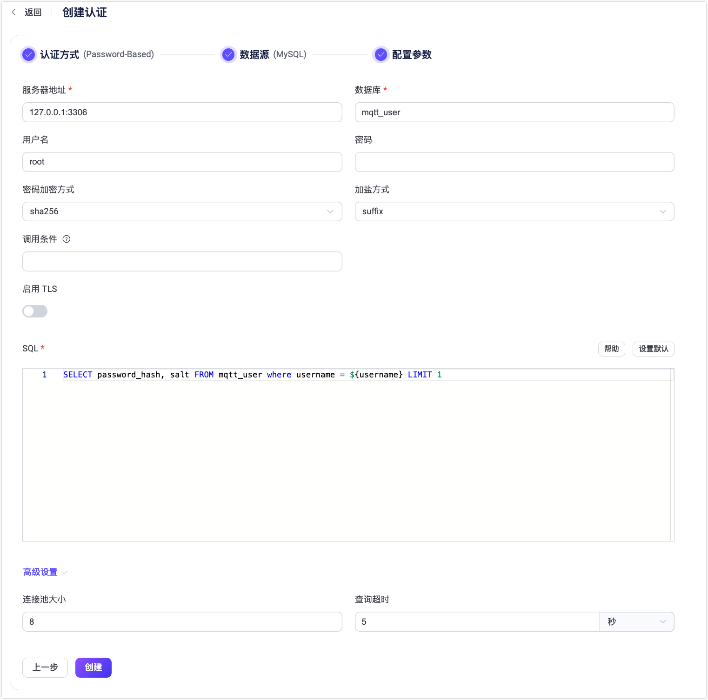

# 使用 PostgreSQL 进行密码认证

作为密码认证方式的一种，EMQX 支持通过集成 PostgreSQL 进行密码认证。

::: tip 前置准备

熟悉 [EMQX 认证基本概念](../authn/authn.md)
:::

## 表结构与查询语句

PostgreSQL 认证器可以支持任何表结构，甚至是多个表联合查询、或从视图中查询。用户需要提供一个查询 SQL 模板，且确保查询结果包含以下字段：

- `password_hash`: 必需，数据库中的明文或散列密码字段
- `salt`: 可选，为空或不存在时视为空盐（`salt = ""`）
- `is_superuser`: 可选，标记当前客户端是否为超级用户，默认为 `false`

示例表结构：

```sql
CREATE TABLE mqtt_user (
  id serial PRIMARY KEY,
  username text NOT NULL UNIQUE,
  password_hash  text NOT NULL,
  salt text NOT NULL,
  is_superuser boolean DEFAULT false,
  created timestamp with time zone DEFAULT NOW()
);
```

:::tip
上面的示例创建了一个有助于查询的隐式 `UNIQUE` 索引字段（ `username` ）。当系统中有大量用户时，请确保查询使用的表已优化并使用有效的索引，以提升大量连接时的数据查找速度并降低 EMQX 负载。
:::

在此表中使用 `username` 作为查找条件。

例如我们希望添加一位名为 `user123`、密码为 `secret`、盐值为 `salt`、散列方式为 `sha256` 且超级用户标志为 `true` 的用户，SQL 如下：

```sql
INSERT INTO mqtt_user(username, password_hash, salt, is_superuser) VALUES ('user123', 'f84fa2149dbb62ed4e0cf1f550d2949b33a6513d3a7707e08502511c79ccb0ee', 'salt', true);
INSERT 0 1
```

对应的查询语句和密码散列方法配置参数为：

- 密码加密方式：`sha256`
- 加盐方式：`suffix`
- SQL：

```sql
SELECT password_hash, salt, is_superuser FROM mqtt_user WHERE username = ${username} LIMIT 1
```

## 通过 Dashboard 配置

1. 在 EMQX Dashboard 页面上点击左侧导航栏的**访问控制** -> **客户端认证**.
2. 在**客户端认证**页面，点击**+ 创建**。
3. 依次选择**认证方式**为 `Password-Based`，**数据源**为 `PostgreSQL`，点击**下一步**进入**配置参数**页签：



4. 按照以下说明配置数据源：

   - 配置 PostgreSQL 连接信息：

     - **服务**：填入 PostgreSQL 服务器地址 (`host:port`) 。
     - **数据库**：填入 PostgreSQL 的数据库名称。
     - **用户名**：填入用户名称。
     - **密码**：填入用户密码。

   - 配置认证相关设置：
     - **密码加密方式**：选择应用于明文密码的哈希算法，用于在将结果存储到数据库之前对密码进行加密。可选算法包括 `plain`、`md5`、`sha`、`sha256`、`sha512`、`bcrypt` 和 `pbkdf2`。具体配置取决于所选择的算法：
       - 选择  `md5`、`sha`、`sha256` 或 `sha512` 算法，还需配置：
         - **加盐方式**：用于指定盐和密码的组合方式，可选值：`suffix`（在密码尾部加盐）、`prefix`（在密码头部加盐）、`disable`（不启用）。如果不需要将用户凭据从外部存储迁移到 EMQX 内置数据库，可以保持默认值。
         - 生成的哈希以十六进制字符串表示，并与存储的凭据进行不区分大小写的比对。

       - 选择 `plain`：
         - **加盐方式**：应设置为 `disable`。

       - 选择 `bcrypt` 算法，还需配置：
         - **Salt Rounds**：指定散列需要的计算次数（2^Salt Rounds），也称成本因子。默认值：`10`，可选值：`5` 到 `10`；数值越高，加密的安全性越高，因此建议采用较大的值，但相应的用户验证的耗时也会增加，您可根据业务需求进行配置。

       - 选择 `pbkdf2` 算法，还需配置：
         - **伪随机函数**：指定生成密钥使用的散列函数，如 `sha256` 等。

         - **迭代次数**：指定迭代次数。默认值：`4096`。

         - **密钥长度**（可选）：指定希望得到的密钥长度。如不指定，密钥长度将由**伪随机函数**确定。

         - 生成的哈希以十六进制字符串表示，并与存储的凭据进行不区分大小写的比对。
   - **调用条件**：一个 Variform 表达式，用于控制是否将此 PostgreSQL 认证器应用于客户端连接。该表达式会根据客户端的属性（例如 `username`、`clientid`、`listener` 等）进行评估。如果表达式的结果为字符串 `"true"`，则会触发认证器。否则，认证器将被跳过。有关调用条件的更多信息，请参见[认证器调用条件](./authn.md#认证器调用条件)。
   - **启用 TLS**：如果要启用TLS，请打开切换按钮。有关启用 TLS 的更多信息，请参见[网络和 TLS](../../network/overview.md)。
   - **SQL**：根据表结构填入查询 SQL，具体要求见 [SQL 表结构与查询语句](#sql-表结构与查询语句)。
   - **高级设置**：
     - **连接池大小**（可选）：填入一个整数用于指定从 EMQX 节点到 PostgreSQL 数据库的并发连接数；默认值：`8`。
     - **禁用预处理**（可选）：如果您使用的是不支持预处理语句会话的 PostgreSQL 服务，例如在事务模式下的 PGBouncer 或 Supabase，请启用此项。这个选项在  EMQX v5.7.1 中引入。
5. 点击**创建**完成配置。

### 通过配置文件配置

您也可通过配置文件完成相关配置。 <!-- 具体操作步骤，请参考： [authn-postgresql:authentication](../../configuration/configuration-manual.html#authn-postgresql:authentication)。-->

配置示例：

```bash
{
  mechanism = password_based
  backend = postgresql

  password_hash_algorithm {
    name = sha256
    salt_position = suffix
  }

  database = mqtt
  username = postgres
  password = public
  server = "127.0.0.1:5432"
  query = "SELECT password_hash, salt, is_superuser FROM users where username = ${username} LIMIT 1"
}
```
