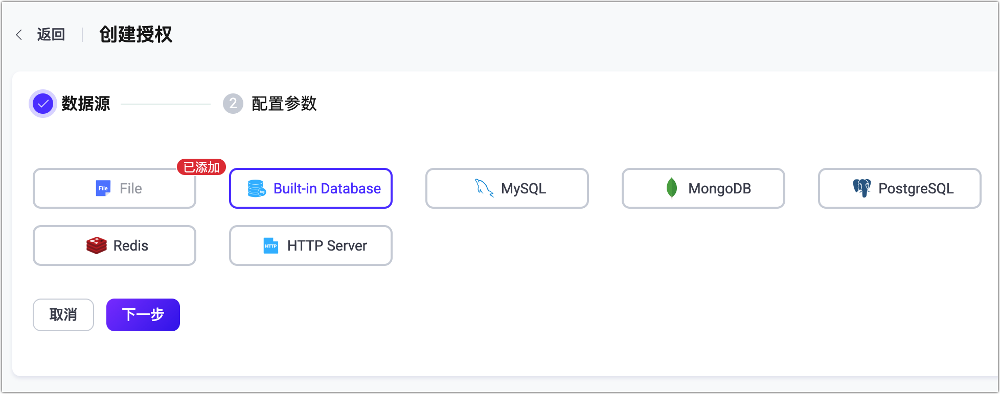

# 授权

在 EMQX 中，授权是指对 MQTT 客户端的发布和订阅操作进行权限控制。EMQX 的授权机制基本原理是：当客户端尝试发布或订阅时，EMQX 会根据特定流程或用户定义的查询语句，从数据源中获取该客户端的权限数据，将权限与要执行的操作进行匹配，根据匹配结果来允许或拒绝本次操作。

单条客户端权限数据由以下部分组成：

| **权限**  | **客户端**               | **操作**           | **操作详情**      |
| --------- | ------------------------ | ------------------ | ----------------- |
| 允许/拒绝 | 客户端 ID/用户名/IP 地址 | 发布/订阅/发布订阅 | 主题/QoS/保留消息 |

::: tip
EMQX 5.1.1 版本开始引入了操作详情支持检查 QoS 和保留消息。
:::

客户端权限列表需要提前存储到特定数据源（数据库、文件）中，更新对应的数据即可实现权限的运行时动态更新。

EMQX 已经默认配置一个基于文件的授权检查器，将基于 ACL 文件中存储的规则进行授权检查。您可直接使用。

## 授权数据存储

EMQX 授权支持与多种数据源集成，包括内置数据库、文件、MySQL、PostgreSQL、MongoDB 和 Redis。用户可以通过 REST API 或 Dashboard 管理权限数据。此外，EMQX 还支持用户通过 HTTP 对接自己开发的服务，借此实现更复杂的授权逻辑。

<!-- TODO 暂不支持：或从 CSV 或 JSON 文件批量导入数据。 -->

按照数据源来划分，EMQX 支持以下几种授权检查器，您可点击下方表格中的链接获取各授权检查器的配置方式：

| 数据存储    | 描述                                              |
| ----------- | ------------------------------------------------- |
| ACL 文件    | [通过文件存放授权信息](./file.md)                 |
| 内置数据库  | [使用内置数据库存放授权数据](./mnesia.md)         |
| MySQL       | [使用 MySQL 存放授权数据](./mysql.md)             |
| PostgreSQL  | [使用 PostgreSQL 存放授权数据](./postgresql.md)   |
| MongoDB     | [使用 MongoDB 存放授权数据](./mongodb.md)         |
| Redis       | [使用 Redis 存放授权数据](./redis.md)             |
| LDAP        | [使用 LDAP 目录存放授权数据](./ldap.md)           |
| HTTP 服务器 | [通过访问外部 HTTP 服务来获取授权信息](./http.md) |

例如，MySQL 授权检查器的配置文件为：

```hcl
{

    type = mysql
    database = "mqtt"
    username = "root"
    password = "public"

    query = "SELECT permission, action, topic FROM mqtt_acl WHERE username = ${username}"
    server = "127.0.0.1:3306"
}
```

## 授权链

除配置单个授权检查器外，EMQX 支持用户通过配置多个授权检查器构成授权链，以实现更灵活的授权检查。EMQX 将按照授权链中配置的检查器顺序依次执行授权检查。如果在当前授权检查器中未检索到权限数据，将会切换至链上的下一个启用的授权检查器继续权限检查。

授权检查流程如下：

1. 当前授权检查器执行时检索到了客户端的权限信息，匹配当前执行的操作与客户端的权限信息：
   - 操作与权限匹配，根据权限允许或拒绝客户端的操作；
   - 操作与权限不匹配，交由下一授权检查器继续检查。
2. 当前授权检查器执行时没有检索到了客户端的权限信息，EMQX 将继续检查授权链中是否还有其他授权检查器：
   - 如有，EMQX 将跳过当前授权检查器，并将请求交由下一授权检查器继续检查；
   - 如当前授权检查器是链中最后一个授权检查器：根据**未匹配时执行**（ `no_match` ）配置决定检查结果（允许或拒绝）。

有关如何调整授权链中授权检查器顺序以及查看其运行统计指标，可查看 [管理授权检查器](#管理授权检查器) 章节。

::: warning 注意

为避免授权检查出错，必须记得在必要时停用或删除基于 ACL 文件的授权检查器，因为 ACL 文件末尾包含的特殊规则 `{allow, all}` 默认允许所有请求。

:::

<!-- TODO 补充流程图 -->

## 客户端授权缓存

EMQX 提供了基于会话的授权数据缓存机制。该缓存会将授权结果存储在客户端的会话状态中，在同一连接期间避免重复执行权限规则判断。客户端授权缓存机制能够提升客户端发布/订阅操作的权限检查效率，同时能够缓解由于大量客户端的订阅和发布请求对授权数据后端造成的访问压力。

### 客户端授权缓存的工作原理

当客户端连接并执行发布/订阅操作时：

1. EMQX 会检查当前会话中是否已有授权缓存；
2. 如果找到了匹配的规则，则直接使用缓存中的结果；
3. 如果未命中缓存（或缓存已过期），EMQX 将使用已配置的授权器进行完整的权限检查；
4. 检查结果将被缓存，用于该连接期间的后续操作。

::: tip

此缓存是客户端会话级别的，在客户端断开连接或重新连接时会被清除。

:::

### 在 Dashboard 中配置客户端授权缓存

您可以在 EMQX Dashboard 中启用或配置客户端授权缓存：

1. 进入**访问控制** -> **授权** -> **设置**。

2. 配置以下选项：

   | 字段名称             | 描述                                                         |
   | -------------------- | ------------------------------------------------------------ |
   | **启用缓存**         | 是否启用客户端会话的授权数据缓存。                           |
   | **单客户端缓存条数** | 每个客户端可缓存的最大条目数。默认值：`32`。                 |
   | **缓存过期时间**     | 每条缓存的有效期。默认值为 `1 分钟`。                        |
   | **排除主题**         | 不启用缓存的主题列表。                                       |
   | **未匹配时执行**     | 当所有授权检查器都未找到授权信息时，应执行的操作。可选值：`allow`（允许操作）/ `deny`（拒绝操作），默认值为 `allow`。 |
   | **拒绝时执行**       | 拒绝当前客户端的操作请求时，应执行的操作。可选值：`ignore`（忽略该操作请求）/ `disconnect`（断开当前客户端连接），默认值为 `ignore`。 |
   | **清除缓存**         | 清除当前所有客户端授权结果缓存。                             |

3. 点击**保存**以应用配置。

您也可以通过配置文件进行相同设置。详细说明请参考：[配置文件](../../configuration/configuration.md)。

::: tip

启用授权数据缓存后，系统性能将受到一定的影响，建议及时根据系统表现调整缓存参数的设置。

:::

## 外部资源缓存

除了基于会话的授权缓存之外，EMQX 还支持用于存储来自外部数据源后端（如 MySQL、MongoDB 或 Redis）的授权结果的节点级缓存。该功能可通过减少对远程数据源的重复访问来提升系统性能。

::: tip 注意

外部资源缓存仅针对外部数据源，对于本地数据源，如内置数据库或文件等 EMQX 不进行缓存。

:::

### 外部资源缓存的工作原理

当发布/订阅操作触发对外部后端的查询时：

1. EMQX 会检查当前节点上所有客户端共享的外部资源缓存；
2. 如果缓存中存在匹配的授权结果：
   - 命中缓存，计入**缓存命中**，无需访问外部后端；
   - 如果未命中，计入**缓存未命中**，EMQX 将查询外部后端；
3. 外部后端返回的结果将被存入缓存，供后续使用，同时计入**缓存插入**指标。

::: tip

与基于会话的授权缓存不同，外部资源缓存是节点范围共享的，在同一节点上的所有客户端之间共享，并在客户端之间的连接过程中持续有效。

:::

### 启用并配置外部资源缓存

您可以通过 EMQX Dashboard 启用并配置外部资源缓存：

1. 进入**访问控制** -> **授权**页面。

2. 点击页面右上角的**外部资源缓存设置**按钮，右侧将弹出设置面板。

3. 在面板中，使用**启用外部资源缓存**开关启用或关闭缓存功能。启用后，您可以配置以下缓存参数：

   | 字段名称         | 描述                                                      |
   | ---------------- | --------------------------------------------------------- |
   | **最大缓存数量** | 每个节点允许缓存的最大授权结果条数。默认值：`1,000,000`。 |
   | **最大内存**     | 缓存允许使用的最大内存。默认值：`100 MB`。                |
   | **缓存过期时间** | 每条缓存数据的有效时长。默认值：`1 分钟`。                |

4. 点击**更新**以应用设置。

以上配置将在整个集群范围内生效，确保所有节点行为一致。

### 查看外部资源缓存状态

<!--@include: ../monitor-cache-status.md-->

## 占位符

EMQX 允许使用占位符动态构造授权数据查询语句、HTTP 请求，占位符会在授权检查器执行时替换为真实的客户端信息，以构造出与当前客户端匹配的查询语句或 HTTP 请求。

一个有效的占位符格式为 ${PATH.TO.VALUE}，其中 PATH.TO.VALUE 是对象中值的点符号路径。允许的字符包括字母、数字、点（`.`）和下划线（`_`）。
如果占位符中包含不支持的字符，将被视为普通文本处理。

### 数据查询占位符

用于在查询权限数据时构造数据查询语句。以 MySQL 授权检查器为例，默认的查询 SQL 中使用了 `${username}` 占位符：

```sql
SELECT action, permission, topic FROM mqtt_acl where username = ${username}
```

当用户名为 `emqx_u` 的客户端触发授权检查时，实际执行权限数据查询 SQL 将被替换为：

```sql
SELECT action, permission, topic FROM mqtt_acl where username = 'emqx_u'
```

EMQX 授权支持的数据查询占位符如下：

- `${username}`：将在运行时被替换为用户名。用户名来自 `CONNECT` 报文中的 `Username` 字段。如果启用了 `peer_cert_as_username`，则会在连接时被证书中的字段或证书内容所覆盖。
- `${clientid}`：将在运行时被替换为客户端 ID。客户端 ID 一般由客户端在 `CONNECT` 报文中显式指定，如果启用了 `use_username_as_clientid` 或 `peer_cert_as_clientid`，则会在连接时被用户名、证书中的字段或证书内容所覆盖。
- `${peerhost}`：将在运行时被替换为客户端的 IP 地址。EMQX 支持 [Proxy Protocol](http://www.haproxy.org/download/1.8/doc/proxy-protocol.txt)，即使 EMQX 部署在某些 TCP 代理或负载均衡器之后，用户也可以使用此占位符获得真实 IP 地址。
- `${peername}`：将在运行时被替换为客户端的 IP 地址和端口，格式为 `IP: PORT`。
- `${cert_common_name}`：将在运行时被替换为客户端 TLS 证书的通用名称（Common Name）。如果证书信息是从负载均衡器发送到 EMQX 的 TCP 端口，需要确保负载均衡器使用的是 Proxy Protocol v2。
- `${cert_subject}`：将在运行时被替换为客户端 TLS 证书的主题（Subject）。如果证书信息是从负载均衡器发送到 EMQX 的 TCP 端口，需要确保负载均衡器使用的是 Proxy Protocol v2。
- `${client_attrs.NAME}`：某个客户端属性。`NAME` 将在运行时根据预定义配置替换为属性名称。有客户端属性的详细信息，请参见 [MQTT 客户端属性](../../../develop/client-attributes/client-attributes.md)。
- `${zone}`：在运行时将替换为客户端的 Zone。`${zone}` 占位符可以直接用于授权模板中。有关 Zone 的详细配置信息，请参见 [Zone 覆盖](../../configuration/configuration.md#zone-覆盖)。

<!-- TODO
确认 HTTP AuthZ 为什么会多出几个
?PH_PROTONAME,
?PH_MOUNTPOINT,
?PH_TOPIC,
?PH_ACTION,
-->

### 主题占位符

EMQX 还允许在主题中使用占位符，在匹配规则时将当前客户端信息等动态替换到主题中，支持的占位符如下：

- `${clientid}`
- `${username}`
- `${client_attrs.NAME}`: 某一个客户端属性，`NAME` 替换成 `mqtt.client_attrs_init` 规则提取的某一个字段名称。

占位符只能用于替换主题的整个字段，例如 `a/b/${username}/c/d`，但是不能用于替换字段的一部分，例如 `a/b${username}c/d`。

<!-- TODO 调查与 4.x 版本是否存在差异-->

为了避免占位符跟想要的主题冲突的问题，从 EMQX 5.4 开始，可以使用 `${$}` 来对 `$` 进行转义。例如 `t/${$}{username}` 表示 `t/${username}` 本身，而不是将 username 替换进去之后的主题名称。

::: tip

如果在查询语句中使用`eq` 语法，需要注意，`eq` 后面的主题不支持占位符替换，这个行为可能会在后续版本中改变。

`eq` 语法用于精确匹配一个订阅主题通配符，而不是匹配该通配符的其他主题。 例如 `eq t/#` 精确匹配 `t/#` 但不匹配 `t/1` 或 `t/2` 等等。

:::

## 授权检查优先级

除了缓存与授权检查器之外，授权结果还可能受到认证阶段设置的[超级用户角色与权限](../authn/authn.md#超级用户与权限)影响。

如果客户端在认证阶段设置了超级用户角色，则发布订阅操作不会再触发授权检查；如果设置了[权限列表](../authn/acl.md)，则优先匹配客户端权限数据。三者匹配优先级如下：

```bash
超级用户 > 权限数据 > 授权检查
```

## 配置授权

EMQX 提供了三种授权检查器的配置方式，分别为：Dashboard、配置文件和 HTTP API。

### 通过 Dashboard 配置授权

在 Dashboard 的授权页面，您可直接完成相关授权检查器的配置，查看授权检查器状态，以及调整授权检查器在授权链中的位置。



### 通过配置文件配置授权

您也可通过配置文件 `base.hocon` 中 `authorization` 相关字段进行授权的配置。

配置结构如下：

```hcl
authorization {
  sources = [
    { ...   },
    { ...   }
  ]
  no_match = deny
  deny_action = ignore
  cache {
    max_size = 32
    excludes = ["t/1", "t/2"]
    ttl = 1m
  }
}
```

其中：

- `sources`(可选)：带顺序的数组，用于配置授权检查器的数据源。有关各授权检查器的具体配置信息，请参考相应的配置文件文档。<!--TODO 这里需要加上对应的超链接-->
- `no_match`：如当前客户端操作无法匹配到任何规则，将基于此规则决定允许或拒绝操作；可选值： `allow` 、 `deny`；自 EMQX 6.0 起，默认值为 `deny`。
- `deny_action`：如当前客户端的操作被拒绝，后续应执行的操作；可选值： `ignore` 、 `disconnect`；默认值： `ignore`。
  - `ignore`: 丢弃当前操作，例如，如针对发布动作，该消息会被丢弃；如针对订阅操作，该请求将被拒绝。
  - `disconnect`: 丢弃当前操作，并将客户端连接断开。
- `cache`：客户端授权缓存的相关配置，包括以下字段：
  - `cache.enable`: 是否为客户端授权开启缓存；默认值： `true`；注意：如果仅使用认证中提供权限信息进行权限检查，建议关闭缓存。
  - `cache.max_size`: 每个客户端允许缓存的最大授权结果数量 ；默认值 `32`；当缓存结果的数量超过上限时，老的记录将被删掉。
  - `cache.excludes`: 排除的主题列表，指定列表内的主题不会生成授权缓存；默认值： `[]`。
  - `cache.ttl`：缓存的有效时间，默认值： `1m`（一分钟）。

::: tip

对于暴露在不受信任网络或公共网络中的 Broker，将 `deny_action` 设置为 `disconnect` 可防止客户端在同一连接上继续尝试未经授权的发布或订阅。配合[连接抖动检测](../flapping-detect.md)使用时，反复重连并触发授权拒绝的客户端会被自动封禁一段时间。

`deny_action` 是全局授权配置，无法针对单个监听器单独设置。它同样会断开尝试了被拒绝操作的合法客户端。建议在客户端正常只发布和订阅已授权主题的场景下使用 `disconnect`。同时应合理调整连接抖动检测阈值，避免正常重连风暴导致客户端被封禁。

:::

### 通过 HTTP API 配置授权

EMQX 为授权参数暴露如下 REST API 来支持进行运行时动态修改。

- `/api/v5/authorization/settings`: 查看、修改授权参数，例如 `no_match`， `deny_action` 和 `cache`
- `/api/v5/authorization/sources`: 用于管理授权检查器
- `/api/v5/authorization/cache`: 清除客户端授权数据缓存
- `/api/v5/authorization/sources/built_in_database`: 内置数据库数据管理

详细的请求方式与参数请参考 [HTTP API](../../api.md)。

## 管理授权检查器

您可以在 Dashboard **访问控制** -> **授权** 页面查看并管理授权检查器。

### 调整授权检查器顺序

如 [授权链](#授权链) 所述，授权检查器按照配置顺序依次执行。

您可以通过列表中的 **更多** 操作，对授权检查器进行**上移**、**下移**、**移到顶部**、**移到底部** 等操作；也可以通过配置文件，改变其在 `authorization.sources` 配置项中的位置进行顺序调整。

### 授权检查器状态

您可以在 **状态** 列中查看每个授权检查器的连接状态，状态如下：

- **已连接**：所有节点都成功连接到数据源；
- **已断开**：部分或全部节点没有连接到数据源，此状态下请检查数据源是否可用，故障排除后手动重启（ **禁用** 并 **启用** ）授权检查器后可恢复；
- **连接中**：部分或全部节点正在进行数据源的重连，请检查数据源是否可用，数据库或表是否存在，故障排除后会自动恢复，也可以通过手动重启（ **禁用** 并 **启用** ）授权检查器恢复。

你可以通过 **是否启用** 列查看并设置每个授权检查器的启用状态。

执行检查时，EMQX 将跳过连接状态异常（**已断开** 或 **连接中**）与处于 **禁用** 状态的授权检查器。

### 统计指标

您可以在授权检查器详情页中查看每个授权检查器的统计指标，指标如下：

- **允许**：鉴权检查通过次数。
- **拒绝**：鉴权检查拒绝次数。<!-- TODO Dashboard 的描述是 失败次数，有歧义 -->
- **不匹配**：未查找到客户端权限数据次数。
- **忽略**：鉴权查询被忽略的次数，原因是当授权源尝试对请求进行授权但遇到不适用或出现错误导致无法决定结果的情况。
- **当前速率(tps)**：当前触发检查执行速率。

您也可以通过 **节点状态** 查看每个节点上授权状态和执行情况。

如果您想查看全局的授权检查统计指标，请参考 [指标 - 认证和授权](../../observability/metrics-and-stats.md#认证和授权)。
