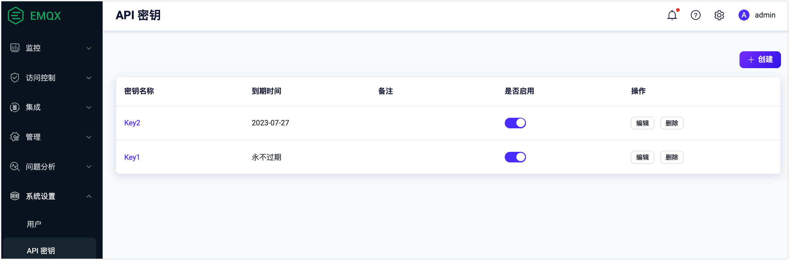
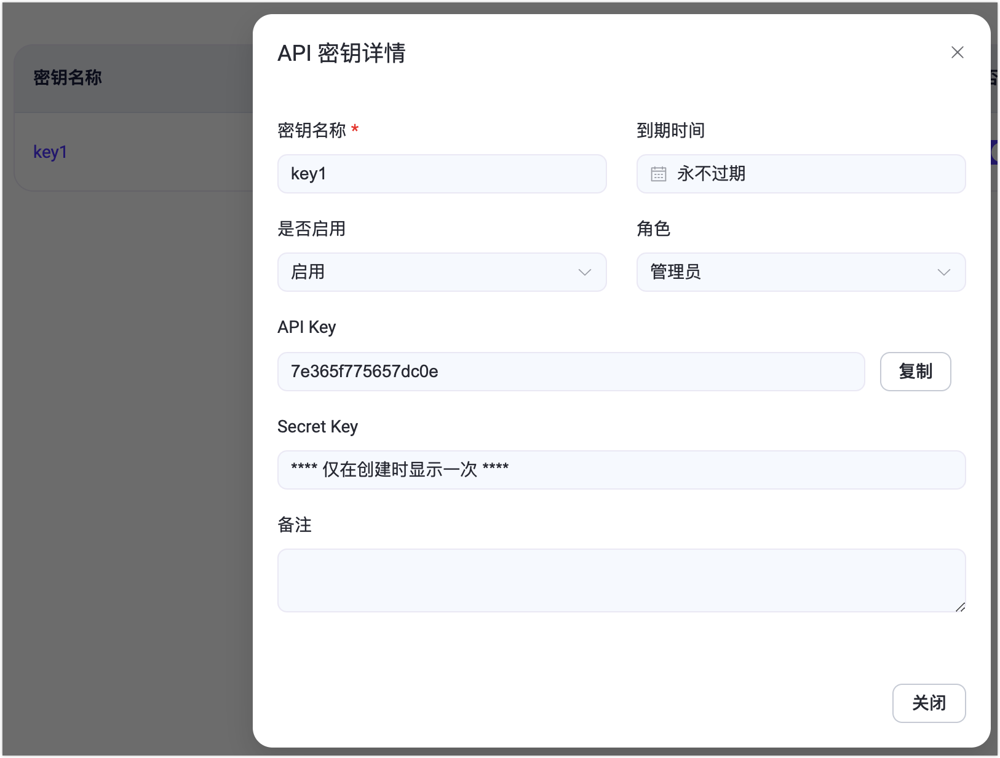

# API 密钥

在 EMQX Dashboard 的 **API 密钥**页面，您可以生成用于访问 [HTTP API](../guides/api.md) 的 API 密钥和 Secret Key。

## 创建 API 密钥

1. 在 Dashboard 中导航至**系统** -> **API 密钥**。

2. 点击页面右上角的**创建**按钮，打开创建 API 密钥对话框。

3. 配置 API 密钥的详细信息：

   - 如果**到期时间**留空，API 密钥将永不过期。
   - 可选择为 API 密钥指定[角色](../guides/api.md#角色与权限)（仅适用于 EMQX 企业版）。

4. 点击**确认**按钮，API 密钥和 Secret Key 将显示在**创建成功**对话框中。

   ::: warning 重要提示

   请立即将 API Key 和 Secret Key 保存至安全的地方，Secret Key 关闭对话框后将不再显示。

   :::

5. 点击**关闭**按钮关闭对话框。

## 管理 API 密钥

创建 API 密钥后，可在 API 密钥页面进行以下操作：

- **查看详情**：点击**名称**列中的密钥名称。
- **编辑**：点击**操作**列中的**编辑**按钮，可重新设置到期时间、修改启用状态或更新备注。
- **删除**：如某 API 密钥不再需要，点击**操作**列中的**删除**按钮将其删除。

