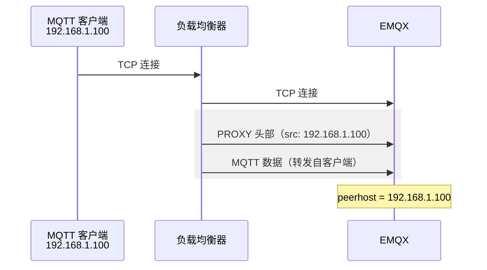

# PROXY 协议

当 EMQX 部署在负载均衡器或反向代理后端时，到达 EMQX 的 TCP 连接来自代理服务器，而非实际客户端。因此，EMQX 只能看到代理的地址，无法获取真实的客户端 IP。这会影响基于 IP 的认证规则、源地址授权策略、审计日志、限流以及问题排查。

PROXY 协议解决了这一问题。该协议由 HAProxy 定义，是一种轻量级的传输层机制，在 TCP 流开头附加一个小型头部，携带原始客户端的 IP 地址、端口及连接元数据。EMQX 在处理任何 MQTT 数据之前先读取该头部，从而将头部中报告的地址视为真实客户端地址，用于所有后续操作。

## PROXY 协议版本

PROXY 协议有两个版本：

| 版本 | 格式 | TLS 证书转发 |
| ---- | ---- | ------------ |
| v1 | 可读文本行 | 不支持 |
| v2 | 二进制头部 | 支持（CN、Subject、SAN 等） |

**v1** 格式简单直接，代理在 TCP 流开头插入一行 ASCII 文本：

```text
PROXY TCP4 192.168.1.100 10.0.0.1 56324 1883\r\n
```

**v2** 采用紧凑的二进制格式，可携带更丰富的元数据，包括 TLS 扩展字段。如果负载均衡器执行 TLS 终结并开启了双向认证，且需要在 EMQX 内部使用客户端证书信息，例如在认证或授权的占位符中使用 `${cert_common_name}`，则必须使用 PROXY 协议 v2。

::: tip

PROXY 协议是单向的、逐连接的机制，无需对 MQTT 客户端做任何修改。
:::

## 工作原理

启用 PROXY 协议后，连接建立流程如下：

1. MQTT 客户端向负载均衡器发起 TCP 连接。
2. 负载均衡器向 EMQX 建立新的 TCP 连接，并在连接建立后立即发送 PROXY 协议头部（v1 或 v2），描述原始客户端的地址信息。
3. EMQX 在处理任何 MQTT 数据之前读取并解析该头部。
4. EMQX 的认证、授权、日志记录、限流等所有后续操作均使用头部中报告的客户端地址。



如果 EMQX 监听器启用了 PROXY 协议，但连接到来时没有携带头部（例如客户端绕过负载均衡器直连 EMQX），EMQX 会关闭该连接并记录错误。反之，如果监听器未启用 PROXY 协议，但代理发送了头部，EMQX 会将其当作异常的 MQTT 数据处理。

::: warning 重要提示

负载均衡器与 EMQX 监听器两端必须对 PROXY 协议的启用状态保持一致。配置不匹配将导致连接失败。

:::

## 在 EMQX 监听器上启用 PROXY 协议

`proxy_protocol` 选项适用于所有基于 TCP 的 EMQX 监听器：MQTT TCP、MQTT SSL、MQTT WebSocket 和 MQTT WebSocket SSL。默认情况下，该选项处于禁用状态。

::: warning 安全提示

当在 EMQX 监听器上启用 PROXY Protocol 时，请确保该监听器端点不对公网开放，并通过防火墙规则仅允许指定的代理或负载均衡器访问。

:::

### 通过 Dashboard 配置

1. 在 EMQX Dashboard 中，进入**管理** -> **监听器**。
2. 点击要配置的监听器（例如端口 1883 上的 `default`）。
3. 将 **Proxy Protocol** 设置为 `true`。
4. 点击**更新**。

### 通过 base.hocon 配置

在 `etc/base.hocon` 中添加或修改监听器配置块。以下示例展示了各监听器类型中 `proxy_protocol` 选项的写法。

**MQTT TCP（端口 1883）**

```hocon
listeners.tcp.default {
  bind = "0.0.0.0:1883"
  proxy_protocol = true
}
```

**MQTT SSL（端口 8883）**

```hocon
listeners.ssl.default {
  bind = "0.0.0.0:8883"
  proxy_protocol = true
  ssl_options {
    certfile = "etc/certs/cert.pem"
    keyfile  = "etc/certs/key.pem"
    cacertfile = "etc/certs/cacert.pem"
  }
}
```

**MQTT WebSocket（端口 8083）**

```hocon
listeners.ws.default {
  bind = "0.0.0.0:8083"
  proxy_protocol = true
}
```

**MQTT WebSocket SSL（端口 8084）**

```hocon
listeners.wss.default {
  bind = "0.0.0.0:8084"
  proxy_protocol = true
  ssl_options {
    certfile = "etc/certs/cert.pem"
    keyfile  = "etc/certs/key.pem"
    cacertfile = "etc/certs/cacert.pem"
  }
}
```

### 配置参数

| 参数 | 类型 | 默认值 | 说明 |
| ---- | ---- | ------ | ---- |
| `proxy_protocol` | Boolean | `false` | 在此监听器上启用 PROXY 协议。启用后，EMQX 要求每个传入连接以 PROXY 协议头部开头。 |
| `proxy_protocol_timeout` | Duration | `3s` | EMQX 接受连接后等待 PROXY 协议头部到达的最长时间。超时未收到头部则关闭连接。 |

配置超时的示例：

```hocon
listeners.tcp.default {
  bind = "0.0.0.0:1883"
  proxy_protocol = true
  proxy_protocol_timeout = 5s
}
```

## 配置负载均衡器发送 PROXY 协议头部

EMQX 本身无法生成 PROXY 协议头部，必须由上游代理负责发送。

### HAProxy

在 backend 中，每个 `server` 行使用 `send-proxy-v2`（v2 二进制格式）或 `send-proxy`（v1 文本格式）：

```bash
backend mqtt_backend
  mode tcp
  server emqx1 emqx1-cluster.emqx.io:1883 check send-proxy-v2
  server emqx2 emqx2-cluster.emqx.io:1883 check send-proxy-v2
  server emqx3 emqx3-cluster.emqx.io:1883 check send-proxy-v2
```

如果还需要转发客户端证书的 Common Name（要求 frontend 启用双向 TLS），使用 `send-proxy-v2-ssl-cn`：

```bash
backend mqtt_backend
  mode tcp
  server emqx1 emqx1-cluster.emqx.io:1883 check send-proxy-v2-ssl-cn
  server emqx2 emqx2-cluster.emqx.io:1883 check send-proxy-v2-ssl-cn
  server emqx3 emqx3-cluster.emqx.io:1883 check send-proxy-v2-ssl-cn
```

### NGINX

在 TCP/stream 监听器的 `server` 块中使用 `proxy_protocol on`：

```bash
stream {
  upstream mqtt_servers {
    server emqx1-cluster.emqx.io:1883;
    server emqx2-cluster.emqx.io:1883;
  }

  server {
    listen 1883;
    proxy_pass mqtt_servers;
    proxy_protocol on;
  }
}
```

::: tip 注意

NGINX 开源版的 stream 模块不支持通过 PROXY 协议转发 TLS 客户端证书信息。如需将证书信息传递给 EMQX，请使用 HAProxy 并配置 `send-proxy-v2-ssl-cn`。

:::

## 在认证与授权中使用客户端 IP

启用 PROXY 协议后，EMQX 会用 PROXY 头部中提取的地址替换连接的对端地址。认证器和授权器中的 `${peerhost}` 占位符将反映真实的客户端 IP，而非代理地址。

`${peerhost}` 可用于以下场景：

- HTTP 认证器 URL 或请求体： `http://auth.example.com/check?ip=${peerhost}`
- MySQL/PostgreSQL 授权查询： `SELECT ... WHERE ipaddress = ${peerhost}`
- 基于文件的授权中，`{ipaddr, "192.168.1.0/24"}` 将匹配真实客户端 IP

对于 `${cert_common_name}` 等 TLS 证书占位符，需要支持 TLS 扩展的 PROXY 协议 v2。负载均衡器须执行双向 TLS 终结，并在 PROXY v2 头部中携带证书字段。

## 验证 PROXY 协议是否生效

在负载均衡器和 EMQX 监听器两端都启用 PROXY 协议后，可通过以下方式验证 EMQX 是否正确获取了客户端 IP。

**通过命令行查看连接详情**

```bash
emqx ctl clients list
```

输出中的 `peername` 字段应显示原始客户端的 IP 和端口，而非负载均衡器的地址。

**通过 Dashboard 查看**

在 EMQX Dashboard 中进入**客户端**页面，打开某个已连接客户端的详情页，**IP 地址**字段应显示真实客户端地址。

**查看日志**

如果连接在 `proxy_protocol_timeout` 时间内未收到 PROXY 协议头部，EMQX 会记录如下错误日志：

```text
[error] [esockd_proxy_protocol] The listener 0.0.0.0:1883 is working in proxy protocol mode,
but timed out while waiting for proxy_protocol header
```

出现此日志说明连接到达 EMQX 时未携带 PROXY 头部，请检查负载均衡器是否已正确配置为发送该头部。
